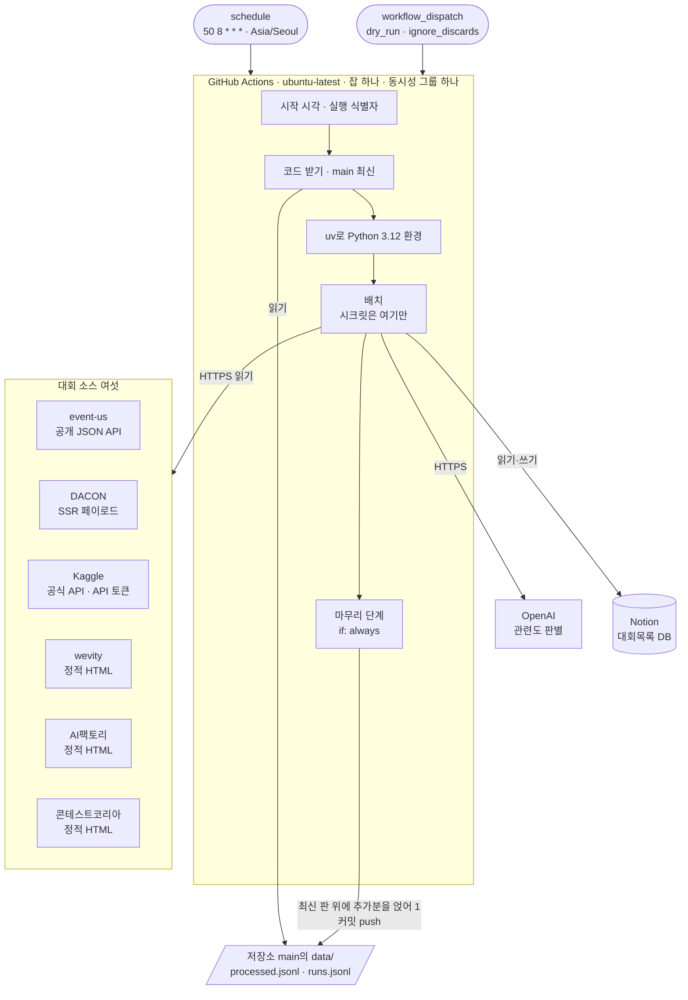

# 인프라 아키텍처

## 0. 이 문서가 다루는 것

배치가 어디서 어떤 모양으로 도는지를 정한다. 실행 환경, 스케줄, 비밀값, 상태 파일, 실패·재시도, 실행 기록까지다.

다루지 않는 것은 코드의 내부 구조다. 도메인 경계와 클래스는 6단계 DOM이 정한다. 이 문서는 폴더의 **자리**와 설정 파일이 무엇을 읽는지까지만 잡는다.

서버도 화면도 없다. 사람이 접속하는 주소가 없고, 하루 한 번 깨어나 끝나면 사라지는 프로세스 하나가 전부다. 그래서 흔한 인프라 관심사 가운데 스케일링·로드밸런싱·무중단 배포는 이 문서에 나오지 않는다.

이 문서와 상위 명세는 공개 저장소의 `docs/specs/`에 커밋된다. 그래서 비밀로 둔 값은 적지 않고 이름만 적는다. 토큰은 물론이고 노션 데이터소스 ID 같은 식별자도 적지 않는다. 한편 상태 파일은 사용자의 노션에 어떤 대회가 들어갔는지를 공개한다. 대회 이름과 건수는 원래 공개된 정보라 받아들인 범위로 둔다.

## 1. 제약

#### C1 실행은 GitHub Actions 안에서만 일어난다

출처: [[CCR-PRD-001#R7]] · [[CCR-RFQ-001#Q5]]

별도 서버나 로컬 cron을 두지 않는다. PC가 꺼져 있어도 돌아야 하고 실행 기록이 남아야 한다. 이 용도가 GitHub Actions 약관에 맞는지는 판정하지 못했고, 사용자가 그 위험을 알고 쓰기로 했다(8.10).

#### C2 매일 08:50 KST에 시작하도록 예약한다

출처: [[CCR-PRD-001#R7]] · [[CCR-RFQ-001#Q10]]

예약은 `cron: '50 8 * * *'`에 `timezone: 'Asia/Seoul'`을 붙여 적는다. GitHub 공식 문서가 `schedule`에 IANA 시간대를 지정하는 이 키를 지원한다. UTC로 바꿔 `50 23 * * *`로 적어도 같은 시각이지만, 두 방식을 섞지 않는다. `timezone`을 붙인 채 cron만 UTC 값으로 두면 시각이 아홉 시간 어긋난다. KST는 서머타임이 없으므로 연중 같은 시각이다.

#### C3 저장소가 공개다

출처: [[CCR-RFQ-001#Q9]] · [[CCR-PRD-001#N3]]

커밋되는 모든 파일과 실행 로그가 누구에게나 보인다. 명세 문서도 예외가 아니다. 비밀값이 한 번이라도 섞이면 로그나 커밋을 지우더라도 이미 노출된 것으로 보고 그 값을 즉시 교체한다.

#### C4 상태를 둘 데이터베이스가 없다

출처: [[CCR-PRD-001#R8]] · [[CCR-UC-001#UC-S4]] · [[CCR-UC-001#UC-S6]]

배치는 처리 이력과 실행 요약을 다음 실행까지 기억해야 한다. 그러나 이를 위해 DB를 띄우지 않는다. 이유는 6장에 적는다.

#### C5 한 번 실행이 10분 안에 끝난다

출처: [[CCR-PRD-001#N2]]

여섯 소스를 돌고 LLM 판별과 노션 적재까지 마치는 데 걸리는 시간이다. Actions의 실행 시간으로 잰다. 소스 하나만 느려도 재시도와 대기가 이 시간을 다 써, 나머지 소스가 정상이어도 한 건도 적재하지 못할 수 있다. 그래서 소스를 동시에 돌리고 소스마다 시간 예산을 둔다. 앞뒤 스텝을 합쳐 10분 안에 들도록 배치 스텝에는 8분 한도를 걸고, 넘기면 끊어 중단으로 남긴다(8.5).

#### C6 유료로 나가는 것은 OpenAI 호출뿐이다

출처: [[CCR-PRD-001#N1]]

공개 저장소라 Actions는 무료이고 Kaggle·노션 API도 요금이 없다. 월 운영비는 미화 1달러 미만이다.

#### C7 소스 하나가 실패해도 잡 전체가 죽지 않는다

출처: [[CCR-PRD-001#R9]] · [[CCR-UC-001#UC-A1]]

여섯 중 넷이 페이지 구조에 기대는 방식이라 상대의 개편에 깨진다.

#### C8 헤드리스 브라우저를 쓰지 않는다

출처: [[CCR-PRD-001#R1]] · [[CCR-RFQ-001#Q4]]

여섯 소스 모두 HTTP 요청만으로 목록을 얻는 것을 확인했다. 브라우저를 얹으면 실행 시간과 설치 시간이 함께 뛴다.

#### C9 상대 서버에 부담을 주지 않는다

출처: [[CCR-PRD-001#N4]]

요청 간격, 식별 가능한 User-Agent, `robots.txt` 준수.

#### C10 같은 날 여러 번 돌려도 결과가 같다

출처: [[CCR-PRD-001#N5]] · [[CCR-UC-001#UC-A1]] · [[CCR-UC-001#UC-A3]]

실패한 날 다시 돌리는 일이 생기고, 예약 실행이 밀려 수동 실행과 이어서 돌 수도 있다.

#### C11 실행은 한 번에 하나씩 차례로 돈다

출처: [[CCR-PRD-001#N5]] · [[CCR-UC-001#UC-A1]]

두 실행이 같은 노션과 처리 이력을 동시에 읽으면 같은 대회를 둘 다 넣는다. 앞 실행이 돌고 있으면 뒤 실행은 취소되지 않고 기다린다. 차례는 브랜치와 상관없이 이 배치 전체에 하나다.

#### C12 노션에 쓰는 실행은 기본 브랜치에서만 돈다

출처: [[CCR-PRD-001#R7]] · [[CCR-UC-001#UC-A1]]

다른 브랜치에서 쓰면 처리 이력이 브랜치마다 갈라진다. 기본 브랜치가 아닌 곳에서 도는 실행은 입력값과 상관없이 노션에 쓰지 않는 모드로 돈다. 다른 브랜치에서 누른 실행은 그 브랜치의 `daily.yml`과 코드로 돌기 때문에, 이 보장은 워크플로 식이나 코드가 아니라 노션 토큰의 권한이 지킨다(5.1). 개발자 PC에서 돌리는 배치도 늘 이 모드다. 마무리 단계가 없어 쓴 기록이 저장소에 올라가지 않기 때문이다. 이 저장소의 기본 브랜치는 `main`이다.

#### C13 날짜는 러너의 시계가 아니라 KST로 센다

출처: [[CCR-PRD-001#R3]] · [[CCR-UC-001#UC-A1]]

08:50 KST는 UTC로 전날 23:50이다. 러너의 시스템 시간대는 공식 문서에 적혀 있지 않고 실무에서는 UTC로 알려져 있다. 그 시계의 날짜를 그대로 쓰면 기준일이 하루 이르게 잡혀, 어제 마감된 대회가 걸러지지 않고 들어오고 `수집일`도 하루 이르게 찍힌다. 그래서 기준일은 러너의 시간대에 기대지 않고 KST로 바꿔 구한다(8.1).

## 2. 구성도



바깥으로 나가는 연결은 전부 배치 쪽에서 건다. 들어오는 연결은 없다. 열어 둘 포트도, 붙일 도메인도 없다는 뜻이다. 노션에 쓰지 않는 실행에서는 마무리 단계의 커밋 화살표가 없다.

## 3. 기술 스택

| 층 | 선택 | 이유 |
|---|---|---|
| 실행 환경 | GitHub Actions `ubuntu-latest` | [[#C1]] |
| 언어 | Python 3.12 | 개발 환경과 같다. HTML 파싱·HTTP·노션 연동 라이브러리가 두껍다 |
| 패키지 관리 | `uv` | 설치가 빨라 [[#C5]]에 유리하다. 락 파일로 실행마다 같은 버전을 쓴다. uv 자체의 버전도 고정한다 |
| HTTP | `httpx` | 요청 단위로 타임아웃을 줄 수 있다. 내장 재시도는 연결 오류만 다루므로 재시도는 따로 구현한다(8.5). 4xx·5xx 응답에 예외를 던지지 않으므로 상태 코드를 직접 확인한다 |
| HTML 파싱 | `selectolax` 또는 `beautifulsoup4` | 정적 HTML 세 곳과 DACON 페이로드 추출에 쓴다. 구체 선택은 DOM 단계에서 |
| 노션 | Notion 공식 HTTP API, 버전 `2025-09-03` | 라이브러리를 끼지 않고 직접 호출한다. 쓰는 엔드포인트가 서넛뿐이다 |
| OpenAI | 공식 SDK, Structured Outputs | 응답 형식을 스키마로 강제한다. 모델을 바꿀 때 이 기능을 지원하는지 확인한다. 거절이나 길이 초과로 스키마를 벗어난 응답은 판별 실패로 다룬다([[CCR-UC-001#UC-S5]] 2a) |
| Kaggle | 공식 API, API 토큰 인증 | 구체 호출 방식은 8단계 API 명세에서 정한다 |

무거운 것을 얹지 않는 것이 이 표의 요지다. 웹 프레임워크와 작업 큐가 없는 것은 들어오는 요청 없이 Actions 안에서 한 번 돌고 끝나기 때문이고([[#C1]]), ORM이 없는 것은 데이터베이스를 두지 않기 때문이다([[#C4]]).

## 4. 내부 구조

서버도 화면도 없으므로 저장소에 `backend/`·`frontend/`가 없다. 그 자리에 배치를 `batch/` 폴더 하나에 담는다. 이 저장소의 실행 컴포넌트는 배치 하나뿐이지만, 싱크독 규약 1.9대로 하나뿐이어도 루트에 쏟지 않는다. 패키지·테스트·배치 전용 설정 파일은 모두 `batch/` 안에 둔다.

```
competition-crawler/
├── batch/                  배치. 이 저장소의 유일한 실행 컴포넌트
│   ├── collector/          배치 본체. 안쪽 구조는 6단계 DOM 클래스 명세
│   ├── tests/              collector/ 구조를 거울로
│   ├── settings.toml       비밀이 아닌 조정값
│   └── pyproject.toml · uv.lock
├── data/                   상태 파일. 6장
│   ├── processed.jsonl     처리 이력
│   └── runs.jsonl          실행 요약
├── docs/specs/             명세 원본
├── .github/
│   ├── workflows/daily.yml 8장
│   └── dependabot.yml      액션 버전 갱신. 5.6
├── .env.example            로컬 실행에 필요한 환경 변수의 이름만. 값은 비운다
├── .gitignore              .env·.venv와 응답 덤프·로그 폴더를 반드시 넣는다
└── README.md · AGENTS.md
```

배치는 `batch/`를 작업 디렉터리로 삼아 실행한다. uv는 현재 디렉터리에서 위로만 프로젝트를 찾으므로 워크플로의 실행 스텝에 `working-directory: batch`를 준다. 상태 파일 경로는 실행 위치가 아니라 저장소 루트를 기준으로 잡는다.

`collector/` 안의 도메인 경계와 계층은 **여기서 정하지 않는다.** 6단계 DOM의 클래스 명세가 확정하고, 그 문서의 「폴더 구조」 절이 기준이다. 다만 소스 여섯이 [[CCR-UC-001#UC-S1]]에서 같은 인터페이스를 따르기로 한 것은 이미 정해진 전제다.

### 4.1 설정 파일이 읽는 것

| 자리 | 담는 것 | 읽는 쪽 |
|---|---|---|
| `.github/workflows/daily.yml` | 예약 시각, 수동 입력, 동시성, 권한, 스텝 순서. 시크릿과 변수를 배치 스텝의 환경 변수로 넘기는 일 | GitHub Actions |
| `batch/pyproject.toml` · `uv.lock` | Python 버전과 의존성, uv 버전(`required-version`) | `setup-uv`(설치할 uv 버전)·uv |
| `batch/settings.toml` | 판별 모델 이름의 기본값, 0건 경고의 연속 일수(기본 3), 소스별 요청 타임아웃·재시도·간격·쪽 상한, 노션·OpenAI의 타임아웃·재시도, 판별 동시 요청 수(8.5) | 배치 |
| 저장소 변수 `OPENAI_MODEL` | 판별 모델 이름. 있으면 `settings.toml`의 기본값을 덮는다. 저장소 설정에서 바꾸므로 코드도 커밋도 없이 모델을 바꿀 수 있다([[CCR-RFQ-001#Q14]]) | 배치 |
| GitHub Secrets와 환경 `notion-write`·`notion-read` | 비밀값 넷(5장). 노션 토큰만 저장소가 아니라 환경에 둔다(5.1) | 배치 |
| `.env` | 로컬에서 돌릴 때만 쓰는 비밀값과 `OPENAI_MODEL`. 노션 토큰은 읽기 연결의 것만 둔다(5.1). 저장소 루트에 두고 커밋하지 않는다. 저장소에는 이름과 설명만 적은 `.env.example`만 둔다([[#C3]]) | 배치 |

판정 규칙의 수치(유사도 0.80, 마감일 180일, 판별 실패 절반)는 조정값이 아니라 규칙이라 코드에 둔다. 바꾸려면 PRD부터 고친다.

로컬에서 돌리면 배치는 GitHub Actions 밖임을 알아보고(`GITHUB_ACTIONS`가 `true`가 아님) 노션에 쓰지 않는 모드로만 돈다([[#C12]]). 처리 이력과 실행 요약은 작업 트리의 사본이 아니라 `origin/main`의 최신 판을 받아 읽고, 받지 못하면 돌지 않는다. 브랜치를 딴 뒤 쌓인 기록이 빠지면 미리보기가 실제와 달라지기 때문이다([[CCR-UC-001#UC-A1]] 1b7). 기준일은 배치가 시작할 때 읽은 시각을 KST로 바꿔 쓴다.

## 5. 인증과 접근

배치가 밖으로 거는 연결마다 자격증명이 필요하다. 전부 GitHub Secrets에 두고, **배치 스텝에만** 환경 변수로 넘긴다. 잡 전체의 환경 변수에 두지 않으므로 다른 스텝과 그 스텝이 부르는 액션은 값을 받지 않는다. 노션 토큰만 저장소가 아니라 GitHub 환경에 둔다(5.1). 저장소 파일에는 이름만 있고 값은 없다.

| 시크릿 | 쓰는 곳 | 형태 |
|---|---|---|
| `NOTION_TOKEN` | 노션 읽기 [[CCR-UC-001#UC-S4]] · 적재와 컬럼 생성 [[CCR-UC-001#UC-S6]] | 내부 연결(internal connection)의 Installation access token. 노션 개발자 포털의 Internal connections → Configuration 탭에서 발급. 쓰기 연결과 읽기 연결의 토큰을 두 환경에 같은 이름으로 따로 둔다(5.1) |
| `NOTION_DATA_SOURCE_ID` | 대상 DB 지정 | `대회목록`의 데이터소스 ID |
| `OPENAI_API_KEY` | 관련도 판별 [[CCR-UC-001#UC-S5]] | 이 도구 전용 프로젝트의 API 키 |
| `KAGGLE_API_TOKEN` | Kaggle 수집 [[CCR-UC-001#UC-S1]] | API 토큰 |

노션은 API 버전 `2025-09-03`부터 DB에 행을 만들 때 부모를 데이터베이스 ID가 아니라 **데이터소스 ID**로 지정한다. 시크릿 이름이 `NOTION_DATA_SOURCE_ID`인 이유다. 이 값은 그 자체로 권한이 없고 ID만으로 DB 내용을 읽을 수도 없다. 그래도 공개 저장소에 개인 워크스페이스의 식별자를 남길 이유가 없으므로 시크릿에 둔다([[CCR-RFQ-001#Q9]]).

배치는 시작할 때 네 값이 있는지 본다. 등록되지 않은 시크릿은 빈 문자열로 들어오므로 빈 값을 빠진 것으로 본다. 빠진 것마다 처리가 다르다([[CCR-UC-001#UC-A1]] 1d).

| 빠진 것 | 처리 | 실행 결과 |
|---|---|---|
| `NOTION_TOKEN`이나 `NOTION_DATA_SOURCE_ID` | 수집을 시작하지 않는다 | 실패(사유: 설정 누락) |
| `KAGGLE_API_TOKEN` | Kaggle에만 실패 표시(종류: 설정 누락)를 남기고 나머지 다섯 소스로 진행한다 | 성공일 수 있다 |
| `OPENAI_API_KEY` | 판별이 통째로 실패한 날로 다룬다. 접수마감일이 기준일인 대회만 적재하고 나머지는 미룬다 | 성공, 판별 미룸 경고(원인: 키 누락) |

### 5.1 노션 쪽 준비 — DB에만 연결한다

노션 내부 연결은 만들어 두는 것만으로는 아무것도 못 읽는다. 접근할 대상에 그 연결을 이어 줘야 한다.

**연결 대상은 `대회목록` DB 자체다. DB를 품은 부모 페이지가 아니다.** 노션 공식 문서(Internal connections 가이드)는 페이지나 DB에 연결하면 그 하위까지 접근이 넘어간다고 적는다. 부모 페이지에 연결하면 그 아래 이 도구와 무관한 개인 페이지까지 토큰의 범위에 든다. DB에만 연결해도 그 안의 모든 행과 행 본문은 범위에 든다.

연결하는 방법은 둘이다. 노션 개발자 포털의 연결 화면에서 Content access → Edit access로 `대회목록` DB만 고르거나, DB를 **전체 페이지로 열어** `•••` 메뉴의 Add connections로 연결한다. `대회목록`이 부모 페이지 안에 인라인으로 들어 있으면 화면 오른쪽 위 `•••`는 부모 페이지의 메뉴라서, 그대로 따르면 막으려던 부모 연결이 된다. 연결한 뒤에는 부모 페이지를 이 토큰으로 조회해 `404 object_not_found`가 오는지 확인한다.

**연결은 둘을 만든다.** 둘 다 위 방법으로 `대회목록` DB에만 연결하고, 댓글 기능은 끄고, 사용자 정보는 No user information으로 둔다.

| 연결 | 기능(capabilities) | 토큰을 두는 곳 |
|---|---|---|
| 쓰기 연결 | Read content · Insert content · Update content | GitHub 환경 `notion-write` |
| 읽기 연결 | Read content | GitHub 환경 `notion-read`, 로컬 `.env` |

두 토큰은 같은 이름 `NOTION_TOKEN`으로 각 환경의 시크릿에 넣는다. `notion-write`는 배포 브랜치를 `main`으로 제한하고 관리자 우회를 끈다. 검토자와 대기 시간은 두지 않는다. 두면 예약 실행이 사람을 기다린다. `notion-read`에는 제한을 두지 않는다. 잡은 노션에 쓰는 실행이면 `notion-write`를, 그 밖에는 `notion-read`를 고른다(8.1).

연결을 나누는 것은 [[#C12]]를 노션의 권한으로 지키기 위해서다. 다른 브랜치에서 누른 실행은 그 브랜치의 워크플로와 코드로 돈다. 그래서 쓰지 않는다는 보장을 워크플로 식이나 코드에 맡기면, 브랜치에서 그것을 고치는 순간 깨진다. 토큰을 나누면 브랜치 실행은 읽기 토큰만 받아 행을 만들 수 없다. 브랜치의 워크플로가 `notion-write`를 고르면 배포 브랜치 규칙에 걸려 잡이 돌지 않는다.

쓰기 연결의 Update content는 `출처`·`수집일` 컬럼이 없을 때 배치가 직접 만들기 위해서다([[CCR-RFQ-001#Q7]] · [[CCR-UC-001#UC-S6]] 1a). 이 기능이 켜져 있으면 쓰기 토큰으로 기존 행의 값을 바꾸거나 행을 휴지통으로 보낼 수 있다. 기존 행을 건드리지 않는다는 약속([[CCR-PRD-001#R6]])을 노션이 아니라 배치 코드가 지키는 셈이다. 사용자가 이 위험을 알고 컬럼 자동 생성을 택했다(8.10). 배치 코드에는 행을 만드는 호출과 컬럼을 만드는 호출만 둔다.

오류로 가르는 법: 연결이 빠졌으면 `404 object_not_found`, 기능이 모자라면 `403 restricted_resource`가 돌아온다. 노션 공식 문서는 `404 object_not_found`를 "리소스가 없거나 토큰의 주인과 공유되지 않았다"는 뜻으로 쓴다. 아래 블록 한도도 같은 `403 restricted_resource`를 쓰므로, 403이면 로그의 오류 본문으로 둘을 가른다.

노션 Free 워크스페이스에 멤버가 둘 이상이면 2026년 9월부터 API에도 평생 블록 1,000개 한도가 적용된다. 한도에 처음 닿는 쓰기는 성공하고 사흘 유예가 시작되며, 유예가 끝나면 행 생성이 `403 restricted_resource`로 실패한다. 멤버가 한 명인 Free 워크스페이스와 유료 플랜은 해당하지 않는다. 사용자 워크스페이스의 플랜과 멤버 수는 확인하지 못했다(9장).

### 5.2 Kaggle 쪽 준비 — 새 API 토큰

kaggle.com/settings/api에서 **Generate New Token**으로 토큰을 발급해 `KAGGLE_API_TOKEN`에 넣는다.

사용자명과 키를 담는 `kaggle.json` 방식은 쓰지 않는다. Kaggle 공식 CLI 문서가 이 방식을 "Legacy API Credentials"로 분류하고 있어, 새 프로젝트를 그 위에 올리지 않는다([[CCR-RFQ-001#Q4]]).

이 토큰은 사용자가 실제로 대회에 참가하는 계정의 것이다. 새면 남이 사용자 이름으로 제출하거나 데이터셋·노트북을 관리할 수 있다. 새 토큰에 범위나 만료를 줄 수 있는지는 공식 문서에서 찾지 못했다(9장).

자격증명 없이 호출하면 401이 돌아오는 것까지는 확인했다. 새 토큰으로 받는 실제 응답은 아직 보지 못했다. 8단계 API 명세를 쓰기 전에 토큰을 발급해 두면 필드를 실측으로 적을 수 있다.

### 5.3 OpenAI 쪽 준비 — 전용 프로젝트와 지출 한도

키는 이 도구만 쓰는 OpenAI 프로젝트에서 발급한다. 그 프로젝트에 지출 알림과 하드 지출 한도를 건다. 알림은 [[CCR-PRD-001#N1]]의 월 1달러에 두고, 하드 한도는 그보다 조금 위(예: 3달러)로 둔다. 첫 실행처럼 호출이 몰리는 날의 정상 판별까지 막지 않기 위해서다. 한도 적용이 즉시가 아니라 조금 넘을 수 있다.

하드 한도에 닿으면 판별 호출이 `429 project_spend_limit_exceeded`로 실패한다. 이 응답은 다시 시도하지 않는다. 판별 실패가 그날 대상의 절반을 넘으면 판별하지 못한 대회는 미뤄지므로([[CCR-UC-001#UC-S5]] 2c), 한도에 닿았다고 관심 밖 대회가 노션에 쏟아지지는 않는다.

### 5.4 로그와 요약 파일에 값이 새지 않게

GitHub는 Secrets에 등록된 값이 로그에 나타나면 가려 준다. 러너는 Base64·URL 이스케이프 같은 몇 가지 변형도 함께 가리지만, 공식 문서는 가공된 값까지 가린다고 보장하지 않는다. 노션 ID의 하이픈 있는 형태와 없는 형태처럼 아예 다른 문자열이 되는 변형은 가려지지 않는다. 노션은 오류 메시지에 ID를 하이픈이 들어간 UUID로 싣는다. 그래서 배치는 시작 직후, 어떤 출력보다 먼저 이런 변형을 `::add-mask::`로 등록한다. 요청 헤더와 요청 객체 전체는 로그에 찍지 않는다([[CCR-UC-001#UC-S7]] 7).

GitHub의 가림은 실행 로그에만 적용된다. 커밋되는 상태 파일에는 자동 보호가 없고 git 이력에 영원히 남는다. 그래서 `runs.jsonl`에는 [[CCR-UC-001#UC-S7]]의 표에 정한 필드만 쓴다. 실패는 종류(연결·응답 코드·형식·수집 금지·설정 누락) 같은 정해진 값으로만 남기고, 예외 메시지·URL·응답 본문·LLM 응답 같은 자유 문장은 넣지 않는다. 자유 문장은 Actions 로그에만 찍는다. 로그도 공개이므로([[#C3]]) 위의 가림을 거친다.

### 5.5 저장소에 쓰기

잡 권한은 `contents: write` 하나다. 그 밖의 권한은 주지 않는다.

코드를 받을 때는 `actions/checkout`에 `persist-credentials: false`를 준다. 잡 토큰이 작업 트리의 git 설정에 남지 않게 하기 위해서다. 토큰은 마무리 스텝에만 스텝 환경 변수로 넘기고, 받기와 push 명령에만 명령 줄 설정으로 준다. `.git/config`에는 쓰지 않고, 마무리 스텝에서는 명령을 그대로 찍는 `set -x`를 쓰지 않는다.

마무리 단계는 기본 브랜치 `main`에 바로 push한다. 그래서 기본 브랜치에 "풀 리퀘스트를 거쳐야만 병합" 규칙은 걸지 않는다. 걸면 봇의 push가 막혀 매일 커밋이 실패한다([[CCR-UC-001#UC-A1]] 9a). 대신 규칙셋으로 **강제 push 차단**과 **삭제 제한**은 건다. 이 둘은 봇과 사람의 일반 push를 막지 않고, 상태 파일의 이력이 force push로 지워지는 것만 막는다. force push로 처리 이력이 과거로 돌아가면 그동안 참가자가 지운 대회가 한꺼번에 되살아난다.

마무리 단계는 새로 받은 `main`에서 `data/processed.jsonl`과 `data/runs.jsonl` 두 경로만 고치고 스테이징한다(8.2). 저장소 설정에서 비밀값 스캔의 푸시 보호가 켜져 있는지 확인한다.

### 5.6 공급망

워크플로의 모든 `uses:`는 태그가 아니라 40자 커밋 SHA로 고정하고, 태그는 같은 줄 주석으로 단다(예: `astral-sh/setup-uv@<sha> # <태그>`). GitHub가 만든 `actions/checkout`도 같다. 저장소 설정의 "Require actions to be pinned to a full-length commit SHA"를 켠다. 태그는 액션 저장소가 탈취되면 악성 커밋으로 옮겨질 수 있다. 2025년 3월 `tj-actions/changed-files`에서 실제로 일어났다.

SHA로 고정하면 새 버전이 저절로 들어오지 않는다. `.github/dependabot.yml`로 `github-actions` 버전 갱신을 켜고, Dependabot이 연 풀 리퀘스트를 검토해 SHA를 올린다. uv 자체의 버전도 고정한다.

`pull_request_target`·`workflow_run` 트리거는 두지 않는다.

### 5.7 범위와 유출 대응

| 시크릿 | 범위 | 새면 생기는 일 |
|---|---|---|
| `NOTION_TOKEN`(쓰기 연결) | 이 도구 전용 내부 연결. `대회목록` DB에만 연결. Read·Insert·Update content. 환경 `notion-write`에만 있다 | DB를 읽고, 새 행을 넣고, 기존 행을 고치거나 휴지통으로 보낼 수 있다 |
| `NOTION_TOKEN`(읽기 연결) | 두 번째 내부 연결. `대회목록` DB에만 연결. Read content만. 환경 `notion-read`와 로컬 `.env`에 있다 | DB의 행과 행 본문을 읽을 수 있다 |
| `OPENAI_API_KEY` | 이 도구 전용 프로젝트. 하드 지출 한도 | 한도까지 과금된다. 한도가 없으면 조직의 한도나 잔액까지 과금된다 |
| `KAGGLE_API_TOKEN` | 사용자의 Kaggle 계정. 범위를 좁힐 수 있는지 확인하지 못했다 | 사용자 계정으로 대회에 제출하고 데이터셋·노트북을 관리할 수 있다 |

값이 로그나 커밋에 보이면 기록을 지우기 전에 각 콘솔에서 먼저 그 값을 폐기하고 새로 발급한 뒤 GitHub Secrets를 갱신한다. GitHub의 비밀값 스캔은 공개 저장소의 커밋과 이슈·PR 등에서 파트너 패턴을 찾으면 그 회사에 알린다. Actions 로그는 스캔 대상이 아니다. 지원 패턴 목록에서 OpenAI API Key는 파트너 대상이고, 노션은 세 패턴 가운데 Notion API Token만 파트너 대상이다. 노션은 2024-09-25부터 새로 만든 토큰에 `ntn_` 접두사를 붙이지만, GitHub가 정규식을 공개하지 않아 이 도구의 토큰이 그 패턴에 들어맞는지는 확인하지 못했다. 알림을 받은 회사가 값을 폐기할지는 그 회사가 정한다. OpenAI는 공개된 곳에서 찾은 키를 곧바로 비활성화한다고 도움말에 적고, 노션 문서에는 그런 설명이 없다. 어느 값도 자동으로 폐기되리라 기대하지 않는다.

## 6. 데이터가 사는 곳

### 6.1 데이터베이스를 두지 않는 이유

배치가 기억해야 하는 것은 둘뿐이다. 한 번 판별했거나 이미 아는 대회와 같다고 확인한 대회의 기록(처리 이력)과, 실행마다의 결과와 건수(실행 요약)다. 둘 다 쓰는 주체가 배치 하나이고, 실행이 차례로 돌므로([[#C11]]) 동시에 쓰는 일이 없다.

여기에 DB를 붙이면 띄우고 지키는 값이 얻는 것보다 크다. 무료로 쓸 수 있는 관리형 DB는 쓰지 않으면 잠들거나 일정 기간 뒤 지워지는 조건이 붙기 마련이라, 하루 한 번만 접속하는 이 배치와 맞지 않는다. [[#C6]]도 걸린다.

저장소 파일로 두면 얻는 것이 더 있다. 변경 이력이 git log로 남아 [[CCR-UC-001#UC-A3]]의 진단에 그대로 쓰인다. "언제부터 이 소스가 0건이었나"를 파일 하나의 히스토리로 볼 수 있다. 관리자가 버린 기록을 비울 때도([[CCR-UC-001#UC-A4]]) 파일을 고쳐 커밋하면 된다.

### 6.2 상태 파일 둘

| 파일 | 내용 | 쓰는 쪽·읽는 쪽 | 자라는 속도 |
|---|---|---|---|
| `data/processed.jsonl` | 처리 이력. 한 줄이 한 대회 공고(묶음의 구성원 하나). 출처·원천 ID·링크·대회명·접수시작일·접수마감일·결과(남김·버림)와, 적은 실행의 기준일·실행 식별자 | [[CCR-UC-001#UC-S4]]·[[CCR-UC-001#UC-S5]]·[[CCR-UC-001#UC-S6]]이 쓰고 [[CCR-UC-001#UC-S4]]가 읽는다 | 판별하거나 확인한 공고 수만큼. 연 수천 줄 |
| `data/runs.jsonl` | 실행 요약. 한 줄이 한 실행. 필드는 [[CCR-UC-001#UC-S7]]의 표를 따른다 | [[CCR-UC-001#UC-S7]]과 마무리 단계가 쓰고, [[CCR-UC-001#UC-S7]]·마무리 단계와 사람이 읽는다 | 실행 한 번에 한 줄. 다시 돌린 날은 그만큼 더 붙는다 |

두 파일 모두 한 줄에 한 레코드를 둔 JSON Lines다. 사람이 열어 읽고 고치기 쉽다. 버린 기록 비우기는 결과가 버림인 줄을 지우는 것이다.

**배치는 작업 트리의 두 파일을 직접 고치지 않는다.** 시작할 때 두 파일을 읽고, 이번 실행이 더하는 줄은 작업 트리 밖(`$RUNNER_TEMP`)의 추가분 파일에 쌓는다. [[CCR-UC-001#UC-A1]]에서 대회가 "처리 이력 파일에 적힌다"는 것은 이 추가분 파일에 적힌다는 뜻이다. 처리 이력의 추가분은 버림을 판정했을 때, 행이 만들어졌다는 응답을 받았을 때, 아는 대회로 빠진 묶음의 구성원을 적을 때마다 곧바로 반영한다. 추가분 파일은 쓸 때마다 임시 파일에 쓴 뒤 이름을 바꿔 통째로 교체한다. 도중에 끊겨도 반쯤 쓴 파일이 남지 않는다. 추가분 파일은 한 곳만 쓴다. 판별을 동시에 하더라도 작업자는 결과만 넘기고, 기록은 한 흐름이 받는 차례대로 한다. 임시 파일은 쓸 때마다 새 이름으로 만든다. 저장소에 올리는 일은 마무리 단계가 한 번에 한다(8.2).

두 파일도 공개된다([[#C3]]). 대회 이름과 건수는 원래 공개된 정보라 괜찮지만, 자유 문장은 넣지 않는다(5.4).

### 6.3 실행 기록 두 곳

[[CCR-UC-001#UC-S7]]의 경계를 따른다. Actions 로그에는 사람이 읽는 상세를 남긴다. 소스별 원문 실패 사유, 적재한 대회의 이름과 출처, 판별 모델이 버린 대회와 그 근거, 정규화에서 버린 레코드의 출처와 이유, 예외의 원문이다. 마무리 단계가 올린 추가분도 로그에 찍힌다(8.2). `data/runs.jsonl`에는 실행끼리 견줄 값만 한 줄로 쌓는다([[CCR-RFQ-001#Q15]]).

Actions 쪽은 영구 기록이 아니다. 공개 저장소의 로그 보관 기간은 기본 90일이고 1~90일 사이로만 바꿀 수 있다. 2026-10-01부터는 로그뿐 아니라 워크플로 실행 이력 자체도 이 기간이 지나면 지워진다. 보관 기간은 이미 상한인 90일을 그대로 둔다. 그보다 오래된 실행은 `runs.jsonl`과 그 git log로만 진단한다([[CCR-UC-001#UC-A3]] 3a).

### 6.4 사람이 보는 데이터

대회 목록 자체는 노션 `대회목록` DB에 산다. 저장소에는 복제본을 두지 않는다. 두 곳에 같은 것이 있으면 어긋나고, 사람이 보는 것은 노션뿐이다.

## 7. 외부 변경 감지

이 배치의 가장 흔한 고장은 **소스 사이트가 조용히 바뀌는 것**이다. 예외가 나면 [[#C7]]이 잡아 기록에 남기지만, 마크업만 바뀌어 파서가 아무것도 못 찾는 경우는 예외가 나지 않는다. 결과가 빈 목록일 뿐이다.

그래서 [[CCR-UC-001#UC-S7]] 2가 `runs.jsonl`을 거슬러 올라가며 소스별 건수를 본다. 0건이 시작되기 바로 앞까지 연속 N일(`settings.toml`, 기본 3) 건수를 내던 소스가 0건을 내면, 0건이 이어지는 동안 매 실행 경고를 붙인다. 날짜는 기준일로 세고, 건수는 정규화를 거친 뒤의 것으로 센다. 경고는 실행 요약에 남고 그 소스가 마지막으로 건수를 낸 기준일을 함께 적으므로, 사람이 저장소만 봐도 어느 날부터 어느 소스가 멈췄는지 알 수 있다.

노션과 OpenAI의 실패도 저절로 예외가 되지는 않는다. `httpx`는 연결 오류와 타임아웃에만 예외를 던지고 4xx·5xx 응답은 그대로 돌려주므로, 노션 응답마다 상태 코드를 확인한다. OpenAI SDK는 연결 오류와 4xx·5xx에 예외를 던지지만, 모델이 답을 거절하면 예외 없이 파싱 결과가 비어서 온다. 이것도 판별 실패로 센다([[CCR-UC-001#UC-S5]] 2a).

설정이나 계정 문제로 오는 오류는 다시 보내도 같은 답이 온다. 이런 오류는 다시 보내지 않는다.

- **판별**: 키가 틀렸거나(401), 한도·크레딧이 소진됐거나(429 가운데 지출 한도·크레딧 소진), 설정한 모델이 없다는(404) 응답은 다시 시도하지 않는다. 남은 묶음도 묻지 않고 판별 실패로 센다. 어느 묶음을 물어도 같은 답이 오기 때문이다. 첫 호출부터 이 응답이 오면 판별 실패가 절반을 넘어 미룸이 되고, 경고의 원인은 호출 실패로 남는다([[CCR-UC-001#UC-S5]] 2c). 한도처럼 도중에 닿아 실패가 절반 이하면, 실패한 묶음은 남김으로 적재된다([[CCR-UC-001#UC-S5]] 2b). 일시적인 속도 제한(429)만 8.5대로 다시 시도한다.
- **노션 행 생성**: 429·529를 뺀 4xx, 곧 `400 validation_error`·401·`403 restricted_resource`·`404 object_not_found`는 다시 보내도 같은 답이 오므로 다시 보내지 않고 그 행을 행 생성 실패로 센다. 남은 행은 멈추지 않고 차례대로 보낸다. 연결·권한 문제라면 남은 행도 같은 오류로 실패해 모두 행 생성 실패로 세어진다. 그래서 전부 실패하면 행 생성 전면 실패 경고가 붙고, 접수마감일이 기준일인 대회가 하나라도 있으면 오늘 마감 미적재로 실행이 실패로 끝난다([[CCR-UC-001#UC-A1]] 7a2 · 7a3). 남은 행을 보내지 않고 멈추면, 보내지 않은 오늘 마감 대회가 실패로 세어지지 않아 이 경고가 빠진다. 노션의 컬럼 이름이 바뀌어도 덜 깨지도록 속성을 이름으로 지정할지 id로 지정할지는 8단계 API 명세에서 정한다.

## 8. 배치와 운영

### 8.1 워크플로 하나, 잡 하나

`.github/workflows/daily.yml` 하나로 끝난다. 마무리 단계는 배치와 **같은 잡의 다음 스텝**이다. 잡을 나누면 배치가 쌓은 추가분을 아티팩트로 넘겨야 하는데, 배치 잡이 시간 한도로 끊기면 그 넘기기부터 못 할 수 있다. 같은 잡 안에서는 그냥 파일이다. 한 잡으로 두는 대가는 8.10에 적는다.

| 항목 | 값 | 근거 |
|---|---|---|
| 트리거 | `schedule` + `workflow_dispatch` | [[#C2]] · [[CCR-PRD-001#R7]] |
| 예약 | `cron: '50 8 * * *'`, `timezone: 'Asia/Seoul'` | [[#C2]] |
| 수동 입력 | `dry_run`(boolean, 기본 `false`) — 노션에 쓰지 않는 모드. `ignore_discards`(boolean, 기본 `false`) — 버림 기록을 없는 것으로 보고 판별한다. 노션에 쓰지 않는 실행에서만 뜻이 있고, 쓰는 실행에서는 무시하고 로그에 적는다 | [[CCR-UC-001#UC-A1]] 1b · [[CCR-UC-001#UC-A4]] |
| 쓰기 여부 | 잡 수준에서 한 번 정한다. `DRY_RUN: ${{ github.ref != 'refs/heads/main' \|\| (github.event_name == 'workflow_dispatch' && inputs.dry_run) }}`. 예약 실행에는 `inputs`가 없고 `github.ref`가 기본 브랜치이므로 `false`가 된다. Actions 안에서 이 값이 `true`도 `false`도 아니면 배치는 아무것도 하지 않고 실패한다. 값이 비었다고 쓰기 모드로 돌지 않게 하기 위해서다 | [[#C12]] · [[CCR-UC-001#UC-A1]] 1b5 |
| 환경 | `environment: ${{ (github.ref == 'refs/heads/main' && !(github.event_name == 'workflow_dispatch' && inputs.dry_run)) && 'notion-write' \|\| 'notion-read' }}`. 쓰기 여부와 같은 조건이다. 이 키에서는 잡의 `env`를 읽을 수 없어 식을 다시 적는다 | 5.1 · [[#C12]] |
| 권한 | `contents: write` 하나 | 5.5 |
| 동시성 | 워크플로 수준에 고정 이름 그룹 하나(예: `competition-batch`)를 두고 `queue: max`로 정한다. 그룹 이름에 `github.ref`·`github.run_id`를 넣지 않아, 어느 브랜치에서 누른 실행이든 예약 실행과 같은 줄에 선다. `cancel-in-progress`는 두지 않는다 | [[#C11]] · [[CCR-UC-001#UC-A1]] 1c |
| 잡 시간 한도 | 15분 | 배치 스텝 8분과 마무리 스텝 3분에 앞 스텝의 여유를 더한 값. 스텝 한도가 먼저 걸려야 마무리 단계가 돌 시간이 남는다 |
| 커밋 | 작성자 `github-actions[bot]`. 메시지에 기준일과 실행 식별자를 적는다 | 사람의 커밋과 가르고, git log에서 실행을 찾게 한다(6.1) |

동시성의 기본값 `queue: single`은 대기 자리가 하나뿐이라, 대기 중에 또 실행이 들어오면 먼저 대기하던 실행이 취소된다. 예약 실행이 기다리는 동안 미리보기를 한 번 더 누르면 그날 실제 적재가 사라진다. `queue: max`는 최대 100건까지 줄 세운다. 순서는 대기를 시작한 차례지만 GitHub가 보장하지는 않는다.

스텝은 이 차례로 돈다.

| 차례 | 스텝 | 하는 일 |
|---|---|---|
| 1 | 시작 시각 | 잡이 시작한 시각을 UTC로 잡 환경 변수(`RUN_STARTED_AT`)에 남긴다. 실행 식별자(`github.run_id`와 `github.run_attempt`)도 함께 남긴다. 배치와 마무리 단계는 이 시각을 각자 KST 날짜로 바꿔 기준일로 쓴다. 배치가 아니라 첫 스텝이 남기는 값이므로, 배치가 어디서 멈추든 마무리 단계가 같은 날짜를 구한다([[CCR-UC-001#UC-A1]] 1 · [[#C13]]). 앞 실행을 기다린 실행은 기다림이 끝나 잡이 시작한 시각이 기준이 된다 |
| 2 | 코드 받기 | 기본 브랜치에서 도는 실행은 쓰기 여부와 상관없이 `ref: main`으로 **시작하는 때의 기본 브랜치 최신 커밋**을 받는다. `ref`를 비워 두면 트리거 시점의 커밋(`GITHUB_SHA`)을 받아, 기다린 실행이나 다시 실행한 실행이 앞 실행의 커밋이 빠진 옛 상태 파일로 돈다. 다른 브랜치의 미리보기는 코드를 그 브랜치에서 받고, 상태 파일은 `main` 최신 판을 따로 가져와 읽는다([[CCR-UC-001#UC-A1]] 1b7). 받은 뒤에는 `GITHUB_SHA`와 받은 커밋 사이에 `.github/`가 바뀌었는지 본다. 워크플로 정의는 트리거 때의 것이라, 바뀌었으면 정의와 코드가 어긋날 수 있다. 그때는 배치를 띄우지 않고 실패로 끝낸다. 새 수동 실행은 새 정의로 돈다 |
| 3 | 환경 | `setup-uv`에 `with: working-directory: batch`를 주어 `batch/pyproject.toml`에 적은 uv 버전을 설치한다. 이 입력이 없으면 저장소 루트에서만 버전을 찾아 최신 uv를 깐다. 이어 `working-directory: batch`인 run 스텝에서 `uv sync --frozen` |
| 4 | 배치 | 시크릿 넷과 `OPENAI_MODEL`을 이 스텝에만 넘긴다. 스텝 시간 한도 8분([[#C5]]). 가상환경의 파이썬을 `exec`로 직접 띄워 끊을 때 오는 신호를 파이썬이 받게 한다. 신호는 스텝을 연 셸에만 가고 셸은 이를 자식에게 넘기지 않는다. 그대로 두면 끊긴 뒤에도 배치가 잡이 끝날 때까지 남아, 마무리 단계와 함께 돌며 노션에 쓸 수 있다. `uv run`도 한 번 온 SIGINT는 자식에게 넘기지 않으므로 거치지 않는다. 신호를 받으면 새 요청을 멈추고 곧바로 끝내며, 실행 요약 줄은 쓰지 않는다. 끊긴 실행의 줄은 마무리 단계가 중단으로 쓴다. 러너는 SIGINT를 보내고 7.5초 뒤 SIGTERM을, 다시 2.5초 뒤 프로세스 트리를 강제로 끝내므로 정리는 그 안에 끝낸다. 결과가 실패면 0이 아닌 값으로 끝난다 |
| 5 | 마무리 단계 | `if: always() && github.ref == 'refs/heads/main' && env.DRY_RUN == 'false'`. 앞 스텝이 실패하거나 끊겨도 돈다. 조건이 없는 스텝에는 GitHub가 `success()`를 적용해, 앞 스텝이 실패하면 건너뛰기 때문이다. 다른 브랜치이거나 쓰기 여부 값이 깨졌으면 돌지 않는다. 러너에 있는 git과 python3 표준 라이브러리만 쓰고 3번이 만든 환경에 기대지 않는다. uv 설치가 실패한 실행에서도 중단 줄을 남겨야 하기 때문이다. 스텝 시간 한도 3분. 하는 일은 8.2 |

### 8.2 마무리 단계 — 최신 판 위에 다시 얹는다

[[CCR-UC-001#UC-A1]] 9와 \*a2를 이렇게 한다.

마무리 단계의 코드는 배치와 함께 `batch/`에 둔다. 다만 표준 라이브러리만 쓰고 배치 패키지의 다른 모듈을 불러오지 않는다. 배치의 작업 트리에 기대지 않고 `$RUNNER_TEMP`에 `main`을 새로 받아 그 위에서 일한다. 코드 받기가 실패한 실행에서는 새로 받은 `main`의 코드로 돈다.

1. 잡 토큰으로 `main`을 `$RUNNER_TEMP`에 얕게 받는다. 되풀이할 때는 받은 것을 `main` 최신 판으로 맞춘다.
2. `runs.jsonl`에 이 실행의 식별자를 가진 줄이 이미 있으면 앞선 push가 응답만 끊기고 실제로는 들어간 것이다. 아무것도 하지 않고 끝낸다. 읽히지 않는 줄은 건너뛴다([[CCR-UC-001#UC-S7]] 2c와 같다).
3. 배치가 쌓은 처리 이력 추가분을 파일 끝에 붙인다. 파일이 줄바꿈으로 끝나지 않으면 먼저 줄바꿈을 붙인다. 붙이기 전에 각 줄이 JSON으로 읽히고 필수 필드(출처·원천 ID·결과·실행 식별자)가 있는지 본다. 아닌 줄은 붙이지 않고 로그에 남기며, 이 스텝을 실패로 끝내기로 표시한다.
4. 배치가 쓴 실행 요약 줄을 3과 같이 확인해 붙인다. 그 줄이 없으면 배치가 줄을 남기기 전에 멈춘 것이므로, 결과 **중단**의 줄을 만들어 붙이고 이 스텝을 실패로 끝내기로 표시한다. 이 줄에는 `RUN_STARTED_AT`에서 구한 기준일, 실행 식별자, 실행 종류(`GITHUB_EVENT_NAME`이 `schedule`이면 예약, 그 밖은 수동)만 적는다. 소스별 건수·탈락 건수·경고는 0으로 채우지 않고 비워 둔다. 0건 경고 판단([[CCR-UC-001#UC-S7]] 2)이 이 줄을 그 소스를 수집하지 않은 줄로 보고 건너뛰게 하기 위해서다.
5. 두 경로만 스테이징해 한 커밋으로 만들고 push한다. 올린 추가분은 로그에도 찍는다. 모두 공개된 값이라 가릴 것이 없고, 끝내 올리지 못했을 때 사람이 다시 얹을 수 있다.
6. 1의 받기나 5의 push가 어떤 이유로든(거절·연결 끊김·응답 없음) 실패하면 1부터 다시 한다. 정해진 횟수(예: 5회)까지 되풀이한다. 응답만 끊기고 실제로 들어간 push는 2가 걸러 낸다.
7. 끝내 실패하면 실패로 끝낸다([[CCR-UC-001#UC-A1]] 9a).

마무리 스텝에는 시간 한도 3분을 두고, git에는 느린 연결을 끊는 설정(`http.lowSpeedLimit`·`http.lowSpeedTime`)을 준다. GitHub 공식 문서는 `always()` 스텝에서 소스를 받는 일처럼 멈출 수 있는 작업을 하면 잡 시간 한도까지 매달릴 수 있다고 경고한다. 강제 취소는 `always()` 조건도 건너뛰므로, 강제 취소된 실행은 줄을 남기지 못한다(8.6).

텍스트 병합이나 rebase에 맡기지 않고 최신 판 위에 추가분을 다시 얹는 것은, 사람도 처리 이력을 고치기 때문이다. 관리자는 버린 기록을 비우고([[CCR-UC-001#UC-A4]]) 손상된 파일을 고친다([[CCR-UC-001#UC-A3]] 2d). 같은 기준에서 두 쪽이 각자 파일 끝에 줄을 붙이면 git은 이를 충돌로 본다. `-X ours`·`-X theirs`나 force push로 풀지 않는다. 어느 쪽을 골라도 처리 이력의 줄이 빠져 참가자가 지운 대회가 되살아난다.

### 8.3 커밋이 다시 워크플로를 부르지 않는다

마무리 단계가 상태 파일을 push하는데, 그 push가 워크플로를 다시 깨우면 무한히 돈다. GitHub 공식 문서에 따르면 기본 `GITHUB_TOKEN`으로 일으킨 이벤트는 새 워크플로 실행을 만들지 않는다. 예외는 `workflow_dispatch`·`repository_dispatch`와, 풀 리퀘스트 생성·갱신으로 생긴 승인 필요 상태의 실행뿐이다. push는 예외가 아니다. 게다가 이 워크플로는 `push` 트리거를 아예 두지 않으므로 이중으로 안전하다.

개인 액세스 토큰이나 GitHub App 토큰으로 바꾸면 이 보호가 사라진다. 바꿀 이유가 없다.

### 8.4 정각을 피하는 이유와 예약의 한계

GitHub 공식 문서는 워크플로 실행이 몰리는 시간에 예약 실행이 지연될 수 있고, 몰리는 시간에 매 정각이 포함된다고 적는다. 부하가 충분히 높으면 대기 중인 예약 잡 일부가 버려질 수 있다고도 적는다. 그리고 지연될 가능성을 줄이려면 정각이 아닌 분으로 예약하라고 권한다.

그래서 09:00 정각이 아니라 08:50에 시작한다. 조금 밀려도 사용자가 노션을 여는 9시 무렵([[CCR-SCN-001#S1]] · [[CCR-RFQ-001#Q10]])에는 결과가 들어가 있다. 늦게 도는 날도 결과는 제시간에 돈 것과 같다([[#C10]]). 버려진 날은 배치가 아예 돌지 않는다. 그날의 대회는 다음 실행이 채우지만, 그 사이 마감된 대회는 놓친다(8.6 · 8.8).

### 8.5 재시도·타임아웃·시간 한도

모든 외부 호출에 요청 타임아웃과 재시도 상한을 **명시적으로** 둔다. 라이브러리 기본값에 기대지 않는다. OpenAI 공식 SDK는 기본 타임아웃이 10분이라 호출 하나로 [[#C5]]를 다 쓸 수 있다. 아래 값은 첫 설정값이며 `batch/settings.toml`에 둔다.

| 대상 | 요청 타임아웃 | 재시도 | 간격·상한 | 끝내 실패하면 |
|---|---|---|---|---|
| 대회 소스 여섯 | 20초 | 연결 오류·타임아웃·429·5xx·형식이 예상과 다른 응답에 2회. 2초, 4초로 늘려 가며. `Retry-After`가 오면 그만큼 기다리되, 30초나 그 소스의 남은 예산보다 길면 기다리지 않고 끝내 실패한 것으로 본다 | 여섯 소스를 동시에 돌린다. 같은 소스 안에서는 요청 사이 1초. 소스별 쪽 상한 20. 소스별 시간 예산 2분 | 빈 목록과 실패 표시([[CCR-UC-001#UC-S1]] 2a). 예산을 넘긴 소스도 같다 |
| OpenAI | 30초. SDK 기본값을 덮어쓴다 | 연결 오류·타임아웃·5xx·일시적 429에 2회. 7장의 설정·계정 오류는 다시 시도하지 않는다. SDK의 자동 재시도는 한도·크레딧 429까지 다시 보내므로 끄고(`max_retries=0`) 이 규칙대로 직접 다시 보낸다 | 동시 요청 4건. 첫 실행처럼 판별이 몰리는 날도 한도 안에 끝내기 위해서다 | 판별 실패([[CCR-UC-001#UC-S5]] 2a) |
| 노션 읽기 | 20초 | 연결 오류·타임아웃·429·529·5xx에 최대 3회. 429·529는 `Retry-After`만큼 기다리되, 60초보다 길면 기다리지 않는다 | 평균 초당 3회를 넘지 않게 보낸다. 노션은 연결마다 이 정도의 요청 한도를 둔다 | 노션 읽기 실패([[CCR-UC-001#UC-A1]] 5a) |
| 노션 행·컬럼 만들기 | 70초. 노션의 최대 처리 시간 60초보다 길게 두어 노션의 답을 받는다 | 429·529와, 요청이 닿기 전의 연결 오류에만 최대 3회. 429·529는 읽기와 같이 기다린다. 503이면 본문의 `additional_data.retry_guidance`를 본다. 행을 만든 요청에 `additional_data.committed_resource_id`가 있으면 행이 만들어진 것으로 보고 처리 이력에 적는다. 그 밖의 5xx와 응답 없이 끊긴 요청은 이미 만들어졌을 수 있으므로 다시 보내지 않는다. 7장의 4xx도 다시 보내지 않는다 | 읽기와 합쳐 평균 초당 3회 | 행이면 그 행만, 컬럼이면 넣으려던 묶음 모두 행 생성 실패([[CCR-UC-001#UC-S6]] 1b · 2a) |

`httpx`의 타임아웃은 연결·읽기 같은 단계마다 걸리고 읽기는 데이터 조각마다 다시 재므로, 요청 하나의 전체 시간을 묶지 못한다. 그래서 소스마다 시간 예산을 두고, 진행 중인 요청과 재시도 대기까지 그 기한에서 끊는다. 예산이 없으면 소스 하나만 느려도 수집이 배치 스텝의 한도를 다 써, 나머지 소스가 정상이어도 한 건도 적재하지 못한다. 수집이 끝나야 판별과 적재가 시작되기 때문이다. 여섯 소스를 동시에 돌리므로 수집은 길어야 예산 하나만큼 걸리고, 판별과 적재에 나머지 시간이 남는다. 소스끼리는 서버가 달라 동시에 돌려도 [[#C9]]를 해치지 않는다.

그래도 판별이나 적재가 늘어져 배치 스텝이 **8분 한도**를 넘으면 GitHub가 배치를 끊는다. 마무리 단계가 결과 중단의 줄을 남긴 뒤 커밋하고 실행을 실패로 끝낸다([[CCR-UC-001#UC-A1]] \*a). 처리 이력은 행마다 추가분 파일에 반영돼 있으므로 넣은 데까지는 남고, 못 넣은 대회는 다음 실행이 채운다. 끊긴 순간 막 만든 행 하나가 기록에서 빠질 수 있는 것은 받아들인 한계다([[CCR-UC-001#UC-S6]] 2c).

행·컬럼 만들기를 그대로 다시 보내지 않는 것은 노션에 같은 행이 둘 생기지 않게 하기 위해서다. 노션 공식 문서도 멱등이 아닌 쓰기는 429와 529만 다시 보내라고 한다. [[CCR-UC-001#UC-S6]] 2a1의 "정해진 횟수만큼 다시 시도한다"를 이렇게 좁힌다. 행이 생겼는데 응답만 받지 못한 대회는 다음 실행이 노션 현재 행으로 알아보므로 중복되지 않는다([[CCR-UC-001#UC-S6]] 2c).

잡 단위 자동 재실행은 두지 않는다. 실패한 날은 사람이 원인을 고친 뒤 **새 수동 실행**으로 다시 돌린다([[CCR-UC-001#UC-A3]] 6). Actions 화면의 Re-run은 시도 번호가 달라 실행 식별자가 따로 생기고, 코드와 상태 파일도 2번 스텝대로 `main` 최신을 받는다. 그러나 워크플로 정의는 처음 실행된 때의 것을 쓴다. 그래서 `daily.yml`을 고친 뒤의 Re-run은 2번 스텝의 확인에 걸려 배치를 띄우지 않고 멈춘다([[CCR-UC-001#UC-A3]] 6b).

### 8.6 실패했을 때

| 상황 | 실행 요약의 결과 | Actions 표시 | 그다음 |
|---|---|---|---|
| 소스 하나가 실패하거나 시간 예산을 넘김 | 성공(그 소스에 실패 표시) | 성공 | 나머지는 적재된다 ([[#C7]] · [[CCR-UC-001#UC-A1]] 2a) |
| 소스가 조용히 0건 | 성공(소스 0건 경고) | 성공 | 7장 |
| 여섯 소스 전부 실패 | 실패(전 소스 실패) | 실패 | [[CCR-UC-001#UC-A1]] 2b |
| 노션 설정 누락 | 실패(설정 누락) | 실패 | 5장 표 |
| Kaggle 토큰 누락 | 성공(Kaggle에 실패 표시) | 성공 | 5장 표 |
| OpenAI 키 누락 | 성공(판별 미룸 경고, 원인 키 누락) | 성공 | 접수마감일이 기준일인 대회만 적재하고 나머지는 미룬다 ([[CCR-UC-001#UC-A1]] 1d3) |
| 판별 실패가 절반 초과 | 성공(판별 미룸 경고, 원인 호출 실패) | 성공 | 판별하지 못한 대회 가운데 접수마감일이 기준일인 것만 적재하고 나머지는 미룬다. 판별에 성공한 대회는 평소대로 처리한다. 키·크레딧·지출 한도·모델 이름(`OPENAI_MODEL`)을 차례로 본다 ([[CCR-UC-001#UC-A1]] 6b) |
| 판별 실패가 절반 이하 | 성공(판별 실패 건수) | 성공 | 실패한 대회는 남김으로 적재된다 ([[CCR-UC-001#UC-A1]] 6a) |
| 노션이나 처리 이력을 읽지 못함 | 실패(노션 읽기 실패·처리 이력 읽기 실패) | 실패 | [[CCR-UC-001#UC-A1]] 5a |
| 처리 이력 파일이 통째로 비거나 사라짐(잘못된 손질·경로 변경) | 성공 | 성공 | 지금은 알아채지 못한다. 첫 실행처럼 돌아 지운 대회가 되살아나고 버린 대회를 다시 판별한다(9장) |
| 행 생성 일부 실패 | 성공(행 생성 실패 건수) | 성공 | 다음 실행이 다시 시도한다 ([[CCR-UC-001#UC-A1]] 7a) |
| 행 생성 전부 실패 | 성공(행 생성 전면 실패 경고) | 성공 | 7장 |
| 접수마감일이 기준일인 대회의 행을 못 만듦 | 실패(오늘 마감 미적재) | 실패 | 그날 안에 고쳐 새로 돌린다 ([[CCR-UC-001#UC-A1]] 7a3) |
| 배치 스텝 시간 한도·예상하지 못한 오류 | 중단(마무리 단계가 씀) | 실패 | 8.5. 오늘 마감 대회가 남았을 수 있으므로 그날 안에 다시 돌린다 ([[CCR-UC-001#UC-A1]] \*a) |
| 수동 취소 | 중단(마무리 단계가 씀) | 취소 | 마무리 단계가 실패로 끝나도 잡은 취소로 남아 실패 알림이 오지 않는다. 오늘 마감 대회가 남았을 수 있으면 그날 안에 다시 돌린다 |
| 배치가 뜨기 전 실패(코드 받기·정의와 코드 어긋남·uv 설치) | 중단(마무리 단계가 씀) | 실패 | 정의가 바뀐 것이면 새 수동 실행으로 돌린다 (8.1) |
| 쓰기 여부 값이 `true`·`false`가 아님(워크플로 수정 실수) | 줄 없음 | 실패 | 배치도 마무리 단계도 쓰지 않는다. `daily.yml`을 고친다 |
| 마무리 단계가 돌지 못하거나 끊김(강제 취소·잡 시간 한도·러너 유실) | 줄 없음 | 실패 또는 취소 | 노션에 행이 들어갔을 수 있다. 로그의 적재 목록을 보고 그날 새 수동 실행을 돌린다 ([[CCR-UC-001#UC-A3]] 1a) |
| 커밋이 끝내 실패 | 줄 없음 | 실패 | [[CCR-UC-001#UC-A1]] 9a |
| 미리보기 실행 | 줄 없음 | 배치 결과대로 | [[CCR-UC-001#UC-A1]] 1b |
| 앞 실행을 기다리다 취소됨(스텝이 하나도 돌지 않음) | 줄 없음 | 취소 | [[CCR-UC-001#UC-A1]] 1c3 |
| 예약 실행이 GitHub 부하로 버려짐 | 줄 없음 | 실행 자체가 없을 수 있다 | 8.8 |
| 예약 워크플로가 꺼짐 | 줄 없음 | 실행 자체가 없다 | 8.8 |
| 요약 파일에 읽히지 않는 줄 | 성공(요약 파일 손상 경고) | 성공 | [[CCR-UC-001#UC-A3]] 2f |

실행 요약의 결과가 실패나 중단이면 Actions에도 실패로 남는다. 수동 취소만 Actions에 취소로 남는다. Actions가 성공이어도 경고가 붙었을 수 있으므로, 노션에 새 행이 없는 날은 실행 요약을 본다([[CCR-UC-001#UC-A2]] 2a).

### 8.7 알아채는 길

배치는 새 대회 알림을 보내지 않는다([[CCR-RFQ-001#Q6]]). 사람이 이상을 알아채는 길은 셋이다.

- **GitHub 실패 알림.** 사용자의 GitHub 알림 설정에서 Actions 알림을 실패한 워크플로에 대해서만 받도록 켠다. 실행이 실패하면 메일이 온다. 오늘 마감 미적재는 실행을 실패로 올리므로 이 길로 드러난다([[CCR-PRD-001#R8]]). 예약 워크플로의 알림은 처음 워크플로를 만든 사용자가 받는다. 다른 사용자가 cron을 고치면 그 사용자가, 꺼진 워크플로를 다시 켜면 켠 사용자가 받는다.
- **실행 요약.** 경고와 건수가 남는다. 결과가 성공인 날의 경고는 여기서만 보인다.
- **노션.** 며칠째 새 행이 없다는 것은 신호이지만, 새 대회가 없던 날과 구분되지 않는다. 그래서 실행 요약과 Actions 실행 이력으로 가른다([[CCR-UC-001#UC-A3]] 1a).

실행이 아예 없는 날(꺼짐·버려짐)에는 실패 알림도 오지 않는다(8.8).

### 8.8 예약 워크플로가 꺼지거나 버려졌을 때

GitHub 공식 문서에 따르면 공개 저장소에서 60일 동안 저장소 활동이 없으면 예약 워크플로가 자동으로 꺼진다. 무엇이 "활동"인지는 공식 문서에 정의돼 있지 않다. 또 부하가 충분히 높으면 대기 중인 예약 잡이 버려질 수 있다. 08:50 예약은 이 확률을 낮출 뿐 없애지 못한다.

어느 쪽이든 실행이 실패하는 것이 아니라 **아예 일어나지 않을 수 있다.** 붉은 줄도, 실패 알림도, `runs.jsonl`의 줄도 없다. 그래서 노션에 새 행이 없는 날 `runs.jsonl` 마지막 줄의 날짜가 오늘이 아니면 Actions 실행 이력을 본다. 오늘 노션에 쓰는 실행이 아예 없으면 워크플로가 켜져 있는지 보고, 꺼져 있으면 Actions 탭에서 `Enable workflow`를 누르거나 `gh workflow enable daily.yml`로 다시 켠다. 켜져 있었다면 버려진 것이다. 어느 쪽이든 새 수동 실행을 돌린다([[CCR-UC-001#UC-A3]] 1a4).

**하지 않는 것**: 스케줄을 살려 두는 것만을 목적으로 빈 커밋을 만들거나, 워크플로 활성화 API를 주기적으로 자동 호출하는 keepalive. 이 용도의 GitHub Action인 `gautamkrishnar/keepalive-workflow`(v1은 더미 커밋이 기본, v2는 활성화 API 호출이 기본)는 2025-04-21부터 GitHub Staff가 서비스 약관 위반을 이유로 저장소 접근을 막아 두었다. 구체적인 위반 사유는 공개되지 않았다. 위에 적은 재활성화는 꺼진 것을 사람이 확인하고 한 번 켜는 조치이고, 이 배치가 매일 올리는 커밋은 실제 상태 데이터다. 같은 저장소에 감시용 예약 워크플로를 더하는 방법도 쓰지 않는다. 같은 60일 규칙과 버림을 함께 받기 때문이다.

### 8.9 비용

| 항목 | 비용 |
|---|---|
| Actions 실행 | 무료. 공개 저장소에서 표준 GitHub 호스팅 러너를 쓰면 분이 과금되지 않는다. 잡당 6시간 같은 실행 한도는 그대로 있지만 이 배치와는 거리가 멀다 |
| Kaggle API | 요금이 없다. 무료라는 명시 문구는 공식 문서에서 찾지 못했다 |
| 노션 API | 요금이 없다. Free 워크스페이스의 블록 한도는 5.1 |
| OpenAI | 호출 수 × 호출당 토큰 × 모델 단가로 정해진다. 아래 문단 |

판별 모델은 [[CCR-RFQ-001#Q14]]대로 소형 모델을 쓴다. 2026-09-17 공식 단가로 예를 들면, `gpt-5.6-luna`의 표준 단가는 100만 토큰당 입력 0.20달러·출력 1.20달러다. 호출당 입력 1,500·출력 200토큰이면 한 번에 약 0.00054달러이므로, 월 약 1,850회까지가 [[#C6]]의 1달러 안이다. 같은 날 확인한 `gpt-6-astra`는 입력 10달러·출력 50달러로 약 46배라, 모델을 상위로 바꾸면 이 계산을 다시 한다([[CCR-PRD-001#N1]]).

호출 수는 처음 본 대회 묶음만큼이다. 버린 대회도 처리 이력에 적혀 다시 묻지 않고([[CCR-UC-001#UC-S4]]), 이미 아는 대회를 판별보다 먼저 빼기 때문이다. [[CCR-UC-001#UC-S4]]를 [[CCR-UC-001#UC-S5]]보다 먼저 두는 순서가 이 비용을 정한다. 첫 실행은 후보 전체를 판별하므로 그날만 호출이 몰린다. 미리보기, 판별을 미룬 날, 행 생성·커밋이 실패한 날의 다시 판별하는 호출도 실제 사용량에 들어간다([[CCR-PRD-001#N1]]).

### 8.10 받아들인 위험

| 위험 | 왜 감수하는가 |
|---|---|
| GitHub 추가 제품 약관의 Actions 조항은 호스팅 러너를 "저장소에 딸린 소프트웨어 프로젝트의 생산·테스트·배포·게시와 무관한 활동"에 쓰지 말라고 적는다. 이 배치를 그 소프트웨어의 '배포'로 볼지는 약관에 정의가 없어 판정하지 못했다. 어기면 잡 종료, Actions 사용 제한, 저장소 비활성화까지 갈 수 있다 | 사용자가 알고 GitHub Actions를 쓰기로 했다([[CCR-RFQ-001#Q5]]). 하루 한 번 몇 분 도는 작은 배치다 |
| 쓰기 연결의 노션 토큰에 Update content가 있어, 새거나 코드가 잘못되면 기존 행이 덮이거나 지워질 수 있다 | 컬럼 자동 생성에 필요하고 사용자가 택했다([[CCR-RFQ-001#Q7]]). 코드에는 행과 컬럼을 만드는 호출만 둔다 |
| 배치와 마무리 단계를 한 잡에 두므로, 같은 잡의 서드파티 액션이 잡의 쓰기 토큰에 닿을 수 있다 | 마무리 단계가 배치가 끊겨도 같은 러너의 추가분 파일을 확실히 읽게 하기 위해서다. 액션을 SHA로 고정하고 최소로 쓰며, 시크릿은 배치 스텝에만 넘기고, 토큰은 작업 트리에 남기지 않는다(5.5 · 5.6) |
| 브랜치의 워크플로 파일에서 마무리 단계 조건을 없애면, 그 브랜치 실행도 잡 토큰으로 `main`에 커밋할 수 있다 | 잡 토큰의 권한은 워크플로 파일이 정하고, 규칙셋은 강제 push와 삭제만 막는다. 막으려면 `main` 갱신을 배포 키 같은 별도 자격으로만 허용해야 해 설정이 무거워진다. 노션 쓰기는 토큰을 나눠 막았고(5.1), 잘못 올라간 커밋은 git으로 되돌린다 |
| 상태 파일이 사용자 노션에 어떤 대회가 들어갔는지를 공개한다 | 대회 이름과 건수는 원래 공개된 정보다. 자유 문장은 넣지 않는다(5.4) |

## 9. 미결사항

- [ ] **이 배치의 커밋이 60일 판정에서 "활동"으로 잡히는지.** 공식 정의가 없어 확인할 수 없다. 개발하는 동안은 사용자의 커밋이 활동을 만들어 드러나지 않는다. 사용자가 손을 뗀 뒤 두 달을 지켜보고, 꺼지면 8.8대로 다시 켠다
- [ ] 실행이 아예 없는 날(꺼짐·버려짐)을 노션을 보기 전에 알 수단을 둘지. 저장소 밖 생존 신호 서비스는 외부 의존과 새 시크릿을 들이고, 새 대회 알림을 두지 않는다는 전제([[CCR-RFQ-001#Q6]])를 건드리므로 사용자 결정이 필요하다
- [ ] **처리 이력 파일이 통째로 비거나 사라진 것을 알아볼 장치.** 지금은 파일이 없거나 비면 첫 실행처럼 돈다([[CCR-UC-001#UC-S4]] 2a). 그러면 참가자가 지운 대회가 되살아나고 버린 대회를 다시 판별하는데, 경고가 없다(8.6). 실행 요약에 남김 줄 수를 적고 그 값보다 줄면 판별 전에 멈추는 방식이 검토됐다. 남김은 버림 비우기에서도 줄지 않으므로 정상적인 손질과 가를 수 있다. [[CCR-UC-001#UC-S4]] 2a와 [[CCR-UC-001#UC-S7]]의 표를 고쳐야 하므로 상위에서 정한다
- [ ] 새 Kaggle 토큰에 범위나 만료를 줄 수 있는지. 줄 수 있으면 가장 좁게 준다
- [ ] 사용자 노션 워크스페이스의 플랜과 멤버 수. Free 플랜에 멤버가 둘 이상이면 블록 한도에 걸린다(5.1)
- [ ] HTML 파서로 `selectolax`와 `beautifulsoup4` 중 무엇을 쓸지. 네 소스의 마크업을 실제로 짜 보고 6단계에서 정한다
- [ ] 노션 속성을 이름으로 지정할지 id로 지정할지. 8단계 API 명세에서 정한다
- [ ] 행 만들기 요청이 응답 없이 끊겼을 때, 노션에 그 행이 생겼는지 확인한 뒤 다시 보낼지. 지금은 다시 보내지 않는다(8.5). 8단계 API 명세에서 정한다
- [ ] 첫 실행의 실측으로 8.5의 타임아웃·재시도·시간 예산과 [[#C5]]·[[#C6]]을 다시 본다
- [ ] `data/processed.jsonl`이 몇 년 뒤 커지면 어떻게 할지. 연 수천 줄이라 당분간은 문제가 없다. 마감이 오래 지난 기록을 덜어낼지, 그대로 둘지
