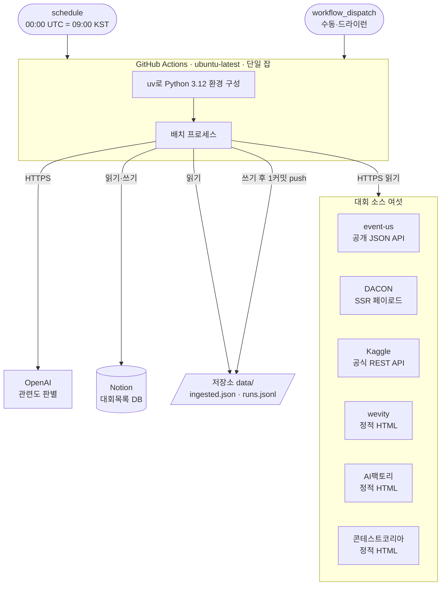

# 인프라 아키텍처

## 0. 이 문서가 다루는 것

배치가 어디서 어떤 모양으로 도는지를 정한다. 실행 환경, 스케줄, 비밀값, 상태를 어디에 두는지, 실패했을 때 어떻게 되는지까지다.

다루지 않는 것은 코드의 내부 구조다. 도메인 경계와 클래스는 6단계 DOM이 정한다. 이 문서는 폴더의 **자리**까지만 잡는다.

서버도 화면도 없다. 사람이 접속하는 주소가 없고, 하루 한 번 깨어나 끝나면 사라지는 프로세스 하나가 전부다. 그래서 흔한 인프라 관심사 가운데 스케일링·로드밸런싱·무중단 배포는 이 문서에 나오지 않는다.

## 1. 제약

#### C1 실행은 GitHub Actions 안에서만 일어난다

출처: [[CCR-PRD-001#R7]] · [[CCR-RFQ-001#Q5]]

별도 서버나 로컬 cron을 두지 않는다. PC가 꺼져 있어도 돌아야 하고 실행 기록이 남아야 한다.

#### C2 하루 한 번, 09:00 KST에 깨어난다

출처: [[CCR-PRD-001#R7]] · [[CCR-RFQ-001#Q10]]

KST는 서머타임이 없으므로 `00:00 UTC`가 연중 `09:00 KST`다. 표준시 전환을 다룰 필요가 없다.

#### C3 저장소가 공개다

출처: [[CCR-RFQ-001#Q9]] · [[CCR-PRD-001#N3]]

커밋되는 모든 파일과 실행 로그가 누구에게나 보인다. 비밀값이 한 번이라도 섞이면 되돌릴 수 없다.

#### C4 상태를 둘 데이터베이스가 없다

출처: [[CCR-PRD-001#R8]] · [[CCR-UC-001#UC-S4]] · [[CCR-UC-001#UC-S6]]

배치는 적재 이력과 실행 요약을 다음 실행까지 기억해야 한다. 그러나 이를 위해 DB를 띄우지 않는다. 이유는 6장에 적는다.

#### C5 한 번 실행이 10분 안에 끝난다

출처: [[CCR-PRD-001#N2]]

여섯 소스를 돌고 LLM 판별과 노션 적재까지 마치는 데 걸리는 시간이다.

#### C6 유료로 나가는 것은 OpenAI 호출뿐이다

출처: [[CCR-PRD-001#N1]]

공개 저장소라 Actions는 무료이고 Kaggle API도 무료다. 월 1달러를 넘기지 않는다.

#### C7 소스 하나가 실패해도 잡 전체가 죽지 않는다

출처: [[CCR-PRD-001#R9]] · [[CCR-UC-001#UC-A1]]

여섯 중 넷이 페이지 구조에 기대는 방식이라 상대의 개편에 깨진다.

#### C8 헤드리스 브라우저를 쓰지 않는다

출처: [[CCR-PRD-001#R1]] · [[CCR-RFQ-001#Q4]]

여섯 소스 모두 HTTP 요청만으로 목록을 얻는 것을 확인했다. 브라우저를 얹으면 실행 시간과 이미지 크기가 함께 뛴다.

#### C9 상대 서버에 부담을 주지 않는다

출처: [[CCR-PRD-001#N4]]

요청 간격, 식별 가능한 User-Agent, `robots.txt` 준수.

#### C10 같은 날 여러 번 돌려도 결과가 같다

출처: [[CCR-PRD-001#N5]] · [[CCR-UC-001#UC-A3]]

실패한 날 다시 돌리는 일이 생기고, 수동 실행이 스케줄과 겹칠 수도 있다.

## 2. 구성도



바깥으로 나가는 연결은 전부 배치가 거는 쪽이다. 들어오는 연결은 없다. 열어 둘 포트도, 붙일 도메인도 없다는 뜻이다.

## 3. 기술 스택

| 층 | 선택 | 이유 |
|---|---|---|
| 실행 환경 | GitHub Actions `ubuntu-latest` | [[#C1]] |
| 언어 | Python 3.12 | 개발 환경과 같다. HTML 파싱·HTTP·노션 연동 라이브러리가 두껍다 |
| 패키지 관리 | `uv` | 설치가 빨라 [[#C5]]에 유리하다. 락 파일로 실행마다 같은 버전을 쓴다 |
| HTTP | `httpx` | 타임아웃·재시도를 요청 단위로 다루기 좋다 |
| HTML 파싱 | `selectolax` 또는 `beautifulsoup4` | 정적 HTML 네 곳에 쓴다. 구체 선택은 DOM 단계에서 |
| 노션 | Notion 공식 HTTP API | 라이브러리를 끼지 않고 직접 호출한다. 쓰는 엔드포인트가 서넛뿐이다 |
| OpenAI | 공식 SDK | 응답 형식을 강제하는 기능을 쓴다 |

무거운 것을 얹지 않는 것이 이 표의 요지다. 웹 프레임워크도, ORM도, 작업 큐도 없다. 들어오는 요청이 없고([[#C4]]) 프로세스가 한 번 돌고 끝나기 때문이다.

## 4. 내부 구조

서버도 화면도 없으므로 저장소에 `backend/`·`frontend/`가 없다. 대신 배치 본체를 폴더 하나에 담고 루트에는 쏟지 않는다.

```
competition-crawler/
├── collector/              배치 본체
├── tests/                  collector/ 구조를 거울로
├── data/                   상태 파일. 5장·6장
│   ├── ingested.json
│   └── runs.jsonl
├── docs/specs/             명세 원본
├── .github/workflows/
│   └── daily.yml           8장
├── .env.example            필요한 환경 변수의 이름만. 값은 비운다
├── pyproject.toml · uv.lock
├── .gitignore
└── README.md · AGENTS.md
```

`collector/` 안의 도메인 경계와 계층은 **여기서 정하지 않는다.** 6단계 DOM의 클래스 명세가 확정하고, 그 문서의 「폴더 구조」 절이 기준이다. 다만 소스 여섯이 [[CCR-UC-001#UC-S1]]에서 같은 인터페이스를 따르기로 한 것은 이미 정해진 전제다.

## 5. 인증과 접근

배치가 밖으로 거는 연결마다 자격증명이 필요하다. 전부 GitHub Secrets에 두고 환경 변수로 주입한다. 저장소 파일에는 이름만 있고 값은 없다.

| 시크릿 | 쓰는 곳 | 형태 |
|---|---|---|
| `NOTION_TOKEN` | 노션 적재 [[CCR-UC-001#UC-S6]] | 인테그레이션 토큰 |
| `NOTION_DATA_SOURCE_ID` | 대상 DB 지정 | `대회목록`의 데이터소스 ID |
| `OPENAI_API_KEY` | 관련도 판별 [[CCR-UC-001#UC-S5]] | API 키 |
| `KAGGLE_USERNAME` · `KAGGLE_KEY` | Kaggle 수집 [[CCR-UC-001#UC-S1]] | HTTP Basic 자격증명 |

`NOTION_DATA_SOURCE_ID`는 그 자체로는 아무 권한이 없지만 [[#C3]] 때문에 시크릿에 둔다. 공개 저장소에 적으면 사용자의 노션에 어떤 페이지가 있는지가 드러난다.

판별에 쓸 모델 이름은 비밀이 아니므로 저장소 변수나 설정 파일에 둔다. [[CCR-RFQ-001#Q14]]대로 코드를 고치지 않고 바꿀 수 있어야 한다.

### 5.1 노션 쪽 준비

노션 인테그레이션은 만들어 두는 것만으로는 아무것도 못 읽는다. `대회목록` DB가 들어 있는 페이지에 그 인테그레이션을 **연결**해 줘야 한다. 이 한 단계를 빠뜨리면 토큰이 맞아도 `object_not_found`가 돌아온다.

### 5.2 로그에 값이 새지 않게

GitHub는 Secrets에 등록된 값이 로그에 나타나면 가려 준다. 그러나 값이 가공돼 나오면 — 예를 들어 URL 인코딩되거나 일부만 잘려 나오면 — 못 알아본다. 그래서 [[CCR-UC-001#UC-S7]] 7이 기록을 내보내기 전에 한 번 더 확인한다.

### 5.3 저장소에 쓰기

배치가 상태 파일을 커밋하므로 잡에 `contents: write` 권한이 필요하다. 그 밖의 권한은 주지 않는다.

## 6. 데이터가 사는 곳

### 6.1 데이터베이스를 두지 않는 이유

배치가 기억해야 하는 것은 둘뿐이다. 지금까지 넣은 대회의 키와, 날짜별 소스 건수. 둘 다 쓰는 주체가 배치 하나이고 동시에 쓰는 일이 없다.

여기에 DB를 붙이면 띄우고 지키는 값이 얻는 것보다 크다. 무료로 쓸 수 있는 관리형 DB는 쓰지 않으면 잠들거나 일정 기간 뒤 지워지는 조건이 붙기 마련이라, 하루 한 번만 접속하는 이 배치와 맞지 않는다. [[#C6]]도 걸린다.

저장소 파일로 두면 얻는 것이 더 있다. 변경 이력이 git log로 남아 [[CCR-UC-001#UC-A3]]의 진단에 그대로 쓰인다. "언제부터 이 소스가 0건이었나"를 파일 하나의 히스토리로 볼 수 있다.

### 6.2 상태 파일 둘

| 파일 | 내용 | 자라는 속도 |
|---|---|---|
| `data/ingested.json` | 지금까지 적재한 대회의 키. [[CCR-UC-001#UC-S4]]가 읽고 [[CCR-UC-001#UC-S6]]이 쓴다 | 적재한 대회 수만큼. 연 수백 건 |
| `data/runs.jsonl` | 한 줄이 한 실행. 소스별 건수·단계별 탈락 수·경고·소요 시간. [[CCR-UC-001#UC-S7]]이 읽고 쓴다 | 하루 한 줄. 연 365줄 |

`runs.jsonl`을 한 줄 단위로 두는 것은 덧붙이기만 하면 되기 때문이다. 기존 줄을 건드리지 않으므로 충돌이 나지 않고, 직전 실행을 읽을 때 마지막 줄만 보면 된다.

두 파일은 [[CCR-UC-001#UC-A1]] 9에서 **한 커밋**으로 올라간다. 나눠 커밋하면 앞 커밋만 성공한 상태가 생겨 이력과 요약이 서로 다른 날을 가리킨다.

### 6.3 사람이 보는 데이터

대회 목록 자체는 노션 `대회목록` DB에 산다. 저장소에는 복제본을 두지 않는다. 두 곳에 같은 것이 있으면 어긋나고, 사람이 보는 것은 노션뿐이다.

## 7. 외부 변경 감지

이 배치의 가장 흔한 고장은 **소스 사이트가 조용히 바뀌는 것**이다. 예외가 나면 [[#C7]]이 잡아 기록에 남기지만, 마크업만 바뀌어 파서가 아무것도 못 찾는 경우는 예외가 나지 않는다. 결과가 빈 목록일 뿐이다.

그래서 [[CCR-UC-001#UC-S7]] 2가 `runs.jsonl`의 직전 성공 실행과 이번 건수를 견준다. 꾸준히 건수를 내던 소스가 0건이 되면 경고를 붙인다. 원래 0건이던 소스에는 붙이지 않는다.

이것이 알림 없이([[CCR-RFQ-001#Q6]]) 고장을 알아채는 유일한 장치다. 경고는 실행 요약 파일에 남으므로 사람이 저장소만 봐도 어느 날부터 어느 소스가 멈췄는지 알 수 있다.

노션과 OpenAI는 이 감지 대상이 아니다. 둘 다 실패하면 예외가 나므로 [[#C7]]과 [[CCR-UC-001#UC-A1]]의 확장이 다룬다.

## 8. 배치와 운영

### 8.1 워크플로 하나, 잡 하나

`.github/workflows/daily.yml` 하나로 끝난다. 잡을 나누면 상태 파일을 아티팩트로 주고받아야 하는데, 한 잡 안에서는 그냥 파일이다.

| 항목 | 값 | 근거 |
|---|---|---|
| 트리거 | `schedule` + `workflow_dispatch` | [[#C2]] · [[CCR-PRD-001#R7]] |
| cron | `0 0 * * *` (UTC) | 09:00 KST. [[#C2]] |
| 수동 입력 | `dry_run` — 노션에 쓰지 않고 결과만 본다 | [[CCR-PRD-001#R7]] · [[CCR-UC-001#UC-A3]] 4 |
| 권한 | `contents: write` | 5.3 |
| 동시성 | 그룹 하나, 겹치면 대기 | [[#C10]] |
| 잡 타임아웃 | 15분 | [[#C5]]의 목표는 10분. 그보다 여유를 두되 무한정 매달리지 않게 한다 |
| 런타임 | `setup-uv` → `uv sync --frozen` | 3장 |

### 8.2 커밋이 다시 워크플로를 부르지 않는다

배치가 상태 파일을 push하는데, 그 push가 워크플로를 다시 깨우면 무한히 돈다. 기본 `GITHUB_TOKEN`으로 한 push는 다른 워크플로를 트리거하지 않는다. 이 워크플로는 `push` 트리거를 아예 두지 않으므로 이중으로 안전하다.

개인 액세스 토큰이나 GitHub App 토큰으로 바꾸면 이 보호가 사라진다. 바꿀 이유가 없다.

### 8.3 스케줄은 정확하지 않다

GitHub의 예약 실행은 요청이 몰리면 밀린다. 정각은 특히 몰리는 시각이라 `0 0 * * *`는 몇 분에서 수십 분 늦게 시작될 수 있다.

하루 한 번 도는 배치라 이 지연은 문제가 되지 않는다. 사용자가 노션을 여는 것은 아침이고([[CCR-SCN-001#P1]]) 대회 마감은 날 단위다. 분 단위 정시성이 필요해지면 cron을 정각에서 몇 분 비켜 두는 것으로 줄일 수 있다.

### 8.4 실패했을 때

| 상황 | 잡의 결말 | 그다음 |
|---|---|---|
| 소스 하나가 실패 | 성공 | 기록에 남는다. 나머지는 적재된다 ([[#C7]]) |
| 소스가 조용히 0건 | 성공 | 경고가 붙는다 (7장) |
| 여섯 소스 전부 실패 | 실패 | [[CCR-UC-001#UC-A1]] 2b |
| 노션을 못 읽음 | 실패 | 적재하지 않는다. [[CCR-UC-001#UC-A1]] 5a |
| 노션 쓰다 끊김 | 실패 | 넣은 데까지 이력에 남고 다음 실행이 채운다 |
| 상태 파일 커밋 실패 | 실패 | 노션은 갱신됐고 상태만 밀린다. [[CCR-UC-001#UC-S6]] 4a |

실패는 Actions 실행 이력에 붉게 남는다. 알림을 보내지 않으므로([[CCR-RFQ-001#Q6]]) 사람이 알아채는 것은 노션에 며칠째 새 행이 없을 때이거나, 저장소의 `runs.jsonl`을 볼 때다.

### 8.5 비용

| 항목 | 비용 |
|---|---|
| Actions 실행 | 무료. 공개 저장소는 사용량 제한이 없다 |
| Kaggle API | 무료 |
| 노션 API | 무료 |
| OpenAI | 신규 대회만 판별하므로 하루 수~수십 건. [[#C6]]의 월 1달러 안 |

[[CCR-UC-001#UC-S4]]를 [[CCR-UC-001#UC-S5]]보다 먼저 두는 순서가 이 비용을 정한다. 순서를 뒤집으면 매일 전체 후보를 다시 판별하게 된다.

## 9. 미결사항

- [ ] **공개 저장소의 예약 워크플로는 저장소가 60일간 조용하면 자동으로 꺼진다.** 이 배치는 매일 상태 파일을 커밋하므로 활동이 계속 생겨 해당되지 않을 것으로 본다. 다만 봇이 만든 커밋이 이 판정에 활동으로 잡히는지 직접 확인하지 않았다. 첫 두 달을 지켜보고, 꺼지면 워크플로를 수동으로 다시 켜거나 다른 활동을 만드는 방법을 찾는다
- [ ] HTML 파서로 `selectolax`와 `beautifulsoup4` 중 무엇을 쓸지. 속도는 앞이 낫고 셀렉터 표현력은 뒤가 낫다. 네 소스의 마크업을 실제로 짜 보고 6단계에서 정한다
- [ ] `data/ingested.json`이 몇 년 뒤 커지면 어떻게 할지. 연 수백 건이라 당분간은 문제가 없다. 마감이 오래 지난 키를 덜어낼지, 그대로 둘지
