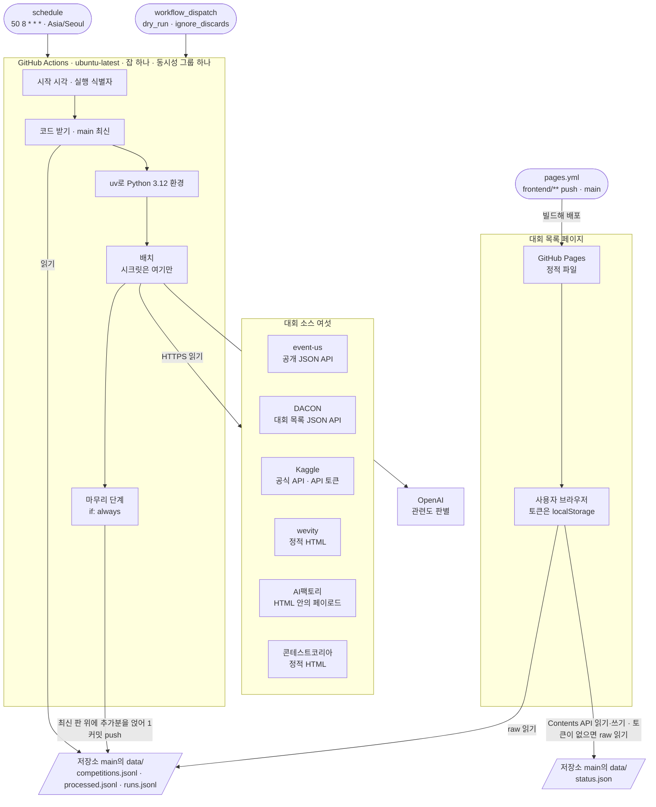

# 인프라 아키텍처

## 0. 이 문서가 다루는 것

배치가 어디서 어떤 모양으로 도는지, 대회 목록 페이지가 어디에 올라가 무엇을 읽고 쓰는지를 정한다. 실행 환경, 스케줄, 비밀값, 저장소의 데이터 파일, 실패·재시도, 실행 기록, 페이지 배포까지다.

다루지 않는 것은 코드의 내부 구조다. 도메인 경계와 클래스는 6단계 DOM이 정한다. 이 문서는 폴더의 **자리**와 설정 파일이 무엇을 읽는지까지만 잡는다.

서버가 없다. 하루 한 번 깨어나 끝나면 사라지는 프로세스 하나와, GitHub Pages에 올라가는 정적 페이지 하나가 전부다. 페이지는 서버 없이 저장소 파일을 읽고, 사용자가 바꾼 것은 사용자의 브라우저에 둔 토큰으로 저장소에 쓴다. 그래서 흔한 인프라 관심사 가운데 스케일링·로드밸런싱·무중단 배포·데이터베이스는 이 문서에 나오지 않는다.

이 문서와 상위 명세는 공개 저장소의 `docs/specs/`에 커밋된다. 그래서 비밀로 둔 값은 적지 않고 이름만 적는다. 한편 목록 파일·기록 파일·상태 파일은 사용자가 어떤 대회를 보고 어떤 상태로 두었는지를 공개한다. 대회 이름과 건수는 원래 공개된 정보이고, 상태 값은 사용자가 알고 받아들였다([[CCR-RFQ-001#Q16]]).

## 1. 제약

#### C1 실행은 GitHub Actions 안에서만 일어난다

출처: [[CCR-PRD-001#R7]] · [[CCR-RFQ-001#Q5]]

별도 서버나 로컬 cron을 두지 않는다. PC가 꺼져 있어도 돌아야 하고 실행 기록이 남아야 한다. 이 용도가 GitHub Actions 약관에 맞는지는 판정하지 못했고, 사용자가 그 위험을 알고 쓰기로 했다(8.10).

#### C2 매일 08:50 KST에 시작하도록 예약한다

출처: [[CCR-PRD-001#R7]] · [[CCR-RFQ-001#Q10]]

예약은 `cron: '50 8 * * *'`에 `timezone: 'Asia/Seoul'`을 붙여 적는다. GitHub 공식 문서가 `schedule`에 IANA 시간대를 지정하는 이 키를 지원한다. UTC로 바꿔 `50 23 * * *`로 적어도 같은 시각이지만, 두 방식을 섞지 않는다. `timezone`을 붙인 채 cron만 UTC 값으로 두면 시각이 아홉 시간 어긋난다. KST는 서머타임이 없으므로 연중 같은 시각이다.

#### C3 저장소가 공개다

출처: [[CCR-RFQ-001#Q9]] · [[CCR-PRD-001#N3]]

커밋되는 모든 파일과 실행 로그가 누구에게나 보인다. 명세 문서도 예외가 아니다. 비밀값이 한 번이라도 섞이면 로그나 커밋을 지우더라도 이미 노출된 것으로 보고 그 값을 즉시 교체한다.

#### C4 상태를 둘 데이터베이스가 없다

출처: [[CCR-PRD-001#R8]] · [[CCR-UC-001#UC-S4]] · [[CCR-UC-001#UC-S6]]

배치는 목록·처리 이력·실행 요약을 다음 실행까지 기억해야 하고, 페이지는 사용자가 바꾼 상태를 기억해야 한다. 그러나 이를 위해 DB를 띄우지 않는다. 전부 저장소 파일이다. 이유는 6장에 적는다.

#### C5 한 번 실행이 10분 안에 끝난다

출처: [[CCR-PRD-001#N2]]

여섯 소스를 돌고 LLM 판별과 목록 파일 적재까지 마치는 데 걸리는 시간이다. Actions의 실행 시간으로 잰다. 소스 하나만 느려도 재시도와 대기가 이 시간을 다 써, 나머지 소스가 정상이어도 한 건도 적재하지 못할 수 있다. 그래서 소스를 동시에 돌리고 소스마다 시간 예산을 둔다. 앞뒤 스텝을 합쳐 10분 안에 들도록 배치 스텝에는 8분 한도를 걸고, 넘기면 끊어 중단으로 남긴다(8.5).

#### C6 유료로 나가는 것은 OpenAI 호출뿐이다

출처: [[CCR-PRD-001#N1]]

공개 저장소라 Actions와 GitHub Pages는 무료이고 Kaggle API도 요금이 없다. 월 운영비는 미화 1달러 미만이다.

#### C7 소스 하나가 실패해도 잡 전체가 죽지 않는다

출처: [[CCR-PRD-001#R9]] · [[CCR-UC-001#UC-A1]]

여섯 중 셋은 페이지 구조에 기대는 방식이고, event-us · DACON도 사이트가 스스로 쓰는 JSON API라 공개 문서가 없다. 어느 것이든 상대의 개편에 깨진다.

#### C8 헤드리스 브라우저를 쓰지 않는다

출처: [[CCR-PRD-001#R1]] · [[CCR-RFQ-001#Q4]]

여섯 소스 모두 HTTP 요청만으로 목록을 얻는 것을 확인했다. 브라우저를 얹으면 실행 시간과 설치 시간이 함께 뛴다.

#### C9 상대 서버에 부담을 주지 않는다

출처: [[CCR-PRD-001#N4]]

요청 간격, 식별 가능한 User-Agent, `robots.txt` 준수.

#### C10 같은 날 여러 번 돌려도 결과가 같다

출처: [[CCR-PRD-001#N5]] · [[CCR-UC-001#UC-A1]] · [[CCR-UC-001#UC-A3]]

실패한 날 다시 돌리는 일이 생기고, 예약 실행이 밀려 수동 실행과 이어서 돌 수도 있다.

#### C11 실행은 한 번에 하나씩 차례로 돈다

출처: [[CCR-PRD-001#N5]] · [[CCR-UC-001#UC-A1]]

두 실행이 같은 목록 파일과 처리 이력을 동시에 읽으면 같은 대회를 둘 다 넣는다. 앞 실행이 돌고 있으면 뒤 실행은 취소되지 않고 기다린다. 차례는 브랜치와 상관없이 이 배치 전체에 하나다.

#### C12 목록에 쓰는 실행은 기본 브랜치에서만 돈다

출처: [[CCR-PRD-001#R7]] · [[CCR-UC-001#UC-A1]]

다른 브랜치에서 쓰면 목록과 처리 이력이 브랜치마다 갈라진다. 페이지가 읽는 것도 기본 브랜치의 파일이다. 기본 브랜치가 아닌 곳에서 도는 실행은 입력값과 상관없이 목록에 쓰지 않는 모드로 돈다. 쓰기는 마무리 단계의 push 하나뿐이고, 그 스텝은 `main`에서만 돈다(8.1). 다른 브랜치에서 누른 실행은 그 브랜치의 `daily.yml`과 코드로 돌기 때문에, 이 보장은 워크플로 파일이 지키고 브랜치에서 그것을 고치면 깨진다. 받아들인 위험이다(8.10). 개발자 PC에서 돌리는 배치도 늘 이 모드다. 마무리 단계가 없어 쓴 기록이 저장소에 올라가지 않기 때문이다. 이 저장소의 기본 브랜치는 `main`이다.

#### C13 날짜는 러너의 시계가 아니라 KST로 센다

출처: [[CCR-PRD-001#R3]] · [[CCR-UC-001#UC-A1]]

08:50 KST는 UTC로 전날 23:50이다. 러너의 시스템 시간대는 공식 문서에 적혀 있지 않고 실무에서는 UTC로 알려져 있다. 그 시계의 날짜를 그대로 쓰면 기준일이 하루 이르게 잡혀, 어제 마감된 대회가 걸러지지 않고 들어오고 `수집일`도 하루 이르게 찍힌다. 그래서 기준일은 러너의 시간대에 기대지 않고 KST로 바꿔 구한다(8.1).

#### C14 대회 목록 페이지는 GitHub Pages의 정적 페이지다

출처: [[CCR-PRD-001#R10]] · [[CCR-RFQ-001#Q16]] · [[CCR-RFQ-001#Q7]]

서버도 데이터베이스도 두지 않는다. 페이지는 빌드된 파일 몇 개이고, 기본 브랜치의 목록 파일과 상태 파일을 읽어 보여 준다. 사용자가 바꾼 상태는 페이지가 GitHub Contents API로 상태 파일에 커밋한다. 그 토큰은 사용자의 브라우저에만 있고 저장소·Actions 어디에도 없다(5.8). 페이지는 저장소가 공개인 만큼 공개다([[#C3]]). 배포는 `frontend/`가 바뀔 때 Actions가 빌드해 올린다(8.11).

## 2. 구성도


```mermaid
flowchart TB
    schedule([schedule<br/>50 8 * * * · Asia/Seoul])
    manual([workflow_dispatch<br/>dry_run · ignore_discards])

    subgraph runner["GitHub Actions · ubuntu-latest · 잡 하나 · 동시성 그룹 하나"]
        direction TB
        s1[시작 시각 · 실행 식별자]
        s2[코드 받기 · main 최신]
        s3[uv로 Python 3.12 환경]
        s4[배치<br/>시크릿은 여기만]
        s5[마무리 단계<br/>if: always]
        s1 --> s2 --> s3 --> s4 --> s5
    end

    subgraph sources["대회 소스 여섯"]
        eus[event-us<br/>공개 JSON API]
        dacon[DACON<br/>대회 목록 JSON API]
        kaggle[Kaggle<br/>공식 API · API 토큰]
        wevity[wevity<br/>정적 HTML]
        aif[AI팩토리<br/>HTML 안의 페이로드]
        ck[콘테스트코리아<br/>정적 HTML]
    end

    openai[OpenAI<br/>관련도 판별]
    state[/저장소 main의 data/<br/>competitions.jsonl · processed.jsonl · runs.jsonl/]
    status[/저장소 main의 data/<br/>status.json/]

    subgraph page["대회 목록 페이지"]
        direction TB
        pages[GitHub Pages<br/>정적 파일]
        browser[사용자 브라우저<br/>토큰은 localStorage]
        pages --> browser
    end
    pageswf([pages.yml<br/>frontend/** push · main])

    schedule --> runner
    manual --> runner
    s4 -->|HTTPS 읽기| sources
    s4 -->|HTTPS| openai
    s2 -->|읽기| state
    s5 -->|최신 판 위에 추가분을 얹어 1커밋 push| state
    pageswf -->|빌드해 배포| pages
    browser -->|raw 읽기| state
    browser -->|Contents API 읽기·쓰기 · 토큰이 없으면 raw 읽기| status
```

바깥으로 나가는 연결은 전부 배치와 브라우저 쪽에서 건다. 들어오는 연결은 없다. 열어 둘 포트도, 붙일 도메인도 없다는 뜻이다. 목록에 쓰지 않는 실행에서는 마무리 단계의 커밋 화살표가 없다. 배치는 `status.json`을 읽지도 쓰지도 않고, 페이지는 `competitions.jsonl`·`processed.jsonl`·`runs.jsonl`을 쓰지 않는다.

## 3. 기술 스택

| 층 | 선택 | 이유 |
|---|---|---|
| 실행 환경 | GitHub Actions `ubuntu-latest` | [[#C1]] |
| 언어(배치) | Python 3.12 | 개발 환경과 같다. HTML 파싱·HTTP 라이브러리가 두껍다 |
| 패키지 관리 | `uv` | 설치가 빨라 [[#C5]]에 유리하다. 락 파일로 실행마다 같은 버전을 쓴다. uv 자체의 버전도 고정한다 |
| HTTP | `httpx` | 요청 단위로 타임아웃을 줄 수 있다. 내장 재시도는 연결 오류만 다루므로 재시도는 따로 구현한다(8.5). 4xx·5xx 응답에 예외를 던지지 않으므로 상태 코드를 직접 확인한다 |
| HTML 파싱 | `selectolax` | wevity · 콘테스트코리아의 목록 HTML에 CSS 선택자로 쓴다. AI팩토리는 페이지 안의 페이로드를 정규식과 JSON으로 읽고, DACON은 JSON API라 쓰지 않는다. 가볍고 빨라 골랐다([[CCR-DOM-002]] 5장) |
| 페이지 | React + Vite + TypeScript, Node 24, npm | 싱크독 규약 1.9의 기본형이다. 빌드 결과가 정적 파일이라 GitHub Pages에 그대로 올라간다([[#C14]]). 저장소 읽기는 `fetch`로 raw 파일을(토큰이 있으면 상태 파일은 Contents API로), 쓰기는 GitHub Contents API를 직접 부른다. 라이브러리를 끼지 않는다 |
| 페이지 배포 | GitHub Pages, 배포 소스는 GitHub Actions | `actions/upload-pages-artifact` + `actions/deploy-pages`. 브랜치에 빌드 결과를 커밋하지 않는다(8.11) |
| OpenAI | 공식 SDK, Structured Outputs | 응답 형식을 스키마로 강제한다. 모델을 바꿀 때 이 기능과 추론 끄기(`reasoning.effort: none`)를 모두 받는지 확인한다. 추론 끄기를 받지 않는 모델이면 요청마다 400이 온다([[CCR-API-001]] 1.3). 거절이나 길이 초과로 스키마를 벗어난 응답은 판별 실패로 다룬다([[CCR-UC-001#UC-S5]] 2a) |
| Kaggle | 공식 API의 대회 목록, API 토큰 인증 | 호출 방식은 [[CCR-API-001#POST/api.kaggle.com/v1/…/ListCompetitions]]. 2026-10-01에 실측했다. 한 쪽은 20건으로 정해져 있고 `page`로 넘긴다 |

무거운 것을 얹지 않는 것이 이 표의 요지다. 백엔드 웹 프레임워크와 작업 큐가 없는 것은 들어오는 요청 없이 Actions 안에서 한 번 돌고 끝나기 때문이고([[#C1]]), ORM이 없는 것은 데이터베이스를 두지 않기 때문이다([[#C4]]). 페이지에도 상태 관리 라이브러리나 UI 키트를 얹지 않는다. 표 하나와 대화상자 하나다([[CCR-PRD-001#R10]]).

## 4. 내부 구조

서버가 없으므로 저장소에 `backend/`가 없다. 실행 컴포넌트는 둘이다. 배치를 `batch/`에, 대회 목록 페이지를 `frontend/`에 담는다. 싱크독 규약 1.9대로 루트에 쏟지 않는다. 패키지·테스트·전용 설정 파일은 각 폴더 안에 둔다.

```
competition-crawler/
├── batch/                  배치
│   ├── collector/          배치 본체. 안쪽 구조는 6단계 DOM 클래스 명세
│   ├── tests/              collector/ 구조를 거울로
│   ├── settings.toml       비밀이 아닌 조정값
│   └── pyproject.toml · uv.lock
├── frontend/               대회 목록 페이지. React + Vite + TypeScript
│   ├── src/                안쪽 구조는 6단계 DOM 클래스 명세
│   ├── package.json · package-lock.json
│   └── vite.config.ts      Pages 하위 경로(base)
├── data/                   저장소에 두는 데이터 파일. 6장
│   ├── competitions.jsonl  목록 파일. 배치만 쓴다
│   ├── status.json         상태 파일. 페이지만 쓴다
│   ├── processed.jsonl     처리 이력
│   └── runs.jsonl          실행 요약
├── docs/specs/             명세 원본
├── .github/
│   ├── workflows/daily.yml 배치. 8장
│   ├── workflows/pages.yml 페이지 배포. 8.11
│   └── dependabot.yml      액션·npm 버전 갱신. 5.6
├── .env.example            로컬 실행에 필요한 환경 변수의 이름만. 값은 비운다
├── .gitignore              .env·.venv·node_modules·frontend/dist와 응답 덤프·로그 폴더를 반드시 넣는다
└── README.md · AGENTS.md
```

배치는 `batch/`를 작업 디렉터리로 삼아 실행한다. uv는 현재 디렉터리에서 위로만 프로젝트를 찾으므로 워크플로의 실행 스텝에 `working-directory: batch`를 준다. 데이터 파일 경로는 실행 위치가 아니라 저장소 루트를 기준으로 잡는다. 페이지 빌드는 `frontend/`에서 `npm ci && npm run build`로 하고 결과는 `frontend/dist/`에 남는데, 커밋하지 않는다.

`collector/`와 `frontend/src/` 안의 도메인 경계와 계층은 **여기서 정하지 않는다.** 6단계 DOM의 클래스 명세가 확정하고, 그 문서의 「폴더 구조」 절이 기준이다. 다만 소스 여섯이 [[CCR-UC-001#UC-S1]]에서 같은 인터페이스를 따르기로 한 것은 이미 정해진 전제다.

### 4.1 설정 파일이 읽는 것

| 자리 | 담는 것 | 읽는 쪽 |
|---|---|---|
| `.github/workflows/daily.yml` | 예약 시각, 수동 입력, 동시성, 권한, 스텝 순서. 시크릿과 변수를 배치 스텝의 환경 변수로 넘기는 일 | GitHub Actions |
| `batch/pyproject.toml` · `uv.lock` | Python 버전과 의존성, uv 버전(`required-version`) | `setup-uv`(설치할 uv 버전)·uv |
| `batch/settings.toml` | 판별 모델 이름의 기본값, 0건 경고의 연속 일수(기본 3), 소스별 요청 타임아웃·재시도·간격·쪽 상한, OpenAI의 타임아웃·재시도, 판별 동시 요청 수(8.5) | 배치 |
| 저장소 변수 `OPENAI_MODEL` | 판별 모델 이름. 있으면 `settings.toml`의 기본값을 덮는다. 저장소 설정에서 바꾸므로 코드도 커밋도 없이 모델을 바꿀 수 있다([[CCR-RFQ-001#Q14]]) | 배치 |
| GitHub Secrets | 비밀값 둘(5장). 시크릿을 담는 환경(environment)은 두지 않는다(5.1) | 배치 |
| `.env` | 로컬에서 돌릴 때만 쓰는 비밀값과 `OPENAI_MODEL`. 저장소 루트에 두고 커밋하지 않는다. 저장소에는 이름과 설명만 적은 `.env.example`만 둔다([[#C3]]) | 배치 |
| `.github/workflows/pages.yml` | 페이지 배포 트리거(`frontend/**` push · 수동), 권한, 빌드·배포 스텝(8.11) | GitHub Actions |
| `frontend/vite.config.ts` | Pages 하위 경로 `base: '/competition-crawler/'`. 저장소 이름이 바뀌면 여기만 고친다 | Vite |
| `frontend/src/config.ts` | 저장소 소유자·이름·기본 브랜치·데이터 파일 경로·raw 주소·Contents API 주소, 상태 커밋의 작성자(저장소 주인의 noreply 주소, 8.11). 비밀값은 없다 | 페이지 |
| 브라우저 `localStorage` | 페이지 토큰(5.8)과 페이지의 보기 설정. 사용자의 브라우저에만 있다 | 페이지 |

판정 규칙의 수치(유사도 0.90, 마감일 180일, 판별 실패 절반)는 조정값이 아니라 규칙이라 코드에 둔다. 바꾸려면 PRD부터 고친다. 유사도는 2026-09-28에 0.80에서 0.90으로 올렸다([[CCR-PRD-001]] 5.2).

로컬에서 돌리면 배치는 GitHub Actions 밖임을 알아보고(`GITHUB_ACTIONS`가 `true`가 아님) 목록에 쓰지 않는 모드로만 돈다([[#C12]]). 처리 이력과 실행 요약은 작업 트리의 사본이 아니라 `origin/main`의 최신 판을 받아 읽고, 받지 못하면 돌지 않는다. 브랜치를 딴 뒤 쌓인 기록이 빠지면 미리보기가 실제와 달라지기 때문이다([[CCR-UC-001#UC-A1]] 1b7). 기준일은 배치가 시작할 때 읽은 시각을 KST로 바꿔 쓴다.

## 5. 인증과 접근

배치가 밖으로 거는 연결 가운데 자격증명이 필요한 것은 둘이다. 전부 GitHub Secrets에 두고, **배치 스텝에만** 환경 변수로 넘긴다. 잡 전체의 환경 변수에 두지 않으므로 다른 스텝과 그 스텝이 부르는 액션은 값을 받지 않는다. 저장소 파일에는 이름만 있고 값은 없다. 페이지가 쓰는 GitHub 토큰은 Secrets에 두지 않는다. 사용자의 브라우저에만 있다(5.8).

| 시크릿 | 쓰는 곳 | 형태 |
|---|---|---|
| `OPENAI_API_KEY` | 관련도 판별 [[CCR-UC-001#UC-S5]] | 이 도구 전용 프로젝트의 API 키 |
| `KAGGLE_API_TOKEN` | Kaggle 수집 [[CCR-UC-001#UC-S1]] | API 토큰 |

배치는 시작할 때 두 값이 있는지 본다. 등록되지 않은 시크릿은 빈 문자열로 들어오므로 빈 값을 빠진 것으로 본다. 반드시 있어야 하는 값은 없다. 아는 대회는 저장소 파일로 가르고 적재도 파일에 하기 때문이다([[CCR-UC-001#UC-A1]] 1d). 빠진 것마다 처리가 다르다.

| 빠진 것 | 처리 | 실행 결과 |
|---|---|---|
| `KAGGLE_API_TOKEN` | Kaggle에만 실패 표시(종류: 설정 누락)를 남기고 나머지 다섯 소스로 진행한다 | 성공일 수 있다 |
| `OPENAI_API_KEY` | 판별이 통째로 실패한 날로 다룬다. 접수마감일이 기준일인 대회만 적재하고 나머지는 미룬다 | 성공, 판별 미룸 경고(원인: 키 누락) |

### 5.1 GitHub 환경(environment)을 두지 않는다

노션에 넣던 때(2026-09-29까지)는 쓰기 토큰과 읽기 토큰을 `notion-write`·`notion-read` 두 환경에 나누어 두고, `notion-write`의 배포 브랜치를 `main`으로 제한해 [[#C12]]를 노션의 권한으로 지켰다. 노션이 빠지면서 그 두 환경과 저장소 시크릿 `NOTION_DATA_SOURCE_ID`는 2026-09-30에 지웠다. 남은 시크릿 둘(OpenAI·Kaggle)은 어느 브랜치의 실행이든 같은 값을 써야 하므로 환경에 둘 이유가 없다. 브랜치의 미리보기도 판별 모델을 실제로 부른다([[CCR-UC-001#UC-A1]] 1b1).

저장소에 쓰는 쪽은 마무리 단계의 push 하나이고, 그 자격은 환경이 아니라 잡 토큰(`GITHUB_TOKEN`)이다. 어느 브랜치의 워크플로도 `contents: write`를 선언하면 이 토큰으로 `main`에 push할 수 있다. 환경을 두어도 브랜치의 워크플로가 `environment:` 줄을 빼면 그만이라 막지 못한다. 그래서 [[#C12]]는 워크플로 파일의 조건으로 지키고, 브랜치에서 그것을 고치는 경우는 받아들인 위험으로 둔다(8.10). 잘못 올라간 커밋은 git으로 되돌린다.

예외는 페이지 배포의 `github-pages` 환경 하나다. Pages를 GitHub Actions 소스로 켜면 GitHub가 만들고, 배포 브랜치를 `main` 하나로 묶는다. 시크릿이 없는 배포 전용 환경이라 이 절의 뜻(시크릿을 환경에 나누지 않는다)과 부딪히지 않는다. 이 환경을 쓰는 것은 `pages.yml`의 잡뿐이고, 배치 잡은 환경 없이 돈다(8.11).

### 5.2 Kaggle 쪽 준비 — 새 API 토큰

kaggle.com/settings/api에서 **Generate New Token**으로 토큰을 발급해 `KAGGLE_API_TOKEN`에 넣는다.

사용자명과 키를 담는 `kaggle.json` 방식은 쓰지 않는다. Kaggle 공식 CLI 문서가 이 방식을 "Legacy API Credentials"로 분류하고 있어, 새 프로젝트를 그 위에 올리지 않는다([[CCR-RFQ-001#Q4]]).

이 토큰은 사용자가 실제로 대회에 참가하는 계정의 것이다. 새면 남이 사용자 이름으로 제출하거나 데이터셋·노트북을 관리할 수 있다. 새 토큰에 범위나 만료를 줄 수 있는지는 공식 문서에서 찾지 못했다(9장). 2026-10-01에 사용자가 새 토큰을 발급해 이 시크릿을 등록했다. 그 전까지 Kaggle은 매 실행 설정 누락으로 표시됐다.

자격증명 없이 호출하면 401이다. 새 토큰으로는 2026-10-01에 200을 받았고, 응답과 쪽 넘김은 [[CCR-API-001#POST/api.kaggle.com/v1/…/ListCompetitions]]에 적었다. Kaggle이 심는 익명 세션 쿠키가 함께 실리면 토큰이 있어도 401이라, 배치는 소스의 쿠키를 남기지 않는다([[CCR-API-001]] 1.1).

### 5.3 OpenAI 쪽 준비 — 전용 프로젝트와 지출 한도

키는 이 도구만 쓰는 OpenAI 프로젝트에서 발급한다. 그 프로젝트에 지출 알림과 하드 지출 한도를 건다. 알림은 [[CCR-PRD-001#N1]]의 월 1달러에 두고, 하드 한도는 그보다 조금 위(예: 3달러)로 둔다. 첫 실행처럼 호출이 몰리는 날의 정상 판별까지 막지 않기 위해서다. 한도 적용이 즉시가 아니라 조금 넘을 수 있다.

하드 한도에 닿으면 판별 호출이 `429 project_spend_limit_exceeded`로 실패한다. 이 응답은 다시 시도하지 않는다. 판별 실패가 그날 대상의 절반을 넘으면 판별하지 못한 대회는 미뤄지므로([[CCR-UC-001#UC-S5]] 2c), 한도에 닿았다고 관심 밖 대회가 목록에 쏟아지지는 않는다.

### 5.4 로그와 요약 파일에 값이 새지 않게

GitHub는 Secrets에 등록된 값이 로그에 나타나면 가려 준다. 러너는 Base64·URL 이스케이프 같은 몇 가지 변형도 함께 가리지만, 공식 문서는 가공된 값까지 가린다고 보장하지 않는다. 그래서 배치는 요청 헤더와 요청 객체 전체를 로그에 찍지 않는다([[CCR-UC-001#UC-S7]] 7). 페이지 토큰은 Actions에 아예 없으므로 가릴 것도 없다. 페이지 쪽에서는 토큰을 콘솔에 찍지 않고 주소에 싣지 않는다(5.8).

GitHub의 가림은 실행 로그에만 적용된다. 커밋되는 데이터 파일에는 자동 보호가 없고 git 이력에 영원히 남는다. 그래서 `runs.jsonl`에는 [[CCR-UC-001#UC-S7]]의 표에 정한 필드만 쓰고, `competitions.jsonl`에는 [[CCR-UC-001#UC-S6]]의 표에 정한 값만 쓴다. 판별 근거는 모델이 낸 한 줄이라 자유 문장이지만, 대회명과 분류 이유뿐이라 비밀값이 섞일 자리가 없다. 실패는 종류(연결·응답 코드·형식·수집 금지·설정 누락) 같은 정해진 값으로만 남기고, 예외 메시지·URL·응답 본문·LLM 응답 같은 자유 문장은 넣지 않는다. 자유 문장은 Actions 로그에만 찍는다. 로그도 공개이므로([[#C3]]) 위의 가림을 거친다.

### 5.5 저장소에 쓰기

잡 권한은 `contents: write` 하나다. 그 밖의 권한은 주지 않는다.

코드를 받을 때는 `actions/checkout`에 `persist-credentials: false`를 준다. 잡 토큰이 작업 트리의 git 설정에 남지 않게 하기 위해서다. 토큰은 마무리 스텝에만 스텝 환경 변수로 넘기고, 받기와 push 명령에만 명령 줄 설정으로 준다. `.git/config`에는 쓰지 않고, 마무리 스텝에서는 명령을 그대로 찍는 `set -x`를 쓰지 않는다.

마무리 단계는 기본 브랜치 `main`에 바로 push한다. 페이지도 사용자의 토큰으로 `main`의 상태 파일에 바로 커밋한다(5.8). 그래서 기본 브랜치에 "풀 리퀘스트를 거쳐야만 병합" 규칙은 걸지 않는다. 걸면 봇과 페이지의 push가 막혀 매일 커밋이 실패한다([[CCR-UC-001#UC-A1]] 9a). 대신 규칙셋으로 **강제 push 차단**과 **삭제 제한**은 건다. 이 둘은 봇·페이지·사람의 일반 push를 막지 않고, 데이터 파일의 이력이 force push로 지워지는 것만 막는다. force push로 목록과 처리 이력이 과거로 돌아가면 그동안 들어온 대회가 한꺼번에 다시 판별된다.

마무리 단계는 새로 받은 `main`에서 `data/competitions.jsonl`·`data/processed.jsonl`·`data/runs.jsonl` 세 경로만 고치고 스테이징한다(8.2). `data/status.json`은 건드리지 않는다. 저장소 설정에서 비밀값 스캔의 푸시 보호가 켜져 있는지 확인한다.

### 5.6 공급망

워크플로의 모든 `uses:`는 태그가 아니라 40자 커밋 SHA로 고정하고, 태그는 같은 줄 주석으로 단다(예: `astral-sh/setup-uv@<sha> # <태그>`). GitHub가 만든 `actions/checkout`도 같다. 저장소 설정의 "Require actions to be pinned to a full-length commit SHA"를 켠다. 태그는 액션 저장소가 탈취되면 악성 커밋으로 옮겨질 수 있다. 2025년 3월 `tj-actions/changed-files`에서 실제로 일어났다.

SHA로 고정하면 새 버전이 저절로 들어오지 않는다. `.github/dependabot.yml`로 `github-actions` 버전 갱신을 켜고, Dependabot이 연 풀 리퀘스트를 검토해 SHA를 올린다. uv 자체의 버전도 고정한다. 페이지의 npm 의존성은 `package-lock.json`으로 고정하고 `npm ci`로만 설치하며, 같은 파일에 `npm` 갱신도 켠다. 페이지가 부르는 외부 스크립트는 없다. 빌드에 들어간 코드가 전부다.

`pull_request_target`·`workflow_run` 트리거는 두지 않는다.

### 5.7 범위와 유출 대응

| 시크릿 | 범위 | 새면 생기는 일 |
|---|---|---|
| `OPENAI_API_KEY` | 이 도구 전용 프로젝트. 하드 지출 한도 | 한도까지 과금된다. 한도가 없으면 조직의 한도나 잔액까지 과금된다 |
| `KAGGLE_API_TOKEN` | 사용자의 Kaggle 계정. 범위를 좁힐 수 있는지 확인하지 못했다 | 사용자 계정으로 대회에 제출하고 데이터셋·노트북을 관리할 수 있다 |
| 페이지 토큰(5.8) | 사용자의 GitHub fine-grained 토큰. 이 저장소 하나, Contents 읽기·쓰기만, 만료 기한 있음. 브라우저 `localStorage`에만 있다 | 이 저장소의 파일을 읽고 고치고 커밋할 수 있다. 다른 저장소와 계정 설정에는 닿지 않는다. 바뀐 것은 저장소 이력에 남아 되돌릴 수 있다 |

값이 로그나 커밋에 보이면 기록을 지우기 전에 각 콘솔에서 먼저 그 값을 폐기하고 새로 발급한 뒤 GitHub Secrets를 갱신한다. GitHub의 비밀값 스캔은 공개 저장소의 커밋과 이슈·PR 등에서 파트너 패턴을 찾으면 그 회사에 알린다. Actions 로그는 스캔 대상이 아니다. 지원 패턴 목록에서 OpenAI API Key는 파트너 대상이다. GitHub 자신의 토큰(페이지 토큰)이 커밋에 들어가면 GitHub가 그 토큰을 자동으로 폐기한다. 알림을 받은 회사가 값을 폐기할지는 그 회사가 정한다. OpenAI는 공개된 곳에서 찾은 키를 곧바로 비활성화한다고 도움말에 적는다. 어느 값도 자동으로 폐기되리라 기대하지 않는다.

### 5.8 페이지 토큰 — 브라우저에만 둔다

페이지는 정적 파일이라 저장소에 쓸 자격을 스스로 가질 수 없다. 사용자가 GitHub에서 **fine-grained personal access token**을 만들어 페이지의 설정에 한 번 붙여 넣으면([[CCR-UC-001#UC-H2]]) 페이지가 브라우저의 `localStorage`에 둔다. 서버가 없으므로 어디로도 보내지 않는다. 배치는 이 토큰을 쓰지 않고 Actions에도 없다.

| 항목 | 값 |
|---|---|
| 종류 | Fine-grained personal access token |
| 저장소 | `HoyoungParkme/competition-crawler` 하나만 |
| 권한 | Repository permissions → Contents: Read and write. 그 밖은 없음. Metadata 읽기는 GitHub가 자동으로 붙인다 |
| 만료 | 둔다. 기한은 사용자가 정한다(9장). 만료되면 페이지가 쓰기 실패를 알리고 사용자가 새로 만들어 넣는다 |
| 쓰는 곳 | `PUT /repos/{owner}/{repo}/contents/data/status.json`과 그 파일의 `GET`. `GET`은 쓰기 직전의 판 읽기와 화면에 보일 상태 파일 읽기에 쓴다([[CCR-API-001]] · 6.4) |
| 두는 곳 | 브라우저 `localStorage`. 페이지 주소·쿠키·콘솔·저장소 파일에는 두지 않는다 |

localStorage는 같은 출처의 스크립트가 읽을 수 있다. 이 페이지의 출처(`hoyoungparkme.github.io`)는 GitHub Pages 사용자 사이트의 출처이지만, 저장소마다 하위 경로가 다를 뿐 출처는 같다. 그래서 같은 계정의 다른 Pages 사이트에 올린 스크립트가 이 토큰을 읽을 수 있다. 사용자 계정의 Pages 사이트는 사용자만 올리므로 받아들인 범위로 둔다. 페이지는 외부 스크립트를 싣지 않는다(5.6).

토큰이 샌 것 같으면 GitHub 설정에서 폐기하고 새로 만들어 넣는다([[CCR-UC-001#UC-H2]] 5a). 권한이 이 저장소의 파일에 그치므로, 새더라도 저장소 이력에서 무엇이 바뀌었는지 보고 되돌릴 수 있다. 사용자가 이 위험을 알고 받아들였다([[CCR-RFQ-001#Q7]] · 8.10).

## 6. 데이터가 사는 곳

### 6.1 데이터베이스를 두지 않는 이유

기억해야 하는 것은 넷이다. 배치가 넣은 대회 목록(목록 파일), 한 번 판별했거나 이미 아는 대회와 같다고 확인한 대회의 기록(처리 이력), 실행마다의 결과와 건수(실행 요약), 그리고 사용자가 페이지에서 바꾼 상태와 지운 표시(상태 파일)다. 앞의 셋은 배치만 쓰고 실행이 차례로 돌므로([[#C11]]) 동시에 쓰는 일이 없다. 상태 파일은 페이지만 쓴다. 쓰는 쪽이 파일마다 하나뿐이라 두 쪽이 같은 파일을 두고 다투지 않는다.

여기에 DB를 붙이면 띄우고 지키는 값이 얻는 것보다 크다. 무료로 쓸 수 있는 관리형 DB는 쓰지 않으면 잠들거나 일정 기간 뒤 지워지는 조건이 붙기 마련이라, 하루 한 번만 접속하는 이 배치와 맞지 않는다. [[#C6]]도 걸린다.

저장소 파일로 두면 얻는 것이 더 있다. 변경 이력이 git log로 남아 [[CCR-UC-001#UC-A3]]의 진단에 그대로 쓰인다. "언제부터 이 소스가 0건이었나"를 파일 하나의 히스토리로 볼 수 있다. 관리자가 버린 기록을 비울 때도([[CCR-UC-001#UC-A4]]) 파일을 고쳐 커밋하면 된다. 페이지도 서버 없이 저장소 파일을 읽는 것으로 끝난다([[#C14]]).

### 6.2 데이터 파일 넷

| 파일 | 내용 | 쓰는 쪽·읽는 쪽 | 자라는 속도 |
|---|---|---|---|
| `data/competitions.jsonl` | 목록 파일. 한 줄이 목록 항목 하나. 식별자(출처 + 원천 ID)·대회명·링크·접수시작일·접수마감일·출처·수집일·판별 근거([[CCR-UC-001#UC-S6]]). 상태는 없다 | [[CCR-UC-001#UC-S6]]이 더하고, [[CCR-UC-001#UC-S4]]와 페이지가 읽는다 | 남긴 대회 수만큼. 연 수백 줄 |
| `data/status.json` | 상태 파일. 식별자를 키로 `{status, hidden, starred, updated_at}`([[CCR-DOM-003#status]]). 값이 없는 대회는 `시작 전`·감추지 않음·별표 없음 | 페이지([[CCR-UC-001#UC-H1]])가 쓰고 페이지가 읽는다. 배치는 읽지도 쓰지도 않는다 | 사용자가 바꾼 대회 수만큼 |
| `data/processed.jsonl` | 처리 이력. 한 줄이 한 대회 공고(묶음의 구성원 하나). 출처·원천 ID·링크·대회명·접수시작일·접수마감일·결과(남김·버림)와, 적은 실행의 기준일·실행 식별자 | [[CCR-UC-001#UC-S4]]·[[CCR-UC-001#UC-S5]]·[[CCR-UC-001#UC-S6]]이 쓰고 [[CCR-UC-001#UC-S4]]가 읽는다 | 판별하거나 확인한 공고 수만큼. 연 수천 줄 |
| `data/runs.jsonl` | 실행 요약. 한 줄이 한 실행. 필드는 [[CCR-UC-001#UC-S7]]의 표를 따른다 | [[CCR-UC-001#UC-S7]]과 마무리 단계가 쓰고, [[CCR-UC-001#UC-S7]]·마무리 단계와 사람이 읽는다 | 실행 한 번에 한 줄. 다시 돌린 날은 그만큼 더 붙는다 |

배치가 쓰는 세 파일은 한 줄에 한 레코드를 둔 JSON Lines다. 목록 파일도 JSON 배열이 아니라 JSON Lines로 두는 것은, 배치가 더하기만 하고 마무리 단계가 최신 판 끝에 추가분을 붙이는 방식(8.2)이 세 파일에 똑같이 적용되게 하기 위해서다. 페이지는 파일을 받아 줄마다 JSON으로 읽는다. 상태 파일만 JSON 객체 하나다. 페이지가 통째로 읽고 통째로 다시 쓰며, Contents API가 파일 단위로 판을 견주므로 줄 단위로 얹을 필요가 없다. 사람이 열어 읽고 고치기 쉽다.

버린 기록 비우기는 처리 이력에서 결과가 버림인 줄을 지우는 것이다. 남김 줄은 지우지 않는다. 실행 요약의 줄마다 그때 처리 이력에 남은 남김 줄 수가 적혀 있어, 이 수가 줄면 다음 실행이 판별 전에 멈춘다([[CCR-UC-001#UC-S4]] 2c). 예전 판으로 되돌릴 때는 목록 파일·처리 이력·실행 요약을 같은 커밋의 판으로 함께 되돌린다([[CCR-UC-001#UC-A3]] 2d2). 목록 파일만 되돌리면 그 뒤 더한 항목이 처리 이력에는 남김으로 남아 다시 들어오지 않고 목록에서만 사라진다. 상태 파일은 되돌리지 않아도 된다. 목록에 없는 식별자의 값은 페이지가 무시한다.

**배치는 작업 트리의 파일을 직접 고치지 않는다.** 시작할 때 세 파일을 읽고, 이번 실행이 더하는 줄은 작업 트리 밖(`$RUNNER_TEMP`)의 추가분 파일에 쌓는다. [[CCR-UC-001#UC-A1]]에서 대회가 "목록 파일과 처리 이력에 적힌다"는 것은 이 추가분 파일에 적힌다는 뜻이다. 추가분은 버림을 판정했을 때, 목록 파일에 더했을 때, 아는 대회로 빠진 묶음의 구성원을 적을 때마다 곧바로 반영한다. 추가분 파일은 쓸 때마다 임시 파일에 쓴 뒤 이름을 바꿔 통째로 교체한다. 도중에 끊겨도 반쯤 쓴 파일이 남지 않는다. 추가분 파일은 한 곳만 쓴다. 판별을 동시에 하더라도 작업자는 결과만 넘기고, 기록은 한 흐름이 받는 차례대로 한다. 임시 파일은 쓸 때마다 새 이름으로 만든다. 저장소에 올리는 일은 마무리 단계가 한 번에 한다(8.2).

네 파일 모두 공개된다([[#C3]]). 대회 이름·건수·상태 값은 사용자가 알고 받아들인 범위이고, 자유 문장은 판별 근거 한 줄 말고는 넣지 않는다(5.4).

### 6.3 실행 기록 두 곳

[[CCR-UC-001#UC-S7]]의 경계를 따른다. Actions 로그에는 사람이 읽는 상세를 남긴다. 소스별 원문 실패 사유, 적재한 대회의 이름과 출처, 판별 모델이 버린 대회와 그 근거, 정규화에서 버린 레코드의 출처와 이유, 예외의 원문이다. 페이지는 로그를 남기지 않는다. 사용자가 바꾼 상태는 상태 파일의 커밋 메시지와 git log가 기록이다. 마무리 단계가 올린 추가분도 로그에 찍힌다(8.2). `data/runs.jsonl`에는 실행끼리 견줄 값만 한 줄로 쌓는다([[CCR-RFQ-001#Q15]]).

Actions 쪽은 영구 기록이 아니다. 공개 저장소의 로그 보관 기간은 기본 90일이고 1~90일 사이로만 바꿀 수 있다. 2026-10-01부터는 로그뿐 아니라 워크플로 실행 이력 자체도 이 기간이 지나면 지워진다. 보관 기간은 이미 상한인 90일을 그대로 둔다. 그보다 오래된 실행은 `runs.jsonl`과 그 git log로만 진단한다([[CCR-UC-001#UC-A3]] 3a).

### 6.4 사람이 보는 데이터

대회 목록 자체가 저장소의 목록 파일이고, 사람은 대회 목록 페이지로 그것을 본다([[#C14]]). 복제본은 없다. 페이지는 열릴 때와 새로 고칠 때 `main`의 목록 파일을 `raw.githubusercontent.com`에서 받는다. 상태 파일은 토큰이 있으면 Contents API로, 없으면 raw로 받는다.

raw 주소의 응답은 CDN이 5분 캐시한다(`cache-control: max-age=300`). 페이지는 주소에 시각을 쿼리로 붙이지만, 이것은 브라우저 캐시만 피하고 CDN 캐시는 피하지 못한다. 2026-09-30 실측에서 새 커밋이 raw에 보이기까지 58초(파일을 새로 만든 커밋)와 267초(값을 바꾼 커밋)가 걸렸고, 두 번 모두 쿼리를 붙인 주소와 붙이지 않은 주소가 같은 때 바뀌었다. 그래서 배치가 올린 직후 5분까지는 낡은 목록이 올 수 있다. 목록 파일은 하루 한 번 바뀌므로 이것은 받아들이고, 사용자는 새로 고쳐 본다([[CCR-UC-001#UC-A2]] 2a4).

상태 파일은 사용자가 페이지에서 바꾸는 파일이다. raw로 읽으면 방금 바꾼 값이 새로 고친 뒤 5분까지 옛 값으로 보인다. 그래서 토큰이 있으면 raw가 아니라 Contents API의 `GET`(캐시되지 않는다)으로 읽는다(2026-09-30 사용자 결정). 쓰기 직전의 판 읽기와 같은 요청이다. API로 읽지 못하면(토큰 만료 · 권한 · 연결) raw로 읽어 화면은 그린다. 토큰 문제는 저장할 때 드러난다([[CCR-UC-001#UC-H1]] 4b). 토큰이 없는 브라우저는 raw로만 읽으므로, 다른 기기에서 바꾼 상태가 5분까지 늦게 보일 수 있다.

상태 파일을 쓸 때는 화면에 쓴 파일과 상관없이 Contents API로 최신 판(`sha`)을 먼저 읽는다. 쓰기의 기준이 캐시된 판이면 판이 어긋나 거절되기 때문이다([[CCR-UC-001#UC-H1]] 4a).

## 7. 외부 변경 감지

이 배치의 가장 흔한 고장은 **소스 사이트가 조용히 바뀌는 것**이다. 예외가 나면 [[#C7]]이 잡아 기록에 남기지만, 마크업만 바뀌어 파서가 아무것도 못 찾는 경우는 예외가 나지 않는다. 결과가 빈 목록일 뿐이다.

그래서 [[CCR-UC-001#UC-S7]] 2가 `runs.jsonl`을 거슬러 올라가며 소스별 건수를 본다. 0건이 시작되기 바로 앞까지 연속 N일(`settings.toml`, 기본 3) 건수를 내던 소스가 0건을 내면, 0건이 이어지는 동안 매 실행 경고를 붙인다. 날짜는 기준일로 세고, 건수는 정규화를 거친 뒤의 것으로 센다. 경고는 실행 요약에 남고 그 소스가 마지막으로 건수를 낸 기준일을 함께 적으므로, 사람이 저장소만 봐도 어느 날부터 어느 소스가 멈췄는지 알 수 있다.

OpenAI의 실패도 저절로 예외가 되지는 않는다. OpenAI SDK는 연결 오류와 4xx·5xx에 예외를 던지지만, 모델이 답을 거절하면 예외 없이 파싱 결과가 비어서 온다. 이것도 판별 실패로 센다([[CCR-UC-001#UC-S5]] 2a).

설정이나 계정 문제로 오는 오류는 다시 보내도 같은 답이 온다. 이런 오류는 다시 보내지 않는다.

- **판별**: 키가 틀렸거나(401), 권한이 없거나(403), 한도·크레딧이 소진됐거나(429 가운데 지출 한도·크레딧 소진), 설정한 모델이 없다는(404) 응답은 다시 시도하지 않는다. 남은 묶음도 묻지 않고 판별 실패로 센다. 어느 묶음을 물어도 같은 답이 오기 때문이다([[CCR-UC-001#UC-S5]] 2a). 첫 호출부터 이 응답이 오면 판별 실패가 절반을 넘어 미룸이 되고, 경고의 원인은 호출 실패로 남는다([[CCR-UC-001#UC-S5]] 2c). 한도처럼 도중에 닿아 실패가 절반 이하면, 실패한 묶음은 남김으로 적재된다([[CCR-UC-001#UC-S5]] 2b). 일시적인 속도 제한(429)과 요청 시간 초과(408) · 충돌(409)만 8.5대로 다시 시도한다. 요청이 잘못됐다는 400은 그 묶음의 입력 탓일 수 있어 그 묶음만 판별 실패로 두고 남은 묶음은 계속 묻는다. 모델이 추론 끄기를 받지 않는 것처럼 설정 탓의 400이면 모든 묶음이 같은 400으로 실패해 미룸이 된다([[CCR-API-001]] 2.2).
- **페이지의 상태 파일 쓰기**: 페이지가 Contents API로 쓸 때 판이 어긋나면(`409 Conflict`, 또는 `sha`가 맞지 않는다는 `422`) 최신 판을 다시 읽고 이번 바꿈만 얹어 한 번 더 쓴다. 401·403은 토큰 문제라 다시 보내지 않고 사용자에게 토큰을 다시 넣으라고 알린다([[CCR-UC-001#UC-H1]] 4b). 목록 파일에 더하는 데는 항목 단위의 실패가 없다. 파일 쓰기가 실패하면 배치가 멈추고([[CCR-UC-001#UC-S6]] 2b), 커밋이 실패하면 마무리 단계가 실패로 끝난다([[CCR-UC-001#UC-A1]] 9a).

## 8. 배치와 운영

### 8.1 워크플로 하나, 잡 하나

`.github/workflows/daily.yml` 하나로 끝난다. 마무리 단계는 배치와 **같은 잡의 다음 스텝**이다. 잡을 나누면 배치가 쌓은 추가분을 아티팩트로 넘겨야 하는데, 배치 잡이 시간 한도로 끊기면 그 넘기기부터 못 할 수 있다. 같은 잡 안에서는 그냥 파일이다. 한 잡으로 두는 대가는 8.10에 적는다.

| 항목 | 값 | 근거 |
|---|---|---|
| 트리거 | `schedule` + `workflow_dispatch` | [[#C2]] · [[CCR-PRD-001#R7]] |
| 예약 | `cron: '50 8 * * *'`, `timezone: 'Asia/Seoul'` | [[#C2]] |
| 수동 입력 | `dry_run`(boolean, 기본 `false`) — 목록에 쓰지 않는 모드. `ignore_discards`(boolean, 기본 `false`) — 버림 기록을 없는 것으로 보고 판별한다. 목록에 쓰지 않는 실행에서만 뜻이 있고, 쓰는 실행에서는 무시하고 로그에 적는다 | [[CCR-UC-001#UC-A1]] 1b · [[CCR-UC-001#UC-A4]] |
| 쓰기 여부 | 잡 수준에서 한 번 정한다. `DRY_RUN: ${{ github.ref != 'refs/heads/main' \|\| (github.event_name == 'workflow_dispatch' && inputs.dry_run) }}`. 예약 실행에는 `inputs`가 없고 `github.ref`가 기본 브랜치이므로 `false`가 된다. Actions 안에서 이 값이 `true`도 `false`도 아니면 배치는 아무것도 하지 않고 실패한다. 값이 비었다고 쓰기 모드로 돌지 않게 하기 위해서다 | [[#C12]] · [[CCR-UC-001#UC-A1]] 1b5 |
| 권한 | `contents: write` 하나 | 5.5 |
| 동시성 | 워크플로 수준에 고정 이름 그룹 하나(예: `competition-batch`)를 두고 `queue: max`로 정한다. 그룹 이름에 `github.ref`·`github.run_id`를 넣지 않아, 어느 브랜치에서 누른 실행이든 예약 실행과 같은 줄에 선다. `cancel-in-progress`는 두지 않는다 | [[#C11]] · [[CCR-UC-001#UC-A1]] 1c |
| 잡 시간 한도 | 15분 | 배치 스텝 8분과 마무리 스텝 3분에 앞 스텝의 여유를 더한 값. 스텝 한도가 먼저 걸려야 마무리 단계가 돌 시간이 남는다 |
| 커밋 | 작성자 `github-actions[bot]`. 메시지에 기준일과 실행 식별자를 적는다 | 사람의 커밋과 가르고, git log에서 실행을 찾게 한다(6.1) |

동시성의 기본값 `queue: single`은 대기 자리가 하나뿐이라, 대기 중에 또 실행이 들어오면 먼저 대기하던 실행이 취소된다. 예약 실행이 기다리는 동안 미리보기를 한 번 더 누르면 그날 실제 적재가 사라진다. `queue: max`는 최대 100건까지 줄 세운다. 순서는 대기를 시작한 차례지만 GitHub가 보장하지는 않는다.

스텝은 이 차례로 돈다.

| 차례 | 스텝 | 하는 일 |
|---|---|---|
| 1 | 시작 시각 | 잡이 시작한 시각을 UTC로 잡 환경 변수(`RUN_STARTED_AT`)에 남긴다. 실행 식별자(`github.run_id`와 `github.run_attempt`)도 함께 남긴다. 배치와 마무리 단계는 이 시각을 각자 KST 날짜로 바꿔 기준일로 쓴다. 배치가 아니라 첫 스텝이 남기는 값이므로, 배치가 어디서 멈추든 마무리 단계가 같은 날짜를 구한다([[CCR-UC-001#UC-A1]] 1 · [[#C13]]). 앞 실행을 기다린 실행은 기다림이 끝나 잡이 시작한 시각이 기준이 된다 |
| 2 | 코드 받기 | 기본 브랜치에서 도는 실행은 쓰기 여부와 상관없이 `ref: main`으로 **시작하는 때의 기본 브랜치 최신 커밋**을 받는다. `ref`를 비워 두면 트리거 시점의 커밋(`GITHUB_SHA`)을 받아, 기다린 실행이나 다시 실행한 실행이 앞 실행의 커밋이 빠진 옛 데이터 파일로 돈다. 다른 브랜치의 미리보기는 코드를 그 브랜치에서 받는다. 목록 파일과 기록 파일은 이 스텝이 아니라 배치(기록 경계)가 git으로 `origin/main` 최신 판을 꺼내 읽는다. 개발자 PC에서 돌릴 때와 같은 길이다([[CCR-UC-001#UC-A1]] 1b7 · [[CCR-SEQ-001#SEQ-8]]). 받은 뒤에는 `GITHUB_SHA`와 받은 커밋 사이에 `.github/`가 바뀌었는지 본다. 워크플로 정의는 트리거 때의 것이라, 바뀌었으면 정의와 코드가 어긋날 수 있다. 그때는 배치를 띄우지 않고 실패로 끝낸다([[CCR-UC-001#UC-A1]] 1c4). 새 수동 실행은 새 정의로 돈다 |
| 3 | 환경 | `setup-uv`에 `with: working-directory: batch`를 주어 `batch/pyproject.toml`에 적은 uv 버전을 설치한다. 이 입력이 없으면 저장소 루트에서만 버전을 찾아 최신 uv를 깐다. 이어 `working-directory: batch`인 run 스텝에서 `uv sync --frozen --no-dev` |
| 4 | 배치 | 시크릿 둘과 `OPENAI_MODEL`을 이 스텝에만 넘긴다. 스텝 시간 한도 8분([[#C5]]). 가상환경의 파이썬을 `exec`로 직접 띄워 끊을 때 오는 신호를 파이썬이 받게 한다. 신호는 스텝을 연 셸에만 가고 셸은 이를 자식에게 넘기지 않는다. 그대로 두면 끊긴 뒤에도 배치가 잡이 끝날 때까지 남아, 마무리 단계가 추가분 파일을 읽는 동안에도 그 파일을 계속 바꿀 수 있다. `uv run`도 한 번 온 SIGINT는 자식에게 넘기지 않으므로 거치지 않는다. 신호를 받으면 새 요청을 멈추고 곧바로 끝내며, 실행 요약 줄은 쓰지 않는다. 끊긴 실행의 줄은 마무리 단계가 중단으로 쓴다. 러너는 SIGINT를 보내고 7.5초 뒤 SIGTERM을, 다시 2.5초 뒤 프로세스 트리를 강제로 끝내므로 정리는 그 안에 끝낸다. 결과가 실패면 0이 아닌 값으로 끝난다 |
| 5 | 마무리 단계 | `if: always() && github.ref == 'refs/heads/main' && env.DRY_RUN == 'false'`. 앞 스텝이 실패하거나 끊겨도 돈다. 조건이 없는 스텝에는 GitHub가 `success()`를 적용해, 앞 스텝이 실패하면 건너뛰기 때문이다. 다른 브랜치이거나 쓰기 여부 값이 깨졌으면 돌지 않는다. [[#C12]]를 지키는 곳이 이 조건이다. 러너에 있는 git과 python3 표준 라이브러리만 쓰고 3번이 만든 환경에 기대지 않는다. uv 설치가 실패한 실행에서도 중단 줄을 남겨야 하기 때문이다. 스텝 시간 한도 3분. 하는 일은 8.2 |

### 8.2 마무리 단계 — 최신 판 위에 다시 얹는다

[[CCR-UC-001#UC-A1]] 9와 \*a2를 이렇게 한다.

마무리 단계의 코드는 배치와 함께 `batch/`에 둔다. 다만 표준 라이브러리만 쓰고 배치 패키지의 다른 모듈을 불러오지 않는다. 배치의 작업 트리에 기대지 않고 `$RUNNER_TEMP`에 `main`을 새로 받아 그 위에서 일한다. 코드 받기가 실패한 실행에서는 새로 받은 `main`의 코드로 돈다.

1. 잡 토큰으로 `main`을 `$RUNNER_TEMP`에 얕게 받는다. 되풀이할 때는 받은 것을 `main` 최신 판으로 맞춘다.
2. `runs.jsonl`에 이 실행의 식별자를 가진 줄이 이미 있으면 앞선 push가 응답만 끊기고 실제로는 들어간 것이다. 아무것도 하지 않고 끝낸다. 읽히지 않는 줄은 건너뛴다([[CCR-UC-001#UC-S7]] 2c와 같다).
3. 배치가 쌓은 목록 파일 추가분과 처리 이력 추가분을 각 파일 끝에 붙인다. 파일이 없으면 만들고, 줄바꿈으로 끝나지 않으면 먼저 줄바꿈을 붙인다. 붙이기 전에 각 줄이 JSON으로 읽히고 ERD가 정한 필수 필드([[CCR-DOM-003#competitions]] · [[CCR-DOM-003#processed]])가 있는지 본다. 목록 파일에 이미 있는 식별자의 줄은 붙이지 않는다. 아닌 줄은 붙이지 않고 로그에 남기며, 이 스텝을 실패로 끝내기로 표시한다.
4. 배치가 쓴 실행 요약 줄을 3과 같이 확인해([[CCR-DOM-003#runs]]) 붙인다. 그 줄이 없으면 배치가 줄을 남기기 전에 멈춘 것이므로, 결과 **중단**의 줄을 만들어 붙이고 이 스텝을 실패로 끝내기로 표시한다. 이 줄에는 `RUN_STARTED_AT`에서 구한 기준일, 실행 식별자, 실행 종류(`GITHUB_EVENT_NAME`이 `schedule`이면 예약, 그 밖은 수동)와 남김 줄 수만 적는다. 소스별 건수·탈락 건수·경고는 0으로 채우지 않고 비워 둔다. 0건 경고 판단([[CCR-UC-001#UC-S7]] 2)이 이 줄을 그 소스를 수집하지 않은 줄로 보고 건너뛰게 하기 위해서다. 배치가 쓴 줄이든 중단 줄이든, 남김 줄 수는 3에서 추가분을 얹은 뒤의 처리 이력에서 세어 채운다([[CCR-UC-001#UC-S4]] 2c). 배치가 미리 세면 3에서 붙이지 못한 줄만큼 실제보다 커져, 다음 실행이 멀쩡한 처리 이력을 줄었다고 보고 멈춘다.
5. 세 경로만 스테이징해 한 커밋으로 만들고 push한다. `data/status.json`은 건드리지 않는다. 페이지가 그사이 상태 파일을 커밋했으면 1의 받기가 그 커밋을 이미 담고 있으므로 부딪히지 않는다. 올린 추가분은 로그에도 찍는다. 모두 공개된 값이라 가릴 것이 없고, 끝내 올리지 못했을 때 사람이 다시 얹을 수 있다.
6. 1의 받기나 5의 push가 어떤 이유로든(거절·연결 끊김·응답 없음) 실패하면 1부터 다시 한다. 정해진 횟수(예: 5회)까지 되풀이한다. 응답만 끊기고 실제로 들어간 push는 2가 걸러 낸다.
7. 끝내 실패하면 실패로 끝낸다([[CCR-UC-001#UC-A1]] 9a).

마무리 스텝에는 시간 한도 3분을 두고, git에는 느린 연결을 끊는 설정(`http.lowSpeedLimit`·`http.lowSpeedTime`)을 준다. GitHub 공식 문서는 `always()` 스텝에서 소스를 받는 일처럼 멈출 수 있는 작업을 하면 잡 시간 한도까지 매달릴 수 있다고 경고한다. 강제 취소는 `always()` 조건도 건너뛰므로, 강제 취소된 실행은 줄을 남기지 못한다(8.6).

텍스트 병합이나 rebase에 맡기지 않고 최신 판 위에 추가분을 다시 얹는 것은, 사람도 처리 이력을 고치기 때문이다. 관리자는 버린 기록을 비우고([[CCR-UC-001#UC-A4]]) 손상된 파일을 고친다([[CCR-UC-001#UC-A3]] 2d). 같은 기준에서 두 쪽이 각자 파일 끝에 줄을 붙이면 git은 이를 충돌로 본다. `-X ours`·`-X theirs`나 force push로 풀지 않는다. 어느 쪽을 골라도 처리 이력의 줄이 빠져 같은 대회가 다시 판별되거나, 목록의 줄이 빠져 대회가 목록에서 사라진다.

### 8.3 커밋이 다시 워크플로를 부르지 않는다

마무리 단계가 데이터 파일을 push하는데, 그 push가 워크플로를 다시 깨우면 무한히 돈다. GitHub 공식 문서에 따르면 기본 `GITHUB_TOKEN`으로 일으킨 이벤트는 새 워크플로 실행을 만들지 않는다. 예외는 `workflow_dispatch`·`repository_dispatch`와, 풀 리퀘스트 생성·갱신으로 생긴 승인 필요 상태의 실행뿐이다. push는 예외가 아니다. 게다가 이 워크플로는 `push` 트리거를 아예 두지 않으므로 이중으로 안전하다. 페이지 배포 워크플로(8.11)는 `push` 트리거가 있지만 `frontend/**` 경로로 좁혀, `data/`만 바뀌는 배치의 커밋과 페이지의 상태 파일 커밋에는 깨지 않는다.

개인 액세스 토큰이나 GitHub App 토큰으로 바꾸면 이 보호가 사라진다. 바꿀 이유가 없다.

### 8.4 정각을 피하는 이유와 예약의 한계

GitHub 공식 문서는 워크플로 실행이 몰리는 시간에 예약 실행이 지연될 수 있고, 몰리는 시간에 매 정각이 포함된다고 적는다. 부하가 충분히 높으면 대기 중인 예약 잡 일부가 버려질 수 있다고도 적는다. 그리고 지연될 가능성을 줄이려면 정각이 아닌 분으로 예약하라고 권한다.

그래서 09:00 정각이 아니라 08:50에 시작한다. 조금 밀려도 사용자가 페이지를 여는 9시 무렵([[CCR-SCN-001#S1]] · [[CCR-RFQ-001#Q10]])에는 결과가 들어가 있다. 늦게 도는 날도 결과는 제시간에 돈 것과 같다([[#C10]]). 버려진 날은 배치가 아예 돌지 않는다. 그날의 대회는 다음 실행이 채우지만, 그 사이 마감된 대회는 놓친다(8.6 · 8.8).

### 8.5 재시도·타임아웃·시간 한도

모든 외부 호출에 요청 타임아웃과 재시도 상한을 **명시적으로** 둔다. 라이브러리 기본값에 기대지 않는다. OpenAI 공식 SDK는 기본 타임아웃이 10분이라 호출 하나로 [[#C5]]를 다 쓸 수 있다. 아래 값은 첫 설정값이며 `batch/settings.toml`에 둔다.

| 대상 | 요청 타임아웃 | 재시도 | 간격·상한 | 끝내 실패하면 |
|---|---|---|---|---|
| 대회 소스 여섯 | 20초 | 연결 오류·타임아웃·429·5xx·형식이 예상과 다른 응답에 2회. 2초, 4초로 늘려 가며. `Retry-After`가 오면 그만큼 기다리되, 30초나 그 소스의 남은 예산보다 길면 기다리지 않고 끝내 실패한 것으로 본다 | 여섯 소스를 동시에 돌린다. 같은 소스 안에서는 요청 사이 1초. 소스별 쪽 상한 20. 소스별 시간 예산 2분 | 빈 목록과 실패 표시([[CCR-UC-001#UC-S1]] 2a). 예산을 넘긴 소스도 같다([[CCR-UC-001#UC-S1]] \*a) |
| OpenAI | 30초. SDK 기본값을 덮어쓴다 | 연결 오류·타임아웃·408·409·5xx·일시적 429에 2회. 7장의 설정·계정 오류는 다시 시도하지 않는다. SDK의 자동 재시도는 한도·크레딧 429까지 다시 보내므로 끄고(`max_retries=0`) 이 규칙대로 직접 다시 보낸다 | 동시 요청 4건. 첫 실행처럼 판별이 몰리는 날도 한도 안에 끝내기 위해서다 | 판별 실패([[CCR-UC-001#UC-S5]] 2a) |
| 페이지 → GitHub Contents API | 브라우저 `fetch`에 20초 | 쓰기는 판이 어긋난 409·422에 최신 판을 다시 읽고 1회. 401·403·그 밖은 다시 보내지 않는다. 표시용 읽기는 다시 보내지 않는다 | 사람이 누르는 속도. 한 번에 요청 하나. 표시용 읽기는 페이지를 열 때와 새로 고칠 때 | 쓰기는 화면을 이전 값으로 되돌리고 알린다([[CCR-UC-001#UC-H1]] 4b). 표시용 읽기는 raw로 읽는다(6.4) |
| 페이지 → raw 읽기 | 브라우저 `fetch`에 20초 | 실패에 1회 | 페이지를 열 때와 새로 고칠 때 | 읽지 못했다고 알린다([[CCR-UC-001#UC-A2]] 1b) |

`httpx`의 타임아웃은 연결·읽기 같은 단계마다 걸리고 읽기는 데이터 조각마다 다시 재므로, 요청 하나의 전체 시간을 묶지 못한다. 그래서 소스마다 시간 예산을 두고, 진행 중인 요청과 재시도 대기까지 그 기한에서 끊는다. 예산이 없으면 소스 하나만 느려도 수집이 배치 스텝의 한도를 다 써, 나머지 소스가 정상이어도 한 건도 적재하지 못한다. 수집이 끝나야 판별과 적재가 시작되기 때문이다. 여섯 소스를 동시에 돌리므로 수집은 길어야 예산 하나만큼 걸리고, 판별과 적재에 나머지 시간이 남는다. 소스끼리는 서버가 달라 동시에 돌려도 [[#C9]]를 해치지 않는다.

그래도 판별이 늘어져 배치 스텝이 **8분 한도**를 넘으면 GitHub가 배치를 끊는다. 마무리 단계가 결과 중단의 줄을 남긴 뒤 커밋하고 실행을 실패로 끝낸다([[CCR-UC-001#UC-A1]] \*a). 목록과 처리 이력은 대회마다 추가분 파일에 반영돼 있으므로 넣은 데까지는 남고, 못 넣은 대회는 다음 실행이 채운다. 적재가 파일 쓰기라 외부 호출이 없어, 노션 때와 달리 "넣었는데 응답을 못 받은" 틈은 없다.

잡 단위 자동 재실행은 두지 않는다. 실패한 날은 사람이 원인을 고친 뒤 **새 수동 실행**으로 다시 돌린다([[CCR-UC-001#UC-A3]] 6). Actions 화면의 Re-run은 시도 번호가 달라 실행 식별자가 따로 생기고, 코드와 데이터 파일도 2번 스텝대로 `main` 최신을 받는다. 그러나 워크플로 정의는 처음 실행된 때의 것을 쓴다. 그래서 `daily.yml`을 고친 뒤의 Re-run은 2번 스텝의 확인에 걸려 배치를 띄우지 않고 멈춘다([[CCR-UC-001#UC-A3]] 6b).

### 8.6 실패했을 때

| 상황 | 실행 요약의 결과 | Actions 표시 | 그다음 |
|---|---|---|---|
| 소스 하나가 실패하거나 시간 예산을 넘김 | 성공(그 소스에 실패 표시) | 성공 | 나머지는 적재된다 ([[#C7]] · [[CCR-UC-001#UC-A1]] 2a) |
| 소스가 조용히 0건 | 성공(소스 0건 경고) | 성공 | 7장 |
| 여섯 소스 전부 실패 | 실패(전 소스 실패) | 실패 | [[CCR-UC-001#UC-A1]] 2b |
| Kaggle 토큰 누락 | 성공(Kaggle에 실패 표시) | 성공 | 5장 표 |
| OpenAI 키 누락 | 성공(판별 미룸 경고, 원인 키 누락) | 성공 | 접수마감일이 기준일인 대회만 적재하고 나머지는 미룬다 ([[CCR-UC-001#UC-A1]] 1d3) |
| 판별 실패가 절반 초과 | 성공(판별 미룸 경고, 원인 호출 실패) | 성공 | 판별하지 못한 대회 가운데 접수마감일이 기준일인 것만 적재하고 나머지는 미룬다. 판별에 성공한 대회는 평소대로 처리한다. 키·크레딧·지출 한도·모델 이름(`OPENAI_MODEL`)을 차례로 본다 ([[CCR-UC-001#UC-A1]] 6b) |
| 판별 실패가 절반 이하 | 성공(판별 실패 건수) | 성공 | 실패한 대회는 남김으로 적재된다 ([[CCR-UC-001#UC-A1]] 6a) |
| 목록 파일이나 처리 이력이 있는데 읽히지 않음 | 실패(목록 파일 읽기 실패·처리 이력 읽기 실패) | 실패 | [[CCR-UC-001#UC-A1]] 5a · [[CCR-UC-001#UC-A3]] 2d · 2e |
| 목록 파일이나 처리 이력이 없음 | 성공 | 성공 | 빈 것으로 보고 돈다. 첫 실행이다 ([[CCR-UC-001#UC-S4]] 1a · 2a) |
| 처리 이력의 남김 줄이 줄어듦(잘못된 손질·처리 이력만 되돌림) | 실패(처리 이력 감소) | 실패 | 판별도 적재도 하지 않는다. 저장소 이력에서 지워진 줄을 되살린다. 일부러 되돌린 것이면 실행 요약도 같은 판으로 되돌린다 ([[CCR-UC-001#UC-A3]] 2i) |
| 처리 이력과 실행 요약이 함께 사라짐(폴더 이동 등) | 성공 | 성공 | 견줄 값이 없어 첫 실행처럼 돈다. 버린 대회를 다시 판별하고 같은 묶음으로만 기록된 공고가 다시 들어온다. 받아들인 한계다 ([[CCR-UC-001#UC-S4]] 2a) |
| 배치 스텝 시간 한도·예상하지 못한 오류 | 중단(마무리 단계가 씀) | 실패 | 8.5. 오늘 마감 대회가 남았을 수 있으므로 그날 안에 다시 돌린다 ([[CCR-UC-001#UC-A1]] \*a) |
| 수동 취소 | 중단(마무리 단계가 씀) | 취소 | 마무리 단계가 실패로 끝나도 잡은 취소로 남아 실패 알림이 오지 않는다. 오늘 마감 대회가 남았을 수 있으면 그날 안에 다시 돌린다 ([[CCR-UC-001#UC-A1]] \*a2) |
| 배치가 뜨기 전 실패(코드 받기·정의와 코드 어긋남·uv 설치) | 중단(마무리 단계가 씀) | 실패 | 정의가 바뀐 것이면 새 수동 실행으로 돌린다 (8.1 · [[CCR-UC-001#UC-A1]] 1c4) |
| 쓰기 여부 값이 `true`·`false`가 아님(워크플로 수정 실수) | 줄 없음 | 실패(배치 종료 코드 2) | 배치도 마무리 단계도 쓰지 않는다. `daily.yml`을 고친다 |
| 마무리 단계가 돌지 못하거나 끊김(강제 취소·잡 시간 한도·러너 유실) | 줄 없음 | 실패 또는 취소 | 아무것도 올라가지 않았다. 그날 새 수동 실행을 돌린다 ([[CCR-UC-001#UC-A1]] \*a5 · [[CCR-UC-001#UC-A3]] 1a3) |
| 커밋이 끝내 실패 | 줄 없음 | 실패 | 아무것도 올라가지 않았다. 오늘 마감 대회가 있었으면 그날 안에 고쳐 새로 돌린다 ([[CCR-UC-001#UC-A1]] 9a · 9a5) |
| 미리보기 실행 | 줄 없음 | 배치 결과대로 | [[CCR-UC-001#UC-A1]] 1b |
| 앞 실행을 기다리다 취소됨(스텝이 하나도 돌지 않음) | 줄 없음 | 취소 | [[CCR-UC-001#UC-A1]] 1c3 |
| 예약 실행이 GitHub 부하로 버려짐 | 줄 없음 | 실행 자체가 없을 수 있다 | 8.8 |
| 예약 워크플로가 꺼짐 | 줄 없음 | 실행 자체가 없다 | 8.8 |
| 요약 파일에 읽히지 않는 줄 | 성공(요약 파일 손상 경고) | 성공 | [[CCR-UC-001#UC-A3]] 2f |

배치의 종료 코드는 성공이면 0, 실패면 1, 쓰기 여부 값이 깨졌으면 2, 신호를 받아 멈췄으면 130이다. 신호로 멈춘 실행은 줄을 남기지 않고, 마무리 단계가 중단으로 쓴다.

실행 요약의 결과가 실패나 중단이면 Actions에도 실패로 남는다. 수동 취소만 Actions에 취소로 남는다. Actions가 성공이어도 경고가 붙었을 수 있으므로, 페이지에 새 대회가 없는 날은 실행 요약을 본다([[CCR-UC-001#UC-A2]] 2a).

페이지 쪽의 실패는 배치와 상관없다. 상태 파일 쓰기가 실패하면 페이지가 화면을 이전 값으로 되돌리고 알리며, 사용자가 다시 바꾸거나 토큰을 다시 넣는다([[CCR-UC-001#UC-H1]] 4b · [[CCR-UC-001#UC-H2]]). 페이지 배포가 실패하면 이전 배포가 그대로 남는다(8.11).

### 8.7 알아채는 길

배치는 새 대회 알림을 보내지 않는다([[CCR-RFQ-001#Q6]]). 사람이 이상을 알아채는 길은 셋이다.

- **GitHub 실패 알림.** 사용자의 GitHub 알림 설정에서 Actions 알림을 실패한 워크플로에 대해서만 받도록 켠다. 실행이 실패하면 메일이 온다. 오늘 마감 대회를 넣지 못하는 고장은 커밋 실패로만 일어나고 그것은 실행 실패로 남으므로 이 길로 드러난다([[CCR-PRD-001#R8]] · [[CCR-UC-001#UC-A1]] 9a5). 예약 워크플로의 알림은 처음 워크플로를 만든 사용자가 받는다. 다른 사용자가 cron을 고치면 그 사용자가, 꺼진 워크플로를 다시 켜면 켠 사용자가 받는다.
- **실행 요약.** 경고와 건수가 남는다. 결과가 성공인 날의 경고는 여기서만 보인다.
- **페이지.** 며칠째 새 대회가 없다는 것은 신호이지만, 새 대회가 없던 날과 구분되지 않는다. 그래서 실행 요약과 Actions 실행 이력으로 가른다([[CCR-UC-001#UC-A3]] 1a).

실행이 아예 없는 날(꺼짐·버려짐)에는 실패 알림도 오지 않는다(8.8).

### 8.8 예약 워크플로가 꺼지거나 버려졌을 때

GitHub 공식 문서에 따르면 공개 저장소에서 60일 동안 저장소 활동이 없으면 예약 워크플로가 자동으로 꺼진다. 무엇이 "활동"인지는 공식 문서에 정의돼 있지 않다. 또 부하가 충분히 높으면 대기 중인 예약 잡이 버려질 수 있다. 08:50 예약은 이 확률을 낮출 뿐 없애지 못한다.

어느 쪽이든 실행이 실패하는 것이 아니라 **아예 일어나지 않을 수 있다.** 붉은 줄도, 실패 알림도, `runs.jsonl`의 줄도 없다. 그래서 페이지에 새 대회가 없는 날 `runs.jsonl` 마지막 줄의 날짜가 오늘이 아니면 Actions 실행 이력을 본다. 오늘 목록에 쓰는 실행이 아예 없으면 워크플로가 켜져 있는지 보고, 꺼져 있으면 Actions 탭에서 `Enable workflow`를 누르거나 `gh workflow enable daily.yml`로 다시 켠다. 켜져 있었다면 버려진 것이다. 어느 쪽이든 새 수동 실행을 돌린다([[CCR-UC-001#UC-A3]] 1a4).

**하지 않는 것**: 스케줄을 살려 두는 것만을 목적으로 빈 커밋을 만들거나, 워크플로 활성화 API를 주기적으로 자동 호출하는 keepalive. 이 용도의 GitHub Action인 `gautamkrishnar/keepalive-workflow`(v1은 더미 커밋이 기본, v2는 활성화 API 호출이 기본)는 2025-04-21부터 GitHub Staff가 서비스 약관 위반을 이유로 저장소 접근을 막아 두었다. 구체적인 위반 사유는 공개되지 않았다. 위에 적은 재활성화는 꺼진 것을 사람이 확인하고 한 번 켜는 조치이고, 이 배치가 매일 올리는 커밋은 실제 상태 데이터다. 같은 저장소에 감시용 예약 워크플로를 더하는 방법도 쓰지 않는다. 같은 60일 규칙과 버림을 함께 받기 때문이다.

### 8.9 비용

| 항목 | 비용 |
|---|---|
| Actions 실행 | 무료. 공개 저장소에서 표준 GitHub 호스팅 러너를 쓰면 분이 과금되지 않는다. 잡당 6시간 같은 실행 한도는 그대로 있지만 이 배치와는 거리가 멀다 |
| Kaggle API | 요금이 없다. 무료라는 명시 문구는 공식 문서에서 찾지 못했다 |
| GitHub Pages | 무료. 공개 저장소의 Pages 사이트는 요금이 없다. 소프트 한도(사이트 1GB, 월 100GB 전송, 시간당 배포 10회)는 이 페이지와 거리가 멀다 |
| OpenAI | 호출 수 × 호출당 토큰 × 모델 단가로 정해진다. 아래 문단 |

판별 모델은 [[CCR-RFQ-001#Q14]]대로 소형 모델을 쓴다. 2026-09-17 공식 단가로 예를 들면, `gpt-5.6-luna`의 표준 단가는 100만 토큰당 입력 0.20달러·출력 1.20달러다. 호출당 입력 1,500·출력 200토큰이면 한 번에 약 0.00054달러이므로, 월 약 1,850회까지가 [[#C6]]의 1달러 안이다. 같은 날 확인한 `gpt-6-astra`는 입력 10달러·출력 50달러로 약 46배라, 모델을 상위로 바꾸면 이 계산을 다시 한다([[CCR-PRD-001#N1]]).

호출 수는 처음 본 대회 묶음만큼이다. 버린 대회도 처리 이력에 적혀 다시 묻지 않고([[CCR-UC-001#UC-S4]]), 이미 아는 대회를 판별보다 먼저 빼기 때문이다. [[CCR-UC-001#UC-S4]]를 [[CCR-UC-001#UC-S5]]보다 먼저 두는 순서가 이 비용을 정한다. 첫 실행은 후보 전체를 판별하므로 그날만 호출이 몰린다. 미리보기, 판별을 미룬 날, 커밋이 실패한 날의 다시 판별하는 호출도 실제 사용량에 들어간다([[CCR-PRD-001#N1]]).

### 8.10 받아들인 위험

| 위험 | 왜 감수하는가 |
|---|---|
| GitHub 추가 제품 약관의 Actions 조항은 호스팅 러너를 "저장소에 딸린 소프트웨어 프로젝트의 생산·테스트·배포·게시와 무관한 활동"에 쓰지 말라고 적는다. 이 배치를 그 소프트웨어의 '배포'로 볼지는 약관에 정의가 없어 판정하지 못했다. 어기면 잡 종료, Actions 사용 제한, 저장소 비활성화까지 갈 수 있다 | 사용자가 알고 GitHub Actions를 쓰기로 했다([[CCR-RFQ-001#Q5]]). 하루 한 번 몇 분 도는 작은 배치다 |
| 페이지 토큰이 사용자의 브라우저에 있어, 새면 이 저장소의 파일을 고치고 커밋할 수 있다 | 서버 없는 정적 페이지가 저장소에 쓰려면 토큰이 브라우저에 있어야 한다. 권한을 이 저장소의 Contents로 좁히고 만료를 두며, 새면 폐기하고 다시 만든다. 바뀐 것은 저장소 이력에서 되돌린다. 사용자가 알고 골랐다([[CCR-RFQ-001#Q7]] · 5.8) |
| 배치와 마무리 단계를 한 잡에 두므로, 같은 잡의 서드파티 액션이 잡의 쓰기 토큰에 닿을 수 있다 | 마무리 단계가 배치가 끊겨도 같은 러너의 추가분 파일을 확실히 읽게 하기 위해서다. 액션을 SHA로 고정하고 최소로 쓰며, 시크릿은 배치 스텝에만 넘기고, 토큰은 작업 트리에 남기지 않는다(5.5 · 5.6) |
| 브랜치의 워크플로 파일에서 마무리 단계 조건을 없애면, 그 브랜치 실행도 잡 토큰으로 `main`에 커밋할 수 있다. [[#C12]]를 지키는 것이 이 조건뿐이다 | 잡 토큰의 권한은 워크플로 파일이 정하고, 규칙셋은 강제 push와 삭제만 막는다. 막으려면 `main` 갱신을 배포 키 같은 별도 자격으로만 허용해야 해 설정이 무거워진다(5.1). 이 저장소에 쓰는 사람은 사용자뿐이고, 잘못 올라간 커밋은 git으로 되돌린다 |
| 목록 파일·상태 파일이 사용자가 어떤 대회를 보고 어떤 상태로 두었는지를 공개한다 | 대회 이름과 건수는 원래 공개된 정보이고, 상태 값은 사용자가 알고 받아들였다([[CCR-RFQ-001#Q16]]). 자유 문장은 판별 근거 말고는 넣지 않는다(5.4) |
| 페이지가 목록 파일을 raw 주소로 읽으므로 배치가 올린 직후 5분까지 낡은 목록이 보일 수 있다. 토큰이 없는 브라우저는 상태도 5분까지 늦게 보인다 | 정적 페이지가 서버 없이 읽는 가장 단순한 길이다. 목록은 하루 한 번 바뀌고, 사용자는 새로 고친다. 사용자가 바꾸는 상태 파일은 토큰이 있으면 캐시되지 않는 Contents API로 읽는다(6.4) |

### 8.11 대회 목록 페이지 — 배포와 읽기·쓰기

페이지는 `.github/workflows/pages.yml`이 빌드해 GitHub Pages에 올린다. 저장소 설정의 Pages 배포 소스는 **GitHub Actions**다. `gh-pages` 브랜치를 두지 않고 빌드 결과를 커밋하지 않는다.

| 항목 | 값 | 근거 |
|---|---|---|
| 트리거 | `push`(브랜치 `main`, 경로 `frontend/**`·`.github/workflows/pages.yml`) + `workflow_dispatch` | 페이지 코드가 바뀔 때만 배포한다. `data/`만 바뀌는 배치·페이지의 커밋에는 돌지 않는다(8.3) |
| 권한 | `pages: write` · `id-token: write` · `contents: read` | `actions/deploy-pages`가 OIDC 토큰으로 배포한다. 저장소에 쓰지 않는다 |
| 환경 | `github-pages`. Pages를 GitHub Actions 소스로 켜면 GitHub가 만든다. 시크릿이 없고, 배포 브랜치는 `main` 하나다 | `actions/deploy-pages`가 이 환경으로 배포하라고 요구한다. 5.1의 예외다 |
| 동시성 | 그룹 `pages`, `cancel-in-progress: false` | 배포가 겹치지 않게. 진행 중인 배포는 끊지 않는다 |
| 잡 | 하나. `actions/checkout` → `actions/setup-node`(Node 24, `cache: npm`, `cache-dependency-path: frontend/package-lock.json`) → `npm ci` → `npm run build` → `actions/configure-pages` → `actions/upload-pages-artifact`(`path: frontend/dist`) → `actions/deploy-pages` | 모든 액션은 40자 SHA로 고정한다(5.6) |
| 주소 | `https://hoyoungparkme.github.io/competition-crawler/` | 사용자 사이트의 하위 경로. Vite의 `base`를 이 경로로 둔다 |
| 시크릿 | 없다 | 페이지는 빌드 시점에 비밀값을 넣지 않는다. 토큰은 사용자가 브라우저에서 넣는다(5.8) |

페이지가 하는 외부 호출은 셋뿐이다.

| 호출 | 주소 | 자격 |
|---|---|---|
| 목록 파일 읽기, 토큰이 없을 때의 상태 파일 읽기(표시용) | `https://raw.githubusercontent.com/HoyoungParkme/competition-crawler/main/data/competitions.jsonl` · `…/status.json`. 브라우저 캐시를 피하는 쿼리를 붙인다. CDN 캐시는 5분 간다(6.4) | 없음. 공개 저장소 |
| 상태 파일 읽기(토큰이 있을 때의 표시용 · 쓰기 직전의 판) | `GET https://api.github.com/repos/HoyoungParkme/competition-crawler/contents/data/status.json?ref=main` | 페이지 토큰 |
| 상태 파일 쓰기 | `PUT` 같은 주소. 본문에 내용(Base64)·`sha`·커밋 메시지·작성자 | 페이지 토큰 |

Contents API의 `PUT`은 파일 하나를 한 커밋으로 `main`에 올린다. 브랜치 규칙셋은 사용자의 push를 막지 않는다(5.5). 커밋 작성자는 저장소 주인(사용자)이다. 페이지는 설정 파일에 적힌 저장소 주인의 noreply 주소(`<id>+<login>@users.noreply.github.com` 꼴)를 작성자로 적어 보낸다. 적지 않으면 GitHub가 토큰 주인 계정의 기본 이메일을 적는데, 이메일 비공개 설정이 꺼진 계정이면 개인 주소가 공개 커밋에 남는다. 이 저장소의 다른 커밋처럼 noreply 주소를 쓴다(2026-09-30 사용자 결정). 메시지는 `status: <대회명> → <상태>` 꼴로 페이지가 만든다([[CCR-API-001]]). 배치의 커밋(`github-actions[bot]`)과 git log에서 구분된다.

로컬에서는 `frontend/`에서 `npm run dev`로 띄운다. 이때도 `main`의 파일을 같은 길로 읽고(목록은 raw, 상태는 토큰이 있으면 Contents API), 쓰기는 같은 Contents API다. 로컬 페이지가 브랜치의 데이터를 보는 길은 두지 않는다. 페이지가 보는 것은 늘 기본 브랜치다([[#C12]]).

배포가 실패하면 이전 배포가 그대로 남는다. Pages는 마지막으로 성공한 배포를 계속 낸다. 배포 상태는 Actions와 저장소의 Deployments에서 본다.

## 9. 미결사항

- [ ] **이 배치의 커밋이 60일 판정에서 "활동"으로 잡히는지.** 공식 정의가 없어 확인할 수 없다. 개발하는 동안은 사용자의 커밋이 활동을 만들어 드러나지 않는다. 사용자가 손을 뗀 뒤 두 달을 지켜보고, 꺼지면 8.8대로 다시 켠다
- [ ] 실행이 아예 없는 날(꺼짐·버려짐)을 페이지를 보기 전에 알 수단을 둘지. 저장소 밖 생존 신호 서비스는 외부 의존과 새 시크릿을 들이고, 새 대회 알림을 두지 않는다는 전제([[CCR-RFQ-001#Q6]])를 건드리므로 사용자 결정이 필요하다
- [ ] 새 Kaggle 토큰에 범위나 만료를 줄 수 있는지. 줄 수 있으면 가장 좁게 준다
- [ ] 페이지 토큰의 만료 기한. 짧을수록 새도 피해가 작지만 자주 다시 넣어야 한다. 사용자가 정한다(5.8)
- [ ] 첫 실행의 실측으로 8.5의 타임아웃·재시도·시간 예산과 [[#C5]]·[[#C6]]을 다시 본다
- [ ] `data/processed.jsonl`과 `data/competitions.jsonl`이 몇 년 뒤 커지면 어떻게 할지. 연 수천 줄이라 당분간은 문제가 없다. 마감이 오래 지난 기록을 덜어낼지, 그대로 둘지. 목록 파일을 덜어내면 페이지에서도 사라진다
