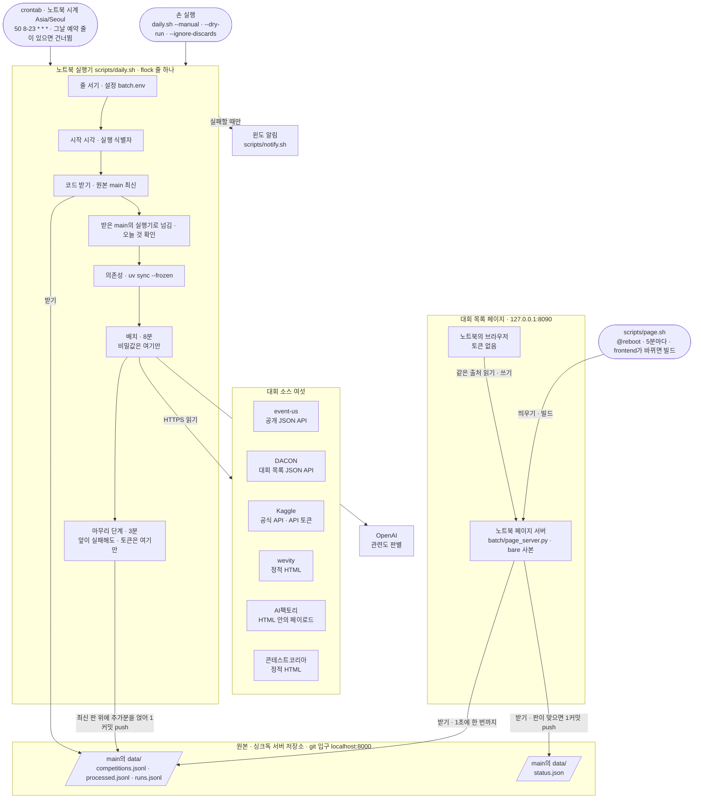

# 인프라 아키텍처

## 0. 이 문서가 다루는 것

배치가 어디서 어떤 모양으로 도는지, 대회 목록 페이지가 어디서 떠 무엇을 읽고 쓰는지를 정한다. 실행 환경, 스케줄, 비밀값, 저장소의 데이터 파일, 실패·재시도, 실행 기록, 페이지 배포까지다.

다루지 않는 것은 코드의 내부 구조다. 도메인 경계와 클래스는 6단계 DOM이 정한다. 이 문서는 폴더의 **자리**와 설정 파일이 무엇을 읽는지까지만 잡는다. 예외는 셸 스크립트(`scripts/`)다. MS 항목이 없으므로 하는 일을 이 문서가 단계까지 정한다(8.1 · 8.7 · 8.11).

모두 사용자의 노트북 하나에서 돈다(2026-10-06부터). 원본은 노트북의 싱크독 서버 저장소이고, 그 곁에 둘이 돈다. 하루 한 번 crontab이 깨워 돌고 끝나면 사라지는 노트북 실행기 하나와, 늘 떠 있으며 127.0.0.1에만 여는 노트북 페이지 서버 하나다. 페이지 서버는 원본의 파일을 내고, 사용자가 바꾼 상태를 원본에 커밋한다. 쓰는 사람은 사용자 하나이고 노트북 밖에서 들어오는 연결이 없다. 그래서 흔한 인프라 관심사 가운데 스케일링·로드밸런싱·무중단 배포·데이터베이스는 이 문서에 나오지 않는다. 2026-10-06까지는 GitHub Actions가 배치를 돌리고 GitHub Pages가 정적 페이지를 냈다.

이 문서와 상위 명세는 저장소의 `docs/specs/`에 커밋된다. 저장소는 비공개이고 원본은 노트북에만 있지만([[#C3]]), 비밀로 둔 값은 적지 않고 이름만 적는다. 2026-10-06까지는 공개 저장소라, 목록 파일·기록 파일·상태 파일이 사용자가 어떤 대회를 보고 어떤 상태로 두었는지를 누구에게나 보였다([[CCR-RFQ-001#Q16]]). 이제는 노트북 밖에서 보이지 않는다.

## 1. 제약

#### C1 실행은 노트북 실행기 안에서만 일어난다

출처: [[CCR-PRD-001#R7]] · [[CCR-RFQ-001#Q5]] · 사용자 결정 2026-10-06 — 노트북 cron

배치의 실행(예약·손 실행)은 crontab이나 사람이 부르는 노트북 실행기(`scripts/daily.sh`) 안에서만 일어난다(8.1). 작업 사본에서 돌리는 배치는 늘 미리보기다([[#C12]]). 별도 서버도 GitHub Actions도 두지 않는다. 실행 기록은 노트북의 로그와 `runs.jsonl`에 남는다(6.3).

2026-10-06까지는 「PC가 꺼져 있어도 돌아야 한다」며 GitHub Actions 안에서만 돌았다. 「노트북이 08:50에 꺼져 있던 날은?」에 사용자는 「아 이건 계속 돌게 하면 안되는 건가?」라고 했고, 설명을 들은 뒤 「노트북 cron」을 골랐다. 「PC가 꺼져도 돈다」를 지키려면 GitHub에 남아야 하는데, 노트북이 꺼지면 원본인 싱크독도 꺼진다. 또 GitHub의 예약은 실제로 2.5~5.5시간 늦었다(8.4). 그래서 「PC가 꺼져 있어도 돈다」는 버렸다. 노트북이 꺼져 있던 날은 켜진 뒤 첫 매시 50분에 돈다([[#C2]] · 8.10).

#### C2 매일 08:50 KST에 시작하도록 예약한다

출처: [[CCR-PRD-001#R7]] · [[CCR-RFQ-001#Q10]] · 사용자 결정 2026-10-06 — 노트북 cron

예약은 노트북의 crontab에 `50 8-23 * * *`로 적는다. 노트북(WSL)의 시계가 Asia/Seoul이라 crontab의 시각이 곧 KST다. 시계의 시간대를 바꾸면 예약 시각도 함께 바뀐다. KST는 서머타임이 없으므로 연중 같은 시각이다.

- 08:50 정시에 돈다.
- 노트북이 꺼져 있거나 잠들어 있던 날은 켜진 뒤 첫 매시 50분에 돈다(23:50까지).
- **그날(KST) `runs.jsonl`에 예약 실행(`kind=schedule`)의 줄이 이미 있으면 건너뛴다.** 실패·중단으로 끝난 실행도 줄을 남기므로 예약 실행은 하루 한 번이다(GitHub Actions 때와 같다). 옛 Actions 실행이 남긴 그날의 줄도 같아서, 갈아타는 날 두 번 돌지 않는다.
- 줄을 남기지 못한 예약 실행(마무리 단계의 push 실패·싱크독이 꺼짐·실행기가 죽음)은 그날의 줄이 없으므로 다음 매시 50분에 다시 돈다. 23:50까지 되풀이한다. 고장이 낫는 대로 그날 안에 저절로 메워지게 하기 위해서다(8.1).
- 23:50까지 한 번도 못 돌면 그날은 실행이 없다. 다음 날 08:50에 정상으로 돈다.

cron은 WSL이 떠 있을 때만 돈다. 노트북을 켤 때 WSL을 저절로 켤지는 정하지 않았다(9장).

#### C3 저장소는 비공개다 — 원본은 노트북의 싱크독 서버 저장소다

출처: [[CCR-RFQ-001#Q9]] · [[CCR-PRD-001#N3]] · 사용자 결정 2026-10-06 — GitHub를 뺀다

원본(origin)은 노트북의 싱크독 서버 저장소이고, 주소는 `http://localhost:8000/git/CCR.git`(싱크독 「git 입구」)이다. 2026-10-04에 사용자가 「내 노트북에서 혼자, 밖으로 새지 않게」 쓰기로 하면서 싱크독이 이 저장소를 서버 저장으로 옮겼다(싱크독 카드 BQ). 2026-10-06에 GitHub 저장소(`HoyoungParkme/competition-crawler`)를 비공개로 바꾸고 보관(archive)한다. GitHub를 완전히 뺀다. 공개 페이지를 살리는 길(저장소를 다시 공개로)을 물었을 때 사용자는 「포기하고 ㄱㄱ」라고 했다.

git 입구의 규칙은 셋이다. HTTP Basic 인증이고 비밀번호 칸에 싱크독 개인 토큰을 넣는다(아이디 칸은 보지 않는다). `main`의 되감기·삭제 push는 거절한다. push를 받으면 싱크독이 곧바로 명세 파일을 판으로 만든다(8.3).

2026-10-06까지는 공개 저장소라 커밋되는 모든 파일과 실행 로그가 누구에게나 보였다. 이제는 노트북 밖에서 보이지 않는다. 그래도 비밀값을 저장소 파일·로그·`data/*.jsonl`에 넣지 않는다는 규칙은 그대로다. git 입구가 `main`의 되감기를 거절하므로 한 번 커밋된 값은 이력에서 지울 수 없고, 저장소는 싱크독 백업에도 실린다. 섞이면 샌 것으로 보고 그 값을 바꾼다(5.7).

#### C4 상태를 둘 데이터베이스가 없다

출처: [[CCR-PRD-001#R8]] · [[CCR-UC-001#UC-S4]] · [[CCR-UC-001#UC-S6]]

배치는 목록·처리 이력·실행 요약을 다음 실행까지 기억해야 하고, 페이지는 사용자가 바꾼 상태를 기억해야 한다. 그러나 이를 위해 DB를 띄우지 않는다. 전부 저장소 파일이다. 이유는 6장에 적는다.

#### C5 한 번 실행이 10분 안에 끝난다

출처: [[CCR-PRD-001#N2]]

여섯 소스를 돌고 LLM 판별과 목록 파일 적재까지 마치는 데 걸리는 시간이다. 노트북 실행기가 줄 서기를 마치고 시작 시각을 정한 때부터 잰다(8.1). 소스 하나만 느려도 재시도와 대기가 이 시간을 다 써, 나머지 소스가 정상이어도 한 건도 적재하지 못할 수 있다. 그래서 소스를 동시에 돌리고 소스마다 시간 예산을 둔다. 앞뒤 단계를 합쳐 10분 안에 들도록 배치 단계에는 8분 한도를 걸고, 넘기면 끊어 중단으로 남긴다(8.5). 마무리 단계는 3분, 줄 서기 대기는 최대 15분이고, 실행 전체의 상한은 따로 없다. GitHub Actions에서 한 번 실행은 53~66초였다(2026-10-01~06).

#### C6 유료로 나가는 것은 OpenAI 호출뿐이다

출처: [[CCR-PRD-001#N1]]

실행기와 페이지 서버는 사용자의 노트북에서 돌아 따로 드는 돈이 없고, Kaggle API도 요금이 없다. 월 운영비는 미화 1달러 미만이다. 2026-10-06까지는 공개 저장소라 Actions와 GitHub Pages가 무료였다.

#### C7 소스 하나가 실패해도 실행 전체가 죽지 않는다

출처: [[CCR-PRD-001#R9]] · [[CCR-UC-001#UC-A1]]

여섯 중 셋은 페이지 구조에 기대는 방식이고, event-us · DACON도 사이트가 스스로 쓰는 JSON API라 공개 문서가 없다. 어느 것이든 상대의 개편에 깨진다.

#### C8 헤드리스 브라우저를 쓰지 않는다

출처: [[CCR-PRD-001#R1]] · [[CCR-RFQ-001#Q4]]

여섯 소스 모두 HTTP 요청만으로 목록을 얻는 것을 확인했다. 브라우저를 얹으면 실행 시간과 설치 시간이 함께 뛴다.

#### C9 상대 서버에 부담을 주지 않는다

출처: [[CCR-PRD-001#N4]]

요청 간격, 식별 가능한 User-Agent, `robots.txt` 준수.

#### C10 같은 날 여러 번 돌려도 결과가 같다

출처: [[CCR-PRD-001#N5]] · [[CCR-UC-001#UC-A1]] · [[CCR-UC-001#UC-A3]]

실패한 날 다시 돌리는 일이 생기고, 예약 실행이 밀려 수동 실행과 이어서 돌 수도 있다. 줄을 남기지 못한 예약 실행은 그날 매시 50분에 다시 돈다([[#C2]]).

#### C11 실행은 한 번에 하나씩 차례로 돈다

출처: [[CCR-PRD-001#N5]] · [[CCR-UC-001#UC-A1]]

두 실행이 같은 목록 파일과 처리 이력을 동시에 읽으면 같은 대회를 둘 다 넣는다. 앞 실행이 돌고 있으면 뒤 실행은 끝날 때까지 기다린다. 줄은 노트북 실행기가 `flock` 하나로 세우고, 예약 실행과 손 실행이 같은 줄에 선다. 15분을 넘게 기다리면 뒤 실행은 시작하지 못하고 끝난다(8.1). 기다린 실행은 시작할 때 원본 `main`을 새로 받으므로 앞 실행이 올린 기록을 본다. 작업 사본의 미리보기는 목록에 쓰지 않으므로 줄에 서지 않는다.

#### C12 목록에 쓰는 실행은 기본 브랜치에서만 돈다

출처: [[CCR-PRD-001#R7]] · [[CCR-UC-001#UC-A1]]

다른 브랜치에서 쓰면 목록과 처리 이력이 브랜치마다 갈라진다. 페이지가 읽는 것도 기본 브랜치의 파일이다. 목록에 쓰는 실행은 **노트북 실행기 안(`BATCH_RUNNER=laptop`)이고 `DRY_RUN=false`인 실행뿐이다.** 실행기는 늘 원본의 `main`을 새로 받아 그 코드와 데이터 파일로 돌고, 나머지 단계도 받은 `main`의 실행기로 돈다(8.1). 쓰기는 마무리 단계의 push 하나뿐이다. 그래서 이 보장은 실행기가 지킨다. 작업 사본에서 고치는 중인 실행기나 코드는 운영에 섞이지 않는다.

실행기 밖(개발 PC의 작업 사본에서 `uv run python -m collector`)은 늘 미리보기다. 마무리 단계가 없어 쓴 기록이 원본에 올라가지 않기 때문이다. 실행기 안에서 `DRY_RUN`이 `true`도 `false`도 아니면 배치는 아무것도 하지 않고 2로 끝난다. 이 저장소의 기본 브랜치는 `main`이다. 2026-10-06까지는 다른 브랜치에서 누른 Actions 실행이 그 브랜치의 `daily.yml`로 돌아, 이 보장을 워크플로 파일의 조건이 지켰다.

#### C13 날짜는 실행하는 곳의 시계가 아니라 KST로 센다

출처: [[CCR-PRD-001#R3]] · [[CCR-UC-001#UC-A1]]

08:50 KST는 UTC로 전날 23:50이다. 시계가 UTC인 곳에서 그 시계의 날짜를 그대로 쓰면 기준일이 하루 이르게 잡혀, 어제 마감된 대회가 걸러지지 않고 들어오고 `수집일`도 하루 이르게 찍힌다. 옛 GitHub 러너가 그런 곳이었다. 노트북의 시계는 Asia/Seoul이지만 거기에도 기대지 않는다. 실행기는 시작 시각과 실행 식별자를 UTC로 정하고, 배치·마무리 단계·「오늘 것 확인」은 그 시각을 KST로 바꿔 날짜를 구한다(8.1).

#### C14 대회 목록 페이지는 노트북 페이지 서버가 낸다

출처: [[CCR-PRD-001#R10]] · [[CCR-RFQ-001#Q16]] · [[CCR-RFQ-001#Q7]] · 사용자 결정 2026-10-06 — 노트북에서 살린다 · 늘 떠 있게

노트북 페이지 서버(`batch/page_server.py`)가 `http://localhost:8090`에서 빌드된 페이지와 두 데이터 파일을 낸다. 127.0.0.1에만 열어 노트북 밖(폰·다른 PC)에서는 보이지 않는다. 데이터베이스는 두지 않는다. 페이지는 원본 `main`의 목록 파일과 상태 파일을 같은 출처로 읽어 보여 준다. 사용자가 바꾼 상태는 페이지가 페이지 서버에 쓰고, 페이지 서버가 `batch.env`의 싱크독 토큰으로 원본에 커밋한다. 브라우저는 토큰을 갖지 않는다(5.8). 띄우기와 배포는 crontab이 부르는 `scripts/page.sh`가 한다(8.11).

2026-10-06까지는 GitHub Pages의 정적 페이지였고, 사용자의 브라우저에 둔 토큰으로 GitHub Contents API에 커밋했다. 저장소를 비공개로 바꾸자 무료 계정이라 Pages가 같이 내려갔다(404). 사용자는 목록 페이지를 「노트북에서 살린다」, 띄우기는 「늘 떠 있게」를 골랐다.

## 2. 구성도


```mermaid
flowchart TB
    cron(["crontab · 노트북 시계 Asia/Seoul<br/>50 8-23 * * * · 그날 예약 줄이 있으면 건너뜀"])
    manual(["손 실행<br/>daily.sh --manual · --dry-run · --ignore-discards"])

    subgraph runner["노트북 실행기 scripts/daily.sh · flock 줄 하나"]
        direction TB
        s1[줄 서기 · 설정 batch.env]
        s2[시작 시각 · 실행 식별자]
        s3[코드 받기 · 원본 main 최신]
        s4[받은 main의 실행기로 넘김 · 오늘 것 확인]
        s5["의존성 · uv sync --frozen"]
        s6["배치 · 8분<br/>비밀값은 여기만"]
        s7["마무리 단계 · 3분<br/>앞이 실패해도 · 토큰은 여기만"]
        s1 --> s2 --> s3 --> s4 --> s5 --> s6 --> s7
    end

    subgraph sources["대회 소스 여섯"]
        eus[event-us<br/>공개 JSON API]
        dacon[DACON<br/>대회 목록 JSON API]
        kaggle[Kaggle<br/>공식 API · API 토큰]
        wevity[wevity<br/>정적 HTML]
        aif[AI팩토리<br/>HTML 안의 페이로드]
        ck[콘테스트코리아<br/>정적 HTML]
    end

    openai[OpenAI<br/>관련도 판별]
    notify[윈도 알림<br/>scripts/notify.sh]

    subgraph origin["원본 · 싱크독 서버 저장소 · git 입구 localhost:8000"]
        state[/main의 data/<br/>competitions.jsonl · processed.jsonl · runs.jsonl/]
        status[/main의 data/<br/>status.json/]
    end

    subgraph page["대회 목록 페이지 · 127.0.0.1:8090"]
        direction TB
        server[노트북 페이지 서버<br/>batch/page_server.py · bare 사본]
        browser[노트북의 브라우저<br/>토큰 없음]
        browser -->|같은 출처 읽기 · 쓰기| server
    end
    pagesh(["scripts/page.sh<br/>@reboot · 5분마다 · frontend가 바뀌면 빌드"])

    cron --> runner
    manual --> runner
    s6 -->|HTTPS 읽기| sources
    s6 -->|HTTPS| openai
    s3 -->|받기| state
    s7 -->|최신 판 위에 추가분을 얹어 1커밋 push| state
    runner -.->|실패할 때만| notify
    pagesh -->|띄우기 · 빌드| server
    server -->|받기 · 1초에 한 번까지| state
    server -->|받기 · 판이 맞으면 1커밋 push| status
```

노트북 밖으로 나가는 연결은 배치가 소스 여섯과 OpenAI에 거는 것과, 브라우저가 페이지의 글꼴(Google Fonts)을 받는 것뿐이다. 노트북 밖에서 실행기나 페이지 서버로 들어오는 연결은 없다. 실행기와 페이지 서버는 원본에 `localhost:8000`으로 닿고, 페이지 서버의 포트는 127.0.0.1에만 연다. 붙일 도메인도 없다. 목록에 쓰지 않는 실행에서는 마무리 단계의 커밋 화살표가 없다. 배치는 `status.json`을 읽지도 쓰지도 않고, 페이지 서버는 `competitions.jsonl`·`processed.jsonl`·`runs.jsonl`을 쓰지 않는다.

## 3. 기술 스택

| 층 | 선택 | 이유 |
|---|---|---|
| 실행 환경 | 노트북의 WSL2 Ubuntu와 cron. 노트북 실행기 `scripts/daily.sh`(bash) | [[#C1]] · [[#C2]] |
| 언어(배치) | Python 3.12 | 개발 환경과 같다. HTML 파싱·HTTP 라이브러리가 두껍다 |
| 패키지 관리 | `uv` | 설치가 빨라 [[#C5]]에 유리하다. 락 파일로 실행마다 같은 버전을 쓴다. uv 자체의 버전도 고정한다 |
| HTTP | `httpx` | 요청 단위로 타임아웃을 줄 수 있다. 내장 재시도는 연결 오류만 다루므로 재시도는 따로 구현한다(8.5). 4xx·5xx 응답에 예외를 던지지 않으므로 상태 코드를 직접 확인한다 |
| HTML 파싱 | `selectolax` | wevity · 콘테스트코리아의 목록 HTML에 CSS 선택자로 쓴다. AI팩토리는 페이지 안의 페이로드를 정규식과 JSON으로 읽고, DACON은 JSON API라 쓰지 않는다. 가볍고 빨라 골랐다([[CCR-DOM-002]] 5장) |
| 페이지 | React + Vite + TypeScript, Node 24, npm | 싱크독 규약 1.9의 기본형이다. 빌드 결과는 정적 파일이고 노트북 페이지 서버가 낸다([[#C14]]). 읽기와 쓰기는 같은 출처의 페이지 서버를 `fetch`로 부른다. 상태 파일 쓰기는 GitHub Contents API와 같은 모양이다(8.11). 라이브러리를 끼지 않는다 |
| 페이지 서버 | 파이썬 표준 라이브러리(`http.server`)와 git | 마무리 단계(`finish.py`)처럼 표준 라이브러리만 쓰고 배치 패키지를 불러오지 않는다. 받는 요청이 노트북 브라우저의 읽기와 상태 파일 쓰기뿐이다(8.11) |
| 페이지 배포 | `scripts/page.sh` — crontab `@reboot`·`*/5 * * * *` | 원본 `main`의 `frontend/`가 바뀌면 `npm ci && npm run build`로 다시 빌드하고 서버를 다시 띄운다. 빌드 결과를 커밋하지 않는다(8.11) |
| 알림 | 윈도 토스트 `scripts/notify.sh` — WSL에서 `powershell.exe -EncodedCommand` | 실패할 때만 띄운다. 한글이 깨지지 않게 스크립트를 UTF-16LE base64로 넘긴다(8.7). 사용자 결정 2026-10-06 — 「윈도 알림」 |
| OpenAI | 공식 SDK, Structured Outputs | 응답 형식을 스키마로 강제한다. 모델을 바꿀 때 이 기능과 추론 끄기(`reasoning.effort: none`)를 모두 받는지 확인한다. 추론 끄기를 받지 않는 모델이면 요청마다 400이 온다([[CCR-API-001]] 1.3). 거절이나 길이 초과로 스키마를 벗어난 응답은 판별 실패로 다룬다([[CCR-UC-001#UC-S5]] 2a) |
| Kaggle | 공식 API의 대회 목록, API 토큰 인증 | 호출 방식은 [[CCR-API-001#POST/api.kaggle.com/v1/…/ListCompetitions]]. 2026-10-01에 실측했다. 한 쪽은 20건으로 정해져 있고 `page`로 넘긴다 |

무거운 것을 얹지 않는 것이 이 표의 요지다. 작업 큐가 없는 것은 배치가 하루 한 번 crontab이 깨워 돌고 끝나기 때문이고([[#C1]]), 페이지 서버에 웹 프레임워크가 없는 것은 받는 요청이 노트북 브라우저 하나의 읽기와 쓰기뿐이기 때문이다([[#C14]]). ORM이 없는 것은 데이터베이스를 두지 않기 때문이다([[#C4]]). 페이지에도 상태 관리 라이브러리나 UI 키트를 얹지 않는다. 화면은 표 하나다([[CCR-PRD-001#R10]]). 토큰을 넣던 설정 대화상자는 2026-10-06에 없앴다(5.8).

## 4. 내부 구조

실행 컴포넌트는 셋이다. 배치(`batch/collector/`)와 노트북 페이지 서버(`batch/page_server.py`)를 `batch/`에, 대회 목록 페이지를 `frontend/`에 담는다. 페이지 서버는 표준 라이브러리만 쓰는 파일 하나이고, 마무리 단계(`finish.py`)처럼 `batch/`에 둔다. 그래서 저장소에 `backend/`가 없다. 노트북에서 도는 셸 스크립트는 `scripts/`에 둔다. 싱크독 규약 1.9대로 루트에 쏟지 않는다. 패키지·테스트·전용 설정 파일은 각 폴더 안에 둔다.

```
competition-crawler/
├── batch/                  배치
│   ├── collector/          배치 본체. 안쪽 구조는 6단계 DOM 클래스 명세
│   ├── tests/              collector/ 구조를 거울로
│   ├── finish.py           마무리 단계. 표준 라이브러리만. 8.2
│   ├── page_server.py      노트북 페이지 서버. 표준 라이브러리만. 8.11
│   ├── settings.toml       비밀이 아닌 조정값
│   └── pyproject.toml · uv.lock
├── frontend/               대회 목록 페이지. React + Vite + TypeScript
│   ├── src/                안쪽 구조는 6단계 DOM 클래스 명세
│   ├── package.json · package-lock.json
│   └── vite.config.ts      base: '/'
├── data/                   저장소에 두는 데이터 파일. 6장
│   ├── competitions.jsonl  목록 파일. 배치만 쓴다
│   ├── status.json         상태 파일. 페이지만 쓴다
│   ├── processed.jsonl     처리 이력
│   └── runs.jsonl          실행 요약
├── scripts/                노트북의 셸 스크립트. MS 항목이 없고 이 문서가 정한다
│   ├── daily.sh            노트북 실행기. 8.1
│   ├── page.sh             페이지 서버 띄우기·배포. 8.11
│   └── notify.sh           윈도 알림. 8.7
├── docs/specs/             명세 원본
├── .env.example            작업 사본의 미리보기에 필요한 환경 변수의 이름만. 값은 비운다
├── .gitignore              .env·.venv·node_modules·frontend/dist와 응답 덤프·로그 폴더를 반드시 넣는다
└── README.md · AGENTS.md
```

2026-10-06까지 있던 `.github/`(`workflows/daily.yml`·`workflows/pages.yml`·`dependabot.yml`)는 지운다.

배치는 `batch/`를 작업 디렉터리로 삼아 실행한다. uv는 현재 디렉터리에서 위로만 프로젝트를 찾으므로 실행기는 `batch/`에서 의존성 설치와 배치를 돌린다. 데이터 파일 경로는 실행 위치가 아니라 저장소 루트를 기준으로 잡는다. 페이지 빌드는 `frontend/`에서 `npm ci && npm run build`로 한다. 빌드 결과(작업 사본에서는 `frontend/dist/`)는 커밋하지 않는다.

`collector/`와 `frontend/src/` 안의 도메인 경계와 계층은 **여기서 정하지 않는다.** 6단계 DOM의 클래스 명세가 확정하고, 그 문서의 「폴더 구조」 절이 기준이다. 다만 소스 여섯이 [[CCR-UC-001#UC-S1]]에서 같은 인터페이스를 따르기로 한 것은 이미 정해진 전제다.

### 4.1 설정 파일이 읽는 것

| 자리 | 담는 것 | 읽는 쪽 |
|---|---|---|
| 노트북 사용자의 crontab | 실행기 줄 `50 8-23 * * * $HOME/dev/personal/competition-crawler/scripts/daily.sh >> $HOME/.local/state/ccr/cron.log 2>&1`과 페이지 띄우기 줄(`@reboot`·`*/5 * * * *`가 `scripts/page.sh`를 부른다). 저장소 밖이다 | cron |
| `scripts/daily.sh` | 줄 서기, 단계 순서, 시간 한도, 단계마다 넘기는 환경 변수와 비밀값, 기록과 실패 알림(8.1) | crontab · 사람(손 실행) |
| `batch/pyproject.toml` · `uv.lock` | Python 버전과 의존성, uv 버전(`required-version`) | 노트북의 uv. 버전이 맞지 않으면 uv가 거절한다(8.6) |
| `batch/settings.toml` | 판별 모델 이름의 기본값, 0건 경고의 연속 일수(기본 3), 소스별 요청 타임아웃·재시도·간격·쪽 상한, OpenAI의 타임아웃·재시도, 판별 동시 요청 수(8.5) | 배치 |
| `~/.config/ccr/batch.env` | 권한 600. 저장소 밖, 노트북에만 둔다. 원본 주소 `CCR_REMOTE`, 싱크독 토큰 `CCR_TOKEN`, 비밀값 둘 `OPENAI_API_KEY`·`KAGGLE_API_TOKEN`(5장), 선택 `NODE_BIN`·`UV_BIN`(cron의 PATH에는 nvm·`~/.local/bin`이 없어 실행기와 `page.sh`가 스스로 찾고, 못 찾으면 여기 적는다) | 실행기 · `page.sh`(페이지 서버) |
| `batch.env`의 `OPENAI_MODEL` | 판별 모델 이름. 있으면 `settings.toml`의 기본값을 덮는다. 코드도 커밋도 없이 모델을 바꿀 수 있다([[CCR-RFQ-001#Q14]]). 옛 저장소 변수 `OPENAI_MODEL` 자리다 | 배치 |
| `.env` | 작업 사본의 미리보기만 쓰는 비밀값과 `OPENAI_MODEL`. 저장소 루트에 두고 커밋하지 않는다. 저장소에는 이름과 설명만 적은 `.env.example`만 둔다([[#C3]]). 실행기 안에서는 읽지 않는다 | 배치(실행기 밖) |
| `scripts/page.sh` | 페이지 서버 띄우기·다시 띄우기, `frontend/` 빌드(8.11) | crontab |
| `frontend/vite.config.ts` | `base: '/'`. 페이지 서버가 루트에서 낸다 | Vite |
| `frontend/src/config.ts` | 데이터 파일 주소 `dataUrl(file)`(같은 출처 `/data/…?t=`), 상태 파일 판 읽기·쓰기 주소 `CONTENTS_URL = '/api/contents/data/status.json'`, 상태 커밋의 작성자 `COMMIT_AUTHOR`(저장소 주인의 noreply 주소, 8.11). 비밀값은 없다 | 페이지 |
| 브라우저 `localStorage` | 페이지의 보기 설정. 토큰은 두지 않는다(5.8) | 페이지 |

판정 규칙의 수치(유사도 0.90, 마감일 180일, 판별 실패 절반)는 조정값이 아니라 규칙이라 코드에 둔다. 바꾸려면 PRD부터 고친다. 유사도는 2026-09-28에 0.80에서 0.90으로 올렸다([[CCR-PRD-001]] 5.2).

작업 사본(개발 PC의 저장소)에서 `uv run python -m collector`로 돌리면 배치는 실행기 밖임을 알아보고(`BATCH_RUNNER`가 `laptop`이 아님) 목록에 쓰지 않는 모드로만 돌며 `.env`를 읽는다([[#C12]]). 처리 이력과 실행 요약은 작업 트리의 사본이 아니라 원본 `main`(`origin/main`)의 최신 판을 받아 읽고, 받지 못하면 돌지 않는다. 브랜치를 딴 뒤 쌓인 기록이 빠지면 미리보기가 실제와 달라지기 때문이다([[CCR-UC-001#UC-A1]] 1b7). 기준일은 배치가 시작할 때 읽은 시각을 KST로 바꿔 쓴다.

판별 기준을 바꾸기 전에 미리 보는 길도 이것이다(옛 「기본 브랜치가 아닌 브랜치에서 미리보기」). 작업 사본에서 고친 코드로 돌리면 늘 미리보기이고 `main`의 최신 이력 위에서 판별한다. 버림을 없는 것으로 보려면 `IGNORE_DISCARDS=true`를 준다. 그다음 기본 브랜치에 한 커밋으로 합쳐 원본에 push한다.

## 5. 인증과 접근

자격증명은 셋이다. 배치가 밖으로 거는 연결에 둘, 원본을 받고 쓰는 데 하나다. 전부 노트북의 `~/.config/ccr/batch.env`(권한 600, 저장소 밖)에 두고, 실행기가 단계마다 필요한 값만 넘긴다. 비밀값 둘은 **배치 단계에만** 넘기고, 싱크독 토큰은 코드 받기의 git 명령과 마무리 단계에만 쓴다(8.1). 저장소 파일에는 이름만 있고 값은 없다. 브라우저는 토큰을 갖지 않는다. 페이지 서버가 싱크독 토큰으로 쓴다(5.8). 작업 사본의 미리보기는 저장소 루트의 `.env`(커밋하지 않는다)를 읽는다. 2026-10-06까지는 비밀값 둘을 GitHub Secrets에 두었다(정리는 5.7).

| 비밀값 | 쓰는 곳 | 형태 |
|---|---|---|
| `OPENAI_API_KEY` | 관련도 판별 [[CCR-UC-001#UC-S5]] | 이 도구 전용 프로젝트의 API 키 |
| `KAGGLE_API_TOKEN` | Kaggle 수집 [[CCR-UC-001#UC-S1]] | API 토큰 |
| `CCR_TOKEN` | 실행기의 코드 받기와 마무리 단계의 push, 페이지 서버의 받기와 push | 싱크독 개인 토큰 「CCR 노트북 — 배치·페이지」. 2026-10-06에 발급했다. 싱크독 UI-13에서 폐기·재발급한다 |

배치는 시작할 때 비밀값 둘이 있는지 본다. `batch.env`에 자리만 있고 값이 비면 빈 문자열로 들어오므로 빈 값을 빠진 것으로 본다. 배치에는 반드시 있어야 하는 값이 없다. 아는 대회는 저장소 파일로 가르고 적재도 파일에 하기 때문이다([[CCR-UC-001#UC-A1]] 1d). 빠진 것마다 처리가 다르다. 실행기에는 `CCR_REMOTE`·`CCR_TOKEN`이 있어야 한다. 원본을 받고 올리는 자격이기 때문이다.

| 빠진 것 | 처리 | 실행 결과 |
|---|---|---|
| `KAGGLE_API_TOKEN` | Kaggle에만 실패 표시(종류: 설정 누락)를 남기고 나머지 다섯 소스로 진행한다 | 성공일 수 있다 |
| `OPENAI_API_KEY` | 판별이 통째로 실패한 날로 다룬다. 접수마감일이 기준일인 대회만 적재하고 나머지는 미룬다 | 성공, 판별 미룸 경고(원인: 키 누락) |

### 5.1 GitHub 환경(environment)을 두지 않는다

2026-10-06부터 없다 — GitHub를 쓰지 않는다. 비밀값과 토큰은 `batch.env` 하나에 두고 실행기가 단계마다 나눠 넘긴다(5장 · 8.1). 그 전에는 시크릿을 GitHub 환경에 나누지 않았고(노션 때의 `notion-write`·`notion-read` 두 환경은 2026-09-30에 지웠다), 예외는 Pages 배포의 `github-pages` 환경 하나였다.

### 5.2 Kaggle 쪽 준비 — 새 API 토큰

kaggle.com/settings/api에서 **Generate New Token**으로 토큰을 발급해 `batch.env`의 `KAGGLE_API_TOKEN`에 넣는다. 작업 사본의 미리보기에 쓰려면 `.env`에도 넣는다.

사용자명과 키를 담는 `kaggle.json` 방식은 쓰지 않는다. Kaggle 공식 CLI 문서가 이 방식을 "Legacy API Credentials"로 분류하고 있어, 새 프로젝트를 그 위에 올리지 않는다([[CCR-RFQ-001#Q4]]).

이 토큰은 사용자가 실제로 대회에 참가하는 계정의 것이다. 새면 남이 사용자 이름으로 제출하거나 데이터셋·노트북을 관리할 수 있다. 새 토큰에 범위나 만료를 줄 수 있는지는 공식 문서에서 찾지 못했다(9장). 2026-10-01에 사용자가 새 토큰을 발급해 그때의 GitHub Secrets에 등록했다. 그 전까지 Kaggle은 매 실행 설정 누락으로 표시됐다. 노트북으로 옮기며 `batch.env`에는 사람이 넣는다.

자격증명 없이 호출하면 401이다. 새 토큰으로는 2026-10-01에 200을 받았고, 응답과 쪽 넘김은 [[CCR-API-001#POST/api.kaggle.com/v1/…/ListCompetitions]]에 적었다. Kaggle이 심는 익명 세션 쿠키가 함께 실리면 토큰이 있어도 401이라, 배치는 소스의 쿠키를 남기지 않는다([[CCR-API-001]] 1.1).

### 5.3 OpenAI 쪽 준비 — 전용 프로젝트와 지출 한도

키는 이 도구만 쓰는 OpenAI 프로젝트에서 발급한다. 그 프로젝트에 지출 알림과 하드 지출 한도를 건다. 알림은 [[CCR-PRD-001#N1]]의 월 1달러에 두고, 하드 한도는 그보다 조금 위(예: 3달러)로 둔다. 첫 실행처럼 호출이 몰리는 날의 정상 판별까지 막지 않기 위해서다. 한도 적용이 즉시가 아니라 조금 넘을 수 있다.

하드 한도에 닿으면 판별 호출이 `429 project_spend_limit_exceeded`로 실패한다. 이 응답은 다시 시도하지 않는다. 판별 실패가 그날 대상의 절반을 넘으면 판별하지 못한 대회는 미뤄지므로([[CCR-UC-001#UC-S5]] 2c), 한도에 닿았다고 관심 밖 대회가 목록에 쏟아지지는 않는다.

### 5.4 로그와 요약 파일에 값이 새지 않게

비밀값은 `setup_logging`의 가리기 필터가 로그 기록에서 `***`로 바꾼다. 이 필터는 값 그대로만 찾으므로 Base64 같은 가공된 값은 가리지 못한다. 그래서 배치는 요청 헤더와 요청 객체 전체를 로그에 찍지 않는다([[CCR-UC-001#UC-S7]] 7). 필터는 로그 기록에만 걸리고 `print` 출력은 가리지 않으므로, 비밀값을 `print`하지 않는다. 옛 Actions의 Secrets 가림과 `::add-mask::`는 없다. 실행기와 마무리 단계는 싱크독 토큰을 명령 줄 설정으로만 쓰고 그 명령을 찍지 않는다(5.5). 브라우저에는 토큰이 없으므로 페이지 쪽에서 가릴 것도 없다(5.8).

가림은 실행 로그에만 적용된다. 커밋되는 데이터 파일에는 자동 보호가 없고 git 이력에 영원히 남는다. 그래서 `runs.jsonl`에는 [[CCR-UC-001#UC-S7]]의 표에 정한 필드만 쓰고, `competitions.jsonl`에는 [[CCR-UC-001#UC-S6]]의 표에 정한 값만 쓴다. 판별 근거는 모델이 낸 한 줄이라 자유 문장이지만, 대회명과 분류 이유뿐이라 비밀값이 섞일 자리가 없다. 실패는 종류(연결·응답 코드·형식·수집 금지·설정 누락) 같은 정해진 값으로만 남기고, 예외 메시지·URL·응답 본문·LLM 응답 같은 자유 문장은 넣지 않는다. 자유 문장은 노트북의 실행 로그에만 찍는다(6.3). 로그는 노트북에만 있지만 위의 가림을 거친다.

### 5.5 저장소에 쓰기

원본에 쓰는 쪽은 둘이다. 실행기의 마무리 단계가 세 데이터 파일을, 페이지 서버가 상태 파일을 쓴다. 둘 다 싱크독 git 입구(`CCR_REMOTE`)로 `main`에 push하고, 자격은 `batch.env`의 싱크독 토큰 하나다. git 입구는 HTTP Basic의 비밀번호 칸만 본다. 실행기와 마무리 단계의 인증 헤더는 `-c http.extraheader=AUTHORIZATION: basic base64("x-access-token:토큰")`이다(8.2).

토큰은 git 명령의 명령 줄 설정으로만 준다. 작업 트리의 `.git/config`·디스크·로그에 남기지 않고, 명령을 그대로 찍는 `set -x`를 쓰지 않는다. 실행기에서는 코드 받기의 git 명령과 마무리 단계에만 쓰고, 배치 단계에는 넘기지 않는다(8.1).

마무리 단계와 페이지 서버는 기본 브랜치 `main`에 바로 push한다. 풀 리퀘스트를 거치는 규칙은 없다. 대신 싱크독 git 입구가 `main`의 **되감기·삭제 push를 거절한다**(옛 GitHub 규칙셋의 강제 push 차단·삭제 제한 자리). 이것은 실행기·페이지 서버·사람의 일반 push를 막지 않고, 데이터 파일의 이력이 force push로 지워지는 것만 막는다. force push로 목록과 처리 이력이 과거로 돌아가면 그동안 들어온 대회가 한꺼번에 다시 판별된다.

마무리 단계는 새로 받은 `main`에서 `data/competitions.jsonl`·`data/processed.jsonl`·`data/runs.jsonl` 세 경로만 고치고 스테이징한다(8.2). `data/status.json`은 건드리지 않는다. 페이지 서버는 `data/status.json` 하나만 바꾼 커밋을 만든다(8.11). 옛 GitHub의 비밀값 스캔과 푸시 보호는 없다. 값이 커밋에 섞여도 찾아 주는 것이 없다.

### 5.6 공급망

2026-10-06부터 GitHub Actions가 없으므로 `uses:`의 SHA 고정과 Dependabot은 사라졌다. 남는 규칙은 lock 파일이다. 배치의 의존성은 `batch/uv.lock`으로 고정하고 `uv sync --frozen`으로만 설치한다. uv 자체의 버전도 고정한다(`required-version`). 페이지의 npm 의존성은 `frontend/package-lock.json`으로 고정하고 `npm ci`로만 설치한다. 의존성 갱신은 사람이 `uv lock --upgrade`·`npm update`로 한다(옛 Dependabot 자리). 페이지가 부르는 외부 스크립트는 없다. 빌드에 들어간 코드가 전부다.

### 5.7 범위와 유출 대응

| 비밀값 | 범위 | 새면 생기는 일 |
|---|---|---|
| `OPENAI_API_KEY` | 이 도구 전용 프로젝트. 하드 지출 한도 | 한도까지 과금된다. 한도가 없으면 조직의 한도나 잔액까지 과금된다 |
| `KAGGLE_API_TOKEN` | 사용자의 Kaggle 계정. 범위를 좁힐 수 있는지 확인하지 못했다 | 사용자 계정으로 대회에 제출하고 데이터셋·노트북을 관리할 수 있다 |
| `CCR_TOKEN` | 싱크독 개인 토큰. **범위를 좁힐 수 없다** — 주인의 싱크독 프로젝트 전부에 MCP와 git 입구로 닿는다. 옛 페이지 토큰(이 저장소의 Contents만)보다 넓다. 브라우저에 두지 않고 `batch.env`(권한 600) 한 곳에만 둔다 | 주인의 싱크독 프로젝트들의 명세와 서버 저장소를 읽고 고치고 push할 수 있다. `main`의 되감기·삭제는 git 입구가 거절하므로 바뀐 것은 이력에 남아 되돌릴 수 있다. 받아들인 위험이다(8.10) |

샜으면 OpenAI·Kaggle 키는 각 콘솔에서 폐기·재발급하고 `batch.env`를 바꾼다. 싱크독 토큰은 싱크독 UI-13에서 폐기·재발급하고 `batch.env`를 바꾼다. 저장소는 비공개이고 원본은 노트북에만 있으니, 「공개 저장소라 곧바로 노출」 전제는 사라졌다([[#C3]]). 그래도 비밀값을 저장소 파일·로그·`data/*.jsonl`에 넣지 않는다는 규칙은 그대로다. 저장소는 싱크독 백업(구글 드라이브, gpg 암호화)에 실린다. 어느 값도 자동으로 폐기되리라 기대하지 않는다.

옛 GitHub 쪽은 이렇게 정리한다. Actions 시크릿 둘은 지운다. 옛 페이지 토큰(fine-grained)은 사람이 GitHub 설정에서 폐기한다. 브라우저 `localStorage`의 옛 토큰(`ccr.token`)은 새 페이지가 읽지 않는다.

### 5.8 페이지의 쓰기 자격 — 브라우저에 토큰이 없다

**2026-10-06부터 페이지 토큰은 없다.** 브라우저는 토큰을 갖지 않는다. 페이지는 같은 출처의 노트북 페이지 서버에 상태 파일을 쓰고, 페이지 서버가 `batch.env`의 싱크독 토큰(`CCR_TOKEN`)으로 원본에 push한다(8.11). 그 전에는 사용자가 GitHub에서 만든 fine-grained 토큰(이 저장소의 Contents 읽기·쓰기만)을 페이지 설정에 붙여 넣어 브라우저 `localStorage`에 두었다. 그 설정 대화상자와 토큰을 넣는 흐름은 없앴다.

페이지 서버에는 로그인이 없다. 대신 다른 사이트가 사용자의 브라우저를 빌려 쓰지 못하게 지킨다. 싱크독 폐쇄망판 가드와 같은 꼴이다.

| 지킴 | 값 |
|---|---|
| 여는 곳 | `127.0.0.1:8090` 하나. 노트북 밖(폰·다른 PC)에서는 닿지 않는다 |
| Host | 요청의 Host가 `localhost:8090`·`127.0.0.1:8090`이 아니면 403이다. 다른 사이트가 이름을 127.0.0.1로 돌려 들어오는 것(DNS rebinding)을 막는다 |
| Origin(쓰기) | `PUT`은 Origin도 `http://localhost:8090`·`http://127.0.0.1:8090`이어야 한다. 아니면 403이다. 다른 사이트가 폼이나 스크립트로 쓰는 것(CSRF)을 막는다 |
| 쓰는 파일 | `data/status.json` 하나뿐이다 |

이 지킴은 브라우저를 거친 요청만 가른다. 노트북에서 같은 사용자로 도는 프로그램은 헤더를 붙여 상태 파일을 쓸 수 있고, `batch.env`를 직접 읽을 수도 있다. 바뀐 것은 원본 이력에 남아 되돌릴 수 있다(8.10). 페이지는 외부 스크립트를 싣지 않는다(5.6).

## 6. 데이터가 사는 곳

### 6.1 데이터베이스를 두지 않는 이유

기억해야 하는 것은 넷이다. 배치가 넣은 대회 목록(목록 파일), 한 번 판별했거나 이미 아는 대회와 같다고 확인한 대회의 기록(처리 이력), 실행마다의 결과와 건수(실행 요약), 그리고 사용자가 페이지에서 바꾼 상태와 지운 표시(상태 파일)다. 앞의 셋은 배치만 쓰고 실행이 차례로 돌므로([[#C11]]) 동시에 쓰는 일이 없다. 상태 파일은 페이지만 쓴다. 쓰는 쪽이 파일마다 하나뿐이라 두 쪽이 같은 파일을 두고 다투지 않는다.

여기에 DB를 붙이면 띄우고 지키는 값이 얻는 것보다 크다. 무료로 쓸 수 있는 관리형 DB는 쓰지 않으면 잠들거나 일정 기간 뒤 지워지는 조건이 붙기 마련이라, 하루 한 번만 접속하는 이 배치와 맞지 않는다. [[#C6]]도 걸린다.

저장소 파일로 두면 얻는 것이 더 있다. 변경 이력이 git log로 남아 [[CCR-UC-001#UC-A3]]의 진단에 그대로 쓰인다. "언제부터 이 소스가 0건이었나"를 파일 하나의 히스토리로 볼 수 있다. 관리자가 버린 기록을 비울 때도([[CCR-UC-001#UC-A4]]) 파일을 고쳐 커밋하면 된다. 페이지도 저장소 파일을 읽는 것으로 끝난다. 페이지 서버는 원본의 파일을 그대로 낸다([[#C14]]).

### 6.2 데이터 파일 넷

| 파일 | 내용 | 쓰는 쪽·읽는 쪽 | 자라는 속도 |
|---|---|---|---|
| `data/competitions.jsonl` | 목록 파일. 한 줄이 목록 항목 하나. 식별자(출처 + 원천 ID)·대회명·링크·접수시작일·접수마감일·출처·수집일·판별 근거([[CCR-UC-001#UC-S6]]). 상태는 없다 | [[CCR-UC-001#UC-S6]]이 더하고, [[CCR-UC-001#UC-S4]]와 페이지가 읽는다 | 남긴 대회 수만큼. 연 수백 줄 |
| `data/status.json` | 상태 파일. 식별자를 키로 `{status, hidden, starred, updated_at}`([[CCR-DOM-003#status]]). 값이 없는 대회는 `시작 전`·감추지 않음·별표 없음 | 페이지([[CCR-UC-001#UC-H1]])가 쓰고 페이지가 읽는다. 배치는 읽지도 쓰지도 않는다 | 사용자가 바꾼 대회 수만큼 |
| `data/processed.jsonl` | 처리 이력. 한 줄이 한 대회 공고(묶음의 구성원 하나). 출처·원천 ID·링크·대회명·접수시작일·접수마감일·결과(남김·버림)와, 적은 실행의 기준일·실행 식별자 | [[CCR-UC-001#UC-S4]]·[[CCR-UC-001#UC-S5]]·[[CCR-UC-001#UC-S6]]이 쓰고 [[CCR-UC-001#UC-S4]]가 읽는다 | 판별하거나 확인한 공고 수만큼. 연 수천 줄 |
| `data/runs.jsonl` | 실행 요약. 한 줄이 한 실행. 필드는 [[CCR-UC-001#UC-S7]]의 표를 따른다 | [[CCR-UC-001#UC-S7]]과 마무리 단계가 쓰고, [[CCR-UC-001#UC-S7]]·마무리 단계와 사람이 읽는다 | 실행 한 번에 한 줄. 다시 돌린 날은 그만큼 더 붙는다 |

배치가 쓰는 세 파일은 한 줄에 한 레코드를 둔 JSON Lines다. 목록 파일도 JSON 배열이 아니라 JSON Lines로 두는 것은, 배치가 더하기만 하고 마무리 단계가 최신 판 끝에 추가분을 붙이는 방식(8.2)이 세 파일에 똑같이 적용되게 하기 위해서다. 페이지는 파일을 받아 줄마다 JSON으로 읽는다. 상태 파일만 JSON 객체 하나다. 페이지가 통째로 읽고 통째로 다시 쓰며, 페이지 서버가 파일 단위로 판(`sha`)을 견주므로 줄 단위로 얹을 필요가 없다(8.11). 사람이 열어 읽고 고치기 쉽다.

버린 기록 비우기는 처리 이력에서 결과가 버림인 줄을 지우는 것이다. 남김 줄은 지우지 않는다. 실행 요약의 줄마다 그때 처리 이력에 남은 남김 줄 수가 적혀 있어, 이 수가 줄면 다음 실행이 판별 전에 멈춘다([[CCR-UC-001#UC-S4]] 2c). 예전 판으로 되돌릴 때는 목록 파일·처리 이력·실행 요약을 같은 커밋의 판으로 함께 되돌린다([[CCR-UC-001#UC-A3]] 2d2). 목록 파일만 되돌리면 그 뒤 더한 항목이 처리 이력에는 남김으로 남아 다시 들어오지 않고 목록에서만 사라진다. 상태 파일은 되돌리지 않아도 된다. 목록에 없는 식별자의 값은 페이지가 무시한다.

**배치는 작업 트리의 파일을 직접 고치지 않는다.** 시작할 때 세 파일을 읽고, 이번 실행이 더하는 줄은 작업 트리 밖(`APPEND_DIR` — 실행기에서는 `WORK_DIR/append`)의 추가분 파일에 쌓는다. [[CCR-UC-001#UC-A1]]에서 대회가 "목록 파일과 처리 이력에 적힌다"는 것은 이 추가분 파일에 적힌다는 뜻이다. 추가분은 버림을 판정했을 때, 목록 파일에 더했을 때, 아는 대회로 빠진 묶음의 구성원을 적을 때마다 곧바로 반영한다. 추가분 파일은 쓸 때마다 임시 파일에 쓴 뒤 이름을 바꿔 통째로 교체한다. 도중에 끊겨도 반쯤 쓴 파일이 남지 않는다. 추가분 파일은 한 곳만 쓴다. 판별을 동시에 하더라도 작업자는 결과만 넘기고, 기록은 한 흐름이 받는 차례대로 한다. 임시 파일은 쓸 때마다 새 이름으로 만든다. 저장소에 올리는 일은 마무리 단계가 한 번에 한다(8.2).

네 파일은 비공개 저장소에 있고 노트북 밖에서 보이지 않는다([[#C3]]). 2026-10-06까지는 공개였다. 그래도 자유 문장은 판별 근거 한 줄 말고는 넣지 않는다(5.4).

### 6.3 실행 기록 두 곳

[[CCR-UC-001#UC-S7]]의 경계를 따른다. 노트북의 실행 로그(`~/.local/state/ccr/logs/{run_id}.log`)에는 실행의 출력 전부, 곧 사람이 읽는 상세를 남긴다. 소스별 원문 실패 사유, 적재한 대회의 이름과 출처, 판별 모델이 버린 대회와 그 근거, 정규화에서 버린 레코드의 출처와 이유, 예외의 원문이다. 건너뜀이나 원본을 받지 못함 같은 한 줄 기록은 `~/.local/state/ccr/cron.log`에 남는다. 페이지 띄우기와 빌드의 기록은 `~/.local/state/ccr/page.log`에 남는다(8.11). 사용자가 바꾼 상태는 상태 파일의 커밋 메시지와 git log가 기록이다. 마무리 단계가 올린 추가분도 실행 로그에 찍힌다(8.2). `data/runs.jsonl`에는 실행끼리 견줄 값만 한 줄로 쌓는다([[CCR-RFQ-001#Q15]]).

실행 로그는 영구 기록이 아니다. 실행기가 90일이 지난 로그를 지운다. 옛 Actions 로그의 보관 90일 자리다. 로그는 노트북에만 있고 싱크독 백업에 실리지 않는다. 그보다 오래된 실행이나 노트북을 잃은 뒤에는 `runs.jsonl`과 그 git log로만 진단한다([[CCR-UC-001#UC-A3]] 3a).

### 6.4 사람이 보는 데이터

대회 목록 자체가 저장소의 목록 파일이고, 사람은 대회 목록 페이지로 그것을 본다([[#C14]]). 따로 두는 복제본은 없다. 페이지 서버의 bare 사본(`~/.local/share/ccr/page.git`)은 원본을 받아 두는 자리이고, 읽을 때마다 원본을 다시 받는다(1초에 한 번까지). 페이지는 열릴 때와 새로 고칠 때 페이지 서버에서 원본 `main`의 목록 파일과 상태 파일을 받는다(`GET /data/…`, `Cache-Control: no-store`).

**CDN 캐시가 없다.** 배치가 올린 직후의 목록과 방금 바꾼 상태가 곧바로 보인다. 2026-10-06까지는 페이지가 `raw.githubusercontent.com`에서 읽어 CDN이 5분 캐시했다(`cache-control: max-age=300`, 2026-09-30 실측 58초·267초). 그래서 상태 파일은 토큰이 있으면 Contents API로 읽었다. 그 문제가 사라졌다.

상태 파일을 쓸 때는 화면에 쓴 파일과 상관없이 판 읽기(`GET /api/contents/data/status.json`)로 최신 판(`sha`)을 먼저 읽는다. 화면이 읽은 뒤 다른 탭이나 브라우저가 썼으면 판이 어긋나 거절되기 때문이다([[CCR-UC-001#UC-H1]] 4a).

## 7. 외부 변경 감지

이 배치의 가장 흔한 고장은 **소스 사이트가 조용히 바뀌는 것**이다. 예외가 나면 [[#C7]]이 잡아 기록에 남기지만, 마크업만 바뀌어 파서가 아무것도 못 찾는 경우는 예외가 나지 않는다. 결과가 빈 목록일 뿐이다.

그래서 [[CCR-UC-001#UC-S7]] 2가 `runs.jsonl`을 거슬러 올라가며 소스별 건수를 본다. 0건이 시작되기 바로 앞까지 연속 N일(`settings.toml`, 기본 3) 건수를 내던 소스가 0건을 내면, 0건이 이어지는 동안 매 실행 경고를 붙인다. 날짜는 기준일로 세고, 건수는 정규화를 거친 뒤의 것으로 센다. 경고는 실행 요약에 남고 그 소스가 마지막으로 건수를 낸 기준일을 함께 적으므로, 사람이 저장소만 봐도 어느 날부터 어느 소스가 멈췄는지 알 수 있다.

OpenAI의 실패도 저절로 예외가 되지는 않는다. OpenAI SDK는 연결 오류와 4xx·5xx에 예외를 던지지만, 모델이 답을 거절하면 예외 없이 파싱 결과가 비어서 온다. 이것도 판별 실패로 센다([[CCR-UC-001#UC-S5]] 2a).

설정이나 계정 문제로 오는 오류는 다시 보내도 같은 답이 온다. 이런 오류는 다시 보내지 않는다.

- **판별**: 키가 틀렸거나(401), 권한이 없거나(403), 한도·크레딧이 소진됐거나(429 가운데 지출 한도·크레딧 소진), 설정한 모델이 없다는(404) 응답은 다시 시도하지 않는다. 남은 묶음도 묻지 않고 판별 실패로 센다. 어느 묶음을 물어도 같은 답이 오기 때문이다([[CCR-UC-001#UC-S5]] 2a). 첫 호출부터 이 응답이 오면 판별 실패가 절반을 넘어 미룸이 되고, 경고의 원인은 호출 실패로 남는다([[CCR-UC-001#UC-S5]] 2c). 한도처럼 도중에 닿아 실패가 절반 이하면, 실패한 묶음은 남김으로 적재된다([[CCR-UC-001#UC-S5]] 2b). 일시적인 속도 제한(429)과 요청 시간 초과(408) · 충돌(409)만 8.5대로 다시 시도한다. 요청이 잘못됐다는 400은 그 묶음의 입력 탓일 수 있어 그 묶음만 판별 실패로 두고 남은 묶음은 계속 묻는다. 모델이 추론 끄기를 받지 않는 것처럼 설정 탓의 400이면 모든 묶음이 같은 400으로 실패해 미룸이 된다([[CCR-API-001]] 2.2).
- **페이지의 상태 파일 쓰기**: 페이지가 페이지 서버로 쓸 때 판이 어긋나면(`409`, 또는 파일이 있는데 판을 주지 않았다는 `422`) 최신 판을 다시 읽고 이번 바꿈만 얹어 한 번 더 쓴다. 판은 다른 탭이나 브라우저가 먼저 쓰면 어긋난다. 그 밖(`502` — 페이지 서버가 원본에 닿지 못함, `400`·`403`, 페이지 서버에 닿지 못함)은 다시 보내지 않고 화면을 이전 값으로 되돌려 알린다. 닿지 못한 경우의 문구는 「페이지 서버·싱크독에 닿지 못했다」 꼴이다([[CCR-UC-001#UC-H1]] 4b). 목록 파일에 더하는 데는 항목 단위의 실패가 없다. 파일 쓰기가 실패하면 배치가 멈추고([[CCR-UC-001#UC-S6]] 2b), 커밋이 실패하면 마무리 단계가 실패로 끝난다([[CCR-UC-001#UC-A1]] 9a).

## 8. 배치와 운영

### 8.1 노트북 실행기 하나

노트북 실행기 `scripts/daily.sh` 하나로 끝난다. crontab이 부르고(예약 실행), 사람이 손으로도 부른다(손 실행). 마무리 단계는 배치와 **같은 실행의 다음 단계**다. 배치가 쌓은 추가분은 같은 임시 작업 폴더(`WORK_DIR`)의 파일이라 그냥 읽는다. GitHub Actions·워크플로·러너는 없다. 2026-10-06까지는 `.github/workflows/daily.yml`의 잡 하나였다.

| 항목 | 값 | 근거 |
|---|---|---|
| 부르는 것 | crontab(예약 실행) + 사람(손 실행) | [[#C2]] · [[CCR-PRD-001#R7]] |
| 예약 | `50 8-23 * * * $HOME/dev/personal/competition-crawler/scripts/daily.sh >> $HOME/.local/state/ccr/cron.log 2>&1`. 인자가 없으면 예약 실행이다. 그날 예약 줄이 이미 있으면 건너뛴다(아래 6) | [[#C2]] |
| 손 실행 | `scripts/daily.sh --manual [--dry-run] [--ignore-discards]`. `--dry-run` — 목록에 쓰지 않는 모드. `--ignore-discards` — 버림 기록을 없는 것으로 보고 판별한다. 목록에 쓰지 않는 실행에서만 뜻이 있고, 쓰는 실행에서는 무시하고 로그에 적는다. 옛 `workflow_dispatch` 입력 `dry_run`·`ignore_discards`와 같다 | [[CCR-UC-001#UC-A1]] 1b · [[CCR-UC-001#UC-A4]] |
| 쓰기 여부 | 실행기가 배치 단계에 `BATCH_RUNNER=laptop`과 `DRY_RUN`을 넘긴다. 예약 실행은 `false`, 손 실행은 `--dry-run`이면 `true`다. 실행기 안에서 이 값이 `true`도 `false`도 아니면 배치는 아무것도 하지 않고 2로 끝난다. 값이 비었다고 쓰기 모드로 돌지 않게 하기 위해서다 | [[#C12]] · [[CCR-UC-001#UC-A1]] 1b5 |
| 줄 서기 | `flock` 하나. 다른 실행이 돌고 있으면 끝날 때까지 기다린다. 15분이 넘으면 이번 것은 시작하지 못하고 끝난다. 옛 `concurrency: queue: max` 자리다 | [[#C11]] · [[CCR-UC-001#UC-A1]] 1c |
| 시간 한도 | 배치 단계 8분, 마무리 단계 3분, 줄 서기 대기 최대 15분. 실행 전체의 상한은 따로 없다(옛 잡 15분) | [[#C5]] · 8.5 |
| 커밋 | 작성자·커미터 `ccr-batch <ccr-batch@localhost>`(옛 `github-actions[bot]`). 메시지에 기준일과 실행 식별자를 적는다 | 사람·페이지의 커밋과 가르고, git log에서 실행을 찾게 한다(6.1) |
| 기록 | 실행의 출력 전부는 `~/.local/state/ccr/logs/{run_id}.log`. 90일이 지난 로그는 실행기가 지운다. 건너뜀 같은 한 줄 기록은 `~/.local/state/ccr/cron.log` | 6.3 |
| 알림 | 배치나 마무리 단계가 0이 아닌 코드로 끝나거나, 설정 파일이 없거나, 원본을 받지 못하면 윈도 알림 「CCR 일배치 실패」. 성공·건너뜀·사람이 끊은 실행은 알리지 않는다 | 8.7 |

단계는 이 차례로 돈다.

| 차례 | 단계 | 하는 일 |
|---|---|---|
| 1 | 줄 서기 | `flock`으로 한 번에 하나만 돈다. 다른 실행이 돌고 있으면 끝날 때까지 기다리고, 15분이 넘으면 「건너뜀」을 남기고 끝낸다([[#C11]]) |
| 2 | 설정 읽기 | `~/.config/ccr/batch.env`(권한 600)를 읽는다. 내보내지(export) 않는다 — 비밀값은 그것을 쓰는 단계에만 골라 넘긴다. 없거나 `CCR_REMOTE`·`CCR_TOKEN`이 비었으면 「실패: …」를 남기고 윈도 알림을 띄운 뒤 3으로 끝난다 |
| 3 | 시작 시각·식별자 | 시작 시각 `RUN_STARTED_AT`(UTC, 초까지)과 실행 식별자 `RUN_ID=local-YYYYMMDDTHHMMSS`(UTC)를 정한다. 배치와 마무리 단계는 이 시각을 각자 KST 날짜로 바꿔 기준일로 쓴다. 배치가 아니라 실행기가 정하는 값이므로, 배치가 어디서 멈추든 마무리 단계가 같은 날짜를 구한다([[CCR-UC-001#UC-A1]] 1 · [[#C13]]). 앞 실행을 기다린 실행은 기다림이 끝난 시각이 기준이 된다 |
| 4 | 코드 받기 | 임시 작업 폴더(`WORK_DIR`)에 원본(`CCR_REMOTE`)의 `main`을 새로 얕게 받는다. **시작하는 때의 기본 브랜치 최신 커밋**이다. 배치는 목록 파일과 기록 파일도 받은 `main`의 `data/`에서 읽으므로 앞 실행이 올린 기록을 본다. 토큰은 명령 줄 설정(`-c http.extraheader`)으로만 주고 디스크·로그에 남기지 않는다(5.5). 받지 못하면(싱크독이 꺼짐 등) 「실패: 원본을 받지 못했다」를 남기고 윈도 알림을 띄운 뒤 1로 끝난다. 줄을 남기지 못했으므로 예약 실행이면 다음 매시 50분에 다시 돈다 |
| 5 | 실행기 정의 확인 | 늘 **받은 `main`의 실행기**로 나머지를 돈다. cron이 부른 작업 사본의 실행기는 `main`을 받아 그쪽으로 넘기기만 한다. 작업 사본에서 고치는 중인 실행기가 운영에 섞이지 않는다. 옛 「워크플로 정의 확인」 자리다([[CCR-UC-001#UC-A1]] 1c4) |
| 6 | 오늘 것 확인 | 예약 실행이면 받은 `main`의 `data/runs.jsonl`에 그날(KST) `kind=schedule` 줄이 있는지 본다. 있으면 「건너뜀: 오늘(YYYY-MM-DD) 예약 실행이 이미 있다」를 남기고 0으로 끝난다. 읽히지 않는 줄은 건너뛴다. 손 실행은 보지 않는다([[#C2]]) |
| 7 | 의존성 | `batch/`에서 `uv sync --frozen --no-dev`. 실패하면 배치를 띄우지 않고 9로 간다. 마무리 단계가 중단 줄을 쓴다 |
| 8 | 배치 | `batch/`에서 `.venv/bin/python -m collector`를 `timeout -s TERM -k 10s 8m`으로 돌린다([[#C5]]). 8분이 지나면 SIGTERM으로 끊고, 10초 안에 안 끝나면 SIGKILL이다. 가상환경의 파이썬을 직접 띄워(`uv run`을 거치지 않는다) 끊을 때 오는 신호를 파이썬이 받게 한다. 비밀값 둘과 `OPENAI_MODEL`은 이 단계에만 넘기고, 싱크독 토큰은 넘기지 않는다. 환경: `BATCH_RUNNER=laptop` · `DRY_RUN`(`true`·`false`) · `RUN_KIND`(`schedule`·`manual`) · `RUN_ID` · `RUN_STARTED_AT` · `APPEND_DIR=$WORK_DIR/append` · `WORK_DIR` · `IGNORE_DISCARDS`(`true`·`false`). 첫 신호를 받으면 새 요청을 멈추고 정리해 끝내고, 두 번째 신호에는 하던 호출도 끊는다. 이때 실행 요약 줄은 쓰지 않는다. 끊긴 실행의 줄은 마무리 단계가 중단으로 쓴다. 결과가 실패면 0이 아닌 값으로 끝난다 |
| 9 | 마무리 단계 | 미리보기가 아니면 앞 단계가 실패하거나 끊겨도 `python3 batch/finish.py`를 3분 한도로 돌린다. 옛 `if: always()` 자리다. 노트북의 git과 python3 표준 라이브러리만 쓰고 7이 만든 환경에 기대지 않는다. 의존성 설치가 실패한 실행에서도 중단 줄을 남겨야 하기 때문이다. 환경: `RUN_ID` · `RUN_STARTED_AT` · `RUN_KIND` · `APPEND_DIR` · `WORK_DIR` · `REMOTE_URL=$CCR_REMOTE` · `PUSH_TOKEN=$CCR_TOKEN`. 토큰은 이 단계에만 넘긴다. 하는 일은 8.2 |
| 10 | 기록·알림 | 실행의 출력 전부를 실행 로그에 남기고, 90일이 지난 로그를 지운다(6.3). 배치나 마무리 단계가 0이 아닌 코드로 끝나면 `scripts/notify.sh`로 윈도 알림을 띄운다. 제목은 「CCR 일배치 실패」, 본문은 실행 식별자와 로그 경로다(8.7). 성공과 건너뜀은 알리지 않는다 |
| 11 | 정리 | 임시 작업 폴더를 지운다 |

**끊기**(옛 Actions 「취소」 자리). 손 실행은 터미널에서 Ctrl-C로 끊는다. 예약 실행은 실행기 프로세스에 SIGTERM을 보낸다. 실행기는 받은 신호를 배치 단계에 넘기고, 배치는 8의 신호 처리대로 멈춘다([[CCR-SEQ-001#SEQ-10]]). 그다음 미리보기가 아니면 마무리 단계가 그대로 돈다. 배치가 줄을 못 남겼으면 중단(`aborted`) 줄을 쓴다. 사람이 끊은 실행은 윈도 알림을 띄우지 않는다.

**줄을 못 남긴 예약 실행**(마무리 단계의 push 실패·싱크독이 꺼짐·실행기가 죽음)은 그날 예약 줄이 없으므로 다음 매시 50분에 다시 돈다. 23:50까지 되풀이하고, 실패할 때마다 알림이 뜬다. 고장이 낫는 대로 그날 안에 저절로 메워지게 하기 위해서다. 판별 호출은 그만큼 되풀이되지만, 하루 새 묶음 몇 개라 비용은 작다(8.9).

### 8.2 마무리 단계 — 최신 판 위에 다시 얹는다

[[CCR-UC-001#UC-A1]] 9와 \*a2를 이렇게 한다.

마무리 단계의 코드는 배치와 함께 `batch/`에 둔다(`finish.py`). 다만 표준 라이브러리만 쓰고 배치 패키지의 다른 모듈을 불러오지 않는다. 배치의 작업 트리에 기대지 않고 `WORK_DIR/finish-main`에 `main`을 새로 받아 그 위에서 일한다. 원격은 `REMOTE_URL`(싱크독 git 입구 `http://localhost:8000/git/CCR.git`)이고 자격은 `PUSH_TOKEN`(싱크독 토큰)이다. 인증 헤더는 `-c http.extraheader=AUTHORIZATION: basic base64("x-access-token:토큰")`이다. git 입구는 비밀번호 칸만 본다(5.5). `RUN_ID`·`APPEND_DIR`·`WORK_DIR`·`REMOTE_URL` 가운데 하나라도 없으면 아무것도 하지 않고 1로 끝난다.

1. `PUSH_TOKEN`으로 `main`을 `WORK_DIR/finish-main`에 얕게 받는다. 되풀이할 때는 받은 것을 `main` 최신 판으로 맞춘다.
2. `runs.jsonl`에 이 실행의 식별자를 가진 줄이 이미 있으면 앞선 push가 응답만 끊기고 실제로는 들어간 것이다. 아무것도 하지 않고 끝낸다. 읽히지 않는 줄은 건너뛴다([[CCR-UC-001#UC-S7]] 2c와 같다).
3. 배치가 쌓은 목록 파일 추가분과 처리 이력 추가분을 각 파일 끝에 붙인다. 파일이 없으면 만들고, 줄바꿈으로 끝나지 않으면 먼저 줄바꿈을 붙인다. 붙이기 전에 각 줄이 JSON으로 읽히고 ERD가 정한 필수 필드([[CCR-DOM-003#competitions]] · [[CCR-DOM-003#processed]])가 있는지 본다. 목록 파일에 이미 있는 식별자의 줄은 붙이지 않는다. 아닌 줄은 붙이지 않고 로그에 남기며, 이 단계를 실패로 끝내기로 표시한다.
4. 배치가 쓴 실행 요약 줄을 3과 같이 확인해([[CCR-DOM-003#runs]]) 붙인다. 그 줄이 없으면 배치가 줄을 남기기 전에 멈춘 것이므로, 결과 **중단**의 줄을 만들어 붙이고 이 단계를 실패로 끝내기로 표시한다. 이 줄에는 `RUN_STARTED_AT`에서 구한 기준일, 실행 식별자, 실행 종류(`RUN_KIND`가 `schedule`이면 예약, 그 밖은 수동)와 남김 줄 수만 적는다. 소스별 건수·탈락 건수·경고는 0으로 채우지 않고 비워 둔다. 0건 경고 판단([[CCR-UC-001#UC-S7]] 2)이 이 줄을 그 소스를 수집하지 않은 줄로 보고 건너뛰게 하기 위해서다. 배치가 쓴 줄이든 중단 줄이든, 남김 줄 수는 3에서 추가분을 얹은 뒤의 처리 이력에서 세어 채운다([[CCR-UC-001#UC-S4]] 2c). 배치가 미리 세면 3에서 붙이지 못한 줄만큼 실제보다 커져, 다음 실행이 멀쩡한 처리 이력을 줄었다고 보고 멈춘다.
5. 세 경로만 스테이징해 한 커밋으로 만들고 push한다. 작성자·커미터는 `ccr-batch <ccr-batch@localhost>`다. `data/status.json`은 건드리지 않는다. 페이지 서버가 그사이 상태 파일을 커밋했으면 1의 받기가 그 커밋을 이미 담고 있으므로 부딪히지 않는다. 올린 추가분은 실행 로그에도 찍는다. 대회 정보는 원래 공개된 값이라 가릴 것이 없고, 끝내 올리지 못했을 때 사람이 다시 얹을 수 있다.
6. 1의 받기나 5의 push가 어떤 이유로든(git 입구의 되감기 거절·연결 끊김·응답 없음) 실패하면 1부터 다시 한다. 5번까지 되풀이한다. 응답만 끊기고 실제로 들어간 push는 2가 걸러 낸다.
7. 끝내 실패하면 실패로 끝낸다([[CCR-UC-001#UC-A1]] 9a). 예약 실행이면 그날 줄이 없으므로 다음 매시 50분에 다시 돈다(8.1).

마무리 단계에는 시간 한도 3분을 두고, git에는 느린 연결을 끊는 설정(`http.lowSpeedLimit`·`http.lowSpeedTime`)을 준다. 원본(싱크독)이 응답하지 않을 때 매달리지 않기 위해서다. 노트북이 꺼지거나 실행기가 죽으면 마무리 단계도 돌지 못해 줄을 남기지 못한다(8.6).

텍스트 병합이나 rebase에 맡기지 않고 최신 판 위에 추가분을 다시 얹는 것은, 사람도 처리 이력을 고치기 때문이다. 관리자는 버린 기록을 비우고([[CCR-UC-001#UC-A4]]) 손상된 파일을 고친다([[CCR-UC-001#UC-A3]] 2d). 같은 기준에서 두 쪽이 각자 파일 끝에 줄을 붙이면 git은 이를 충돌로 본다. `-X ours`·`-X theirs`나 force push로 풀지 않는다. 어느 쪽을 골라도 처리 이력의 줄이 빠져 같은 대회가 다시 판별되거나, 목록의 줄이 빠져 대회가 목록에서 사라진다.

### 8.3 커밋이 무엇을 부르는가 — 싱크독이 읽기만 한다

마무리 단계와 페이지 서버가 원본에 push하는데, 그 push가 실행을 다시 깨우면 무한히 돈다. 노트북 실행기는 crontab과 사람만 부르고 push로는 깨지 않으므로 이 고리가 없다. 페이지 서버의 다시 빌드도 `frontend/`가 바뀐 커밋에서만 일어나, `data/`만 바뀌는 배치와 페이지 서버의 커밋에는 돌지 않는다(8.11).

원본에 push가 들어오면 싱크독이 그 커밋을 읽는다. `data/`만 바뀐 커밋에서는 명세 판도 코드 그래프도 만들지 않는다. 싱크독은 `docs/specs/`만 판으로, 코드 확장자만 코드로 본다. 2026-10-06까지는 마무리 단계가 잡 토큰(`GITHUB_TOKEN`)으로 push해, 그 push가 워크플로를 다시 부르지 않았다.

### 8.4 08:50을 지키는 이유와 예약의 한계

2026-10-06까지는 GitHub가 매 정각처럼 몰리는 시간에 예약 실행을 늦출 수 있다고 해, 09:00 정각을 피해 08:50으로 잡았다([[CCR-RFQ-001#Q10]]). 그래도 2026-10-01~06의 08:50 예약은 실제로 11:21~14:26 KST에 돌았다(2.5~5.5시간 지연). 노트북 cron은 제시각에 돈다.

08:50은 그대로 둔다. 사용자가 페이지를 여는 9시 무렵([[CCR-SCN-001#S1]] · [[CCR-RFQ-001#Q10]])에는 결과가 들어가 있게 한다는 처음 목적이 그대로이기 때문이다. 다시 도는 때도 매시 50분이다([[#C2]]).

예약의 한계는 노트북이다. 08:50에 노트북이 꺼져 있거나 잠들어 있으면 켜진 뒤 첫 매시 50분에 돈다. 늦게 도는 날도 결과는 제시간에 돈 것과 같다([[#C10]]). 23:50까지 켜지지 않은 날은 배치가 아예 돌지 않는다. 그날의 대회는 다음 실행이 채우지만, 그 사이 마감된 대회는 놓친다(8.6 · 8.8).

### 8.5 재시도·타임아웃·시간 한도

모든 외부 호출에 요청 타임아웃과 재시도 상한을 **명시적으로** 둔다. 라이브러리 기본값에 기대지 않는다. OpenAI 공식 SDK는 기본 타임아웃이 10분이라 호출 하나로 [[#C5]]를 다 쓸 수 있다. 아래 값은 첫 설정값이며 배치의 값은 `batch/settings.toml`에 둔다.

| 대상 | 요청 타임아웃 | 재시도 | 간격·상한 | 끝내 실패하면 |
|---|---|---|---|---|
| 대회 소스 여섯 | 20초 | 연결 오류·타임아웃·429·5xx·형식이 예상과 다른 응답에 2회. 2초, 4초로 늘려 가며. `Retry-After`가 오면 그만큼 기다리되, 30초나 그 소스의 남은 예산보다 길면 기다리지 않고 끝내 실패한 것으로 본다 | 여섯 소스를 동시에 돌린다. 같은 소스 안에서는 요청 사이 1초. 소스별 쪽 상한 20. 소스별 시간 예산 2분 | 빈 목록과 실패 표시([[CCR-UC-001#UC-S1]] 2a). 예산을 넘긴 소스도 같다([[CCR-UC-001#UC-S1]] \*a) |
| OpenAI | 30초. SDK 기본값을 덮어쓴다 | 연결 오류·타임아웃·408·409·5xx·일시적 429에 2회. 7장의 설정·계정 오류는 다시 시도하지 않는다. SDK의 자동 재시도는 한도·크레딧 429까지 다시 보내므로 끄고(`max_retries=0`) 이 규칙대로 직접 다시 보낸다 | 동시 요청 4건. 첫 실행처럼 판별이 몰리는 날도 한도 안에 끝내기 위해서다 | 판별 실패([[CCR-UC-001#UC-S5]] 2a) |
| 페이지 → 페이지 서버의 판 읽기·쓰기(`/api/contents/data/status.json`) | 브라우저 `fetch`에 20초 | 쓰기는 판이 어긋난 409·422에 최신 판을 다시 읽고 1회. 502·403·그 밖은 다시 보내지 않는다 | 사람이 누르는 속도. 한 번에 요청 하나 | 화면을 이전 값으로 되돌리고 알린다([[CCR-UC-001#UC-H1]] 4b) |
| 페이지 → 페이지 서버의 파일 읽기(`/data/…`) | 브라우저 `fetch`에 20초 | 실패에 1회 | 페이지를 열 때와 새로 고칠 때 | 읽지 못했다고 알린다([[CCR-UC-001#UC-A2]] 1b) |
| 실행기 → 원본(코드 받기) | 정하지 않았다(9장) | 다시 보내지 않는다 | 실행마다 한 번 | 「실패: 원본을 받지 못했다」, 윈도 알림. 예약 실행이면 다음 매시 50분에 다시 돈다(8.1) |
| 마무리 단계 → 원본 | 느린 연결을 끊는 git 설정. 단계 한도 3분 | 받기나 push가 실패하면 1부터 다시. 5번까지(8.2) | — | 실패로 끝난다([[CCR-UC-001#UC-A1]] 9a) |
| 페이지 서버 → 원본 | 정하지 않았다(9장) | 쓰기의 push가 거절되면(그사이 배치가 push했다) 원본을 다시 받고 판을 다시 확인한 뒤 다시 얹는다. 3번까지 | 읽을 때 원본 받기는 1초에 한 번까지. 쓰기는 한 번에 하나 | 쓰기는 502(8.11) |

`httpx`의 타임아웃은 연결·읽기 같은 단계마다 걸리고 읽기는 데이터 조각마다 다시 재므로, 요청 하나의 전체 시간을 묶지 못한다. 그래서 소스마다 시간 예산을 두고, 진행 중인 요청과 재시도 대기까지 그 기한에서 끊는다. 예산이 없으면 소스 하나만 느려도 수집이 배치 단계의 한도를 다 써, 나머지 소스가 정상이어도 한 건도 적재하지 못한다. 수집이 끝나야 판별과 적재가 시작되기 때문이다. 여섯 소스를 동시에 돌리므로 수집은 길어야 예산 하나만큼 걸리고, 판별과 적재에 나머지 시간이 남는다. 소스끼리는 서버가 달라 동시에 돌려도 [[#C9]]를 해치지 않는다.

그래도 판별이 늘어져 배치 단계가 **8분 한도**를 넘으면 실행기의 `timeout`이 배치를 끊는다(SIGTERM, 10초 뒤 SIGKILL). 마무리 단계가 결과 중단의 줄을 남긴 뒤 커밋하고 실행을 실패로 끝낸다([[CCR-UC-001#UC-A1]] \*a). 목록과 처리 이력은 대회마다 추가분 파일에 반영돼 있으므로 넣은 데까지는 남고, 못 넣은 대회는 다음 실행이 채운다. 적재가 파일 쓰기라 외부 호출이 없어, 노션 때와 달리 "넣었는데 응답을 못 받은" 틈은 없다.

줄을 남긴 실행은 저절로 다시 돌지 않는다. 실패·중단으로 끝난 날은 그날의 예약 줄이 이미 있어 매시 50분에도 건너뛴다. 사람이 원인을 고친 뒤 **손 실행**(`scripts/daily.sh --manual`)으로 다시 돌린다([[CCR-UC-001#UC-A3]] 6). 손 실행은 늘 새 실행이다. 실행 식별자가 새로 생기고, 코드와 데이터 파일과 실행기 정의를 그때의 `main` 최신에서 받는다. 옛 Actions의 Re-run처럼 처음 실행 때의 정의로 돌아 코드와 어긋나는 일은 없다([[CCR-UC-001#UC-A3]] 6b). 줄을 남기지 못한 예약 실행만 그날 매시 50분에 다시 돈다(8.1).

### 8.6 실패했을 때

| 상황 | 실행 요약의 결과 | 기록·알림 | 그다음 |
|---|---|---|---|
| 소스 하나가 실패하거나 시간 예산을 넘김 | 성공(그 소스에 실패 표시) | 조용함 | 나머지는 적재된다 ([[#C7]] · [[CCR-UC-001#UC-A1]] 2a) |
| 소스가 조용히 0건 | 성공(소스 0건 경고) | 조용함 | 7장 |
| 여섯 소스 전부 실패 | 실패(전 소스 실패) | 윈도 알림 | [[CCR-UC-001#UC-A1]] 2b |
| Kaggle 토큰 누락 | 성공(Kaggle에 실패 표시) | 조용함 | 5장 표 |
| OpenAI 키 누락 | 성공(판별 미룸 경고, 원인 키 누락) | 조용함 | 접수마감일이 기준일인 대회만 적재하고 나머지는 미룬다 ([[CCR-UC-001#UC-A1]] 1d3) |
| 판별 실패가 절반 초과 | 성공(판별 미룸 경고, 원인 호출 실패) | 조용함 | 판별하지 못한 대회 가운데 접수마감일이 기준일인 것만 적재하고 나머지는 미룬다. 판별에 성공한 대회는 평소대로 처리한다. 키·크레딧·지출 한도·모델 이름(`batch.env`의 `OPENAI_MODEL`)을 차례로 본다 ([[CCR-UC-001#UC-A1]] 6b) |
| 판별 실패가 절반 이하 | 성공(판별 실패 건수) | 조용함 | 실패한 대회는 남김으로 적재된다 ([[CCR-UC-001#UC-A1]] 6a) |
| 목록 파일이나 처리 이력이 있는데 읽히지 않음 | 실패(목록 파일 읽기 실패·처리 이력 읽기 실패) | 윈도 알림 | [[CCR-UC-001#UC-A1]] 5a · [[CCR-UC-001#UC-A3]] 2d · 2e |
| 목록 파일이나 처리 이력이 없음 | 성공 | 조용함 | 빈 것으로 보고 돈다. 첫 실행이다 ([[CCR-UC-001#UC-S4]] 1a · 2a) |
| 처리 이력의 남김 줄이 줄어듦(잘못된 손질·처리 이력만 되돌림) | 실패(처리 이력 감소) | 윈도 알림 | 판별도 적재도 하지 않는다. 저장소 이력에서 지워진 줄을 되살린다. 일부러 되돌린 것이면 실행 요약도 같은 판으로 되돌린다 ([[CCR-UC-001#UC-A3]] 2i) |
| 처리 이력과 실행 요약이 함께 사라짐(폴더 이동 등) | 성공 | 조용함 | 견줄 값이 없어 첫 실행처럼 돈다. 버린 대회를 다시 판별하고 같은 묶음으로만 기록된 공고가 다시 들어온다. 받아들인 한계다 ([[CCR-UC-001#UC-S4]] 2a) |
| 배치 단계 시간 한도(8분)·예상하지 못한 오류 | 중단(마무리 단계가 씀) | 윈도 알림 | 8.5. 그날 예약 줄이 생겨 매시 50분에는 다시 돌지 않는다. 오늘 마감 대회가 남았을 수 있으므로 그날 안에 손 실행으로 다시 돌린다 ([[CCR-UC-001#UC-A1]] \*a) |
| 사람이 끊음(손 실행은 Ctrl-C, 예약 실행은 실행기에 SIGTERM) | 중단(마무리 단계가 씀) | 알림 없음 | 미리보기가 아니면 마무리 단계가 돈다(8.1 「끊기」). 오늘 마감 대회가 남았을 수 있으면 그날 안에 손 실행으로 다시 돌린다 ([[CCR-UC-001#UC-A1]] \*a2) |
| 의존성 설치 실패(`uv sync` — 노트북의 uv가 `required-version`과 다름 등) | 중단(마무리 단계가 씀) | 윈도 알림 | 실행 로그를 보고 고친 뒤 그날 안에 손 실행으로 돌린다 (8.1 · [[CCR-UC-001#UC-A1]] \*a2) |
| 설정 파일(`batch.env`)이 없음 | 줄 없음 | `cron.log` 「실패: 설정 파일이 없다」, 윈도 알림, 실행기 종료 코드 3 | `batch.env`를 만든다(4.1). 예약 실행이면 다음 매시 50분에 다시 돈다 |
| 원본을 받지 못함(싱크독이 꺼짐 등) | 줄 없음 | `cron.log` 「실패: 원본을 받지 못했다」, 윈도 알림, 실행기 종료 코드 1 | 예약 실행이면 다음 매시 50분에 다시 돈다. 23:50까지 되풀이하고 그때마다 알림이 뜬다 (8.1) |
| 쓰기 여부 값이 `true`·`false`가 아님(실행기 수정 실수) | 줄 없음 | 윈도 알림(배치 종료 코드 2) | 배치도 마무리 단계도 쓰지 않는다. `scripts/daily.sh`를 고친다 |
| 실행 중에 노트북이 꺼지거나 실행기가 죽음(마무리 단계가 돌지 못하거나 끊김) | 줄 없음 | 알림 없음 | 아무것도 올라가지 않았다. 예약 실행이면 그날 다음 매시 50분에 다시 돈다. 손 실행이면 다시 돌린다 ([[CCR-UC-001#UC-A1]] \*a5 · [[CCR-UC-001#UC-A3]] 1a3) |
| 커밋이 끝내 실패(싱크독이 도중에 꺼짐 등) | 줄 없음 | 윈도 알림 | 아무것도 올라가지 않았다. 예약 실행이면 다음 매시 50분에 다시 돈다. 손 실행이고 오늘 마감 대회가 있었으면 그날 안에 고쳐 새로 돌린다 ([[CCR-UC-001#UC-A1]] 9a · 9a5) |
| 미리보기 실행 | 줄 없음 | 배치 결과대로 | [[CCR-UC-001#UC-A1]] 1b |
| 15분 기다리다 시작하지 못하고 끝난 실행 | 줄 없음 | `cron.log` 「건너뜀」, 알림 없음 | 예약 실행이면 다음 매시 50분에 다시 돈다 ([[CCR-UC-001#UC-A1]] 1c3) |
| 오늘 예약 실행이 이미 있음 | 이미 있다 | `cron.log` 「건너뜀: 오늘(YYYY-MM-DD) 예약 실행이 이미 있다」 | 정상이다. 예약 실행은 하루 한 번이다 ([[#C2]]) |
| 노트북이 08:50에 꺼져 있거나 잠듦 | 아직 없음 | 없음 | 켜진 뒤 첫 매시 50분에 돈다. 23:50까지 못 돌면 그날 실행이 없다 ([[#C2]] · 8.8) |
| cron이 실행기를 부르지 못함(WSL이 떠 있지 않음·crontab 줄이 없음) | 줄 없음 | 없음 | 8.8 |
| 요약 파일에 읽히지 않는 줄 | 성공(요약 파일 손상 경고) | 조용함 | [[CCR-UC-001#UC-A3]] 2f |

배치의 종료 코드는 성공이면 0, 실패면 1, 쓰기 여부 값이 깨졌으면 2, 신호를 받아 멈췄으면 130이다. 신호로 멈춘 실행은 줄을 남기지 않고, 마무리 단계가 중단으로 쓴다. 실행기 자신은 성공·건너뜀이면 0, 원본 받기·배치·마무리 단계 가운데 하나라도 실패하면 1, 설정 파일이 없으면 3으로 끝난다.

실행 요약의 결과가 실패나 중단이면 배치나 마무리 단계가 0이 아닌 코드로 끝나 윈도 알림이 뜬다. 사람이 끊은 실행만 알리지 않는다. 성공이어도 경고가 붙었을 수 있으므로, 페이지에 새 대회가 없는 날은 실행 요약을 본다([[CCR-UC-001#UC-A2]] 2a).

페이지 쪽의 실패는 배치와 상관없다. 상태 파일 쓰기가 실패하면 페이지가 화면을 이전 값으로 되돌리고 알리며, 사용자가 다시 바꾼다([[CCR-UC-001#UC-H1]] 4b). 싱크독이 꺼져 있으면 페이지 서버가 원본에 닿지 못해 쓰기가 502로 실패한다. 페이지 빌드가 실패하면 이전 빌드를 그대로 내고 윈도 알림 「CCR 페이지 빌드 실패」를 띄운다. 페이지 서버가 죽으면 `page.sh`가 5분 안에 다시 띄운다(8.11).

### 8.7 알아채는 길

배치는 새 대회 알림을 보내지 않는다([[CCR-RFQ-001#Q6]]). 사람이 이상을 알아채는 길은 셋이다.

- **윈도 알림.** 배치나 마무리 단계가 0이 아닌 코드로 끝나면 실행기가 `scripts/notify.sh`로 윈도 토스트 「CCR 일배치 실패」를 띄운다. 본문은 실행 식별자와 로그 경로다. 설정 파일이 없거나 원본을 받지 못했을 때도 띄운다. 성공·건너뜀·사람이 끊은 실행은 알리지 않는다. 오늘 마감 대회를 넣지 못하는 고장은 커밋 실패로만 일어나고 그것은 실행 실패로 남으므로 이 길로 드러난다([[CCR-PRD-001#R8]] · [[CCR-UC-001#UC-A1]] 9a5). 페이지 빌드가 실패하면 「CCR 페이지 빌드 실패」를 띄운다(8.11). WSL에서 윈도의 `powershell.exe`를 `-EncodedCommand`로 부르고, 한글이 깨지지 않게 스크립트를 UTF-16LE base64로 넘긴다. 사용자 결정 2026-10-06 — 「윈도 알림」. 옛 GitHub 실패 메일 자리다.
- **실행 요약.** 경고와 건수가 남는다. 결과가 성공인 날의 경고는 여기서만 보인다.
- **페이지.** 며칠째 새 대회가 없다는 것은 신호이지만, 새 대회가 없던 날과 구분되지 않는다. 그래서 실행 요약과 노트북의 기록(`cron.log`·실행 로그)으로 가른다([[CCR-UC-001#UC-A3]] 1a).

알림은 노트북에 뜬다. 실행이 아예 없는 날(노트북이 23:50까지 꺼져 있었음·cron이 돌지 않음)에는 실패 알림도 오지 않는다(8.8).

### 8.8 실행이 아예 없는 날

2026-10-06까지는 GitHub의 규칙 때문에 예약 워크플로가 꺼지거나(공개 저장소에서 60일 동안 활동이 없을 때) 예약 잡이 부하로 버려질 수 있었다. 스케줄을 살려 두려는 keepalive는 두지 않았다. 노트북 cron에는 둘 다 없다.

이제 실행이 없는 날은 둘이다. 노트북이 그날 23:50까지 한 번도 켜져(깨어) 있지 않았거나, cron이 실행기를 부르지 못했다(WSL이 떠 있지 않음·crontab 줄이 없음). cron과 `@reboot`는 WSL이 떠 있을 때만 돈다(9장). 어느 쪽이든 실행이 실패하는 것이 아니라 **아예 일어나지 않는다.** 실패 알림도, `runs.jsonl`의 줄도 없다.

그래서 페이지에 새 대회가 없는 날 `runs.jsonl` 마지막 줄의 날짜가 오늘이 아니면 노트북의 기록을 본다. `~/.local/state/ccr/cron.log`와 `~/.local/state/ccr/logs/`에 오늘 것이 없으면 cron이 실행기를 부르지 않은 것이다. `crontab -l`에 실행기 줄이 있는지, WSL이 떠 있는지 본다. 건너뜀이나 실패의 줄이 있으면 그것을 따른다(8.6). 어느 쪽이든 고친 뒤 손 실행(`scripts/daily.sh --manual`)으로 돌린다([[CCR-UC-001#UC-A3]] 1a4). 23:50까지 못 돈 날은 다음 날 08:50에 정상으로 돌지만, 그 사이 마감된 대회는 놓친다.

### 8.9 비용

| 항목 | 비용 |
|---|---|
| 노트북 실행기 | 따로 드는 돈이 없다. 사용자의 노트북에서 돈다. 2026-10-06까지는 공개 저장소의 GitHub Actions라 무료였다 |
| Kaggle API | 요금이 없다. 무료라는 명시 문구는 공식 문서에서 찾지 못했다 |
| 노트북 페이지 서버 | 따로 드는 돈이 없다. 같은 노트북에서 돈다. 2026-10-06까지는 공개 저장소의 GitHub Pages라 무료였다 |
| OpenAI | 호출 수 × 호출당 토큰 × 모델 단가로 정해진다. 아래 문단 |

판별 모델은 [[CCR-RFQ-001#Q14]]대로 소형 모델을 쓴다. 2026-09-17 공식 단가로 예를 들면, `gpt-5.6-luna`의 표준 단가는 100만 토큰당 입력 0.20달러·출력 1.20달러다. 호출당 입력 1,500·출력 200토큰이면 한 번에 약 0.00054달러이므로, 월 약 1,850회까지가 [[#C6]]의 1달러 안이다. 같은 날 확인한 `gpt-6-astra`는 입력 10달러·출력 50달러로 약 46배라, 모델을 상위로 바꾸면 이 계산을 다시 한다([[CCR-PRD-001#N1]]).

호출 수는 처음 본 대회 묶음만큼이다. 버린 대회도 처리 이력에 적혀 다시 묻지 않고([[CCR-UC-001#UC-S4]]), 이미 아는 대회를 판별보다 먼저 빼기 때문이다. [[CCR-UC-001#UC-S4]]를 [[CCR-UC-001#UC-S5]]보다 먼저 두는 순서가 이 비용을 정한다. 첫 실행은 후보 전체를 판별하므로 그날만 호출이 몰린다. 미리보기, 판별을 미룬 날, 커밋이 실패한 날의 다시 판별하는 호출도 실제 사용량에 들어간다([[CCR-PRD-001#N1]]). 줄을 남기지 못한 예약 실행은 그날 매시 50분에 다시 돌아 그때마다 다시 판별한다(8.1). 하루 새 묶음 몇 개라 비용은 작다.

### 8.10 받아들인 위험

| 위험 | 왜 감수하는가 |
|---|---|
| 노트북 하나가 원본(싱크독)·배치·페이지를 다 갖는다. 싱크독이 꺼져 있으면 실행기는 원본을 받지 못해 돌지 않고(다음 매시 50분에 다시 돈다) 페이지의 쓰기도 실패한다. 노트북을 잃으면 셋을 함께 잃는다 | 사용자가 「내 노트북에서 혼자, 밖으로 새지 않게」 쓰기로 했다(2026-10-04 · [[#C3]]). 원본은 싱크독 백업(구글 드라이브, gpg 암호화)에 실려, 노트북이 망가지면 그것으로 되살린다. 실행 로그는 백업에 실리지 않는다(6.3) |
| 노트북이 꺼져 있거나 잠든 날은 늦게 돈다. 23:50까지 켜지지 않은 날은 실행이 없고, 그 사이 마감된 대회는 놓친다 | 사용자가 「노트북 cron」을 골랐다(사용자 결정 2026-10-06 · [[#C1]]). 「PC가 꺼져도 돈다」를 지키려면 GitHub에 남아야 하는데, 노트북이 꺼지면 원본인 싱크독도 꺼진다. GitHub 예약은 실제로 2.5~5.5시간 늦었다(8.4) |
| 싱크독 토큰은 범위를 좁힐 수 없어 주인의 싱크독 프로젝트 전부(MCP·git 입구)에 닿는다. 옛 페이지 토큰(이 저장소의 Contents만)보다 넓다. 이 토큰과 OpenAI·Kaggle 키는 `batch.env`에 있어, 노트북에서 같은 사용자로 도는 프로그램(배치·페이지 빌드의 의존성 포함)이 읽을 수 있다 | 브라우저에 두지 않고 노트북의 `batch.env`(권한 600, 저장소 밖) 한 곳에만 둔다. 실행기는 단계마다 필요한 값만 넘기고(8.1), 의존성은 lock 파일로 고정한다(5.6). 새면 싱크독 UI-13에서 폐기·재발급한다. `main`의 되감기·삭제는 git 입구가 거절하므로 바뀐 것은 이력에서 되돌린다(5.7) |
| 페이지가 노트북에서만 보인다. 폰·다른 PC에서는 보지도 바꾸지도 못한다 | 사용자가 목록 페이지를 「노트북에서 살린다」를 골랐다(사용자 결정 2026-10-06 · [[#C14]]). 페이지 서버는 127.0.0.1에만 연다(5.8) |
| 페이지 서버에는 로그인이 없다. Host·Origin 지킴은 브라우저를 거친 요청만 가르므로, 노트북의 프로그램은 상태 파일을 쓸 수 있다 | 같은 사용자의 프로그램은 `batch.env`를 직접 읽을 수도 있다. 쓰는 파일은 `data/status.json` 하나이고, 바뀐 것은 원본 이력에서 되돌린다(5.8) |

2026-10-06까지 받아들였던 위험(GitHub Actions 약관, 브라우저에 둔 페이지 토큰, 같은 잡의 서드파티 액션, 브랜치의 워크플로 조건, 공개 저장소의 목록·상태 파일, raw 주소의 5분 캐시)은 GitHub를 빼며 사라졌다.

### 8.11 대회 목록 페이지 — 배포와 읽기·쓰기

페이지는 노트북 페이지 서버(`batch/page_server.py`)가 `http://localhost:8090`에서 낸다. 127.0.0.1에만 열어 노트북 밖(폰·다른 PC)에서는 보이지 않는다. 마무리 단계(`finish.py`)처럼 파이썬 표준 라이브러리만 쓰고 배치 패키지를 불러오지 않는다. 빌드 결과는 커밋하지 않는다. 2026-10-06까지는 `.github/workflows/pages.yml`이 빌드해 GitHub Pages(`https://hoyoungparkme.github.io/competition-crawler/`)에 올렸다.

| 항목 | 값 | 근거 |
|---|---|---|
| 띄우기 | `scripts/page.sh`를 crontab `@reboot`와 `*/5 * * * *`가 부른다(sudo 없이). 떠 있으면 아무것도 하지 않고, 죽었으면 다시 띄운다. 그래서 늘 떠 있다 | 사용자 결정 2026-10-06 — 「늘 떠 있게」 |
| 배포 | 원본 `main`의 `frontend/` 트리가 지난 빌드와 다르면 `npm ci && npm run build`로 다시 빌드하고 서버를 다시 띄운다. `batch/page_server.py`가 바뀌어도 다시 띄운다. 5분 안에 반영된다 | 옛 `pages.yml`의 「`frontend/`가 바뀔 때만 배포」 자리. `data/`만 바뀌는 커밋에는 빌드하지 않는다(8.3) |
| 빌드 실패 | 이전 빌드를 그대로 내고 윈도 알림 「CCR 페이지 빌드 실패」를 띄운다 | 8.7 |
| 기록 | `~/.local/state/ccr/page.log` | 6.3 |
| 주소 | `http://localhost:8090`. 127.0.0.1에만 연다 | Vite의 `base`는 `/`다 |
| 데이터 | 원본의 bare 사본 `~/.local/share/ccr/page.git`(작업 트리 없음). 읽을 때 원본을 받는다(1초에 한 번까지) | CDN 캐시가 없다(6.4) |
| 서버의 환경 | `CCR_REMOTE` · `CCR_TOKEN`(`batch.env`) · `PAGE_PORT`(기본 8090) · `PAGE_DIST`(빌드 결과) · `PAGE_MIRROR`(bare 사본) | 5장 |
| 비밀값 | 빌드에 넣지 않는다. 싱크독 토큰은 서버만 갖고 브라우저에는 없다 | 5.8 |

페이지가 부르는 것은 이렇다. 모두 같은 출처이고 토큰이 없다.

| 호출 | 주소 | 하는 일 |
|---|---|---|
| 목록 파일 읽기 | `GET /data/competitions.jsonl` | 원본 `main`의 파일. 페이지는 `?t=`를 붙인다. `Cache-Control: no-store`. 없으면 404(첫 실행 전) |
| 상태 파일 읽기(표시용) | `GET /data/status.json` | 같은 꼴 |
| 상태 파일의 판 읽기 | `GET /api/contents/data/status.json` | `{"sha": 블롭 해시, "content": Base64}`. GitHub Contents API와 같은 모양이다. 없으면 404 |
| 상태 파일 쓰기 | `PUT /api/contents/data/status.json` | 본문 `{message, content(Base64), sha?, author, committer}` → 200(있던 파일)·201(새 파일) `{"content": {"sha": 새 블롭 해시}}`. `sha`가 지금 판과 다르면 409, 파일이 있는데 `sha`가 없으면 422(GitHub과 같다). 본문이 틀리면 400 |
| 그 밖 | `GET /…` | 빌드된 정적 파일(`/`는 `index.html`) |

쓰기가 맞으면 서버가 원본 `main` 위에 그 파일만 바꾼 커밋을 하나 만들어 git 입구로 push한다. 쓰기는 한 번에 하나씩 한다. 작성자·커미터는 본문의 `author`·`committer`이고, 페이지는 설정 파일에 적힌 저장소 주인의 noreply 주소(`<id>+<login>@users.noreply.github.com` 꼴, `COMMIT_AUTHOR`)를 보낸다. 이 저장소의 다른 커밋처럼 noreply 주소를 쓴다(2026-09-30 사용자 결정). 그사이 배치가 push해 거절되면 원본을 다시 받고, `sha`를 다시 확인한 뒤 다시 얹는다. 3번까지다. 원본에 닿지 못하면 502다. 쓰는 파일은 `data/status.json` 하나뿐이다. 메시지는 `status: <대회명> → <상태>` 꼴로 페이지가 만든다([[CCR-API-001]]). 배치의 커밋(`ccr-batch`)과 git log에서 구분된다. 요청의 Host·Origin 지킴은 5.8이다.

페이지 서버는 늘 원본 `main`을 낸다. 브랜치의 데이터를 보는 길은 두지 않는다([[#C12]]). 개발 중의 화면을 `frontend/`에서 `npm run dev`(Vite 개발 서버)로 띄우면, 페이지가 부르는 같은 출처의 `/data/…`·`/api/contents/…`가 페이지 서버에 닿지 않는다. 이때 데이터를 받는 길은 정하지 않았다(9장).

## 9. 미결사항

- [x] 이 배치의 커밋이 60일 판정에서 "활동"으로 잡히는지 — 2026-10-06 뜻이 없어졌다. GitHub Actions를 쓰지 않는다(8.8)
- [ ] **노트북을 켤 때 WSL을 저절로 켤지.** cron과 `@reboot`는 WSL이 떠 있을 때만 돈다. WSL이 떠 있지 않으면 노트북이 켜져 있어도 실행기도 페이지 띄우기도 돌지 않는다([[#C2]] · 8.8). 사용자가 정한다
- [ ] 실행이 아예 없는 날(노트북이 23:50까지 꺼져 있었음·cron이 돌지 않음)을 페이지를 보기 전에 알 수단을 둘지. 윈도 알림은 실행기가 돌아 실패했을 때만 뜬다(8.7). 저장소 밖 생존 신호 서비스는 외부 의존과 새 비밀값을 들이고, 새 대회 알림을 두지 않는다는 전제([[CCR-RFQ-001#Q6]])를 건드리므로 사용자 결정이 필요하다
- [ ] 새 Kaggle 토큰에 범위나 만료를 줄 수 있는지. 줄 수 있으면 가장 좁게 준다
- [x] 페이지 토큰의 만료 기한 — 2026-10-06 뜻이 없어졌다. 페이지 토큰을 없앴다(5.8)
- [ ] 노트북 실행기의 첫 실행들의 실측으로 8.5의 타임아웃·재시도·시간 예산과 [[#C5]]·[[#C6]]을 다시 본다. GitHub Actions에서 한 번 실행은 53~66초였다(2026-10-01~06)
- [ ] 실행기의 코드 받기와 페이지 서버의 git 명령에 둘 시간 한도(8.5). 실행 전체의 상한이 없으므로, 원본이 응답하지 않으면 실행기가 줄을 쥔 채 매달릴 수 있다
- [ ] 개발 중의 페이지(`npm run dev`)가 데이터를 받는 길(8.11). Vite 개발 서버에서 페이지 서버로 넘기면 Host·Origin 지킴(5.8)과 함께 정해야 한다
- [ ] `data/processed.jsonl`과 `data/competitions.jsonl`이 몇 년 뒤 커지면 어떻게 할지. 연 수천 줄이라 당분간은 문제가 없다. 마감이 오래 지난 기록을 덜어낼지, 그대로 둘지. 목록 파일을 덜어내면 페이지에서도 사라진다
