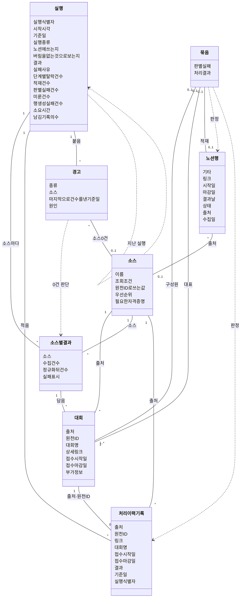
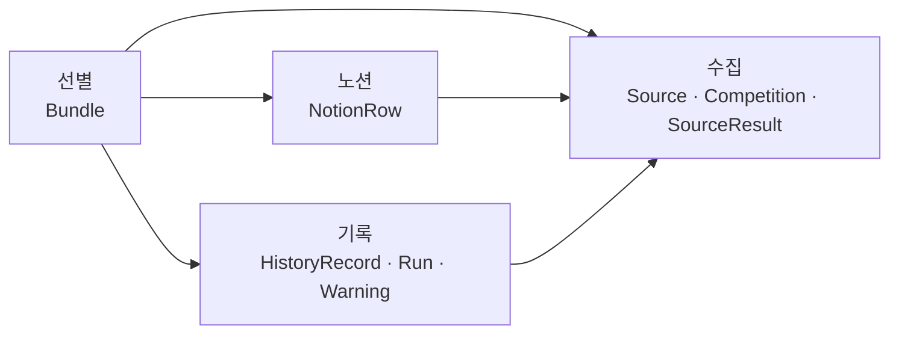

# 도메인 모델 — 대회 수집 배치

## 0. 이 문서가 다루는 것

배치 안에 어떤 **개념**이 있고, 각각 무엇을 **가지며**, 서로 어떻게 **이어지는지**를 정한다. 그리고 개념을 몇 덩어리로 **나눈다**. 이 경계가 코드 폴더의 기준이 된다.

| 단계 | 하는 일 | 이 문서의 절 |
|---|---|---|
| 개념 식별 | 유스케이스 문장의 명사를 모아 개념인지 속성인지 가른다 | 1장 |
| 개념 모델 | 개념에 속성을 붙이고 관계를 잇는다 | 2·3장 |
| 경계 나누기 | 바뀌는 이유가 같은 개념끼리 모은다 | 4장 |

**판별 기준은 "소프트웨어가 없어도 있는가"다.** 사용자는 이 일을 손으로 해 왔다([[CCR-RFQ-001#Q1]]). 사이트를 열어 공고를 훑고, 참가할 만한 것을 노션에 옮겨 적었다. 여섯 사이트를 손으로 돈다 해도 하는 일은 같다. 공고를 보고, 같은 대회를 알아보고, 관심 있는 것만 옮기고, 무엇을 봤는지 기억하고, 오늘 한 일을 적어 둔다. 그 일에도 있던 것이 도메인이다. 로그·커밋·추가분 파일·마무리 단계는 배치라서 생긴 것이라 도메인이 아니다.

여기서 정하지 않는 것도 있다. 메서드와 코드 폴더 구조는 클래스 명세가 정하고, 클래스 명세는 8단계 API 명세 뒤에 온다. 상태 파일 한 줄의 필드 이름과 형식은 ERD가 정한다. 소스 응답의 모양과 노션 속성의 종류는 8단계 API 명세가 정한다. 지금 정하면 뒤 단계에서 두 번 고치게 된다.

이 문서에서 `묶음`은 같은 대회로 판정된 공고들([[#Bundle]])만 가리킨다. 개념을 나눈 덩어리는 `경계`라 부른다.

## 1. 개념 식별

[[CCR-UC-001]] 2·3장의 흐름과 확장 문장에 나오는 명사를 후보로 삼았다. 흐름 문장은 "누가 무엇을 어떻게 한다"이므로 명사가 다뤄지는 대상이다. 번호 목록과 확장 목록의 줄 298개에서 셌고, 한 줄에 여러 번 나와도 한 번으로 셌다.

| 후보 | 빈도 | 판정 |
|---|---:|---|
| 대회 | 85 | **개념** `Competition`. 한 소스에서 온 공고 하나다([[CCR-UC-001]] 0장) |
| 실행 | 60 | **개념** `Run` |
| 처리 이력 | 55 | 기록의 모음. 한 줄이 **개념** `HistoryRecord`다 |
| 노션 | 55 | 노션의 행이 **개념** `NotionRow`다. `대회목록` DB는 하나뿐이라 개념으로 두지 않는다 |
| 판별 | 47 | 행위. 개념 아님. 답이 버림이면 곧바로 처리 이력 기록의 결과가 되고, 남김이면 노션에 행을 만든 뒤에야 남김으로 적힌다. 건수는 실행에 남고 근거는 로그에만 남는다 |
| 소스 | 44 | **개념** `Source` |
| 기록 | 41 | 개념 아님. 처리 이력과 실행 요약을 두루 가리키는 말이라, 이 문서는 두 파일의 개념을 모은 경계의 이름으로 쓴다(4.1) |
| 결과 | 41 | 속성. 실행의 결과(성공·실패·중단)와 처리 이력 기록의 결과(남김·버림)는 이름만 같다 |
| 남김·버림 | 37 | 처리 이력 기록의 결과 값 |
| 참가자·관리자·스케줄러 | 33 | 액터([[CCR-UC-001]] 1장). 개념 아님. 스케줄러는 실행 종류의 `예약`으로만 남는다 |
| 실행 요약 | 32 | 지난 실행들의 모음. 한 줄이 실행 하나다 → `Run` |
| 접수 날짜 | 32 | 대회·노션 행·처리 이력 기록의 속성 |
| 묶음 | 30 | **개념** `Bundle` |
| 경고 | 24 | **개념** `Warning` |
| 로그 | 21 | 개념 아님. 사람이 읽는 출력이고 보관 기간이 지나면 사라진다(4.3) |
| 설정·토큰·키 | 20 | 개념 아님. 실행 환경의 일이다(4.3) |
| 커밋 | 18 | 개념 아님. 마무리 단계가 한다 |
| 구성원·대표 | 16 | 묶음 안의 자리. 대표는 구성원 가운데 하나다 |
| 기준일 | 15 | 실행의 속성. 처리 이력 기록에도 들어가고, 노션 행의 `수집일`이 이 값이다 |
| 건수 | 15 | 실행과 소스별 결과의 속성 |
| 실패 표시 | 14 | 소스별 결과의 속성. 소스별 결과는 **개념** `SourceResult`다 |
| 마무리 단계 | 13 | 개념 아님. 배치가 멈춰도 기록을 올리려고 둔 단계다(4.2 · 4.3) |
| Actions | 13 | 개념 아님. 실행이 도는 곳이다. 실행 이력은 줄이 없는 실행을 가를 때 본다([[CCR-UC-001#UC-A3]] 1a) |
| 아는 대회 | 12 | 개념 아님. 노션 행과 처리 이력 기록을 합친 것이다([[CCR-UC-001#UC-S4]] 3) |
| 모드 | 11 | 실행의 속성(노션에 쓰는지) |
| 미룸 | 10 | 묶음의 처리 결과 가운데 하나 |
| 링크 | 10 | 대회(상세 링크)·노션 행·처리 이력 기록의 속성 |
| 판정 | 9 | 규칙. 개념 아님. 묶음을 만들고 묶음을 아는 대회와 견주는 데 쓰며, 짝마다의 판정은 남기지 않는다 |
| 브랜치 | 9 | 개념 아님. 실행이 노션에 쓰는지를 정하는 조건이다([[CCR-UC-001#UC-A1]] 1b5) |
| 레코드 | 8 | 원본 레코드와 공통 형식은 대회의 두 표현이다. 개념은 대회 하나. 수집 건수와 정규화 탈락은 원본 레코드를 센다 |
| 판별 기준 | 8 | 규칙. 개념 아님(4.3) |
| 요청 간격·쪽·상한·robots.txt | 8 | 개념 아님. 수집 예의와 시간 한도를 지키는 장치다. `robots.txt`가 막으면 소스별 결과의 실패 표시(수집 금지)로 남는다 |
| 컬럼 | 7 | 노션 행의 속성 |
| 과제 | 6 | 개념 아님. AI팩토리 원본 레코드의 단위로, 정규화에서 대회 하나로 합쳐진다 |
| 원천 ID | 6 | 대회와 처리 이력 기록의 속성 |
| 연도·회차 | 6 | 대회명에서 뽑기로 한 값. 판정 2단계에 쓴다 |
| 짝·유사도 | 5 | 판정의 단위와 값. 남지 않는다 |
| 상태 | 3 | 노션 행의 속성. 배치는 `시작 전`으로 만들 뿐이다 |
| 추가분 | 3 | 개념 아님. 마무리 단계가 올리기 전까지 이번 실행이 더한 줄을 쌓아 두는 파일이다 |
| 상태 파일 | 2 | 개념 아님. 처리 이력과 실행 요약 두 파일을 함께 부르는 말이다(2.1) |
| 시작 시각 | 2 | 실행의 속성 |
| 판별 모델 | 2 | 보조 액터([[CCR-UC-001]] 1장). 개념 아님 |
| 조회 조건 | 1 | 소스의 속성 |

**빈도만으로 판정하지 않는다.** `기록`은 41줄에 나오지만 두 파일을 두루 가리키는 말일 뿐이다. `경고`는 24줄이지만 종류마다 붙는 조건과 함께 적는 값이 달라 개념이 된다. `소스별 결과`라는 말은 흐름에 나오지 않는다. 소스마다 따로 나오는 `실패 표시`와 `건수`를 한 개념으로 모았다([[#SourceResult]]).

## 2. 개념 모델

상자에는 값으로 적히는 속성만 적는다. 다른 개념을 담는 것(묶음의 구성원·대표, 소스별 결과의 대회, 실행의 소스별 결과·경고)은 선으로만 그리고, 출처처럼 다른 개념을 이름으로 가리키는 값은 상자에도 적고 선으로도 잇는다. 실선은 담거나 가리키는 관계이고, 점선은 견주거나 지난 것을 읽기만 하는 관계다. 선이 있다고 저장되는 것은 아니다. 무엇이 어디에 남는지는 2.1에 적는다.

경계를 건너는 선은 4.2의 방향으로만 그렸다. 노션 행과 처리 이력 기록, 실행과 노션 행, 실행과 묶음은 값으로만 이어져 선을 긋지 않았다. 3장의 관계에 적는다.

### 2.1 개념이 사는 곳

데이터베이스는 없다([[CCR-INFRA-001#C4]]). 개념은 네 곳에 산다.

| 개념 | 사는 곳 | 얼마나 사나 |
|---|---|---|
| 소스 | 밖의 사이트. 배치가 아는 속성은 코드에 둔다 | 소스를 더하거나 뺄 때까지 |
| 대회 · 소스별 결과 · 묶음 | 한 실행 안 | 실행이 끝나면 사라진다. 배치가 쓴 실행 요약 줄에 소스별 결과의 건수와 실패 표시만 남는다 |
| 노션 행 | 노션 `대회목록` | 참가자가 지울 때까지 |
| 처리 이력 기록 | 실행 중에는 추가분 파일, 마무리 단계가 올린 뒤에는 저장소 `data/processed.jsonl` | 배치는 지우지 않는다. 관리자가 버림을 비우거나, 복구할 때 실행 요약과 함께 예전 판으로 되돌린다 |
| 실행 · 경고 | 실행 중에는 추가분 파일, 마무리 단계가 올린 뒤에는 저장소 `data/runs.jsonl` | 배치는 지우지 않는다. 관리자가 읽히지 않는 줄을 고치거나, 처리 이력과 함께 되돌린다 |

## 3. 개념별 정리

항목 ID는 영문 개념명이다. 클래스 명세의 클래스명과 맞춘다.

#### Source 소스

대회 목록을 가져오는 사이트 하나다. 여섯 곳으로 정해져 있다([[CCR-RFQ-001#Q4]] · [[CCR-PRD-001#R1]]).

**속성**

| 속성 | 뜻 |
|---|---|
| 이름 | event-us · DACON · Kaggle · wevity · AI팩토리 · 콘테스트코리아. 배치가 만든 노션 행의 `출처`에 이 이름이 들어간다([[CCR-PRD-001#R6]]) |
| 조회 조건 | 소스에 무엇을 묻는지. event-us는 행사유형 `대회/공모전`만 걸고 분야는 걸지 않는다([[CCR-PRD-001#R1]] · [[CCR-UC-001#UC-S1]] 1) |
| 원천 ID로 쓰는 값 | event-us `id` · DACON `cpt_id` · Kaggle `ref` · wevity `ix` · AI팩토리 합친 과제 `id` 가운데 가장 작은 값 · 콘테스트코리아 `str_no`([[CCR-PRD-001]] 5.1) |
| 우선순위 | DACON · Kaggle · AI팩토리 · event-us · wevity · 콘테스트코리아 차례다. 선별이 이 값을 읽어, 묶음의 대표를 고를 때와 합칠 짝의 차례가 판정 단계와 유사도로 갈리지 않을 때 쓴다([[CCR-UC-001#UC-S4]] 4 · 4a2) |
| 필요한 자격증명 | Kaggle만 API 토큰이 있어야 한다([[CCR-UC-001#UC-S1]]의 사전조건) |

**관계**

- 대회를 낸다. 대회 하나는 소스 하나에서 온다.
- 소스를 돈 실행마다 소스별 결과가 하나 생긴다.
- 처리 이력 기록과 배치가 만든 노션 행은 출처로 소스를 가리킨다.

**판정 근거**

사람이 여는 사이트라 소프트웨어가 없어도 있다. 속성 넷(조회 조건 · 원천 ID로 쓰는 값 · 우선순위 · 자격증명)이 규칙에 쓰이고, 실패가 소스 단위로 갈린다([[CCR-PRD-001#R9]]).

가져오는 길은 소스마다 다르다. 공개 검색 API(event-us), 토큰으로 인증하는 공식 API(Kaggle), 서버 렌더링 페이로드(DACON), 정적 HTML(wevity · AI팩토리 · 콘테스트코리아)이다([[CCR-RFQ-001#Q4]]). 그러나 돌려주는 것은 같다([[CCR-UC-001#UC-S1]]의 일반화). 가져오는 방법은 소프트웨어의 일이라 여기 두지 않는다. 8단계 API 명세가 정한다.

#### Competition 대회

한 소스에 올라온 공고 하나다. [[CCR-UC-001]] 0장이 `대회`를 이렇게 정했고 이 문서도 따른다. 같은 대회가 여러 소스에 올라오면 대회가 여럿이고, 그것들이 한 묶음이 된다([[#Bundle]]).

**출처와 원천 ID로 식별한다**([[CCR-PRD-001]] 5.1). 어제 가져온 대회를 오늘 다시 가져와도 이 둘이 같으면 같은 대회다. 다만 원천 ID는 바뀔 수 있다. AI팩토리에서 가장 작은 id의 과제가 목록에서 빠지거나, 소스가 개편해 식별값을 주지 않아 상세 링크를 쓰게 되면 같은 공고가 새 원천 ID를 갖는다. 그때는 대회명으로 예전 기록과 이어진다(판정 4·5단계, [[CCR-PRD-001]] 5.1). 확실하게 같다고 나오면 새 원천 ID로도 처리 이력 기록이 생긴다([[CCR-UC-001#UC-S4]] 6).

**속성**

| 속성 | 뜻 |
|---|---|
| 출처 | 가져온 소스 |
| 원천 ID | 소스가 주는 식별값([[#Source]]). 소스가 주지 않으면 절대 주소로 만든 상세 링크를 쓴다([[CCR-UC-001#UC-S2]] 1c) |
| 대회명 | 소스가 준 그대로. 앞뒤 공백만 정리한다. Kaggle의 영문 대회명도 옮기지 않는다([[CCR-RFQ-001#Q13]]) |
| 상세 링크 | 절대 주소 |
| 접수시작일 · 접수마감일 | 접수 기준의 KST 날짜. 시각은 없다. 알 수 없으면 비운다([[CCR-PRD-001#R2]] · [[CCR-PRD-001]] 5.3) |
| 부가 정보 | 소스가 준 분야·태그·키워드. 판별 요청에 쓴다([[CCR-UC-001#UC-S5]] 1). Kaggle의 분류(`category`)도 부가 정보에 넣기로 한다. `gettingStarted`·`playground`면 상시 연습용 대회로 보고 버린다([[CCR-RFQ-001#Q4]] · [[CCR-UC-001#UC-S3]] 2b) |

판정([[CCR-UC-001#UC-S4]])에 쓰는 값은 선별이 대회에서 뽑는다. 추적용 매개변수를 뗀 링크, 정규화한 대회명, 대회명에 적힌 연도·회차다. 연도·회차는 대회명에서 뽑기로 한다. 대회는 이 값을 따로 들고 있지 않는다.

**관계**

- 소스 하나에서 온다.
- 소스별 결과에 담겨 나온다.
- 마감 판정을 지나면 선별이 묶음의 구성원으로 삼는다. 대표가 될 수 있다. 마감이 지난 대회는 묶기 전에 빠진다([[CCR-UC-001#UC-S3]]).
- 선별은 출처·원천 ID가 같은 처리 이력 기록이 있으면 그 대회를 이미 아는 대회로 본다.

**판정 근거**

사람이 사이트에서 보는 공고 그 자체다. 대회명·상세 링크·출처·원천 ID 넷 가운데 하나라도 채울 수 없으면 대회가 되지 못한다. 정규화에서 버리고 그 수를 센다([[CCR-UC-001#UC-S2]] 1b).

소스가 준 원본 레코드와 공통 형식은 같은 대회의 두 표현이다. 원본 레코드의 모양은 소스마다 달라 소프트웨어의 일이므로 개념으로 두지 않는다. AI팩토리의 과제도 그렇다. 과제 여럿은 정규화에서 대회 하나로 합쳐진다. 대회명은 과제명이 아니라 대회 이름이고, 접수시작일은 가장 이른 과제의 값, 접수마감일은 가장 늦은 과제의 값이다([[CCR-UC-001#UC-S2]] 1d). 합친 뒤에는 과제가 남지 않는다.

대회는 한 실행 안에서만 산다. 다음 실행은 소스에서 다시 가져온다. 실행 뒤에 남는 것은 처리 이력 기록과, 적재했다면 노션 행이다.

#### SourceResult 소스별 결과

한 실행에서 소스 하나를 돈 결과다. [[CCR-UC-001#UC-S1]]이 가져오고 [[CCR-UC-001#UC-S2]]가 맞춘다.

**속성**

| 속성 | 뜻 |
|---|---|
| 소스 | 돈 소스 |
| 대회 | 공통 형식을 갖춘 대회 목록 |
| 수집 건수 | 소스가 준 원본 레코드의 수. AI팩토리는 합치기 전 과제의 수다([[CCR-UC-001#UC-S1]] 4) |
| 정규화 뒤 건수 | 공통 형식을 갖춘 대회의 수. 소스 0건 경고는 이 수로 판단한다([[CCR-UC-001#UC-S7]] 2) |
| 실패 표시 | 실패했으면 그 종류. 연결 · 응답 코드 · 형식 · 수집 금지 · 설정 누락 가운데 하나다([[CCR-UC-001#UC-S7]]). 시간 예산을 넘긴 것은 연결로, 기다리라는 시간이 상한보다 길어 멈춘 것은 응답 코드로 보기로 한다([[CCR-UC-001#UC-S1]] \*a · 2a1) |

**관계**

- 소스 하나를 가리킨다.
- 실행이 소스마다 하나씩 갖는다. 소스별 결과는 실행을 가리키지 않는다.
- 대회 목록을 담는다.

**판정 근거**

"오늘 wevity는 열 건, DACON은 접속이 안 됨"은 손으로 해도 남기는 기록이다. 실패가 소스 단위로 갈리고([[CCR-PRD-001#R9]]), 실행 요약에 소스마다 남으며([[CCR-PRD-001#R8]]), 소스 0건 경고가 지난 실행을 거슬러 소스마다 본다([[CCR-UC-001#UC-S7]] 2). 실행의 속성으로 흩어 두면 이 셋을 소스마다 따로 챙겨야 한다.

실패는 예외가 아니라 이 결과의 값이다. 실패한 소스는 빈 목록과 실패 표시를 돌려주고, 요청은 성공했는데 0건이면 실패 표시 없는 빈 목록을 돌려준다([[CCR-UC-001#UC-S1]] 2a · 2b). 이 둘을 가르는 것이 소스 0건 경고의 전제다.

쪽 상한에 닿으면 그때까지 가져온 목록을 실패 표시 없이 돌려주고, 상한에 닿았다는 사실은 로그에 남기기로 한다. 실행 요약의 필드에는 그 자리가 없다([[CCR-UC-001#UC-S1]] 3a · [[CCR-UC-001#UC-S7]]).

실행 요약에는 배치가 쓴 줄에만 건수와 실패 표시가 남고, 대회 목록은 남지 않는다. 수집을 시작하지 않은 실행에는 소스별 결과가 없다([[CCR-UC-001#UC-A1]] 1d1).

#### Bundle 묶음

같은 대회로 판정된 대회들이다. 같은 소스 안에도 중복 공고가 있고, 같은 대회가 여러 소스에 올라온다([[CCR-SCN-001#S3]]). 노션에는 묶음 하나가 행 하나로 들어간다.

**속성**

| 속성 | 뜻 |
|---|---|
| 구성원 | 같은 대회로 판정된 대회들. 하나뿐일 수도 있다 |
| 대표 | 구성원 가운데 노션에 넣는 한 건. 접수 날짜가 더 채워진 쪽, 같으면 소스 우선순위가 앞선 쪽이다([[CCR-UC-001#UC-S4]] 4a) |
| 판별 실패 | 판별을 받지 못했는지. 처리 결과와 따로 둔다([[CCR-UC-001#UC-S5]] 2a2) |
| 처리 결과 | 한 실행 안에서 이 묶음이 어떻게 끝났는지. 아래 표 |

**묶는 규칙**

구성원은 같다는 짝으로 모두 이어져 있고, 판정 2·3단계에서 다르다고 나온 짝이 하나도 없어야 한다([[CCR-UC-001#UC-S4]] 4).

판정은 두 대회가 같은지를 다섯 단계로 가르는 규칙이다([[CCR-PRD-001]] 5.2). 묶음을 만들 때([[CCR-UC-001#UC-S4]] 4)와 묶음을 아는 대회와 견줄 때([[CCR-UC-001#UC-S4]] 5) 쓴다. 결과는 같음 · 다름 · 판단하지 않음 가운데 하나이고, 같음이면 어느 단계에서 났는지, 유사도, 연도나 접수 날짜를 실제로 맞대 봤는지를 함께 낸다. 단계와 유사도는 합치는 차례를 정하고, 맞대 봤는지는 구성원을 처리 이력에 적을지를 정한다([[CCR-UC-001#UC-S4]] 6). 짝마다의 판정은 남기지 않는다.

판정은 세 가지를 같은 규칙으로 견준다. 후보 대회끼리, 대회와 노션 행, 대회와 처리 이력 기록이다. 선별은 셋에서 판정에 쓰는 값을 같은 방법으로 뽑는다. 대회명(여기서 정규화한 대회명과 연도·회차를 뽑는다)과 접수 날짜는 셋 모두에서 뽑는다. 출처·원천 ID는 대회와 처리 이력 기록에만 있다. 노션 행에는 원천 ID가 없어 1단계에서 링크로 견주며, 링크는 이때만 쓴다.

**처리 결과**

| 처리 결과 | 정해지는 곳 | 처리 이력 | 노션 |
|---|---|---|---|
| 이미 앎 | [[CCR-UC-001#UC-S4]] 5 | 확실하게 같았으면 자기 기록이 없는 구성원을 견준 쪽의 결과로 적는다([[CCR-UC-001#UC-S4]] 6) | 새 행 없음 |
| 버림 | [[CCR-UC-001#UC-S5]] 3 | 대표와 구성원을 버림으로 곧바로 적는다([[CCR-UC-001#UC-S5]] 5) | 새 행 없음 |
| 적재 | [[CCR-UC-001#UC-S6]] 4 · 2d | 행이 만들어졌다는 응답을 받는 대로 대표와 구성원을 남김으로 적는다 | 행 하나 |
| 행 생성 실패 | [[CCR-UC-001#UC-S6]] 1b · 2a | 적지 않는다. 다음 실행이 다시 판별하고 다시 넣는다. 응답 없이 끊겨 행이 이미 생겼으면 다음 실행이 그 노션 행으로 알아보고 뺀다([[CCR-UC-001#UC-S6]] 2c2) | 없음. 응답 없이 끊겼으면 생겼을 수 있다([[CCR-UC-001#UC-S6]] 2c) |
| 미룸 | [[CCR-UC-001#UC-S5]] 2c | 적지 않는다. 다음 실행이 다시 판별한다 | 없음 |

판별 실패는 처리 결과와 따로 두는 표시다. 그날 판별 실패가 판별 대상의 절반 이하면 남김으로 넘어가 적재나 행 생성 실패로 끝나고, 절반을 넘으면 미룸으로 끝난다. 절반을 넘어도 접수마감일이 기준일인 묶음은 남김으로 넘어간다([[CCR-UC-001#UC-S5]] 2b · 2c). 묶음의 접수마감일을 무엇으로 볼지는 6장에 남겼다.

노션에 쓰지 않는 실행에서는 남김으로 넘어간 묶음의 처리 결과를 정하지 않는다. 무엇이 들어갔을지만 로그에 남기고, 처리 이력에도 노션에도 쓰지 않는다([[CCR-UC-001#UC-A1]] 1b2 · 1b3).

**관계**

- 대회 하나 이상을 구성원으로 갖고, 그 가운데 하나가 대표다.
- 적재되면 노션 행 하나가 된다. 행에는 대표의 값이 들어간다.
- 판정에서 노션 행 · 처리 이력 기록과 견준다. 이 관계는 남지 않는다.
- 한 실행 안에서 만들어지고 끝난다. 실행은 묶음을 가리키지 않고, 처리 결과를 센 건수만 받는다(4.2).

**판정 근거**

여러 사이트를 보는 사람도 같은 대회임을 알아보고 한 번만 적는다. 판별 · 적재 · 기록이 모두 묶음 단위로 돈다. 판별은 대표에 대해 묻고([[CCR-UC-001#UC-S5]] 1), 적재는 대표로 행을 만들며([[CCR-UC-001#UC-S6]] 2), 기록은 대표와 구성원을 같은 결과로 적는다.

**묶음은 저장하지 않는다.** 한 실행 안에서만 산다. 흔적은 구성원마다의 처리 이력 기록과 대표로 만든 노션 행이다. 구성원이 각자 기록되어 있으므로, 다음 날 어느 구성원이 따로 올라와도 판정 1단계로 알아본다([[CCR-UC-001#UC-S4]] 5).

#### NotionRow 노션 행

노션 `대회목록` DB의 행 하나다. 사람이 보는 대회 목록의 한 줄이다([[CCR-RFQ-001#Q3]]).

행은 두 갈래로 생긴다. 배치가 묶음의 대표로 만든 행과, 참가자가 손으로 넣은 행이다. `출처`·`수집일` 컬럼이 생기기 전에 손으로 넣은 행은 두 컬럼이 비어 있다([[CCR-RFQ-001#Q7]] · [[CCR-PRD-001#R6]]). 손으로 넣은 행은 링크가 비었거나 대회 전용 사이트를 가리키기도 하고([[CCR-UC-001#UC-S4]] 5a), 손으로 적은 날짜는 틀릴 수 있다([[CCR-UC-001#UC-S4]] 판정 1단계).

**속성**

| 컬럼 | 뜻 | 배치는 |
|---|---|---|
| `기타`(제목) | 대회명 | 읽는다. 만들 때 대표의 대회명을 넣는다 |
| `링크` | 상세 페이지 주소 | 읽는다. 만들 때 대표의 상세 링크를 넣는다 |
| `시작일` · `마감일` | 접수시작일 · 접수마감일 | 읽는다. 만들 때 대표의 값을 넣고, 모르면 비운다 |
| `결과날` | 결과 발표일 | 쓰지 않는다. 어느 소스에도 없다 |
| `상태` | 시작 전 · 진행 중 · 제출 · 완료 | 만들 때 `시작 전`으로 넣는다. 그 뒤로는 사람만 바꾼다 |
| `출처` | 소스 이름 | 만들 때 대표의 출처를 넣는다 |
| `수집일` | 만든 실행의 기준일 | 만들 때 넣는다. 실행 도중 자정을 넘겨도 바꾸지 않는다 |

노션 행에는 원천 ID가 없다. 판정은 노션 행과 링크로 견준다([[CCR-UC-001#UC-S4]] 판정 1단계). 행마다 노션이 주는 ID는 소프트웨어의 것이라 여기 두지 않는다.

**관계**

- 배치가 만든 행은 선별이 고른 묶음의 대표로 만들고, 출처로 소스 하나를 가리킨다.
- `수집일`에는 만든 실행의 기준일 값이 들어갈 뿐, 행은 실행을 가리키지 않는다. 같은 날 돈 실행끼리는 행으로 가를 수 없다.
- 처리 이력 기록과는 값으로만 이어진다. 배치가 만든 행에는 그 묶음의 구성원마다 남김 기록이 있어, 행을 지워도 같은 대회를 다시 넣지 않는다([[CCR-PRD-001#R5]] · [[CCR-UC-001#UC-A2]] 5a). 손으로 넣은 행은 확실하게 같은 공고가 올라와 빠진 뒤에야 남김 기록이 생긴다([[CCR-UC-001#UC-A2]] 5a3). 기록이 없는 행도 있다. 응답 없이 생긴 행, 적기 전에 배치가 멈춘 행, 올리지 못한 실행이 만든 행이다([[CCR-UC-001#UC-S6]] 2c · [[CCR-UC-001#UC-A1]] \*a · 9a · \*a5).
- 판정에서 처리 이력 기록과 함께 `아는 대회`가 된다([[CCR-UC-001#UC-S4]] 3).

**판정 근거**

사람이 보는 유일한 곳이자 배치의 입력이고 출력이다. 배치는 모든 행을 읽어 이미 아는 대회를 가르고([[CCR-UC-001#UC-S4]] 1), 새 대회만 행으로 만든다([[CCR-UC-001#UC-S6]]).

**한 번 들어간 행은 배치가 다시 손대지 않는다**([[CCR-PRD-001#R6]]). 소스에서 마감일이 바뀌어도 그대로다. 행을 지우는 것은 참가자다([[CCR-UC-001#UC-A2]] 5). 이 약속은 노션의 권한이 아니라 배치 코드가 지킨다([[CCR-RFQ-001#Q7]]). 그래서 노션 경계는 읽는 일과 만드는 일만 연다(4.2).

`대회목록` DB 자체는 개념으로 두지 않는다. 하나뿐이고, 배치가 DB에 하는 일은 `출처`·`수집일` 컬럼이 없을 때 만드는 것 하나다([[CCR-UC-001#UC-S6]] 1a). 노션에 쓰지 않는 실행은 컬럼도 만들지 않는다.

#### HistoryRecord 처리 이력 기록

버림으로 판별됐거나, 노션에 행이 생겼거나, 이미 아는 대회와 확실하게 같다고 확인된 공고 하나와 그 결과를 적은 한 줄이다. 모이면 처리 이력이다([[CCR-UC-001]] 0.1). 판별해 버린 대회는 노션 어디에도 남지 않으므로 따로 기억해야 하고([[CCR-PRD-001#R4]]), 참가자가 노션에서 지운 대회를 되살리지 않으려면 남긴 대회도 기억해야 한다([[CCR-PRD-001#R5]]).

**속성**

| 속성 | 뜻 |
|---|---|
| 출처 · 원천 ID | 그 대회의 것. 이 둘로 대회와 이어진다 |
| 링크 · 대회명 | 그 대회의 것. 대회를 다시 알아볼 수 있도록 둔다([[CCR-UC-001]] 0.1). 판정은 이 가운데 대회명을 쓴다 |
| 접수시작일 · 접수마감일 | 그 대회의 것. 그 대회에 없으면 묶음 대표의 값으로 채운다. 날짜 없는 기록은 다음 해 같은 이름의 대회를 가르지 못하기 때문이다([[CCR-UC-001#UC-S4]] 5b). 대표에도 없으면 비어 있다 |
| 결과 | 남김 · 버림. 남김은 노션에 행이 있거나 있었던 대회다. 배치가 행을 만들었거나, 노션 행이나 남김 기록과 확실하게 같다고 확인됐다. 버림은 판별이 관심 밖이라고 답했거나, 버림 기록과 확실하게 같다고 확인된 대회다 |
| 기준일 · 실행 식별자 | 적은 실행의 것 |

속성은 [[CCR-INFRA-001]] 6.2의 필드와 같다. 반드시 있는 것은 출처 · 원천 ID · 결과 · 실행 식별자다([[CCR-INFRA-001]] 8.2). 필드 이름과 형식은 ERD가 정한다.

**적는 때**

| 결과 | 적는 때 |
|---|---|
| 남김 | 노션이 행을 만들었다고 응답하는 대로, 그 묶음의 대표와 구성원([[CCR-UC-001#UC-S6]] 4 · 2d) |
| 버림 | 판별에서 버리는 대로, 그 묶음의 대표와 구성원([[CCR-UC-001#UC-S5]] 5) |
| 견준 쪽을 따른다 | 이미 아는 대회로 빠진 묶음이 확실하게 같았을 때, 자기 기록이 없는 구성원. 노션 행과 같았으면 남김이고, 처리 이력 기록과 같았으면 그 기록의 결과다([[CCR-UC-001#UC-S4]] 6) |

적을 값은 선별과 실행의 흐름이 정해 넘기고, 기록 경계는 받은 대로 덧붙인다(4.2).

적지 않는 것도 있다. 판별을 미룬 묶음, 행 생성에 실패한 묶음, 이름만으로 같다고 본 묶음의 구성원이다. 노션에 쓰지 않는 실행은 아무것도 적지 않는다([[CCR-UC-001#UC-A1]] 1b2).

한 실행이 적은 기록은 마무리 단계가 저장소에 올린 뒤에야 처리 이력이 된다. 커밋이 끝내 실패하거나 마무리 단계까지 돌지 못하면, 그 실행의 기록은 실행 요약의 줄과 함께 사라진다([[CCR-UC-001#UC-A1]] 9a · \*a5). 형식에 맞지 않는 줄은 올릴 때 빠진다([[CCR-INFRA-001]] 8.2).

**관계**

- 실행 하나가 적는다. 기준일과 실행 식별자가 그 실행을 가리킨다.
- 출처로 소스 하나를 가리킨다.
- 출처·원천 ID가 같은 대회와 이어진다. 배치는 자기 기록이 이미 있는 대회를 다시 적지 않는다([[CCR-UC-001#UC-S4]] 6).
- 노션 행과는 값으로만 이어진다([[#NotionRow]]).
- 판정에서 노션 행과 함께 `아는 대회`가 된다. 노션에 쓰지 않는 실행이 버림을 없는 것으로 보면 버림 기록은 빠진다([[CCR-UC-001#UC-A1]] 1b6).

**판정 근거**

손으로 해도 "이건 봤고 거른 것"을 적어 둔다. 이 기록이 없으면 버린 대회를 마감 전까지 매일 다시 묻는다([[CCR-PRD-001#R4]]).

**배치는 덧붙이기만 한다.** 고치거나 지우는 길은 배치에 없다. 기록에 손을 대는 것은 관리자다. 판별 기준을 바꿀 때 버림을 비우고([[CCR-UC-001#UC-A4]] 4), 손으로 고치다 깬 형식을 고치며([[CCR-UC-001#UC-A3]] 2d1), 지워진 남김 줄을 저장소 이력에서 되살린다([[CCR-UC-001#UC-A3]] 2i1). 손상을 복구하거나 일부러 예전 판으로 돌릴 때는 실행 요약과 같은 판으로 함께 되돌리고, 그 뒤에 적힌 기록은 남김까지 사라진다([[CCR-UC-001#UC-A3]] 2d2 · 2i2).

남김은 버림을 비울 때도 지우지 않는다. 그래서 처리 이력에 있는 남김 기록의 수는 줄지 않아야 하며, 줄면 실행이 판별 전에 멈춘다([[CCR-UC-001#UC-S4]] 2c). 실행 요약과 함께 되돌리면 견줄 수도 함께 돌아가 멈추지 않는다. 견줄 수는 실행이 들고 있다([[#Run]]).

처리 이력이 읽히지 않으면 빈 이력으로 보지 않고 실행을 실패로 끝낸다([[CCR-UC-001#UC-S4]] 2b). 빈 것으로 보면 버린 대회를 모두 다시 묻고 지운 대회를 모두 되살린다.

#### Run 실행

배치를 한 번 돌린 것이다. 실행 요약 파일의 한 줄이 그 기록이다([[CCR-UC-001]] 0.1 · [[CCR-UC-001#UC-S7]]).

**속성**

| 속성 | 뜻 |
|---|---|
| 실행 식별자 | 실행 번호와 시도 번호. 같은 날 여러 번 돈 실행과, 같은 실행을 다시 시도한 것을 가른다. 한 식별자에 줄은 하나뿐이다. 마무리 단계는 이 식별자의 줄이 있는지로, 배치가 줄을 남겼는지와 앞선 올리기가 이미 들어갔는지를 가른다([[CCR-UC-001#UC-A1]] 9 · \*a2) |
| 시작 시각 | 실행이 시작한 시각. 배치가 아니라 실행에 기록되는 값이라 배치가 멈춰도 남는다. 앞 실행을 기다렸으면 기다림이 끝난 시각이다. 실행 요약에는 남기지 않는다([[CCR-UC-001]] 0.1 · [[CCR-UC-001#UC-S7]]) |
| 기준일 | 시작 시각을 KST로 바꾼 날짜. 실행 도중 자정을 넘겨도 바꾸지 않는다([[CCR-PRD-001]] 5.3) |
| 실행 종류 | 예약 · 수동 |
| 노션에 쓰는지 | 예약 실행은 늘 쓴다. 기본 브랜치 밖과 Actions 밖의 실행은 늘 쓰지 않는다. 기본 브랜치의 수동 실행은 관리자가 고른다([[CCR-UC-001#UC-A1]] 1b5). 쓰지 않는 실행(미리보기)은 기본 브랜치 최신 판의 두 파일을 읽고, 노션과 두 파일에 아무것도 쓰지 않으며, 줄을 남기지 않는다([[CCR-UC-001#UC-A1]] 1b2 · 1b7 · [[CCR-UC-001#UC-S7]] 8a) |
| 버림을 없는 것으로 보는지 | 켜면 판정에서 버림 기록을 아는 대회에 넣지 않는다. 노션에 쓰지 않는 실행에서만 뜻이 있고, 쓰는 실행에서는 무시한다([[CCR-UC-001#UC-A1]] 1b6 · [[CCR-INFRA-001]] 8.1) |
| 결과 | 성공 · 실패 · 중단 |
| 실패 사유 | 결과가 실패일 때. 설정 누락 · 전 소스 실패 · 노션 읽기 실패 · 처리 이력 읽기 실패 · 처리 이력 감소 · 오늘 마감 미적재 가운데 하나다 |
| 소스별 건수와 실패 표시 | 소스별 결과에서 대회 목록을 뺀 것 |
| 단계별 탈락 건수 | 정규화 탈락 · 마감 지남 · 이미 아는 대회 · 버림 |
| 적재 건수 · 판별 실패 건수 · 미룬 건수 · 행 생성 실패 건수 | 묶음의 처리 결과와 판별 실패를 센 것 |
| 경고 | [[#Warning]] |
| 소요 시간 | 실행 전체에 걸린 시간 |
| 남김 기록의 수 | 이 실행을 저장소에 올린 뒤 처리 이력에 남은 남김 기록의 수. 마무리 단계가 추가분을 얹은 뒤 세어 채운다([[CCR-UC-001#UC-A1]] 9) |

**건수를 세는 단위.** 수집 건수와 정규화 탈락은 원본 레코드의 수다. AI팩토리는 과제의 수이고, 과제를 합쳐 줄어든 수는 탈락이 아니다. 그래서 AI팩토리는 수집 건수에서 정규화 탈락을 빼도 정규화 뒤 건수가 되지 않는다. 정규화 뒤 건수와 마감 지남은 대회의 수다. 이미 아는 대회(처리 결과가 이미 앎인 묶음) · 버림 · 적재 · 판별 실패 · 미룸 · 행 생성 실패는 묶음의 수다. 판별 대상이 묶음이고([[CCR-UC-001#UC-S5]] 2b), 이렇게 세면 적재 건수가 그 실행이 만들었다는 응답을 받은 노션 행의 수와 같아진다. 응답 없이 끊긴 행은 행 생성 실패로 센다([[CCR-UC-001#UC-S6]] 2c1). 마감 지남은 [[CCR-UC-001#UC-S3]]에서 버린 대회의 수다. Kaggle 상시 연습용 대회도 이 단계에서 버리므로 마감 지남에 넣기로 한다.

**결과가 정해지는 길**

| 결과 | 누가 쓰나 | 언제 | Actions에 |
|---|---|---|---|
| 성공 | 배치 | 끝까지 돌았다. 경고가 붙을 수 있다 | 성공 |
| 실패 | 배치 | 스스로 실패로 판단해 끝냈다([[CCR-UC-001#UC-A1]] 1d1 · 2b · 5a · 7a3) | 실패 |
| 중단 | 마무리 단계 | 배치가 줄을 남기기 전에 멈췄다([[CCR-UC-001#UC-A1]] \*a2). 기준일 · 실행 식별자 · 실행 종류 · 남김 기록의 수만 적고 나머지는 비운다([[CCR-INFRA-001]] 8.2) | 실패. 관리자가 직접 취소한 실행만 취소 |

알림이 없어, 노션에 새 행이 들어온 날에도 사람에게 닿는 것은 Actions의 실패뿐이다. 그래서 그날 조치해야 하는 경고(오늘 마감 미적재)만 결과를 실패로 올린다([[CCR-RFQ-001#Q6]]).

줄이 없는 실행도 있다. [[CCR-PRD-001#R8]]의 넷은 노션에 쓰지 않는 실행, 앞 실행을 기다리다 취소된 실행, 커밋이 끝내 실패한 실행, 실행 환경이 통째로 멈춰 마무리 단계까지 돌지 못한 실행이다. [[CCR-INFRA-001]] 8.6은 둘을 더 적는다. 잡 시간 한도로 마무리 단계가 끊긴 실행과, 워크플로를 잘못 고쳐 노션에 쓰는지를 가르는 값이 깨진 실행이다.

판별 전에 처리 이력에 있는 남김 기록의 수를 실행 요약에 마지막으로 적힌 남김 기록의 수와 견준다. 읽히지 않는 줄은 소스 0건 경고를 판단할 때처럼 건너뛰기로 한다([[CCR-UC-001#UC-S7]] 2c). 적으면 판별도 적재도 하지 않고 실패(처리 이력 감소)로 끝낸다. 처리 이력 파일이 없는데 적힌 줄이 있으면 남김 기록의 수를 0으로 보고 견준다([[CCR-UC-001#UC-S4]] 2 · 2a2 · 2c).

첫 실행에는 두 파일에 줄이 없다. 처리 이력은 빈 것으로 보고, 남김 기록의 수를 견주지 않으며, 소스 0건 경고도 붙이지 않는다([[CCR-UC-001#UC-S4]] 2a1 · [[CCR-UC-001#UC-S7]] 2a1). 두 파일이 함께 사라져도 견줄 값이 없어 첫 실행처럼 돈다. 받아들인 한계다([[CCR-UC-001#UC-S4]] 2a3).

**관계**

- 소스별 결과를 소스마다 하나씩 갖는다. 수집을 시작하지 않은 실행에는 없다.
- 경고를 0개 이상 갖는다.
- 처리 이력 기록을 적는다.
- 지난 실행을 읽는다. 소스 0건 경고를 판단할 때와 남김 기록의 수를 견줄 때다.
- 노션 행과 묶음은 가리키지 않는다. 노션 행에는 기준일이 `수집일`로 들어갈 뿐이고, 묶음은 처리 결과를 센 건수로만 받는다(4.2).

**판정 근거**

손으로 해도 남기는 "오늘 한 일"의 기록이다. 알림이 없으므로 이상을 알아채는 주된 통로다([[CCR-RFQ-001#Q15]] · [[CCR-PRD-001#R8]]).

실행과 실행 요약의 한 줄을 따로 두지 않는다. 줄은 실행이 끝난 모습이고, 실행 요약 파일은 지난 실행들의 모음이다.

**실행 요약에는 정해진 값만 쓴다.** 예외 메시지 · URL · 응답 본문 같은 자유 문장은 넣지 않는다. 저장소 파일은 공개되고 git 이력에서 지워지지 않기 때문이다([[CCR-PRD-001#R8]] · [[CCR-UC-001#UC-S7]] 7). 원문은 로그에만 간다.

#### Warning 경고

실행에 붙여 사람이 봐야 할 일을 알리는 표시다. 결과를 실패로 올리는 것은 오늘 마감 미적재 하나뿐이고, 실패로 끝난 실행에도 붙을 수 있다([[CCR-PRD-001#R8]] · [[CCR-UC-001#UC-S7]]).

**속성**

| 속성 | 뜻 |
|---|---|
| 종류 | 아래 다섯 가운데 하나 |
| 소스 | 소스 0건일 때만. 0건을 낸 소스 |
| 마지막으로 건수를 낸 기준일 | 소스 0건일 때만. 그 소스가 마지막으로 1건 이상을 낸 기준일 |
| 원인 | 판별 미룸일 때만. 키 누락 · 호출 실패 |

종류마다 붙는 때와 결과에 주는 영향은 이렇다.

| 종류 | 붙는 때 | 결과에 |
|---|---|---|
| 소스 0건 | 꾸준히 건수를 내던 소스가 오류 없이 0건을 낸다. 0건이 이어지는 동안 매 실행 붙는다([[CCR-UC-001#UC-S7]] 2) | 그대로 |
| 판별 미룸 | 판별 실패가 절반을 넘어 미룬 묶음이 있다([[CCR-UC-001#UC-S5]] 2c4) | 그대로 |
| 행 생성 전면 실패 | 넣으려던 묶음이 한 건 이상이고 모두 행 생성 실패로 끝났다. 컬럼을 만들지 못해 행을 하나도 만들지 않은 경우도 같다([[CCR-UC-001#UC-S6]] 1b · 2b) | 그대로 |
| 오늘 마감 미적재 | 행 생성에 실패한 것 가운데 접수마감일이 기준일인 것이 있다([[CCR-UC-001#UC-A1]] 7a3). 묶음의 접수마감일을 무엇으로 볼지는 6장 | **실패로 올린다** |
| 요약 파일 손상 | 실행 요약에 읽히지 않는 줄이 있다([[CCR-UC-001#UC-S7]] 2c) | 그대로 |

"꾸준히"는 0건이 시작되기 바로 앞까지 연속 N일(설정값, 기본 3) 1건 이상을 냈다는 뜻이다. 날짜는 기준일로 세고, 건수는 정규화 뒤의 것이다. 같은 기준일에 줄이 여럿이면 하나라도 1건 이상일 때 그날을 건수를 낸 날로 본다. 그 소스를 수집하지 않았거나 실패 표시를 받은 줄은 건너뛴다.

**관계**

- 실행 하나에 붙는다.
- 소스 0건 경고는 소스 하나를 가리키고, 이번 실행과 지난 실행의 소스별 결과로 판단한다.

**판정 근거**

종류마다 붙는 조건과 함께 적는 값이 다르고, 결과를 바꾸는 것은 하나뿐이다. 다른 경고까지 실패로 올리면 실패로 끝나는 실행이 흔해져 정작 그날 조치할 일이 가려진다([[CCR-UC-001#UC-S7]] 3). 관리자는 경고의 종류를 보고 진단을 시작한다([[CCR-UC-001#UC-A3]] 2a · 2c · 2e · 2f).

## 4. 경계

### 4.1 네 경계

개념이 여덟이다. 세 가지를 물어 나눴다.

1. **바뀌는 이유가 같은가.** 사이트가 개편되거나, 판정 규칙과 판별 기준이 바뀌거나, 노션의 모양이 바뀌거나, 상태 파일의 형식이 바뀔 때 각각 어디가 바뀌는가.
2. **함께 움직이는가.** 한 번에 함께 올라가고 함께 되돌리는 것끼리 모은다.
3. **얘 없이 다른 게 말이 되는가.** 소스별 결과는 소스 없이 말이 안 되고, 경고는 실행 없이 말이 안 된다.

| 경계 | 개념 | 유스케이스 | 나눈 근거 |
|---|---|---|---|
| 수집 | Source · Competition · SourceResult | [[CCR-UC-001#UC-S1]] · [[CCR-UC-001#UC-S2]] | 소스마다 다르게 가져와 같은 형식으로 맞추는 곳이다. 사이트가 개편되면 여기만 바뀐다. 여섯 가운데 넷이 페이지 구조에 기대므로 가장 자주 바뀐다([[CCR-PRD-001#R9]]) |
| 선별 | Bundle | [[CCR-UC-001#UC-S3]] · [[CCR-UC-001#UC-S4]] 3 · 4 · 5 · 6 · 7 · [[CCR-UC-001#UC-S5]] | 무엇을 넣을지 가르는 규칙이 모인 곳이다. 마감 판정, 같은 대회 판정, 관심 분야 판별이 여기 있다. 판정 규칙이나 판별 기준이 바뀌면 여기만 바뀐다([[CCR-UC-001#UC-A4]]) |
| 노션 | NotionRow | [[CCR-UC-001#UC-S4]] 1 · [[CCR-UC-001#UC-S6]] 1 · 2 · 3 | 사람의 목록이다. 배치는 읽고 새로 만들 뿐 고치지 않는다 |
| 기록 | HistoryRecord · Run · Warning | [[CCR-UC-001#UC-S4]] 2 · [[CCR-UC-001#UC-S7]] · 처리 이력 덧붙이기([[CCR-UC-001#UC-S4]] 6 · [[CCR-UC-001#UC-S5]] 5 · [[CCR-UC-001#UC-S6]] 4) | 배치의 기억이다. 두 파일이 한 커밋으로 올라가고([[CCR-UC-001#UC-A1]] 9) 되돌릴 때도 함께 되돌린다([[CCR-UC-001#UC-A3]] 2d2). 남김 기록의 수로 서로를 견준다 |

UC의 패키지로 보면 수집·정규화는 수집 경계, 선별은 선별 경계에 들고, 운영 패키지의 [[CCR-UC-001#UC-S7]]은 기록 경계에 든다. 적재([[CCR-UC-001#UC-S6]])는 행과 컬럼을 만드는 일이 노션 경계, 남김을 적는 일이 기록 경계로 나뉜다.

**코드 폴더는 여기서 정하지 않는다.** 이 경계가 `collector/` 안 폴더의 기준이 되지만, 확정은 클래스 명세의 「폴더 구조」 절에서 한다([[CCR-INFRA-001]] 4장).

### 4.2 경계 사이의 규칙

화살표는 "가리킨다"는 뜻이다. 반대 방향은 없다.

1. **의존은 한 방향이다.** 선별은 수집 · 노션 · 기록을 가리키고, 노션과 기록은 수집을 가리킨다. 수집은 아무것도 가리키지 않는다. 대회와 소스는 네 경계가 모두 쓰는 말이라 맨 아래에 둔다.
2. **경계끼리는 값으로 주고받는다.** 한 실행 안에서 앞 단계가 만든 대회 · 소스별 결과 · 노션 행 · 처리 이력 기록과 건수를 뒤 단계가 받아 읽는다. 받은 값을 고쳐 돌려보내지 않는다.
3. **노션 경계는 읽기와 만들기만 연다.** 행과 컬럼을 읽고, 행과 컬럼을 만든다. 행을 고치거나 지우는 길을 두지 않는다([[CCR-PRD-001#R6]] · [[CCR-UC-001#UC-S6]]).
4. **기록 경계는 읽기와 덧붙이기만 연다.** 두 파일의 줄을 고치거나 지우는 길을 두지 않는다. 버림 비우기와 복구는 관리자가 파일을 고쳐 한다([[CCR-UC-001#UC-A4]] 4 · [[CCR-UC-001#UC-A3]] 2d). 남김 기록의 수를 견주는 일([[CCR-UC-001#UC-S4]] 2c)도 이 경계 안에서 한다. 처리 이력과 실행을 함께 봐야 하기 때문이다.
5. **기록 경계는 묶음을 모른다.** 처리 이력 기록에 적을 값(대표의 날짜로 채우기, 견준 쪽의 결과)은 선별이 정해 넘긴다. 묶음을 센 건수와, 판별 미룸 · 행 생성 전면 실패 · 오늘 마감 미적재에 해당하는지는 실행의 흐름을 잇는 일이 세어 넘긴다. 기록 경계가 스스로 판단하는 것은 소스 0건 경고, 요약 파일 손상 경고, 남김 기록의 수 견주기다.
6. **판정에 쓰는 값은 선별이 뽑는다.** 대회 · 노션 행 · 처리 이력 기록에서 같은 방법으로 뽑으므로 정규화 규칙은 선별 한 곳에 있다. 세 개념은 선별이 쓰는 형식을 따르지 않는다.

**어느 경계에도 속하지 않는 것이 둘 있다.**

- **실행의 흐름을 잇는 일**([[CCR-UC-001#UC-A1]]). 네 경계를 차례로 부르고, 노션 행 하나를 만들 때마다 기록 경계에 남김을 적게 한다. 묶음을 센 건수와 경고에 쓸 사실도 이 일이 모아 넘긴다. 어디에 둘지는 클래스 명세가 정한다.
- **마무리 단계**([[CCR-INFRA-001]] 8.2). 표준 라이브러리만 쓰고 배치의 다른 모듈을 불러오지 않는다. 그래서 기록 경계의 두 파일 형식을 따로 안다. 형식은 ERD가 한 곳에 정하고, 배치와 마무리 단계가 각자 그 정의를 따라 구현한다.

### 4.3 이 모델 밖의 것

| 다루지 않는 것 | 이유 |
|---|---|
| 판별 기준의 문구 | 규칙이다. 판별 요청과 코드에 산다. 바꾸는 절차는 [[CCR-UC-001#UC-A4]] |
| 판정 규칙의 수치(유사도 0.80 · 마감일 180일 · 판별 실패 절반) | 조정값이 아니라 규칙이다. 코드에 두고, 바꾸려면 PRD부터 고친다([[CCR-INFRA-001]] 4.1) |
| 설정값(판별 모델 이름과 그것을 덮는 저장소 변수 · 0건 경고의 연속 일수 · 소스별 타임아웃 · 재시도 · 요청 간격 · 쪽 상한 · 시간 예산 · 노션과 OpenAI의 타임아웃 · 재시도 · 판별 동시 요청 수) | 조정값이다([[CCR-INFRA-001]] 4.1 · 8.5) |
| 시크릿과 토큰 | 실행 환경의 일이다([[CCR-INFRA-001]] 5장) |
| 로그 | 원문 실패 사유 · 판별 근거 · 적재한 대회의 이름과 출처 · 정규화에서 버린 레코드의 출처와 이유 · 쪽 상한에 닿은 소스 · 미리보기에서 들어갔을 대회 · 마무리 단계가 올린 추가분이 사는 곳이지만, 사람이 읽는 출력이다. 보관 기간이 지나면 사라진다([[CCR-INFRA-001]] 6.3) |
| 커밋 · 추가분 파일 · 마무리 단계 | 배치가 멈춰도 넣은 데까지 올리고, 그사이 관리자가 고친 처리 이력을 지우지 않으려고 둔 장치다([[CCR-UC-001#UC-A1]] 9 · [[CCR-INFRA-001]] 6.2 · 8.2) |
| 노션 `상태`의 변화 | 사람의 일이다([[CCR-UC-001#UC-A2]] 4). 배치는 `시작 전`으로 만들 뿐이다 |
| 참가 신청 · 제출 | 비목표다([[CCR-PRD-001]] 2장) |

## 5. 판단한 것

| 판단 | 이유 |
|---|---|
| `대회`는 한 소스의 공고 하나다. 같은 대회를 가리키는 공고 여럿은 `묶음`이다. 개념을 나눈 덩어리는 `경계`라 부른다 | 상위 문서가 이렇게 정했다([[CCR-UC-001]] 0장 · [[CCR-PRD-001]] 5.1). 영어 뜻으로는 묶음이 실제 대회에 가깝지만, 상위 문서의 `대회`와 뜻을 맞추는 쪽을 골랐다. 코드의 `Competition`도 공고 하나다. `묶음`은 이미 개념의 이름이라 경계에는 쓰지 않는다 |
| 묶음은 저장하지 않는다 | 구성원마다 처리 이력 기록이 있어 다음 날 어느 구성원이 올라와도 알아본다. 묶음을 저장하면 다음 날 구성원이 달라진 묶음과 어느 것이 이어지는지를 또 가려야 한다 |
| 실행과 실행 요약의 한 줄은 한 개념이다 | 줄은 실행이 끝난 모습이다. 둘로 나누면 같은 값을 두 곳에 둔다 |
| 소스별 결과는 수집 경계에 둔다 | 수집이 만드는 값이다. 기록 경계에 두면 수집이 기록을 가리켜 의존이 양쪽으로 흐른다 |
| 판정에 쓰는 값은 선별이 뽑는다 | 정규화 규칙을 한 곳에 둔다. 세 개념이 각자 뽑으면 같은 규칙이 수집 · 노션 · 기록에 흩어진다 |
| 묶기 전 단계는 원본 레코드나 대회를, 묶은 뒤 단계는 묶음을 센다 | 판별 대상이 묶음이고, 적재 건수가 그 실행이 만든 노션 행의 수와 같아진다 |
| 소스의 실패 종류는 다섯으로 닫는다. 시간 예산을 넘긴 것은 연결, 상한보다 긴 대기 요구는 응답 코드로 본다 | 실행 요약의 종류를 늘리지 않고 상위의 다섯에 맞춘다([[CCR-UC-001#UC-S7]]) |

## 6. 미결사항

- [ ] **묶음의 접수마감일을 무엇으로 볼지.** 오늘 마감인지 가를 때 쓴다. 판별을 미루는 날의 예외([[CCR-UC-001#UC-S5]] 2c1 · [[CCR-UC-001#UC-A1]] 6b1)와 오늘 마감 미적재 경고([[CCR-UC-001#UC-A1]] 7a3 · [[CCR-UC-001#UC-S7]] 3)다. 읽는 길이 셋이다. 대표의 값, 구성원 가운데 가장 늦은 값, 구성원 가운데 하나라도 기준일인지다. [[CCR-UC-001#UC-A1]] 6b1 · 7a3과 [[CCR-UC-001#UC-S7]] 3은 `대회`(공고) 단위로 적혀 있어 글자대로 읽으면 셋째이고, [[CCR-UC-001#UC-S5]] 2c1만 묶음 단위다. 노션 행에는 대표의 값이 들어간다. 가장 늦은 값으로 보면, 오늘 마감인 구성원이 다음 날 [[CCR-UC-001#UC-S3]]에서 빠져도 나머지 구성원이 남아 대회를 잃지 않는다
- [ ] **아는 대회로 빠진 묶음이, 결과가 다른 둘과 함께 확실하게 같을 때 구성원을 무엇으로 적을지.** 예를 들어 버림 기록과 손으로 넣은 노션 행이 같은 대회일 때다. 상위 문서는 견준 쪽의 결과를 따른다고만 한다([[CCR-UC-001#UC-S4]] 6). 남김으로 적으면 버림을 비울 때도 지워지지 않는다
- [ ] **처리 이력이 커질 때 오래된 기록을 덜어낼지**([[CCR-INFRA-001]] 9장). 남김을 덜어내면 처리 이력 감소에 걸리므로, 실행 요약의 남김 기록의 수와 함께 정해야 한다
- [ ] AI팩토리의 대회 단위. 같은 대회의 과제를 알아보는 법, 대회 이름을 얻는 곳, 대회 하나만 보여 주는 상세 페이지가 있는지는 8단계 API 명세에서 정한다. 원천 ID(가장 작은 과제 id)와 상세 링크를 고르는 규칙은 정해져 있다([[CCR-PRD-001]] 5.1 · [[CCR-UC-001#UC-S2]] 1d2)
- [ ] 소스마다 대회에 채울 수 있는 값. 접수 날짜(wevity 목록에는 접수시작일이 없다)와 부가 정보를 소스마다 무엇으로 채울지는 8단계 API 명세에서 실제 응답을 보고 정한다
- [ ] 노션 `출처` 컬럼을 선택 속성으로 둘지 텍스트로 둘지. 값은 소스 이름 여섯 가운데 하나다. 8단계 API 명세에서 정한다
- [ ] `결과날`을 사람이 채우는 컬럼으로 굳힐지([[CCR-PRD-001]] 6장). 지금은 배치가 쓰지 않는다
- [ ] HTML 파서(`selectolax`·`beautifulsoup4`)를 무엇으로 할지. 같은 6단계의 클래스 명세에서 정한다([[CCR-INFRA-001]] 3장 · 9장)
