# 클래스 명세 — 대회 수집 배치

## 0. 이 문서가 다루는 것

도메인 모델([[CCR-DOM-001]])의 개념과 경계를 **코드 구조**로 옮긴다. 폴더 배치, 엔티티 클래스, 서비스의 책임과 메서드 이름까지다. 상태 파일 두 개와 노션 `대회목록`의 줄 형식은 [[CCR-DOM-003]] ERD·DD가 맡고, 함수 하나하나의 처리는 [[CCR-MS-001]]이 맡는다.

**클래스 세 종류와 이 문서의 범위**

| 종류 | 역할 | 이 배치에서 | 정의하는 곳 |
|---|---|---|---|
| Entity | 저장되는 데이터를 갖는 것 | 처리 이력 한 줄 · 실행 요약 한 줄과 그 안의 소스별 건수 · 경고, 노션 행 | 2장 + [[CCR-DOM-003]] |
| Control | 유스케이스 흐름을 조율하는 것 | 수집 · 선별 · 노션 · 기록의 서비스, 실행의 흐름(`Pipeline`), 마무리 단계 | 3장 · 4장 |
| Boundary | 바깥과 만나는 것 | 입구(`python -m collector`)와 소스 · 노션 · OpenAI · git에 거는 요청 | [[CCR-API-001]]. 4장에서 Control과 잇는 곳만 |

**전제(앞 단계에서 정한 것)**
- 서버 · 화면 · 데이터베이스가 없다. 한 번 돌고 끝나는 배치 하나다([[CCR-INFRA-001#C1]] · [[CCR-INFRA-001#C4]]).
- 경계는 넷이다. 수집 · 선별 · 노션 · 기록. 의존은 선별 → 수집 · 노션 · 기록, 노션 · 기록 → 수집의 한 방향이다([[CCR-DOM-001]] 4.2).
- 경계끼리는 값으로 주고받는다. 받은 값을 고쳐 돌려보내지 않는다.
- 노션 경계는 읽기와 만들기만, 기록 경계는 읽기와 덧붙이기만 연다.
- 판정 규칙의 수치(유사도 0.80 · 마감일 180일 · 판별 실패 절반)는 코드의 상수이고, 조정값은 `batch/settings.toml`이다([[CCR-INFRA-001]] 4.1).

## 1. 폴더 구조

저장소의 실행 컴포넌트는 배치 하나다. [[CCR-INFRA-001]] 4장대로 루트에 쏟지 않고 `batch/`에 담는다.

```
competition-crawler/
├── batch/                      배치. 이 저장소의 유일한 실행 컴포넌트
│   ├── collector/              배치 본체(임포트 패키지). 아래
│   ├── tests/                  collector/ 구조를 거울로. fixtures/에 실측 응답을 줄인 것
│   ├── finish.py               마무리 단계. 표준 라이브러리만 쓴다(4.10)
│   ├── settings.toml           비밀이 아닌 조정값
│   └── pyproject.toml · uv.lock
├── data/                       상태 파일. processed.jsonl · runs.jsonl. 마무리 단계만 커밋한다
├── docs/specs/                 명세 원본
├── .github/
│   ├── workflows/daily.yml     예약 · 수동 실행과 스텝 순서
│   └── dependabot.yml          액션 버전 갱신
├── .env.example · .gitignore
└── README.md · AGENTS.md       사람용 · 에이전트용
```

**batch/collector/ 안**

```
collector/
├── __main__.py                 입구. 하루치(run_batch)와 수집만(run_collect)
├── core/                       도메인에 속하지 않는 것
│   ├── settings.py             조정값 · 비밀값 · 실행 문맥(기준일 · 쓰기 여부 · 상태 파일 자리)
│   └── logging.py              로그 설정과 비밀값 가리기
├── shared/                     여러 경계가 쓰는 순수 함수
│   ├── dates.py                KST 날짜
│   └── text.py                 대회명 앞뒤 다듬기 · HTML 글자
├── infra/                      바깥 요청의 공용 도구
│   ├── http.py                 소스 요청. 시간 예산 · 요청 간격 · 재시도
│   ├── robots.py               robots.txt 확인
│   └── notion.py               노션 요청. 읽기와 쓰기의 재시도 규칙이 다르다
├── domains/
│   ├── collect/                수집 경계
│   │   ├── models.py           Competition · SourceResult · 열거형
│   │   ├── ports.py            Source 인터페이스
│   │   ├── service.py          CollectService
│   │   └── adapters/           eventus · dacon · kaggle · wevity · aifactory · contestkorea
│   ├── screen/                 선별 경계
│   │   ├── models.py           Bundle · MatchKey · PairResult · Known
│   │   ├── matching.py         같은 대회 판정 규칙(순수 함수)
│   │   ├── ports.py            Judge 인터페이스
│   │   ├── service.py          ScreenService
│   │   └── adapters/           openai_judge
│   ├── notion/                 노션 경계
│   │   ├── models.py           NotionRow · 컬럼 이름
│   │   ├── crud.py             NotionCrud. 노션에 닿는 네 호출
│   │   └── service.py          NotionService
│   └── record/                 기록 경계
│       ├── models.py           HistoryRecord · RunLine · 열거형
│       ├── crud.py             RecordCrud. 상태 파일 읽기와 추가분 쓰기
│       └── service.py          RecordService
└── run/
    └── pipeline.py             실행의 흐름(UC-A1). 네 경계를 차례로 부른다
```

**기본형과 다른 점, 그리고 왜.** [[CCR-INFRA-001]] 4장이 가리킨 싱크독 규약 1.9의 기본형은 `domains/<도메인>/`에 `router · schemas · service · crud · models`를 둔다. 여기서 벗어난 곳은 다섯이다.

1. **`router.py` · `schemas.py`가 없다.** 들어오는 요청이 없다. 입구는 `__main__.py` 하나이고, 입구가 하나라 도메인 밖에 따로 폴더를 두지 않는다.
2. **실행의 흐름을 `run/pipeline.py`에 둔다.** 도메인 모델은 이 일을 어느 경계에도 넣지 않고 클래스 명세에 맡겼다([[CCR-DOM-001]] 4.2). 네 경계를 모두 부르므로 어느 경계 안에 두면 의존이 거꾸로 흐른다.
3. **선별 경계에 `matching.py`를 따로 둔다.** 같은 대회 판정은 대회 · 노션 행 · 처리 이력 기록 셋에 같은 규칙을 쓰는 순수 함수다([[CCR-DOM-001]] 4.2 규칙 6). 흐름(`service.py`)과 섞으면 판정 규칙을 고칠 때 흐름까지 건드린다. 판정 규칙이 바뀌면 이 파일만 바뀐다([[CCR-UC-001#UC-A4]]).
4. **선별 경계의 폴더 이름이 `screen`이다.** 파이썬 표준 라이브러리에 `select`가 있어 헷갈린다. 역할은 그대로다.
5. **마무리 단계(`finish.py`)는 패키지 밖 `batch/` 바로 아래에 둔다.** [[CCR-INFRA-001]] 8.2가 표준 라이브러리만 쓰고 배치 패키지를 불러오지 말라고 정했다. uv 설치가 실패한 실행에서도 러너의 python3로 돌아야 한다. 패키지 안에 두면 `collector/__init__.py`를 거쳐 다른 모듈을 끌어들이기 쉽다.

`ports.py` · `adapters/`는 바깥 호출이 실제로 있는 두 곳에만 둔다. 수집(소스 여섯, 구현 여섯)과 선별(판별 모델). 노션은 구현이 하나이고 요청 도구가 `infra/notion.py`에 있어 `crud.py`로 충분하다. 기록의 `crud.py`는 데이터베이스 대신 상태 파일을 읽고 쓴다.

**tests/** 는 `collector/` 구조를 그대로 따른다. `tests/fixtures/`의 응답은 실측을 줄인 것이고, event-us 응답에서는 주최자 연락처 필드를 뺐다(공개 저장소).

## 2. 엔티티

저장되는 것은 셋이다. 처리 이력 한 줄, 실행 요약 한 줄(안에 소스별 건수와 경고), 노션 행. 모두 파이썬 `dataclass`이고, 파일 한 줄과 오가는 변환(`to_dict` · `from_dict`)을 클래스가 갖는다. 줄 형식은 [[CCR-DOM-003]]이 정한다.

### 2.1 기록

#### HistoryRecord 처리 이력 기록

테이블: [[CCR-DOM-003#processed]] · 도메인: [[CCR-DOM-001#HistoryRecord]]

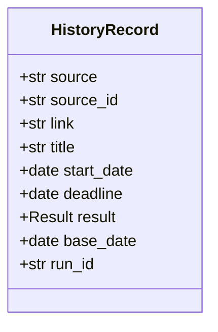

`domains/record/models.py`. 한 줄이 공고(묶음의 구성원) 하나다. 반드시 있는 것은 `source` · `source_id` · `result` · `run_id`이고, 하나라도 없으면 `from_dict`가 `ValueError`를 낸다. 읽는 쪽(`RecordCrud.read_history`)은 이것을 처리 이력 읽기 실패로 올린다.

선별이 적을 값을 정해 `HistoryEntry`(2.4)로 넘기면 `HistoryRecord.of`가 기준일과 실행 식별자를 붙인다. 기록 경계는 묶음을 모른다([[CCR-DOM-001]] 4.2 규칙 5).

관계
- `HistoryRecord` * — 1 `RunLine` (`run_id`로. 적은 실행)

#### RunLine 실행 요약 줄

테이블: [[CCR-DOM-003#runs]] · 도메인: [[CCR-DOM-001#Run]]

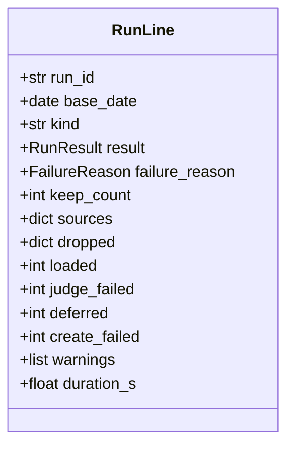

`domains/record/models.py`. 실행 한 번에 한 줄이다. `sources`는 소스 이름을 키로 한 `SourceLine`이고, `dropped`는 `normalize` · `expired` · `known` · `discarded` 넷의 건수, `warnings`는 `RunWarning`의 목록이다.

`keep_count`는 배치가 비워 둔다(`None`). 마무리 단계가 추가분을 얹은 뒤 센 남김 기록의 수를 채운다([[CCR-INFRA-001]] 8.2). 배치가 미리 세면 올리다 빠진 줄만큼 커져, 다음 실행이 멀쩡한 처리 이력을 줄었다고 본다.

`fail(reason)`이 결과를 실패로 바꾸고 사유를 적는다. 결과 중단의 줄은 이 클래스가 만들지 않는다. 마무리 단계가 따로 만든다(4.10).

관계
- `RunLine` 1 — * `SourceLine` (`sources`에 품는다)
- `RunLine` 1 — * `RunWarning` (`warnings`에 품는다)

#### SourceLine 소스별 건수

테이블: [[CCR-DOM-003#run_sources]] · 도메인: [[CCR-DOM-001#SourceResult]]

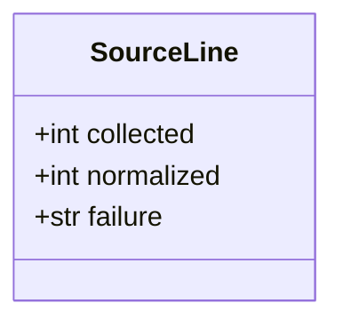

`SourceResult`(2.4)에서 대회 목록과 원문 사유를 뺀 것이다. `failure`는 실패의 종류(`FailureKind` 값)이고 성공이면 비어 있다. 원문 사유는 로그에만 간다(공개 저장소).

#### RunWarning 경고

테이블: [[CCR-DOM-003#run_warnings]] · 도메인: [[CCR-DOM-001#Warning]]

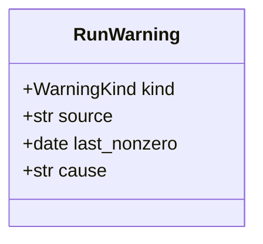

`source` · `last_nonzero`는 소스 0건일 때만, `cause`는 판별 미룸일 때만(`missing_key` · `call_failed`) 채운다. `to_dict`는 빈 속성을 쓰지 않는다.

### 2.2 노션

#### NotionRow 노션 행

테이블: [[CCR-DOM-003#notion_rows]] · 도메인: [[CCR-DOM-001#NotionRow]]

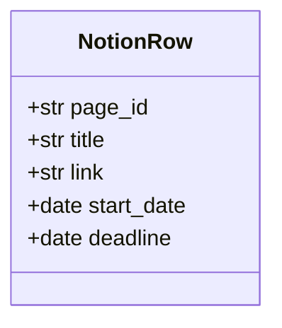

`domains/notion/models.py`. 배치가 읽는 네 컬럼(`기타` · `링크` · `시작일` · `마감일`)과 노션이 주는 행 id다. 판정은 이 넷만 쓴다. 쓸 때의 일곱 컬럼은 `properties_of`(4.5)가 대표 대회에서 만든다. 컬럼 이름은 같은 모듈의 상수(`TITLE` · `LINK` · … · `STATUS_NEW = "시작 전"`)에 한 번만 적는다.

행 id는 담아 두기만 하고 판정에도 로그에도 쓰지 않는다([[CCR-DOM-001#NotionRow]]).

### 2.3 열거형

| 이름 | 값 | 쓰는 곳 |
|---|---|---|
| `SourceName` | `event-us` · `DACON` · `Kaggle` · `wevity` · `AI팩토리` · `콘테스트코리아` | 수집. 노션 `출처` 값과 실행 요약의 소스 키가 이 값이다 |
| `FailureKind` | `connection` · `http_status` · `format` · `robots` · `missing_config` | `SourceResult` · `SourceLine.failure` |
| `Result` | `keep` · `discard` | `HistoryRecord` · `HistoryEntry` |
| `RunResult` | `success` · `failure` · `aborted` | `RunLine`. `aborted`는 마무리 단계만 쓴다 |
| `FailureReason` | `missing_config` · `all_sources_failed` · `notion_read_failed` · `history_read_failed` · `history_shrank` · `due_today_not_loaded` | `RunLine.failure_reason` |
| `WarningKind` | `zero_count` · `judge_deferred` · `create_all_failed` · `due_today_not_loaded` · `summary_corrupt` | `RunWarning` |
| `Verdict` | `same` · `different` · `undecided` | `PairResult`. `undecided`는 5단계 문턱에 못 미친 것이다. 다르다는 뜻이 아니다 |
| `KnownKind` | `notion` · `history` | `Known` |
| `Outcome` | `known` · `discarded` · `loaded` · `create_failed` · `deferred` | `Bundle`의 처리 결과([[CCR-DOM-001#Bundle]]) |

`SOURCE_PRIORITY`(DACON 1 · Kaggle 2 · AI팩토리 3 · event-us 4 · wevity 5 · 콘테스트코리아 6)는 `domains/collect/models.py`의 상수다([[CCR-UC-001#UC-S4]] 4a2).

### 2.4 값 타입

경계 사이와 경계 안에서 주고받는 값이다. 저장하지 않는다. [[CCR-MS-001]]은 타입을 여기서만 찾는다.

| 타입 | 필드 | 파일 · 쓰는 곳 |
|---|---|---|
| `Competition` | `source: SourceName` · `source_id: str` · `title: str` · `link: str` · `start_date: date?` · `deadline: date?` · `extras: tuple[str]` · `practice: bool` | collect/models. 어댑터가 만들고 선별 · 노션 · 기록이 읽는다. 도메인 [[CCR-DOM-001#Competition]]. `dates_filled()`는 채워진 접수 날짜의 수 |
| `Collected` | `competitions` · `collected: int` · `dropped: int` · `page_cap_hit: bool` · `notes: list[str]` | collect/models. 어댑터 → `CollectService`. `notes`는 로그에만 |
| `SourceResult` | `source` · `competitions` · `collected` · `dropped` · `failure: FailureKind?` · `detail: str?` · `page_cap_hit` | collect/models. `CollectService` → `Pipeline`. 도메인 [[CCR-DOM-001#SourceResult]]. `normalized`는 대회 수 |
| `Task` · `WevityItem` · `CkItem` | 소스의 원본 레코드를 읽은 것 | 어댑터 안에서만 |
| `HistoryEntry` | `HistoryRecord`에서 `base_date` · `run_id`를 뺀 것 | record/models. 선별 · `Pipeline` → `RecordService.append` |
| `MatchKey` | `source?` · `source_id?` · `link?` · `from_notion` · `title_norm` · `years` · `rounds` · `start?` · `deadline?` · `chars` | screen/models. 판정에 쓰는 값. 대회 · 노션 행 · 처리 이력 기록에서 같은 방법으로 뽑는다 |
| `PairResult` | `verdict: Verdict` · `step: int?` · `similarity: float` · `certain: bool` | screen/models. `judge_pair`의 결과. `certain`은 1단계였거나 연도 · 회차 · 접수 날짜를 실제로 맞대 보고 같았다는 뜻이다 |
| `Known` | `kind: KnownKind` · `key: MatchKey` · `result: str` · `label: str` | screen/models. 아는 대회 하나. 노션 행이면 결과는 `keep` |
| `KnownSet` | `items` · `by_id` · `by_link` · `by_title` · `history_ids` | screen/service. 아는 대회와 찾기용 색인 |
| `Bundle` | `members` · `representative` · `judge_failed` · `outcome: Outcome?` · `matched` · `reason` · `keys` | screen/models. 도메인 [[CCR-DOM-001#Bundle]]. `deadline`은 구성원 가운데 가장 늦은 접수마감일(5장 결정 1) |
| `JudgeOutcome` | `to_load: list[Bundle]` · `discarded` · `judge_failed` · `deferred` · `cause: str?` | screen/service. 판별 → `Pipeline` |
| `Answer` | `keep: bool` · `reason: str` | screen/ports. 판별 모델의 답 |
| `Relevance` | `decision: keep\|discard` · `reason: str` | openai_judge. 판별 스키마([[CCR-API-001]] 4.3)를 pydantic 모델로 옮긴 것 |
| `SchemaCheck` | `ok: bool` · `created: list[str]` · `problem: str?` | notion/models. 컬럼 확인 결과 |
| `CreateOutcome` | `created: bool` · `page_id: str?` · `via_committed: bool` · `error: str?` | notion/models. 행 하나를 만든 결과 |
| `WriteResponse` | `data: dict` · `committed_id: str?` | infra/notion. 노션 쓰기의 응답 |
| `State` | `history` · `history_exists` · `history_error: str?` · `runs: RunsFile` | record/service. 시작할 때 읽은 두 파일. `keep_count` · `last_keep_count()` |
| `RunsFile` | `lines: list[dict]` · `corrupt: int` | record/crud. 읽힌 실행 요약 줄과 읽히지 않은 줄의 수 |
| `Settings` | `source: SourceSettings` · `notion: NotionSettings` · `judge: JudgeSettings` · `zero_count_days` | core/settings. `settings.toml`과 저장소 변수 `OPENAI_MODEL` |
| `Secrets` | `notion_token?` · `notion_data_source_id?` · `openai_api_key?` · `kaggle_api_token?` | core/settings. 빈 문자열은 빠진 것으로 본다 |
| `RunContext` | `run_id` · `started_at` · `base_date` · `kind` · `write` · `ignore_discards` · `ignore_discards_requested` · `in_actions` · `state_dir` · `state_from_main` · `append_dir` | core/settings. 실행 문맥 |
| `Services` | `collect` · `notion?` · `record` · `screen` | run/pipeline. `Pipeline`이 받는 서비스 묶음. 테스트는 가짜를 넣는다 |

예외와 그것이 바뀌는 곳은 이렇다.

| 예외 | 나는 곳 | 바뀌는 곳 |
|---|---|---|
| `FormatError` · `HttpFailure(category)` · `RobotsDisallowed` | 소스 요청 · 어댑터 | `CollectService`가 `SourceResult`의 실패 종류로 |
| `NotionFailure(maybe_written)` | 노션 요청 | 행 읽기면 `NotionReadFailed`로 올려 `Pipeline`이 실패(노션 읽기 실패)로, 컬럼 확인이면 `SchemaCheck`로, 행 만들기면 `CreateOutcome`으로 |
| `NotionReadFailed` | `NotionService.read_rows` | `Pipeline` |
| `JudgeError(fatal)` | 판별 어댑터 | `ScreenService`가 그 묶음의 판별 실패로 |
| `HistoryReadFailed` | `RecordCrud` | `RecordService.load`가 `State.history_error`로 |
| `RunModeError` | `RunContext.from_env` | 입구가 종료 코드 2로 |
| `Stopped` | 멈춤 표시를 보는 모든 곳 | 입구가 종료 코드 130으로. 줄을 쓰지 않는다 |
| `GitError` | `finish.py`의 git 명령 | `finish`가 처음부터 다시 |

여기 없는 예외(파일을 쓰지 못함 등)는 입구까지 올라가 스택을 로그에 남기고 종료 코드 1로 끝난다. 줄을 쓰지 않으므로 마무리 단계가 중단 줄을 쓴다([[CCR-UC-001#UC-A1]] \*a).

## 3. 의존 관계

누가 누구를 부르는지다. 여기 없는 방향은 부르지 않는다.

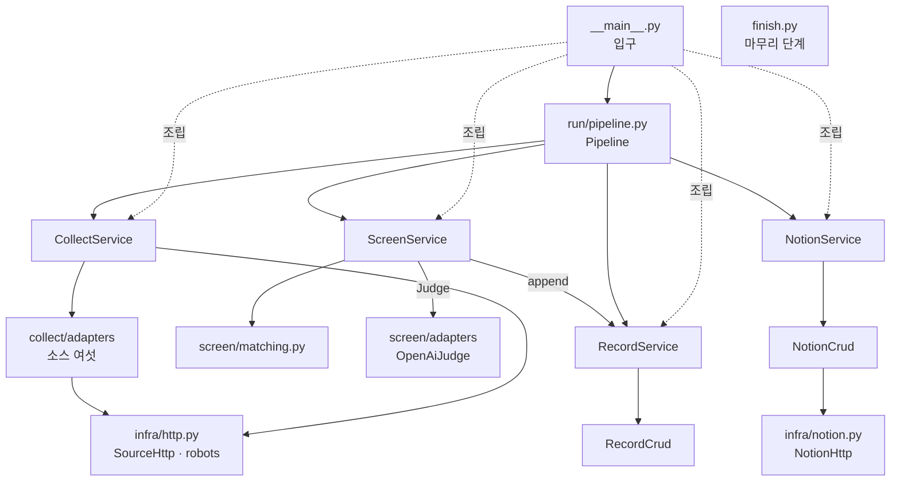

- **`Pipeline`만 네 서비스를 모두 부른다.** 노션 행 하나를 만들 때마다 `RecordService.append`에 남김을 적게 하는 것도 `Pipeline`이다([[CCR-DOM-001]] 4.2).
- **`ScreenService`는 `RecordService.append`를 부른다.** 버림과 아는 대회의 구성원을 곧바로 적어야 하기 때문이다([[CCR-UC-001#UC-S5]] 5 · [[CCR-UC-001#UC-S4]] 6). 선별 → 기록은 도메인 모델이 허락한 방향이다.
- **`NotionService` · `RecordService`는 서로 부르지 않고 선별도 부르지 않는다.** 노션과 기록이 가리키는 것은 수집의 값(`Competition` · `SourceResult`)뿐이다.
- **소스 어댑터는 `SourceHttp`로만 요청한다.** robots.txt 확인 · 요청 간격 · 시간 예산이 거기 있다.
- **`finish.py`는 아무것도 부르지 않는다.** 두 파일의 줄 형식을 스스로 안다([[CCR-DOM-001]] 4.2 · [[CCR-INFRA-001]] 8.2).
- `core/` · `shared/`는 어디서나 부른다. 거꾸로 부르지 않는다.

## 4. 설계 클래스

3장이 지도라면 여기는 각 노드를 확대한 것이다. 서비스마다 메서드 시그니처와 그 서비스가 만지는 엔티티를 한 그림에 둔다. 엔티티의 속성은 2장과 같게 다시 그린다. 어긋나면 2장이 진실이다. 그림에서 `-`로 시작하는 메서드는 클래스 안에서만 쓰는 것이고, 코드에서는 이름 앞에 밑줄이 붙는다(`-matches` → `_matches`). 표의 유스케이스는 그 메서드가 구현하는 단계다.

### 4.1 수집

#### CollectService 수집 서비스

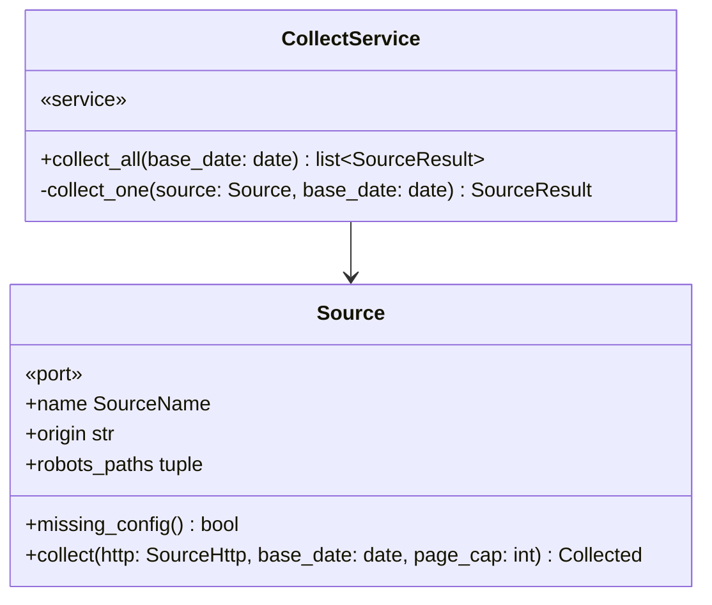

| 메서드 | 부르는 곳 | 유스케이스 | 실패 |
|---|---|---|---|
| `collect_all` | `Pipeline._run` · `__main__.run_collect` | [[CCR-UC-001#UC-S1]] · [[CCR-UC-001#UC-S2]] | 신호면 `Stopped` |
| `_collect_one` | `collect_all`(스레드마다) | [[CCR-UC-001#UC-S1]] 1a · 2a · \*a | 밖으로 내지 않는다. `SourceResult.failed` |

**규칙이 사는 곳**
- 여섯 소스를 동시에 돌린다(스레드 여섯). 소스마다 시간 예산 120초의 기한으로 `SourceHttp`를 새로 만든다. 소스끼리는 서버가 달라 동시에 돌려도 요청 간격 규칙에 걸리지 않는다([[CCR-INFRA-001]] 8.5).
- `missing_config()`가 참이면 요청하지 않고 `missing_config`로 끝낸다. 토큰이 없는 Kaggle이 여기 든다([[CCR-UC-001#UC-S1]] 1a).
- 소스마다 robots.txt를 먼저 본다. 실패를 종류로 바꾸는 표는 [[CCR-API-001]] 2.1이다. 시간 예산을 넘긴 것은 `connection`이다. 파서의 예상하지 못한 예외도 `format`으로 가둔다([[CCR-INFRA-001#C7]]).
- 소스 결과의 순서는 소스 목록의 순서다. 실행 요약의 소스 키 차례가 날마다 같다.

#### Source 소스 어댑터

`domains/collect/ports.py`의 인터페이스와 `adapters/`의 구현 여섯이다. 인터페이스는 같고 가져오는 법이 다르다([[CCR-UC-001#UC-S1]] 일반화).

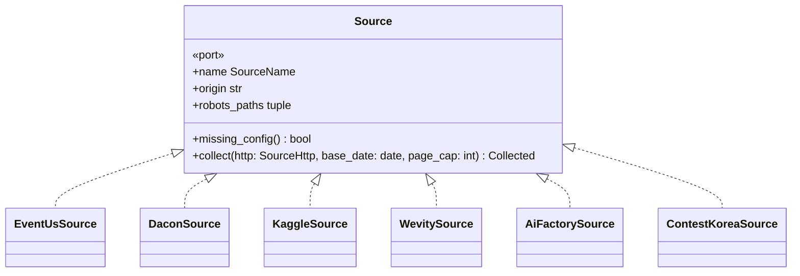

| 구현 | 모듈의 함수 | 엔드포인트 | 멈추는 때 |
|---|---|---|---|
| `EventUsSource` | `build_query` · `parse_page` · `normalize` | [[CCR-API-001#POST/api.event-us.kr/api/v1/engine/search]] | `total_pages`까지 |
| `DaconSource` | `parse_page` · `link_for` · `normalize` | [[CCR-API-001#GET/app.dacon.io/api/v1/competition/list]] | 빈 쪽이나 접수 중인 대회가 없는 쪽 |
| `KaggleSource` | `parse_page` · `is_practice` · `normalize` | [[CCR-API-001#POST/api.kaggle.com/v1/…/ListCompetitions]] | 토큰 없음 · 다음 쪽 없음 · 모두 마감된 쪽 |
| `WevitySource` | `parse_list` · `parse_detail_end` · `deadline_of` · `-calibrate` | [[CCR-API-001#GET/www.wevity.com/?c=find]] · [[CCR-API-001#GET/www.wevity.com/?c=find&gbn=view]] | 분야마다 `마감` 공고가 나온 쪽이나 빈 쪽 |
| `AiFactorySource` | `extract_payload` · `parse_tasks` · `group_tasks` · `competition_name` · `to_competition` | [[CCR-API-001#GET/aifactory.space/ko/competition]] | 한 쪽 |
| `ContestKoreaSource` | `parse_list` · `resolve_dates` | [[CCR-API-001#GET/www.contestkorea.com/sub/list.php]] | 분야마다 12건보다 적은 쪽 |

**규칙이 사는 곳**
- 어댑터는 읽은 것을 곧바로 `Competition`으로 맞춘다([[CCR-UC-001#UC-S2]]). 대회명이나 원천 ID · 링크를 채우지 못한 레코드는 `dropped`로 센다. 수집 건수는 원본 레코드의 수다. AI팩토리는 합치기 전 과제의 수이고, 여러 분야에 같은 공고가 올라오는 wevity · 콘테스트코리아는 원천 ID로 합친 뒤의 수다([[CCR-DOM-001#Run]] · [[CCR-API-001]] 1.2).
- 대회명은 앞뒤의 공백과 보이지 않는 서식 문자만 뗀다(`clean_text`, [[CCR-UC-001#UC-S2]] 4). event-us와 콘테스트코리아가 대회명 앞에 BOM을 붙여 주는 일이 있다(2026-09-27 실측). HTML 소스(wevity · 콘테스트코리아)는 브라우저가 보여 주는 대로 이어진 공백을 하나로 모은다(`html_text`).
- 쪽 상한 20은 소스 안에서 합산한다. wevity와 콘테스트코리아는 분야를 넘나들며 한 상한을 쓴다. 상한에 닿으면 `page_cap_hit`을 켜고 로그에 남긴다.
- 목록 요청은 리디렉션을 따라가지 않는다. 따라가는 것은 robots.txt(RFC 9309)와 wevity 날수 맞춰 보기의 상세 요청(같은 사이트의 `gbn=viewok`로 가는 302, 2026-09-27 실측, 6장) 둘이다.
- 시간대 표기가 없는 값은 KST로 본다. 날짜 변환은 `shared/dates.py` 한 곳이다.

### 4.2 선별

#### ScreenService 선별 서비스

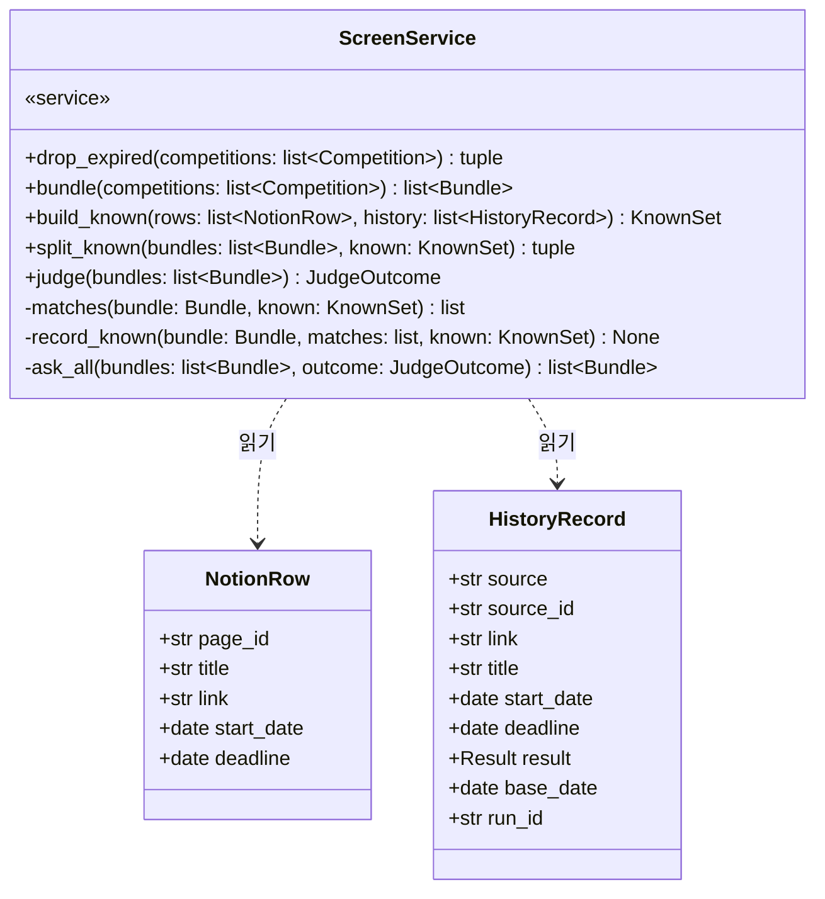

| 메서드 | 부르는 곳 | 유스케이스 | 실패 |
|---|---|---|---|
| `drop_expired` | `Pipeline._run` | [[CCR-UC-001#UC-S3]] | |
| `bundle` | `Pipeline._run` | [[CCR-UC-001#UC-S4]] 4 · 4a · 4b | |
| `build_known` | `Pipeline._run` | [[CCR-UC-001#UC-S4]] 3 · [[CCR-UC-001#UC-A1]] 1b6 | |
| `split_known` | `Pipeline._run` | [[CCR-UC-001#UC-S4]] 5 · 6 · 7 | |
| `judge` | `Pipeline._run` | [[CCR-UC-001#UC-S5]] | 신호면 `Stopped` |

**규칙이 사는 곳**
- **마감 판정.** 접수마감일이 기준일보다 이른 대회와 Kaggle 상시 연습용 대회를 버린다. 오늘 마감과 마감일이 빈 대회는 남긴다. 버린 수가 `dropped.expired`다.
- **묶기.** `matching.group`이 같다는 짝을 강한 것부터 합치고, 합친 묶음에 2 · 3단계로 다른 짝이 생기면 합치지 않는다. 대표는 접수 날짜가 더 채워진 쪽, 같으면 소스 우선순위 · 원천 ID 순이다.
- **아는 대회.** 노션 행과 처리 이력 기록을 합친다. 버림을 없는 것으로 보는 실행이면 버림 기록을 넣지 않되, 자기 기록이 있는지(`history_ids`)는 모든 기록으로 본다. 묶음은 구성원 가운데 하나라도 1단계로 같거나, 아는 대회를 넣어도 묶는 규칙이 지켜지면 아는 대회다.
- **아는 대회로 빠진 묶음의 기록.** 확실하게 같은 짝이 있을 때만 자기 기록이 없는 구성원을 적는다. 결과는 견준 쪽을 따르되, 확실하게 같은 것 가운데 남김(노션 행 · 남김 기록)이 하나라도 있으면 남김이다(5장 결정 2). 날짜 없는 구성원은 대표의 날짜로 채운다(`entries_for`).
- **판별.** 묶음마다 대표 하나를 묻는다. 동시에 넷(설정값)이고, 결과는 받는 차례대로 한 흐름이 처리한다. 버림은 받는 대로 적는다. 다시 물어도 같은 답이 올 오류(`JudgeError.fatal`)가 나면 아직 묻지 않은 묶음은 묻지 않고 판별 실패로 둔다. OpenAI 키가 없으면 판별기가 없고(`judge=None`) 모든 묶음이 판별 실패다.
- **미루기.** 판별 실패가 대상의 절반을 넘으면 실패한 묶음 가운데 접수마감일이 기준일이 아닌 것을 미룬다. 미룬 묶음은 넣지도 적지도 않는다. 원인은 키가 없으면 `missing_key`, 그 밖은 `call_failed`다.
- 넣을 묶음과 판별할 묶음은 접수마감일이 이른 차례로 둔다. 시간 한도로 끊겨도 오늘 마감인 대회가 먼저 들어가게 하기 위해서다.
- 판정 규칙 자체는 `matching.py`에 있다(4.3).

### 4.3 matching — 같은 대회 판정

`domains/screen/matching.py`. 클래스가 아니라 순수 함수 열이다. 대회 · 노션 행 · 처리 이력 기록을 같은 `MatchKey`로 바꿔 견준다([[CCR-DOM-001]] 4.2 규칙 6).

```
normalize_title(title) -> str               4 · 5단계가 견주는 대회명
extract_marks(title) -> (years, rounds)     2단계의 연도 · 회차
normalize_link(link) -> str | None          추적용 매개변수(utm_* · fbclid)만 뗀 링크
key_of_competition(c) -> MatchKey
key_of_notion(row) -> MatchKey              링크를 싣는다. 원천 ID는 없다
key_of_history(record) -> MatchKey          링크를 싣지 않는다. 링크는 노션 행과 견줄 때만 쓴다
similarity(a, b) -> float                   0.80에 닿을 수 없으면 계산하지 않고 0
judge_pair(a, b) -> PairResult              다섯 단계
representative_order(c) -> tuple            대표를 고르는 차례
group(competitions, keys) -> list[list[int]]  후보끼리 묶기
```

**규칙이 사는 곳** — 판정표([[CCR-UC-001#UC-S4]] · [[CCR-PRD-001]] 5.2)를 그대로 옮긴다. 상수 `SIMILARITY = 0.80` · `DEADLINE_GAP_DAYS = 180`. 정규화의 세부(꼬리말 목록 · 날짜 괄호로 보는 것 · 회차 표기)는 [[CCR-MS-001#matching.normalize_title]] · [[CCR-MS-001#matching.extract_marks]]가 정한다. 유사도 계산 전의 거르기(길이 · 글자 집합의 상한)는 결과를 바꾸지 않는다. 0.80에 닿을 수 없는 짝만 건너뛴다.

### 4.4 판별

#### OpenAiJudge 판별 어댑터

`domains/screen/ports.py`의 `Judge`를 OpenAI Responses API로 구현한다([[CCR-API-001#POST/api.openai.com/v1/responses]]).

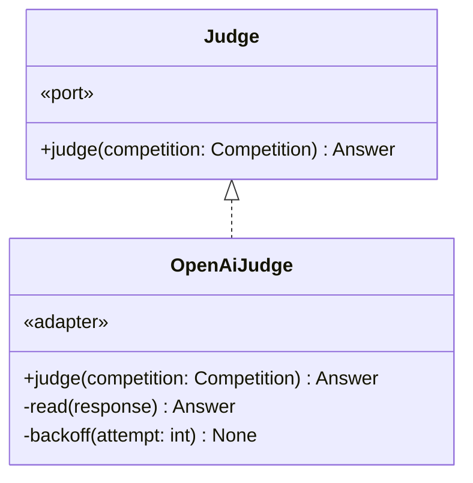

| 메서드 | 부르는 곳 | 유스케이스 | 실패 |
|---|---|---|---|
| `judge` | `ScreenService._ask_all`(판별 스레드) | [[CCR-UC-001#UC-S5]] 1 · 2 · 3 · 2a | `JudgeError(fatal)` · 신호면 `Stopped` |

**규칙이 사는 곳**
- SDK의 자동 재시도는 끈다(`max_retries=0`). `reasoning.effort = none` · `max_output_tokens = 300` · `store = false` · 타임아웃 30초([[CCR-API-001]] 1.3).
- 오류의 가름은 [[CCR-API-001]] 2.2의 표다. 401 · 403 · 404와 지출 한도 · 크레딧 429는 `fatal`, 408 · 409 · 그 밖의 429 · 5xx · 연결 오류는 두 번까지 다시 묻고, 400 등 그 밖의 4xx와 `status`가 `completed`가 아님 · 거절 · 스키마 불일치는 그 묶음만 실패다.
- 판별 기준의 문구(`CRITERIA`)는 규칙이라 이 모듈의 상수다. 바꾸는 절차는 [[CCR-UC-001#UC-A4]]다. 입력은 대회명 · 출처 · 부가 정보이고, 부가 정보는 800자에서 자른다.

### 4.5 노션

#### NotionService 노션 서비스

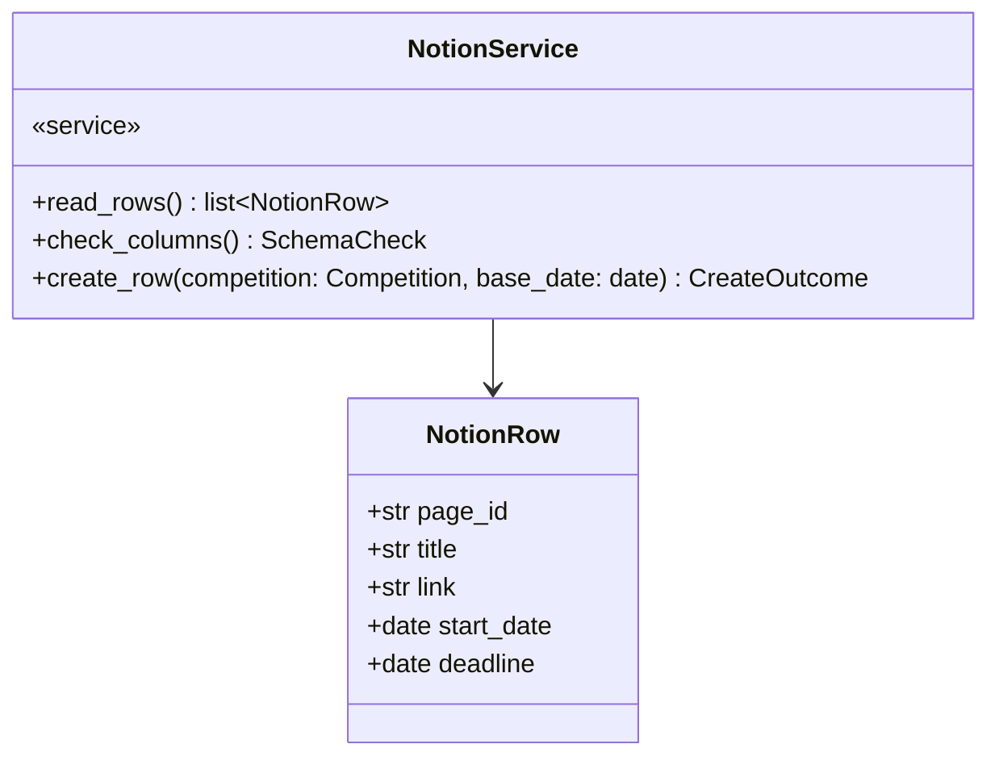

| 메서드 | 부르는 곳 | 유스케이스 | 실패 |
|---|---|---|---|
| `read_rows` | `Pipeline._run` | [[CCR-UC-001#UC-S4]] 1 · 1a | `NotionReadFailed` |
| `check_columns` | `Pipeline._load`(넣을 묶음이 있을 때 한 번) | [[CCR-UC-001#UC-S6]] 1 · 1a · 1b | 내지 않는다. `SchemaCheck.ok=False` |
| `create_row` | `Pipeline._load`(묶음마다) | [[CCR-UC-001#UC-S6]] 2 · 3 · 2a · 2c · 2d | 내지 않는다. `CreateOutcome.created=False` |

**규칙이 사는 곳**
- 행 읽기가 끝내 실패하거나 `request_status`가 `incomplete`면 노션 읽기 실패다([[CCR-API-001]] 1.4).
- 컬럼 확인. 일곱 컬럼의 종류와 `상태`의 `시작 전` 선택지를 본다. `출처` · `수집일`만 없으면 노션에 쓰는 실행에서 없는 것만 만든다. 그 밖의 문제나 스키마를 읽지 못함 · 컬럼을 만들지 못함은 `ok=False`이고, `Pipeline`이 넣으려던 묶음을 모두 행 생성 실패로 센다.
- 행 값은 [[CCR-API-001]] 4.2다(`properties_of`). 대회명은 2,000자에서 자른다. `결과날`은 보내지 않는다.
- 503이 새 행의 id를 알려 주면 만들어진 것으로 본다(`via_committed`). 응답 없이 끊긴 쓰기는 확인하지도 다시 보내지도 않고 실패로 센다.
- 노션에 쓰지 않는 실행이면 `write=False`로 만든다. 컬럼을 확인만 하고, `create_row`는 `Pipeline`이 부르지 않는다.

#### NotionCrud 노션 호출

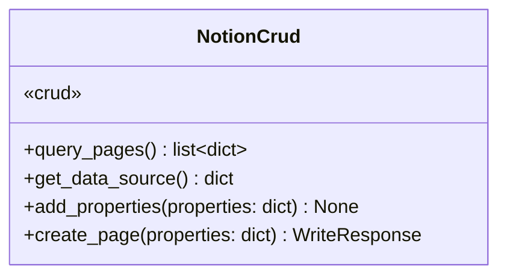

| 메서드 | 엔드포인트 | 읽기 · 쓰기 |
|---|---|---|
| `query_pages` | [[CCR-API-001#POST/api.notion.com/v1/data_sources/{id}/query]] | 읽기. 커서를 따라 끝까지 |
| `get_data_source` | [[CCR-API-001#GET/api.notion.com/v1/data_sources/{id}]] | 읽기 |
| `add_properties` | [[CCR-API-001#PATCH/api.notion.com/v1/data_sources/{id}]] | 쓰기 |
| `create_page` | [[CCR-API-001#POST/api.notion.com/v1/pages]] | 쓰기 |

**규칙이 사는 곳** — 이 네 호출만 둔다. 기존 행을 고치거나 지우는 호출은 두지 않는다([[CCR-PRD-001#R6]] · [[CCR-DOM-001]] 4.2 규칙 3). 쓰기 토큰에 수정 권한이 있어도 코드에 그 길이 없다. 재시도와 요청 한도는 `NotionHttp`(4.8)가 맡는다.

### 4.6 기록

#### RecordService 기록 서비스

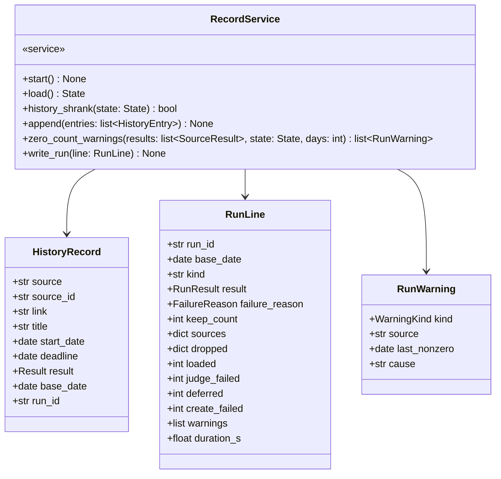

| 메서드 | 부르는 곳 | 유스케이스 | 실패 |
|---|---|---|---|
| `start` | `Pipeline.run` | [[CCR-INFRA-001]] 6.2 | |
| `load` | `Pipeline._run` | [[CCR-UC-001#UC-S4]] 2 · 2a · 2b | 내지 않는다. `State.history_error` |
| `history_shrank` | `Pipeline._run` | [[CCR-UC-001#UC-S4]] 2c | |
| `append` | `ScreenService` · `Pipeline._load` | [[CCR-UC-001#UC-S4]] 6 · [[CCR-UC-001#UC-S5]] 5 · [[CCR-UC-001#UC-S6]] 4 | |
| `zero_count_warnings` | `Pipeline._finish` | [[CCR-UC-001#UC-S7]] 2 · 2a · 2b | |
| `write_run` | `Pipeline._finish` | [[CCR-UC-001#UC-S7]] 8 · 8a | |

**규칙이 사는 곳**
- 읽기와 덧붙이기만 한다. 두 파일의 줄을 고치거나 지우는 길이 없다([[CCR-DOM-001]] 4.2 규칙 4).
- 노션에 쓰지 않는 실행이면 `start` · `append` · `write_run`이 아무것도 하지 않는다.
- 처리 이력이 한 줄이라도 읽히지 않으면 빈 이력으로 보지 않는다. 실행 요약의 읽히지 않는 줄은 건너뛰고 센다.
- 남김 기록의 수 견주기. 실행 요약에 마지막으로 적힌 `keep_count`보다 지금 남김 기록이 적으면 참이다. 적힌 줄이 없으면 견주지 않는다. 처리 이력 파일이 없으면 0으로 본다.
- 소스 0건 경고. 기준일마다 모으고(같은 날 하나라도 1건 이상이면 건수를 낸 날), 그 소스를 수집하지 않았거나 실패한 줄은 건너뛴다. 오늘 앞으로 이어진 0건인 날들 바로 앞에서 연속 N일(설정값 3) 건수를 냈으면 경고하고, 그 마지막 날을 적는다.
- `append`는 받은 대로 기준일 · 실행 식별자를 붙여 추가분 파일 전체를 다시 쓴다(`RecordCrud`).

#### RecordCrud 상태 파일

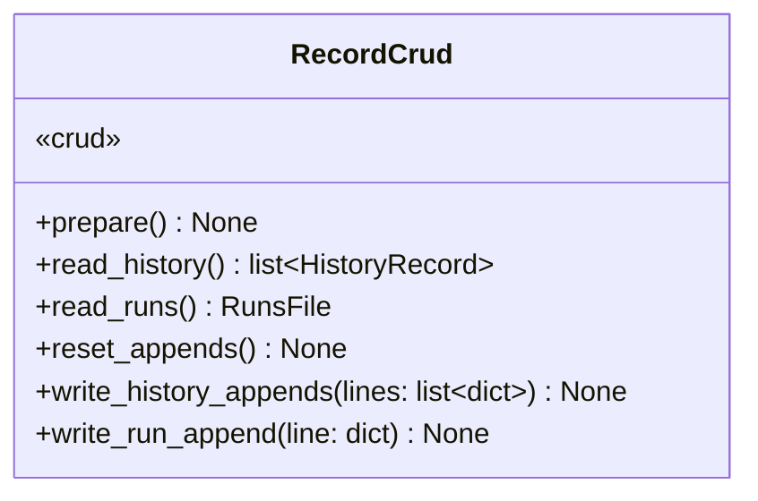

| 메서드 | 읽고 쓰는 곳 |
|---|---|
| `prepare` | 기본 브랜치가 아닌 실행이면 `export_main_state`로 origin/main 최신 판의 두 파일을 상태 폴더에 꺼낸다 |
| `read_history` · `read_runs` | 상태 폴더의 `processed.jsonl` · `runs.jsonl` |
| `reset_appends` · `write_history_appends` · `write_run_append` | 추가분 폴더(`$RUNNER_TEMP/append`)의 같은 이름 두 파일 |

**규칙이 사는 곳**
- 작업 트리의 두 파일을 직접 고치지 않는다. 추가분은 작업 트리 밖에 쌓는다([[CCR-INFRA-001]] 6.2).
- 쓸 때마다 새 이름의 임시 파일에 쓰고 `os.replace`로 통째로 바꾼다. 도중에 끊겨도 반쯤 쓴 파일이 남지 않는다.
- 추가분 폴더가 상태 폴더와 같으면 만들 때 거부한다. 상태 파일을 비우는 사고를 막는다.
- 상태 폴더는 실행 문맥이 정한다. 기본 브랜치에서 도는 Actions 실행은 시작할 때 받은 `data/`, 그 밖(다른 브랜치 · 개발자 PC)은 origin/main에서 꺼낸 사본이다. 받지 못하면 처리 이력 읽기 실패다([[CCR-UC-001#UC-A1]] 1b7 · [[CCR-INFRA-001]] 4.1).

### 4.7 실행의 흐름

#### Pipeline 실행의 흐름

`run/pipeline.py`. [[CCR-UC-001#UC-A1]]의 기본 흐름과 실패 확장을 차례로 부른다.

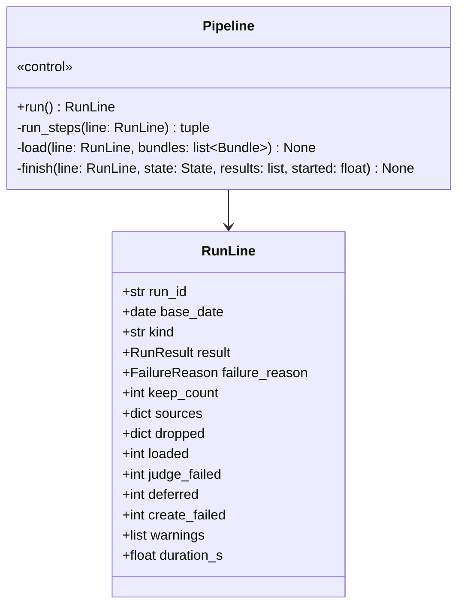

그림의 `run_steps`는 코드의 `_run`이다. mermaid가 밑줄로 시작하는 이름을 굵게 그려 이름을 바꿔 적었다.

| 메서드 | 부르는 곳 | 유스케이스 | 실패 |
|---|---|---|---|
| `run` | `__main__.run_batch` | [[CCR-UC-001#UC-A1]] 1 ~ 8 | 신호면 `Stopped`. 줄을 쓰지 않는다 |
| `_run` | `run` | [[CCR-UC-001#UC-A1]] 1d1 · 2 ~ 7 · 2b · 5a | |
| `_load` | `_run` | [[CCR-UC-001#UC-A1]] 7 · 7a · [[CCR-UC-001#UC-S6]] | |
| `_finish` | `run` | [[CCR-UC-001#UC-A1]] 8 · [[CCR-UC-001#UC-S7]] | |

**규칙이 사는 곳**
- 실패 사유는 하나다. 노션 설정 누락이면 수집하지 않고, 전 소스 실패 · 노션 읽기 실패 · 처리 이력 읽기 실패 · 처리 이력 감소면 판별 전에 8로 건너뛴다. 그래도 `_finish`는 돌아 줄을 남긴다.
- 노션을 먼저 읽고 처리 이력의 문제를 본다([[CCR-UC-001#UC-S4]] 1 · 2의 차례).
- 행을 만들 때마다 곧바로 그 묶음의 대표와 구성원을 남김으로 적는다. 오늘 마감인 묶음의 행을 만들지 못하면 오늘 마감 미적재 경고와 함께 결과를 실패로 올린다. 넣으려던 묶음이 한 건 이상이고 모두 실패면 행 생성 전면 실패 경고다.
- 단계 사이마다 신호 표시를 본다. 신호를 받았으면 `Stopped`를 낸다.
- 노션에 쓰지 않는 실행은 넣었을 대회를 로그에만 남긴다([[CCR-UC-001#UC-A1]] 1b3).

**입구(`__main__.py`)** — `main`이 비밀값을 Actions에 가릴 값으로 먼저 알리고(`::add-mask::`), 로그를 설정하고, 신호 처리기를 건 뒤 `run_batch` 또는 `run_collect`를 부른다. `run_batch`는 서비스를 조립해 `Pipeline`을 돌리고 결과가 성공이면 0, 아니면 1로 끝난다. 쓰기 여부 값이 깨졌으면 2, 신호로 멈추면 130이다. 첫 신호는 새 요청을 멈추게 하고, 두 번째 신호는 막혀 있는 호출도 끊는다([[CCR-INFRA-001]] 8.1). 로컬 실행만 저장소 루트의 `.env`를 읽는다.

### 4.8 infra — 바깥 요청 도구

클래스 둘과 함수 하나다. 서비스가 아니라 요청 규칙을 감싸는 얇은 층이다.

```
SourceHttp(settings, deadline, stop, client?, sleep?, clock?)
    .fetch(method, url, parse, params?, json?, headers?, follow_redirects=False, accept_client_errors=False) -> T
    .remaining() -> float
    .requests: int
parse_retry_after(value, now?) -> float | None
ensure_allowed(http, origin, paths) -> None           robots.txt. 막히면 RobotsDisallowed

NotionHttp(settings, token, stop, client?, sleep?, clock?)
    .read(method, path, json?) -> dict               연결 오류 · 429 · 529 · 5xx에 다시 보낸다
    .write(method, path, json) -> WriteResponse      429 · 529와 닿지 않은 연결 오류에만 다시 보낸다
```

**규칙** — `SourceHttp`는 소스 하나 · 실행 하나에 하나다. 요청 사이 1초, 시간 예산의 기한, 재시도 두 번(2초 · 4초), `Retry-After` 상한 30초와 남은 예산([[CCR-INFRA-001]] 8.5 · [[CCR-API-001]] 2.1). 본문은 흘려 받으며 조각마다 기한과 멈춤 표시를 본다. httpx의 타임아웃은 단계마다 걸려 요청 전체를 묶지 못하기 때문이다. 3xx는 따라가지 않고 실패다(`follow_redirects`를 켠 호출만 예외). `NotionHttp`는 읽기와 쓰기를 합쳐 초당 3회를 넘지 않게 보내고, `Retry-After`가 60초보다 길면 기다리지 않는다([[CCR-API-001]] 2.3). 둘 다 요청 헤더를 로그에 찍지 않는다. 시계와 잠은 넣어 줄 수 있어 테스트가 실제로 기다리지 않는다.

### 4.9 core · shared

```
Settings.load(env, path?) -> Settings                settings.toml + OPENAI_MODEL
Secrets.from_env(env) -> Secrets
RunContext.from_env(env, now?) -> RunContext         쓰기 여부 · 기준일 · 실행 식별자 · 상태 폴더 · 추가분 폴더
read_dotenv(path) -> dict                            로컬 실행용 .env
secret_variants(values) -> list[str]                 노션 ID는 하이픈 있는 꼴과 없는 꼴 둘 다
register_actions_masks(values, emit?) -> None        ::add-mask::
SecretFilter(values)                                 로그 메시지와 예외 원문을 가린다
setup_logging(secrets) -> None
kst_date_of(moment) -> date · parse_to_kst_date(text) -> date | None · kst_midnight_utc(day) -> datetime
clean_text(value) -> str · html_text(value) -> str
```

**규칙** — `RunContext.from_env`는 Actions 안에서 `DRY_RUN`이 `true`도 `false`도 아니면 `RunModeError`를 낸다. 값이 비었다고 쓰기 모드로 돌지 않는다([[CCR-INFRA-001]] 8.1). Actions 밖은 늘 쓰지 않는다. 기준일은 첫 스텝이 남긴 `RUN_STARTED_AT`을 KST로 바꾼 날짜다([[CCR-INFRA-001#C13]]).

### 4.10 마무리 단계

`batch/finish.py`. 표준 라이브러리와 git만 쓴다. 배치가 어디서 멈추든 같은 잡의 다음 스텝으로 돈다([[CCR-INFRA-001]] 8.1 · 8.2).

```
finish(env, git: Git) -> Outcome                     1~7단계. 되풀이 다섯 번
read_additions(append_dir, run_id) -> Additions      추가분 두 파일을 읽고 형식을 본다
has_run(runs_path, run_id) -> bool
count_keep(history_path) -> int
append_lines(path, lines) -> None                    줄바꿈으로 끝나지 않으면 먼저 붙인다
base_date_of(started_at) -> str
Git(workdir, remote, token)
    .fresh_main() -> None                            얕게 받기. 되풀이 때는 main 최신 판으로 맞춘다
    .commit_and_push(message) -> None                두 경로만 스테이징
main() -> int
```

**규칙** — 두 파일의 줄 형식을 [[CCR-DOM-003]]대로 스스로 안다. 이 실행의 식별자를 가진 줄이 이미 있으면 얹지 않는다. 배치가 줄을 남기지 않았으면 결과 중단의 줄(기준일 · 실행 식별자 · 실행 종류 · 결과 · 남김 기록의 수만)을 쓰고 실패로 끝낸다. 형식이 맞지 않는 추가분 줄은 붙이지 않고 실패로 끝낸다. 토큰은 받기와 push 명령에만 명령 줄 설정으로 주고 명령을 찍지 않는다. 커밋 작성자는 `github-actions[bot]`, 메시지에 기준일과 실행 식별자를 적는다.

## 5. 판단한 것

**결정 1. 묶음의 접수마감일은 구성원 가운데 가장 늦은 값이다.** 도메인 모델 6장의 미결이다. 오늘 마감인지 가를 때만 쓴다(판별을 미루는 날의 예외 · 오늘 마감 미적재). 가장 늦은 값으로 보면, 오늘 마감인 구성원이 다음 날 마감 판정에서 빠져도 나머지 구성원이 남아 대회를 잃지 않는다. 그래서 그 묶음은 미뤄도 되고, 행을 못 만들어도 그날 급하지 않다. 노션 행에는 여전히 대표의 값이 들어간다.

**결정 2. 결과가 다른 둘과 함께 확실하게 같으면 남김으로 적는다.** 도메인 모델 6장의 미결이다. 예를 들어 버림 기록과 손으로 넣은 노션 행이 같은 대회일 때다. 노션에 행이 있는 대회를 버림으로 적으면, 참가자가 그 행을 지운 뒤 버림을 비울 때 대회가 되살아난다. 남김은 버림을 비울 때도 지우지 않는다([[CCR-UC-001#UC-A4]]).

**결정 3. HTML 파서는 `selectolax`다.** 도메인 모델 6장 · [[CCR-INFRA-001]] 9장의 미결이다. 정적 HTML 두 곳(wevity · 콘테스트코리아)의 CSS 선택자만 쓰고, AI팩토리는 페이로드를 정규식과 JSON으로 읽어 파서가 필요 없다. 둘 다 짜 본 결과 선택자 문법이 같았고, selectolax가 가볍고 빠르다.

**결정 4. 노션은 포트 없이 `crud.py`와 `infra/notion.py`로 둔다.** 구현이 하나이고 바뀔 계획이 없다. 테스트는 HTTP 층에서 가짜 응답(`httpx.MockTransport`)으로 본다. 소스와 판별 모델에만 포트를 둔 것은 구현이 여섯이거나(소스), 테스트가 모델 호출 없이 선별을 돌려야 하기(판별) 때문이다.

**결정 5. 기록 경계가 상태 폴더를 스스로 꺼낸다(`prepare`).** 기본 브랜치가 아닌 실행이 origin/main 최신 판을 읽어야 하는데([[CCR-UC-001#UC-A1]] 1b7), 워크플로에 스텝을 더하면 로컬 실행에는 그 스텝이 없다. git으로 꺼내는 일을 기록 경계에 두면 Actions의 브랜치 실행과 개발자 PC가 같은 길을 탄다. 꺼내지 못하면 처리 이력 읽기 실패로 끝난다.

**결정 6. 판별 스레드의 결과는 한 흐름이 받는다.** 추가분 파일은 한 곳만 쓴다는 [[CCR-INFRA-001]] 6.2를 지키기 위해서다. 판별 스레드는 답만 돌려주고, 받는 쪽이 받은 차례대로 버림을 적는다.

## 6. 미결사항

- [ ] **같은 대회 판정이 틀박이 이름을 잇는다.** 2026-09-27 실측 후보 321건을 판정표대로 묶었더니, 여럿인 묶음 63개 가운데 적어도 네 개가 서로 다른 대회를 합쳤다. 가장 큰 것은 스무 건이다(「2026 대구 관광 혁신 아이디어 공모전」 · 「[포천도시공사] 2026년 혁신 아이디어 공모전」 · 「2026년 성남시 규제혁신 아이디어 공모전」 …). 5단계 짝 47개 가운데 절반쯤이 틀렸고, 대괄호 머리말(주최)만 다르고 나머지가 같은 이름이 많았다. 유사도 문턱 0.90과 「모든 짝이 같아야 한 묶음」을 함께 쓰면 가장 큰 묶음이 셋으로 준다. 판정 규칙은 [[CCR-PRD-001]] 5.2의 결정이라 코드는 판정표 그대로 두었다. PRD를 고칠지 정한다
- [ ] Kaggle 어댑터는 실측 전이다. 토큰이 생기면 [[CCR-API-001]] 5장대로 필드 이름 · 연습용 표기 · 쪽 크기를 실측하고 `kaggle.py`를 맞춘다. 그때까지는 토큰이 없어 설정 누락으로 건너뛴다
- [ ] wevity 날수 맞춰 보기는 매 실행 상세 한 쪽으로 보정값을 잰다. 2026-09-27 22시에 잰 값은 0이었다(저녁). 08:50 예약 실행의 로그에서 −1이 나오는지 본다([[CCR-API-001]] 5장)
- [ ] wevity 상세는 `gbn=view` → `gbn=viewok`로 302를 보낸다(2026-09-27). [[CCR-API-001]]의 상세 엔드포인트 절에 적는다
- [ ] 처리 이력이 커질 때 아는 대회 가르기의 시간. 기록 5,000줄 · 후보 600건으로 흉내 내 2.2초였다. 연 수천 줄이면 몇 해는 넉넉하다([[CCR-DOM-001]] 6장의 덜어내기 미결과 함께 본다)
