# 클래스 명세 — 대회 수집 배치

## 0. 이 문서가 다루는 것

도메인 모델([[CCR-DOM-001]])의 개념과 경계를 **코드 구조**로 옮긴다. 폴더 배치, 엔티티 클래스, 서비스의 책임과 메서드 이름까지다. 실행 컴포넌트는 둘이다. 배치(`batch/`)와 대회 목록 페이지(`frontend/`)다([[CCR-INFRA-001]] 4장). 데이터 파일 넷의 줄 형식은 [[CCR-DOM-003]] ERD·DD가 맡고, 함수 하나하나의 처리는 [[CCR-MS-001]]이 맡는다. 화면의 모양은 [[CCR-UI-001]]이 정했고, 여기서는 그 화면을 그리는 컴포넌트와 모듈만 정한다. 2026-09-29까지 있던 노션 경계(`domains/notion/` · `infra/notion.py`)는 노션을 쓰지 않기로 하면서 지웠다.

**클래스 세 종류와 이 문서의 범위**

| 종류 | 역할 | 이 배치와 페이지에서 | 정의하는 곳 |
|---|---|---|---|
| Entity | 저장되는 데이터를 갖는 것 | 목록 항목, 상태, 처리 이력 한 줄, 실행 요약 한 줄과 그 안의 소스별 건수 · 경고 | 2장 + [[CCR-DOM-003]] |
| Control | 유스케이스 흐름을 조율하는 것 | 수집 · 선별 · 목록 · 기록의 서비스, 실행의 흐름(`Pipeline`), 마무리 단계, 페이지의 상태 저장(`StatusStore`) | 3장 · 4장 |
| Boundary | 바깥과 만나는 것 | 배치의 입구(`python -m collector`)와 소스 · OpenAI · git에 거는 요청, 페이지의 화면과 GitHub에 거는 요청 | [[CCR-API-001]] · [[CCR-UI-001]]. 4장에서 Control과 잇는 곳만 |

**전제(앞 단계에서 정한 것)**
- 서버 · 데이터베이스가 없다. 배치는 한 번 돌고 끝나고, 페이지는 정적 파일이다([[CCR-INFRA-001#C1]] · [[CCR-INFRA-001#C4]] · [[CCR-INFRA-001#C14]]).
- 경계는 넷이다. 수집 · 선별 · 목록 · 기록. 의존은 선별 → 수집 · 목록 · 기록, 목록 · 기록 → 수집의 한 방향이다([[CCR-DOM-001]] 4.2).
- 경계끼리는 값으로 주고받는다. 받은 값을 고쳐 돌려보내지 않는다.
- 목록 경계는 배치에게 읽기와 더하기만, 기록 경계는 읽기와 덧붙이기만 연다. 상태는 페이지만 읽고 쓴다.
- 페이지는 배치와 코드를 나누어 가지지 않는다. 두 파일의 형식([[CCR-DOM-003]])만 함께 따른다([[CCR-DOM-001]] 4.2).
- 판정 규칙의 수치(유사도 0.90 · 마감일 180일 · 판별 실패 절반)는 코드의 상수이고, 조정값은 `batch/settings.toml`이다([[CCR-INFRA-001]] 4.1).

## 1. 폴더 구조

[[CCR-INFRA-001]] 4장대로 루트에 쏟지 않고 배치는 `batch/`, 페이지는 `frontend/`에 담는다.

```
competition-crawler/
├── batch/                      배치
│   ├── collector/              배치 본체(임포트 패키지). 아래
│   ├── tests/                  collector/ 구조를 거울로. fixtures/에 실측 응답을 줄인 것
│   ├── finish.py               마무리 단계. 표준 라이브러리만 쓴다(4.10)
│   ├── settings.toml           비밀이 아닌 조정값
│   └── pyproject.toml · uv.lock
├── frontend/                   대회 목록 페이지. React + Vite + TypeScript. 아래
├── data/                       데이터 파일 넷. competitions.jsonl · status.json · processed.jsonl · runs.jsonl
├── docs/specs/                 명세 원본
├── .github/
│   ├── workflows/daily.yml     배치의 예약 · 수동 실행과 스텝 순서
│   ├── workflows/pages.yml     페이지 빌드와 Pages 배포
│   └── dependabot.yml          액션 · npm 버전 갱신
├── .env.example · .gitignore
└── README.md · AGENTS.md       사람용 · 에이전트용
```

`data/`의 넷 가운데 셋(목록 파일 · 처리 이력 · 실행 요약)은 마무리 단계만 커밋하고, 상태 파일은 페이지만 커밋한다([[CCR-INFRA-001]] 6.2).

**batch/collector/ 안**

```
collector/
├── __main__.py                 입구. 하루치(run_batch)와 수집만(run_collect)
├── core/                       도메인에 속하지 않는 것
│   ├── settings.py             조정값 · 비밀값 · 실행 문맥(기준일 · 쓰기 여부 · 데이터 파일 자리)
│   └── logging.py              로그 설정과 비밀값 가리기
├── shared/                     여러 경계가 쓰는 순수 함수
│   ├── dates.py                KST 날짜
│   └── text.py                 대회명 앞뒤 다듬기 · HTML 글자
├── infra/                      바깥 요청의 공용 도구
│   ├── http.py                 소스 요청. 시간 예산 · 요청 간격 · 재시도
│   └── robots.py               robots.txt 확인
├── domains/
│   ├── collect/                수집 경계
│   │   ├── models.py           Competition · SourceResult · 열거형
│   │   ├── ports.py            Source 인터페이스
│   │   ├── service.py          CollectService
│   │   └── adapters/           eventus · dacon · kaggle · wevity · aifactory · contestkorea
│   ├── screen/                 선별 경계
│   │   ├── models.py           Bundle · MatchKey · PairResult · Known
│   │   ├── matching.py         같은 대회 판정 규칙(순수 함수)
│   │   ├── ports.py            Judge 인터페이스
│   │   ├── service.py          ScreenService
│   │   └── adapters/           openai_judge
│   ├── list/                   목록 경계(배치 쪽)
│   │   ├── models.py           ListEntry · entry_of
│   │   ├── crud.py             ListCrud. 목록 파일 읽기와 추가분 쓰기
│   │   └── service.py          ListService
│   └── record/                 기록 경계
│       ├── models.py           HistoryRecord · RunLine · 열거형
│       ├── crud.py             RecordCrud. 기록 파일 읽기와 추가분 쓰기
│       └── service.py          RecordService
└── run/
    └── pipeline.py             실행의 흐름(UC-A1). 네 경계를 차례로 부른다
```

**기본형과 다른 점, 그리고 왜.** [[CCR-INFRA-001]] 4장이 가리킨 싱크독 규약 1.9의 기본형은 `domains/<도메인>/`에 `router · schemas · service · crud · models`를 둔다. 여기서 벗어난 곳은 다섯이다.

1. **`router.py` · `schemas.py`가 없다.** 들어오는 요청이 없다. 입구는 `__main__.py` 하나이고, 입구가 하나라 도메인 밖에 따로 폴더를 두지 않는다.
2. **실행의 흐름을 `run/pipeline.py`에 둔다.** 도메인 모델은 이 일을 어느 경계에도 넣지 않고 클래스 명세에 맡겼다([[CCR-DOM-001]] 4.2). 네 경계를 모두 부르므로 어느 경계 안에 두면 의존이 거꾸로 흐른다.
3. **선별 경계에 `matching.py`를 따로 둔다.** 같은 대회 판정은 대회 · 목록 항목 · 처리 이력 기록 셋에 같은 규칙을 쓰는 순수 함수다([[CCR-DOM-001]] 4.2 규칙 6). 흐름(`service.py`)과 섞으면 판정 규칙을 고칠 때 흐름까지 건드린다. 판정 규칙이 바뀌면 이 파일만 바뀐다([[CCR-UC-001#UC-A4]]).
4. **선별 경계의 폴더 이름이 `screen`이다.** 파이썬 표준 라이브러리에 `select`가 있어 헷갈린다. 역할은 그대로다.
5. **마무리 단계(`finish.py`)는 패키지 밖 `batch/` 바로 아래에 둔다.** [[CCR-INFRA-001]] 8.2가 표준 라이브러리만 쓰고 배치 패키지를 불러오지 말라고 정했다. uv 설치가 실패한 실행에서도 러너의 python3로 돌아야 한다. 패키지 안에 두면 `collector/__init__.py`를 거쳐 다른 모듈을 끌어들이기 쉽다.

`ports.py` · `adapters/`는 바깥 호출이 실제로 있는 두 곳에만 둔다. 수집(소스 여섯, 구현 여섯)과 선별(판별 모델). 목록과 기록의 `crud.py`는 데이터베이스 대신 저장소의 데이터 파일을 읽고 쓴다. 목록 경계에는 HTTP가 없다. 배치는 git으로 받은 파일을 읽고 추가분 파일에 더할 뿐이고, 저장소에 올리는 일은 마무리 단계가 한다([[CCR-INFRA-001]] 8.2).

**tests/** 는 `collector/` 구조를 그대로 따른다. `tests/fixtures/`의 응답은 실측을 줄인 것이고, event-us 응답에서는 주최자 연락처 필드를 뺐다(공개 저장소).

**frontend/ 안**

```
frontend/
├── index.html                  진입 html. 폰트 링크 하나, 외부 스크립트 없음
├── package.json · package-lock.json
├── vite.config.ts              base: '/competition-crawler/'
├── tsconfig.json
├── src/
│   ├── main.tsx                입구. CompetitionList를 붙인다
│   ├── config.ts               저장소 소유자 · 이름 · 브랜치 · 데이터 파일 경로 · raw · Contents API 주소
│   ├── styles.css              공통 틀의 색 · 글꼴 토큰(UI 명세 3장)
│   ├── domain/
│   │   └── types.ts            ListEntry · Status · StatusValue · StatusFile · 상태 표시 이름
│   ├── api/
│   │   ├── data.ts             raw 읽기와 두 파일의 파싱
│   │   └── github.ts           Contents API의 판 읽기 · 쓰기
│   ├── store/
│   │   ├── token.ts            TokenStore. localStorage의 페이지 토큰
│   │   └── status.ts           StatusStore. 상태 바꿈을 줄 세워 커밋한다
│   ├── pages/
│   │   └── CompetitionList.tsx UI-1 대회 목록
│   └── components/
│       ├── FilterBar.tsx       거르기 줄(3)
│       ├── CompetitionTable.tsx 목록 표(7)와 접힌 구역(9)
│       ├── Notice.tsx          저장 중(8) · 토큰 없음(11) · 저장 실패(12)
│       └── SettingsDialog.tsx  UI-2 설정 대화상자
└── tests/                      src/ 구조를 거울로. 브라우저 없이 도는 순수 모듈만(vitest)
```

**기본형과 다른 점, 그리고 왜.** 규약 1.9의 프론트 기본형은 `pages · components · api · store`다. 여기서 벗어난 곳은 둘이다.

1. **도메인 폴더가 없다.** 화면이 하나이고 개념이 둘(목록 항목 · 상태)뿐이라 `domain/types.ts` 하나로 충분하다. 경계는 배치의 것이고, 페이지는 목록 경계의 두 개념만 읽고 쓴다([[CCR-DOM-001]] 4.1).
2. **상태 관리 라이브러리를 쓰지 않는다.** 저장할 것이 상태 파일 하나이고 바꾸는 조작이 셋(상태 · 지우기 · 되살리기)이다. `store/status.ts`의 클래스 하나가 큐와 판을 갖고, 화면은 React 상태로 그린다. 의존성을 줄이는 쪽이다([[CCR-INFRA-001]] 5.6).

`tests/`는 파싱 · 정렬 · 상태 얹기 · 커밋 메시지 같은 순수 모듈만 본다. 화면은 사용자가 브라우저에서 요소 번호대로 눌러 확인한다(싱크독 규약 DEV-14). 빌드 결과 `dist/`는 커밋하지 않는다.

## 2. 엔티티

저장되는 것은 넷이다. 목록 항목, 상태, 처리 이력 한 줄, 실행 요약 한 줄(안에 소스별 건수와 경고). 배치의 셋은 파이썬 `dataclass`이고, 파일 한 줄과 오가는 변환(`to_dict` · `from_dict`)을 클래스가 갖는다. 상태는 페이지만 쓰므로 TypeScript 타입이다. 줄 형식은 [[CCR-DOM-003]]이 정한다.

### 2.1 목록

#### ListEntry 목록 항목

테이블: [[CCR-DOM-003#competitions]] · 도메인: [[CCR-DOM-001#ListEntry]]

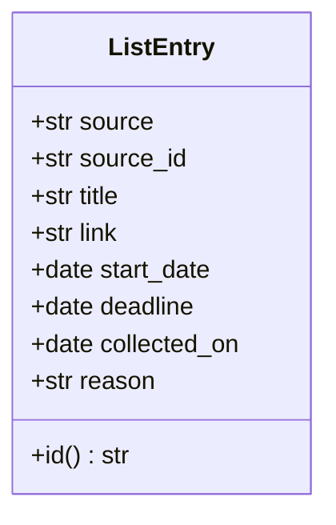

`domains/list/models.py`. 목록 파일의 한 줄이다. `id`는 `<출처>:<원천 ID>`이고 필드가 아니라 속성(property)이다. 두 값에서 늘 같게 만들어지므로 따로 저장한 값을 믿지 않는다. 파일에는 ERD대로 적는다. 반드시 있는 것은 `source` · `source_id` · `title` · `link` · `collected_on`이고, 하나라도 없으면 `from_dict`가 `ValueError`를 낸다. 읽는 쪽(`ListCrud.read`)은 이것을 목록 파일 읽기 실패로 올린다([[CCR-UC-001#UC-S4]] 1b).

선별이 넣기로 한 묶음의 대표에서 `entry_of(competition, base_date, reason)`이 만든다. 값은 [[CCR-UC-001#UC-S6]]의 표다. 판별 근거는 판별이 낸 한 줄이고, 판별 없이 들어온 대회는 그 사정(`판별 실패` · `오늘 마감`)이다. 상태는 여기 없다.

페이지 쪽에는 같은 값의 TypeScript 타입 `ListEntry`가 `domain/types.ts`에 있다. 필드 이름은 ERD와 같고, 코드를 나누지 않는다([[CCR-DOM-001]] 4.2).

관계
- `ListEntry` * — 1 `Status` (식별자로. 페이지만 잇는다)
- 처리 이력 기록과는 값으로만 이어진다. 항목마다 그 묶음의 구성원에 남김 기록이 있다.

#### Status 상태

테이블: [[CCR-DOM-003#status]] · 도메인: [[CCR-DOM-001#Status]]

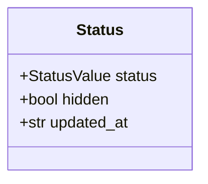

`frontend/src/domain/types.ts`. 상태 파일은 식별자를 키로 한 객체 하나이고(`StatusFile = Record<string, Status>`), 값 하나가 이 타입이다. `StatusValue`는 `not_started` · `in_progress` · `submitted` · `done`이고 화면 이름(`시작 전` · `진행 중` · `제출` · `완료`)은 같은 모듈의 `STATUS_LABELS`에 한 번만 적는다. `updated_at`은 UTC 초 단위의 ISO 문자열이다([[CCR-API-001]] 4.2).

배치에는 이 타입이 없다. 배치는 상태 파일을 읽지도 쓰지도 않는다([[CCR-DOM-001]] 4.2 규칙 3). 값이 없는 대회는 페이지가 `시작 전` · 감추지 않음으로 본다. 목록에 없는 식별자의 값은 무시한다.

### 2.2 기록

#### HistoryRecord 처리 이력 기록

테이블: [[CCR-DOM-003#processed]] · 도메인: [[CCR-DOM-001#HistoryRecord]]

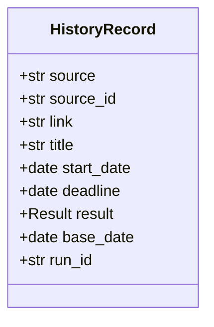

`domains/record/models.py`. 한 줄이 공고(묶음의 구성원) 하나다. 반드시 있는 것은 `source` · `source_id` · `result` · `run_id`이고, 하나라도 없으면 `from_dict`가 `ValueError`를 낸다. 읽는 쪽(`RecordCrud.read_history`)은 이것을 처리 이력 읽기 실패로 올린다.

선별이 적을 값을 정해 `HistoryEntry`(2.4)로 넘기면 `HistoryRecord.of`가 기준일과 실행 식별자를 붙인다. 기록 경계는 묶음을 모른다([[CCR-DOM-001]] 4.2 규칙 5).

관계
- `HistoryRecord` * — 1 `RunLine` (`run_id`로. 적은 실행)

#### RunLine 실행 요약 줄

테이블: [[CCR-DOM-003#runs]] · 도메인: [[CCR-DOM-001#Run]]

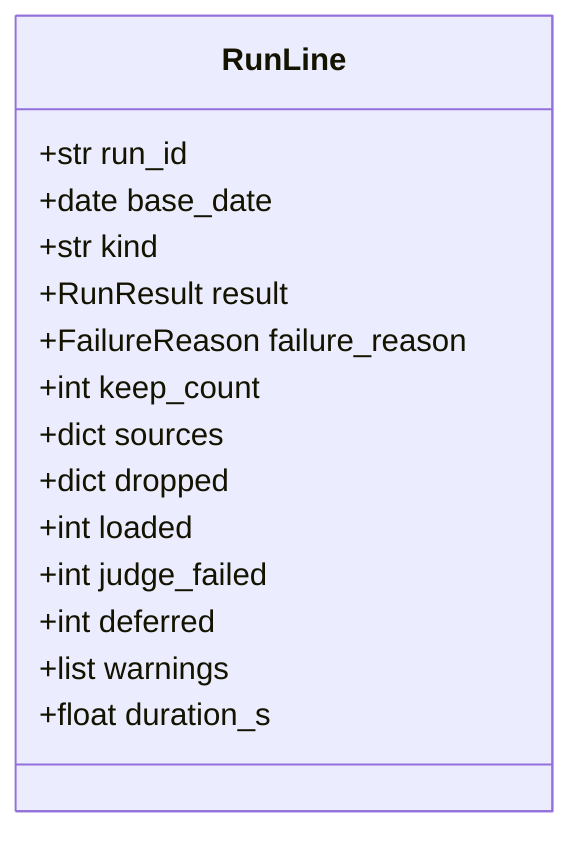

`domains/record/models.py`. 실행 한 번에 한 줄이다. `sources`는 소스 이름을 키로 한 `SourceLine`이고, `dropped`는 `normalize` · `expired` · `known` · `discarded` 넷의 건수, `warnings`는 `RunWarning`의 목록이다. `loaded`는 그 실행이 목록 파일에 더한 항목의 수다. 노션 때 있던 행 생성 실패 건수는 파일에 더하는 방식에서 일어날 수 없어 없앴다([[CCR-DOM-001#Warning]]).

`keep_count`는 배치가 비워 둔다(`None`). 마무리 단계가 추가분을 얹은 뒤 센 남김 기록의 수를 채운다([[CCR-INFRA-001]] 8.2). 배치가 미리 세면 올리다 빠진 줄만큼 커져, 다음 실행이 멀쩡한 처리 이력을 줄었다고 본다.

`fail(reason)`이 결과를 실패로 바꾸고 사유를 적는다. 결과 중단의 줄은 이 클래스가 만들지 않는다. 마무리 단계가 따로 만든다(4.10).

관계
- `RunLine` 1 — * `SourceLine` (`sources`에 품는다)
- `RunLine` 1 — * `RunWarning` (`warnings`에 품는다)

#### SourceLine 소스별 건수

테이블: [[CCR-DOM-003#run_sources]] · 도메인: [[CCR-DOM-001#SourceResult]]

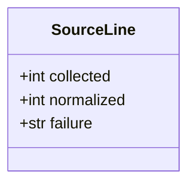

`SourceResult`(2.4)에서 대회 목록과 원문 사유를 뺀 것이다. `failure`는 실패의 종류(`FailureKind` 값)이고 성공이면 비어 있다. 원문 사유는 로그에만 간다(공개 저장소).

#### RunWarning 경고

테이블: [[CCR-DOM-003#run_warnings]] · 도메인: [[CCR-DOM-001#Warning]]

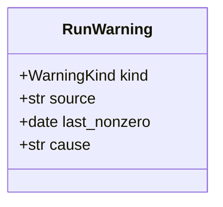

`source` · `last_nonzero`는 소스 0건일 때만, `cause`는 판별 미룸일 때만(`missing_key` · `call_failed`) 채운다. `to_dict`는 빈 속성을 쓰지 않는다.

### 2.3 열거형

| 이름 | 값 | 쓰는 곳 |
|---|---|---|
| `SourceName` | `event-us` · `DACON` · `Kaggle` · `wevity` · `AI팩토리` · `콘테스트코리아` | 수집. 목록 항목의 `출처` 값과 실행 요약의 소스 키가 이 값이다. 식별자의 앞부분이기도 하다 |
| `FailureKind` | `connection` · `http_status` · `format` · `robots` · `missing_config` | `SourceResult` · `SourceLine.failure` |
| `Result` | `keep` · `discard` | `HistoryRecord` · `HistoryEntry` |
| `RunResult` | `success` · `failure` · `aborted` | `RunLine`. `aborted`는 마무리 단계만 쓴다 |
| `FailureReason` | `all_sources_failed` · `list_read_failed` · `history_read_failed` · `history_shrank` | `RunLine.failure_reason`. 넷이다([[CCR-DOM-001#Run]]). 반드시 있어야 하는 시크릿이 없어 설정 누락은 실패 사유가 아니다([[CCR-UC-001#UC-A1]] 1d1) |
| `WarningKind` | `zero_count` · `judge_deferred` · `summary_corrupt` | `RunWarning`. 셋이다([[CCR-DOM-001#Warning]]) |
| `Verdict` | `same` · `different` · `undecided` | `PairResult`. `undecided`는 5단계 문턱에 못 미친 것이다. 다르다는 뜻이 아니다 |
| `KnownKind` | `list` · `history` | `Known`. 목록 항목에서 온 아는 대회와 처리 이력 기록에서 온 아는 대회 |
| `Outcome` | `known` · `discarded` · `loaded` · `deferred` | `Bundle`의 처리 결과([[CCR-DOM-001#Bundle]]) |
| `StatusValue`(페이지) | `not_started` · `in_progress` · `submitted` · `done` | `Status.status`. 문자열 리터럴 유니온이다 |

`SOURCE_PRIORITY`(DACON 1 · Kaggle 2 · AI팩토리 3 · event-us 4 · wevity 5 · 콘테스트코리아 6)는 `domains/collect/models.py`의 상수다([[CCR-UC-001#UC-S4]] 4a2).

### 2.4 값 타입

경계 사이와 경계 안에서 주고받는 값이다. 저장하지 않는다. [[CCR-MS-001]]은 타입을 여기서만 찾는다.

| 타입 | 필드 | 파일 · 쓰는 곳 |
|---|---|---|
| `Competition` | `source: SourceName` · `source_id: str` · `title: str` · `link: str` · `start_date: date?` · `deadline: date?` · `extras: tuple[str]` · `practice: bool` | collect/models. 어댑터가 만들고 선별 · 목록 · 기록이 읽는다. 도메인 [[CCR-DOM-001#Competition]]. `dates_filled()`는 채워진 접수 날짜의 수 |
| `Collected` | `competitions` · `collected: int` · `dropped: int` · `page_cap_hit: bool` · `notes: list[str]` | collect/models. 어댑터 → `CollectService`. `notes`는 로그에만 |
| `SourceResult` | `source` · `competitions` · `collected` · `dropped` · `failure: FailureKind?` · `detail: str?` · `page_cap_hit` | collect/models. `CollectService` → `Pipeline`. 도메인 [[CCR-DOM-001#SourceResult]]. `normalized`는 대회 수 |
| `Task` · `WevityItem` · `CkItem` | 소스의 원본 레코드를 읽은 것 | 어댑터 안에서만 |
| `ListFile` | `entries: list[ListEntry]` · `exists: bool` · `error: str?` | list/service. 시작할 때 읽은 목록 파일. `ids()`는 식별자 집합 |
| `HistoryEntry` | `HistoryRecord`에서 `base_date` · `run_id`를 뺀 것 | record/models. 선별 · `Pipeline` → `RecordService.append` |
| `MatchKey` | `source?` · `source_id?` · `link?` · `from_list` · `title_norm` · `years` · `rounds` · `start?` · `deadline?` · `chars` | screen/models. 판정에 쓰는 값. 대회 · 목록 항목 · 처리 이력 기록에서 같은 방법으로 뽑는다 |
| `PairResult` | `verdict: Verdict` · `step: int?` · `similarity: float` · `certain: bool` | screen/models. `judge_pair`의 결과. `certain`은 1단계였거나 연도 · 회차 · 접수 날짜를 실제로 맞대 보고 같았다는 뜻이다 |
| `Known` | `kind: KnownKind` · `key: MatchKey` · `result: str` · `label: str` | screen/models. 아는 대회 하나. 목록 항목이면 결과는 `keep` |
| `KnownSet` | `items` · `by_id` · `by_link` · `by_title` · `history_ids` | screen/service. 아는 대회와 찾기용 색인 |
| `Bundle` | `members` · `representative` · `judge_failed` · `outcome: Outcome?` · `matched` · `reason` · `keys` | screen/models. 도메인 [[CCR-DOM-001#Bundle]]. `deadline`은 구성원 가운데 가장 늦은 접수마감일(5장 결정 1). `reason`은 판별 근거이고 목록 항목에 들어간다 |
| `JudgeOutcome` | `to_load: list[Bundle]` · `discarded` · `judge_failed` · `deferred` · `cause: str?` | screen/service. 판별 → `Pipeline` |
| `Answer` | `keep: bool` · `reason: str` | screen/ports. 판별 모델의 답 |
| `Relevance` | `decision: keep\|discard` · `reason: str` | openai_judge. 판별 스키마([[CCR-API-001]] 4.3)를 pydantic 모델로 옮긴 것 |
| `State` | `history` · `history_exists` · `history_error: str?` · `runs: RunsFile` | record/service. 시작할 때 읽은 기록 파일 둘. `keep_count` · `last_keep_count()` |
| `RunsFile` | `lines: list[dict]` · `corrupt: int` | record/crud. 읽힌 실행 요약 줄과 읽히지 않은 줄의 수 |
| `Settings` | `source: SourceSettings` · `judge: JudgeSettings` · `zero_count_days` | core/settings. `settings.toml`과 저장소 변수 `OPENAI_MODEL` |
| `Secrets` | `openai_api_key?` · `kaggle_api_token?` | core/settings. 빈 문자열은 빠진 것으로 본다. 둘뿐이다([[CCR-INFRA-001]] 5장) |
| `RunContext` | `run_id` · `started_at` · `base_date` · `kind` · `write` · `ignore_discards` · `ignore_discards_requested` · `in_actions` · `state_dir` · `state_from_main` · `append_dir` | core/settings. 실행 문맥. `state_dir`는 세 파일을 읽는 폴더, `append_dir`는 추가분 폴더 |
| `Services` | `collect` · `list` · `record` · `screen` | run/pipeline. `Pipeline`이 받는 서비스 묶음. 테스트는 가짜를 넣는다 |

페이지의 값 타입은 `domain/types.ts`와 각 모듈에 있다.

| 타입 | 필드 | 파일 · 쓰는 곳 |
|---|---|---|
| `ListEntry` · `Status` · `StatusFile` | 2.1 | domain/types |
| `StatusVersion` | `sha: string \| null` · `file: StatusFile` | api/github. 판 읽기의 결과. 파일이 없으면 `sha`가 `null` |
| `Change` | `id` · `title` · `status?: StatusValue` · `hidden?: boolean` | store/status. 바꿈 하나. 상태 바꾸기는 `status`만, 지우기 · 되살리기는 `hidden`만 채운다 |
| `SaveState` | `saving: boolean` · `error?: {status: number, message: string}` | store/status → 화면. 저장 중(8)과 저장 실패(12) |
| `Filters` | `source: SourceName \| 'all'` · `status: StatusValue \| 'all'` · `showHidden: boolean` | pages/CompetitionList. localStorage에 기억한다 |
| `Row` | `entry: ListEntry` · `status: Status` · `expired: boolean` | pages/CompetitionList. 표 한 줄. 정렬과 거르기의 단위 |

예외와 그것이 바뀌는 곳은 이렇다.

| 예외 | 나는 곳 | 바뀌는 곳 |
|---|---|---|
| `FormatError` · `HttpFailure(category)` · `RobotsDisallowed` | 소스 요청 · 어댑터 | `CollectService`가 `SourceResult`의 실패 종류로 |
| `ListReadFailed` | `ListCrud.read` | `ListService.load`가 `ListFile.error`로. `Pipeline`이 실패(목록 파일 읽기 실패)로 |
| `JudgeError(fatal)` | 판별 어댑터 | `ScreenService`가 그 묶음의 판별 실패로 |
| `HistoryReadFailed` | `RecordCrud` | `RecordService.load`가 `State.history_error`로 |
| `RunModeError` | `RunContext.from_env` | 입구가 종료 코드 2로 |
| `Stopped` | 멈춤 표시를 보는 모든 곳 | 입구가 종료 코드 130으로. 줄을 쓰지 않는다 |
| `GitError` | `finish.py`의 git 명령 | `finish`가 처음부터 다시 |
| `GitHubError(status)`(페이지) | `api/github.ts` | `StatusStore`가 409 · 422면 한 번 다시 쓰고, 그 밖은 값을 되돌리고 `SaveState.error`로 |
| `DataReadError`(페이지) | `api/data.ts` | `CompetitionList`가 읽지 못했다는 알림으로([[CCR-UC-001#UC-A2]] 1b) |

여기 없는 예외(파일을 쓰지 못함 등)는 입구까지 올라가 스택을 로그에 남기고 종료 코드 1로 끝난다. 줄을 쓰지 않으므로 마무리 단계가 중단 줄을 쓴다([[CCR-UC-001#UC-A1]] \*a).

## 3. 의존 관계

누가 누구를 부르는지다. 여기 없는 방향은 부르지 않는다.

### 3.1 배치

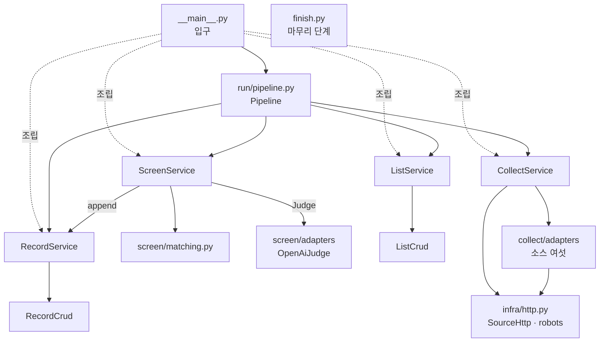

- **`Pipeline`만 네 서비스를 모두 부른다.** 목록 파일에 항목을 더할 때마다 `RecordService.append`에 남김을 적게 하는 것도 `Pipeline`이다([[CCR-DOM-001]] 4.2).
- **`ScreenService`는 `RecordService.append`를 부른다.** 버림과 아는 대회의 구성원을 곧바로 적어야 하기 때문이다([[CCR-UC-001#UC-S5]] 5 · [[CCR-UC-001#UC-S4]] 6). 선별 → 기록은 도메인 모델이 허락한 방향이다.
- **`ListService` · `RecordService`는 서로 부르지 않고 선별도 부르지 않는다.** 목록과 기록이 가리키는 것은 수집의 값(`Competition` · `SourceResult`)뿐이다. 두 `crud`가 같은 폴더(`state_dir` · `append_dir`)를 읽고 쓰지만, 폴더는 실행 문맥(`core/`)이 정하고 기본 브랜치의 최신 판을 꺼내는 일은 `RecordCrud.prepare`가 세 파일을 한 번에 한다. `Pipeline`이 `RecordService.start`를 먼저 부르므로 `ListCrud`는 꺼내 둔 파일을 읽기만 한다.
- **소스 어댑터는 `SourceHttp`로만 요청한다.** robots.txt 확인 · 요청 간격 · 시간 예산이 거기 있다.
- **`finish.py`는 아무것도 부르지 않는다.** 세 파일의 줄 형식을 스스로 안다([[CCR-DOM-001]] 4.2 · [[CCR-INFRA-001]] 8.2).
- `core/` · `shared/`는 어디서나 부른다. 거꾸로 부르지 않는다.

### 3.2 페이지

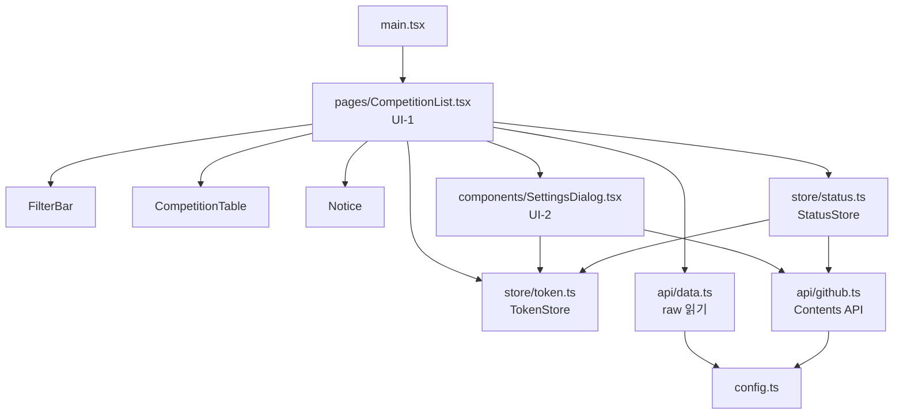

- **`CompetitionList`만 데이터를 읽는다.** 두 파일을 받아 `Row`로 합치고 자식 컴포넌트에는 값과 콜백만 내려 준다. 자식은 요청하지 않는다.
- **GitHub에 쓰는 곳은 `StatusStore` 하나다.** 상태 · 지우기 · 되살리기가 모두 이 클래스를 거쳐 줄을 선다([[CCR-API-001]] 1.4). `SettingsDialog`가 `api/github.ts`를 부르는 것은 토큰 검증의 판 읽기뿐이다([[CCR-UC-001#UC-H2]] 4).
- **토큰은 `TokenStore`만 만진다.** `localStorage`의 키 하나다. 화면은 있음 · 없음만 묻는다.
- `config.ts` · `domain/types.ts` · `styles.css`는 어디서나 쓴다. 거꾸로 부르지 않는다.

## 4. 설계 클래스

3장이 지도라면 여기는 각 노드를 확대한 것이다. 서비스마다 메서드 시그니처와 그 서비스가 만지는 엔티티를 한 그림에 둔다. 엔티티의 속성은 2장과 같게 다시 그린다. 어긋나면 2장이 진실이다. 그림에서 `-`로 시작하는 메서드는 클래스 안에서만 쓰는 것이고, 코드에서는 이름 앞에 밑줄이 붙는다(`-matches` → `_matches`). 표의 유스케이스는 그 메서드가 구현하는 단계다.

### 4.1 수집

#### CollectService 수집 서비스

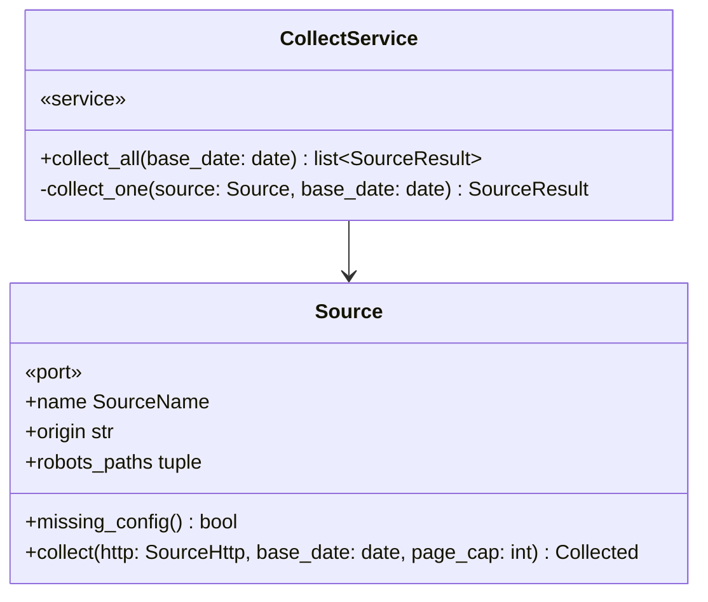

| 메서드 | 부르는 곳 | 유스케이스 | 실패 |
|---|---|---|---|
| `collect_all` | `Pipeline._run` · `__main__.run_collect` | [[CCR-UC-001#UC-S1]] · [[CCR-UC-001#UC-S2]] | 신호면 `Stopped` |
| `_collect_one` | `collect_all`(스레드마다) | [[CCR-UC-001#UC-S1]] 1a · 2a · \*a | 밖으로 내지 않는다. `SourceResult.failed` |

**규칙이 사는 곳**
- 여섯 소스를 동시에 돌린다(스레드 여섯). 소스마다 시간 예산 120초의 기한으로 `SourceHttp`를 새로 만든다. 소스끼리는 서버가 달라 동시에 돌려도 요청 간격 규칙에 걸리지 않는다([[CCR-INFRA-001]] 8.5).
- `missing_config()`가 참이면 요청하지 않고 `missing_config`로 끝낸다. 토큰이 없는 Kaggle이 여기 든다([[CCR-UC-001#UC-S1]] 1a).
- 소스마다 robots.txt를 먼저 본다. 실패를 종류로 바꾸는 표는 [[CCR-API-001]] 2.1이다. 시간 예산을 넘긴 것은 `connection`이다. 파서의 예상하지 못한 예외도 `format`으로 가둔다([[CCR-INFRA-001#C7]]).
- 소스 결과의 순서는 소스 목록의 순서다. 실행 요약의 소스 키 차례가 날마다 같다.

#### Source 소스 어댑터

`domains/collect/ports.py`의 인터페이스와 `adapters/`의 구현 여섯이다. 인터페이스는 같고 가져오는 법이 다르다([[CCR-UC-001#UC-S1]] 일반화).

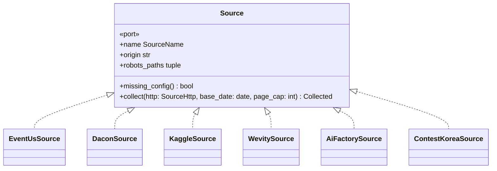

| 구현 | 모듈의 함수 | 엔드포인트 | 멈추는 때 |
|---|---|---|---|
| `EventUsSource` | `build_query` · `parse_page` · `normalize` | [[CCR-API-001#POST/api.event-us.kr/api/v1/engine/search]] | `total_pages`까지 |
| `DaconSource` | `parse_page` · `link_for` · `normalize` | [[CCR-API-001#GET/app.dacon.io/api/v1/competition/list]] | 빈 쪽이나 접수 중인 대회가 없는 쪽 |
| `KaggleSource` | `parse_page` · `is_practice` · `normalize` | [[CCR-API-001#POST/api.kaggle.com/v1/…/ListCompetitions]] | 토큰 없음 · 다음 쪽 없음 · 모두 마감된 쪽 |
| `WevitySource` | `parse_list` · `parse_detail_end` · `deadline_of` · `-calibrate` | [[CCR-API-001#GET/www.wevity.com/?c=find]] · [[CCR-API-001#GET/www.wevity.com/?c=find&gbn=view]] | 분야마다 마지막 공고가 `마감`인 쪽이나 빈 쪽(5장 결정 8) |
| `AiFactorySource` | `extract_payload` · `parse_tasks` · `group_tasks` · `competition_name` · `to_competition` | [[CCR-API-001#GET/aifactory.space/ko/competition]] | 한 쪽 |
| `ContestKoreaSource` | `parse_list` · `resolve_dates` | [[CCR-API-001#GET/www.contestkorea.com/sub/list.php]] | 분야마다 12건보다 적은 쪽 |

**규칙이 사는 곳**
- 어댑터는 읽은 것을 곧바로 `Competition`으로 맞춘다([[CCR-UC-001#UC-S2]]). 대회명이나 원천 ID · 링크를 채우지 못한 레코드는 `dropped`로 센다. 수집 건수는 원본 레코드의 수다. AI팩토리는 합치기 전 과제의 수이고, 여러 분야에 같은 공고가 올라오는 wevity · 콘테스트코리아는 원천 ID로 합친 뒤의 수다([[CCR-DOM-001#Run]] · [[CCR-API-001]] 1.2).
- 대회명은 앞뒤의 공백과 보이지 않는 서식 문자만 뗀다(`clean_text`, [[CCR-UC-001#UC-S2]] 4). event-us와 콘테스트코리아가 대회명 앞에 BOM을 붙여 주는 일이 있다(2026-09-27 실측). HTML 소스(wevity · 콘테스트코리아)는 브라우저가 보여 주는 대로 이어진 공백을 하나로 모은다(`html_text`).
- 쪽 상한 20은 소스 안에서 합산한다. wevity와 콘테스트코리아는 분야를 넘나들며 한 상한을 쓴다. 상한에 닿으면 `page_cap_hit`을 켜고 로그에 남긴다.
- 목록 요청은 리디렉션을 따라가지 않는다. 따라가는 것은 robots.txt(RFC 9309)와 wevity 날수 맞춰 보기의 상세 요청(같은 사이트의 `gbn=viewok`로 가는 302, 2026-09-27 실측, [[CCR-API-001]] 1.2) 둘이다.
- 시간대 표기가 없는 값은 KST로 본다. 날짜 변환은 `shared/dates.py` 한 곳이다.

### 4.2 선별

#### ScreenService 선별 서비스

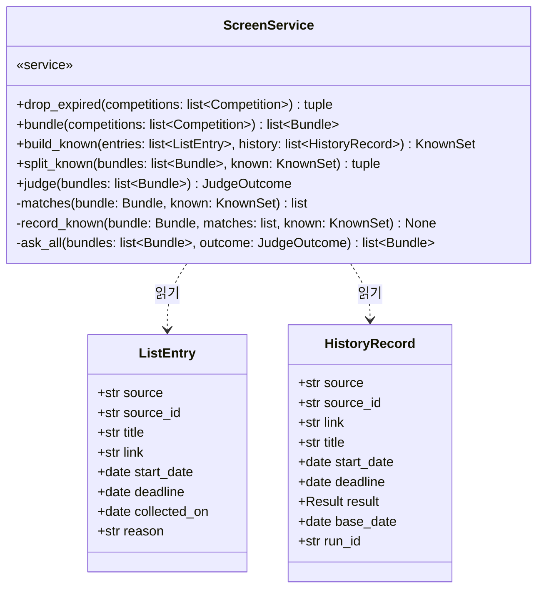

| 메서드 | 부르는 곳 | 유스케이스 | 실패 |
|---|---|---|---|
| `drop_expired` | `Pipeline._run` | [[CCR-UC-001#UC-S3]] | |
| `bundle` | `Pipeline._run` | [[CCR-UC-001#UC-S4]] 4 · 4a · 4b | |
| `build_known` | `Pipeline._run` | [[CCR-UC-001#UC-S4]] 3 · [[CCR-UC-001#UC-A1]] 1b6 | |
| `split_known` | `Pipeline._run` | [[CCR-UC-001#UC-S4]] 5 · 6 · 7 | |
| `judge` | `Pipeline._run` | [[CCR-UC-001#UC-S5]] | 신호면 `Stopped` |

**규칙이 사는 곳**
- **마감 판정.** 접수마감일이 기준일보다 이른 대회와 Kaggle 상시 연습용 대회를 버린다. 오늘 마감과 마감일이 빈 대회는 남긴다. 버린 수가 `dropped.expired`다.
- **묶기.** `matching.group`이 같다는 짝을 강한 것부터 합치되, 합친 묶음 안의 모든 짝이 같다고 나올 때만 합친다. 2 · 3단계로 다른 짝은 물론 5단계에서 판단하지 않은 짝이 하나라도 있으면 합치지 않는다(5장 결정 7). 대표는 접수 날짜가 더 채워진 쪽, 같으면 소스 우선순위 · 원천 ID 순이다.
- **아는 대회.** 목록 항목과 처리 이력 기록을 합친다. 목록 항목은 참가자가 지워도 남아 있으므로 지운 대회도 아는 대회다([[CCR-UC-001#UC-S4]] 3). 버림을 없는 것으로 보는 실행이면 버림 기록을 넣지 않되, 자기 기록이 있는지(`history_ids`)는 모든 기록으로 본다. 묶음은 구성원 가운데 하나라도 1단계로 같거나, 아는 대회가 구성원 하나 이상과 같고 어느 구성원과도 다르지 않으면 아는 대회다. 묶을 때와 달리 모든 구성원과 같을 필요는 없다.
- **아는 대회로 빠진 묶음의 기록.** 확실하게 같은 짝이 있을 때만 자기 기록이 없는 구성원을 적는다. 결과는 견준 쪽을 따르되, 확실하게 같은 것 가운데 남김(목록 항목 · 남김 기록)이 하나라도 있으면 남김이다(5장 결정 2). 날짜 없는 구성원은 대표의 날짜로 채운다(`entries_for`).
- **판별.** 묶음마다 대표 하나를 묻는다. 동시에 넷(설정값)이고, 결과는 받는 차례대로 한 흐름이 처리한다. 버림은 받는 대로 적는다. 다시 물어도 같은 답이 올 오류(`JudgeError.fatal`)가 나면 아직 묻지 않은 묶음은 묻지 않고 판별 실패로 둔다. OpenAI 키가 없으면 판별기가 없고(`judge=None`) 모든 묶음이 판별 실패다.
- **미루기.** 판별 실패가 대상의 절반을 넘으면 실패한 묶음 가운데 접수마감일이 기준일이 아닌 것을 미룬다. 미룬 묶음은 넣지도 적지도 않는다. 원인은 키가 없으면 `missing_key`, 그 밖은 `call_failed`다.
- **판별 근거.** 남긴 묶음의 `reason`은 판별 모델의 한 줄이다. 판별 없이 넘긴 묶음(판별 실패 · 오늘 마감)은 그 사정을 `reason`에 적는다. 목록 항목의 판별 근거가 된다([[CCR-UC-001#UC-S6]]).
- 넣을 묶음과 판별할 묶음은 접수마감일이 이른 차례로 둔다. 시간 한도로 끊겨도 오늘 마감인 대회가 먼저 들어가게 하기 위해서다.
- 판정 규칙 자체는 `matching.py`에 있다(4.3).

### 4.3 matching — 같은 대회 판정

`domains/screen/matching.py`. 클래스가 아니라 순수 함수 열이다. 대회 · 목록 항목 · 처리 이력 기록을 같은 `MatchKey`로 바꿔 견준다([[CCR-DOM-001]] 4.2 규칙 6).

```
normalize_title(title) -> str               4 · 5단계가 견주는 대회명
extract_marks(title) -> (years, rounds)     2단계의 연도 · 회차
normalize_link(link) -> str | None          추적용 매개변수(utm_* · fbclid)만 뗀 링크
key_of_competition(c) -> MatchKey
key_of_entry(entry) -> MatchKey             원천 ID와 링크를 싣는다. 링크는 소스 개편으로 원천 ID가 바뀐 공고를 잇는 예비다
key_of_history(record) -> MatchKey          링크를 싣지 않는다. 링크는 목록 항목과 견줄 때만 쓴다
similarity(a, b) -> float                   0.90에 닿을 수 없으면 계산하지 않고 0
judge_pair(a, b) -> PairResult              다섯 단계
representative_order(c) -> tuple            대표를 고르는 차례
group(competitions, keys) -> list[list[int]]  후보끼리 묶기. 모든 짝이 같을 때만 합친다
```

**규칙이 사는 곳** — 판정표([[CCR-UC-001#UC-S4]] · [[CCR-PRD-001]] 5.2)를 그대로 옮긴다. 상수 `SIMILARITY = 0.90` · `DEADLINE_GAP_DAYS = 180`. 정규화의 세부(꼬리말 목록 · 날짜 괄호로 보는 것 · 회차 표기)는 [[CCR-MS-001#matching.normalize_title]] · [[CCR-MS-001#matching.extract_marks]]가 정한다. 유사도 계산 전의 거르기(길이 · 글자 집합의 상한)는 결과를 바꾸지 않는다. 0.90에 닿을 수 없는 짝만 건너뛴다. 노션 때는 행에 원천 ID가 없어 링크로만 1단계를 봤지만, 목록 항목에는 출처 · 원천 ID가 있어 1단계가 원천 ID로 돌아왔다([[CCR-DOM-001#ListEntry]]).

### 4.4 판별

#### OpenAiJudge 판별 어댑터

`domains/screen/ports.py`의 `Judge`를 OpenAI Responses API로 구현한다([[CCR-API-001#POST/api.openai.com/v1/responses]]).

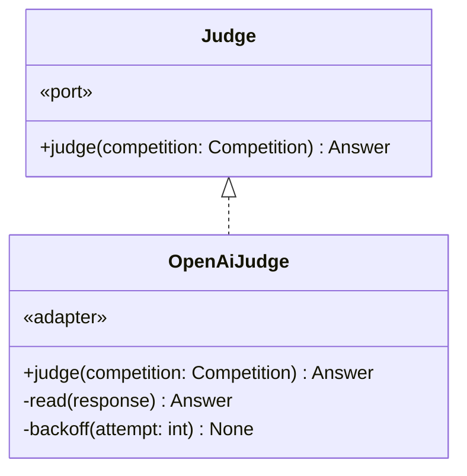

| 메서드 | 부르는 곳 | 유스케이스 | 실패 |
|---|---|---|---|
| `judge` | `ScreenService._ask_all`(판별 스레드) | [[CCR-UC-001#UC-S5]] 1 · 2 · 3 · 2a | `JudgeError(fatal)` · 신호면 `Stopped` |

**규칙이 사는 곳**
- SDK의 자동 재시도는 끈다(`max_retries=0`). `reasoning.effort = none` · `max_output_tokens = 300` · `store = false` · 타임아웃 30초([[CCR-API-001]] 1.3).
- 오류의 가름은 [[CCR-API-001]] 2.2의 표다. 401 · 403 · 404와 지출 한도 · 크레딧 429는 `fatal`, 408 · 409 · 그 밖의 429 · 5xx · 연결 오류는 두 번까지 다시 묻고, 400 등 그 밖의 4xx와 `status`가 `completed`가 아님 · 거절 · 스키마 불일치는 그 묶음만 실패다.
- 판별 기준의 문구(`CRITERIA`)는 규칙이라 이 모듈의 상수다. 바꾸는 절차는 [[CCR-UC-001#UC-A4]]다. 입력은 대회명 · 출처 · 부가 정보이고, 부가 정보는 800자에서 자른다.

### 4.5 목록(배치 쪽)

#### ListService 목록 서비스

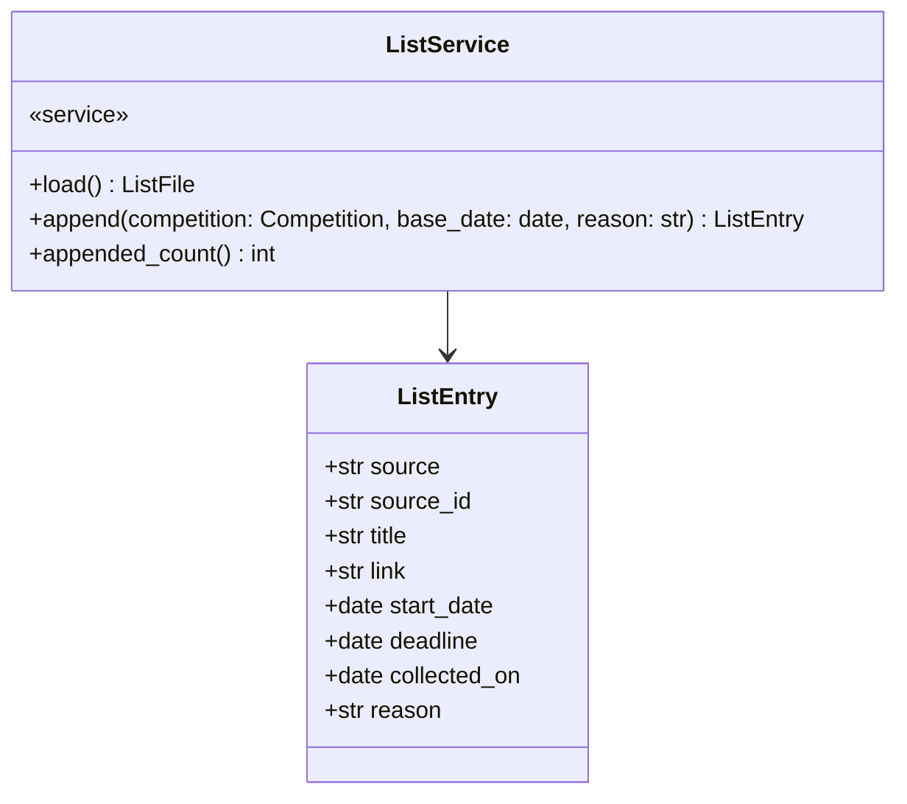

| 메서드 | 부르는 곳 | 유스케이스 | 실패 |
|---|---|---|---|
| `load` | `Pipeline._run` | [[CCR-UC-001#UC-S4]] 1 · 1a · 1b | 내지 않는다. `ListFile.error` |
| `append` | `Pipeline._load`(묶음마다) | [[CCR-UC-001#UC-S6]] 1 · 2 · 2a · 4a | 내지 않는다. 식별자가 이미 있으면 `None` |

**규칙이 사는 곳**
- 읽기와 더하기만 한다. 항목을 고치거나 지우는 길이 없고, 상태 파일은 열지도 않는다([[CCR-DOM-001]] 4.2 규칙 3 · [[CCR-PRD-001#R6]]).
- 목록 파일이 없으면 빈 목록이다(`exists=False`). 있는데 한 줄이라도 읽히지 않으면 빈 것으로 보지 않고 `error`를 채운다. `Pipeline`이 실패(목록 파일 읽기 실패)로 끝낸다([[CCR-UC-001#UC-S4]] 1b).
- `append`는 `entry_of`로 항목을 만들고, 시작할 때 읽은 식별자와 이번 실행에 더한 식별자 어디에도 없을 때만 추가분에 더한다. 이미 있으면 더하지 않고 `None`을 돌려주며 로그에 남긴다. `Pipeline`은 그 묶음을 처리 이력에만 적는다([[CCR-UC-001#UC-S6]] 2a).
- 목록에 쓰지 않는 실행이면 `append`가 추가분을 쓰지 않고 항목만 만들어 돌려준다. `Pipeline`이 로그에 남긴다([[CCR-UC-001#UC-A1]] 1b3).
- `append`는 받은 대로 추가분 파일 전체를 다시 쓴다(`ListCrud`). 한 묶음마다 곧바로다. 모두 넣은 뒤에 한꺼번에 쓰지 않는다([[CCR-UC-001#UC-S6]] 4).

#### ListCrud 목록 파일

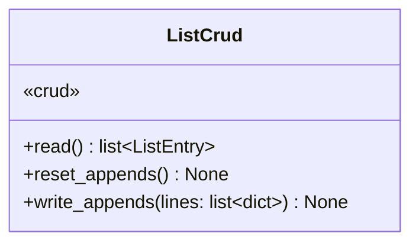

| 메서드 | 읽고 쓰는 곳 |
|---|---|
| `read` | 데이터 폴더(`state_dir`)의 `competitions.jsonl`. 없으면 `None` |
| `reset_appends` · `write_appends` | 추가분 폴더(`$RUNNER_TEMP/append`)의 `competitions.jsonl` |

**규칙이 사는 곳**
- 작업 트리의 목록 파일을 직접 고치지 않는다. 추가분은 작업 트리 밖에 쌓는다([[CCR-INFRA-001]] 6.2).
- 읽히지 않는 줄이 하나라도 있으면 `ListReadFailed`를 낸다. 건너뛰지 않는다. 건너뛰면 그 항목의 대회가 다시 들어온다.
- 쓸 때마다 새 이름의 임시 파일에 쓰고 `os.replace`로 통째로 바꾼다. 추가분 폴더가 데이터 폴더와 같으면 만들 때 거부한다. `RecordCrud`와 같은 규칙이다.
- 데이터 폴더의 파일을 꺼내는 일은 하지 않는다. `RecordCrud.prepare`가 세 파일을 한 번에 꺼내고(4.6), `Pipeline`이 그 뒤에 `load`를 부른다.

### 4.6 기록

#### RecordService 기록 서비스

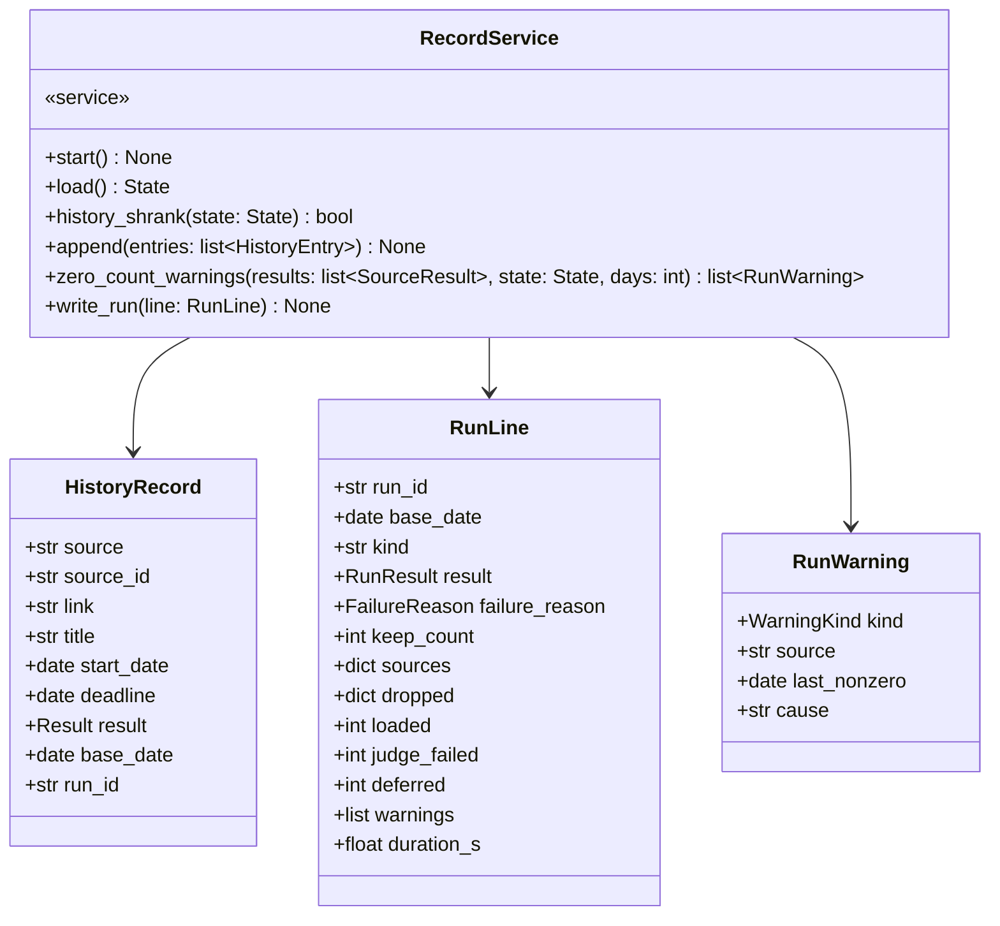

| 메서드 | 부르는 곳 | 유스케이스 | 실패 |
|---|---|---|---|
| `start` | `Pipeline.run` | [[CCR-INFRA-001]] 6.2 | |
| `load` | `Pipeline._run` | [[CCR-UC-001#UC-S4]] 2 · 2a · 2b | 내지 않는다. `State.history_error` |
| `history_shrank` | `Pipeline._run` | [[CCR-UC-001#UC-S4]] 2c | |
| `append` | `ScreenService` · `Pipeline._load` | [[CCR-UC-001#UC-S4]] 6 · [[CCR-UC-001#UC-S5]] 5 · [[CCR-UC-001#UC-S6]] 3 | |
| `zero_count_warnings` | `Pipeline._finish` | [[CCR-UC-001#UC-S7]] 2 · 2a · 2b | |
| `write_run` | `Pipeline._finish` | [[CCR-UC-001#UC-S7]] 8 · 8a | |

**규칙이 사는 곳**
- 읽기와 덧붙이기만 한다. 두 파일의 줄을 고치거나 지우는 길이 없다([[CCR-DOM-001]] 4.2 규칙 4).
- 목록에 쓰지 않는 실행이면 `append` · `write_run`이 아무것도 하지 않는다. `start`는 데이터 폴더를 꺼내는 일이라 그대로 한다.
- 처리 이력이 한 줄이라도 읽히지 않으면 빈 이력으로 보지 않는다. 실행 요약의 읽히지 않는 줄은 건너뛰고 센다.
- 남김 기록의 수 견주기. 실행 요약에 마지막으로 적힌 `keep_count`보다 지금 남김 기록이 적으면 참이다. 적힌 줄이 없으면 견주지 않는다. 처리 이력 파일이 없으면 0으로 본다.
- 소스 0건 경고. 기준일마다 모으고(같은 날 하나라도 1건 이상이면 건수를 낸 날), 그 소스를 수집하지 않았거나 실패한 줄은 건너뛴다. 오늘 앞으로 이어진 0건인 날들 바로 앞에서 연속 N일(설정값 3) 건수를 냈으면 경고하고, 그 마지막 날을 적는다.
- `append`는 받은 대로 기준일 · 실행 식별자를 붙여 추가분 파일 전체를 다시 쓴다(`RecordCrud`).

#### RecordCrud 기록 파일

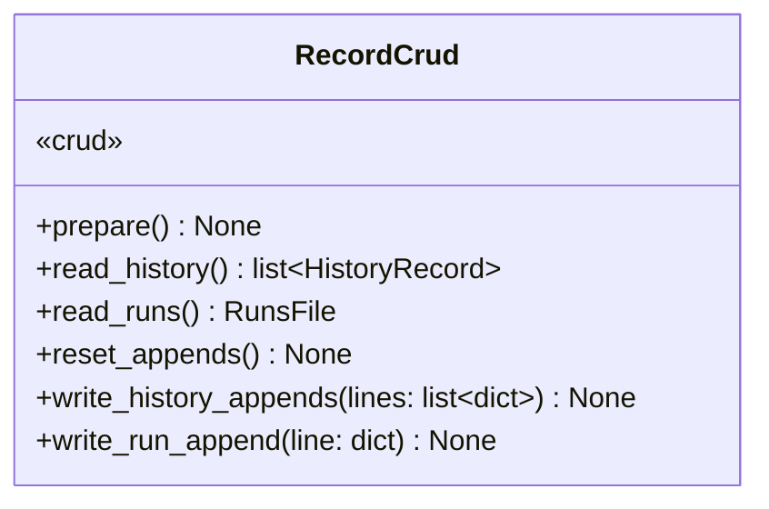

| 메서드 | 읽고 쓰는 곳 |
|---|---|
| `prepare` | 기본 브랜치가 아닌 실행이면 `export_main_state`로 origin/main 최신 판의 **세 파일**(목록 파일 · 처리 이력 · 실행 요약)을 데이터 폴더에 꺼낸다. 상태 파일은 꺼내지 않는다 |
| `read_history` · `read_runs` | 데이터 폴더의 `processed.jsonl` · `runs.jsonl` |
| `reset_appends` · `write_history_appends` · `write_run_append` | 추가분 폴더(`$RUNNER_TEMP/append`)의 같은 이름 두 파일 |

**규칙이 사는 곳**
- 작업 트리의 두 파일을 직접 고치지 않는다. 추가분은 작업 트리 밖에 쌓는다([[CCR-INFRA-001]] 6.2).
- 쓸 때마다 새 이름의 임시 파일에 쓰고 `os.replace`로 통째로 바꾼다. 도중에 끊겨도 반쯤 쓴 파일이 남지 않는다.
- 추가분 폴더가 데이터 폴더와 같으면 만들 때 거부한다. 데이터 파일을 비우는 사고를 막는다.
- 데이터 폴더는 실행 문맥이 정한다. 기본 브랜치에서 도는 Actions 실행은 시작할 때 받은 `data/`, 그 밖(다른 브랜치 · 개발자 PC)은 origin/main에서 꺼낸 사본이다. 받지 못하면 처리 이력 읽기 실패다([[CCR-UC-001#UC-A1]] 1b7 · [[CCR-INFRA-001]] 4.1). 목록 파일도 같은 사본에서 읽히므로 `ListCrud`가 따로 꺼내지 않는다(5장 결정 5).

### 4.7 실행의 흐름

#### Pipeline 실행의 흐름

`run/pipeline.py`. [[CCR-UC-001#UC-A1]]의 기본 흐름과 실패 확장을 차례로 부른다.

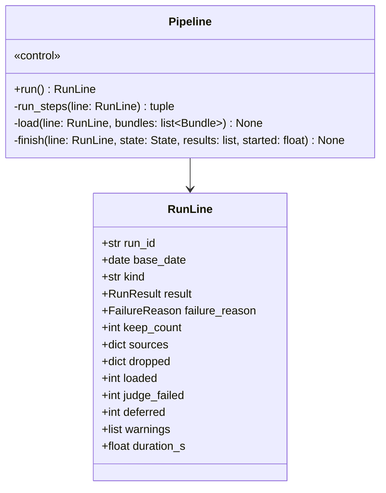

그림의 `run_steps`는 코드의 `_run`이다. mermaid가 밑줄로 시작하는 이름을 굵게 그려 이름을 바꿔 적었다.

| 메서드 | 부르는 곳 | 유스케이스 | 실패 |
|---|---|---|---|
| `run` | `__main__.run_batch` | [[CCR-UC-001#UC-A1]] 1 ~ 8 | 신호면 `Stopped`. 줄을 쓰지 않는다 |
| `_run` | `run` | [[CCR-UC-001#UC-A1]] 1d · 2 ~ 7 · 2b · 5a | |
| `_load` | `_run` | [[CCR-UC-001#UC-A1]] 7 · [[CCR-UC-001#UC-S6]] | |
| `_finish` | `run` | [[CCR-UC-001#UC-A1]] 8 · [[CCR-UC-001#UC-S7]] | |

**규칙이 사는 곳**
- 실패 사유는 넷 가운데 하나다. 전 소스 실패 · 목록 파일 읽기 실패 · 처리 이력 읽기 실패 · 처리 이력 감소면 판별 전에 8로 건너뛴다. 그래도 `_finish`는 돌아 줄을 남긴다. 반드시 있어야 하는 시크릿은 없다([[CCR-UC-001#UC-A1]] 1d1).
- 목록 파일을 먼저 읽고 처리 이력의 문제를 본다([[CCR-UC-001#UC-S4]] 1 · 2의 차례). 둘 다 문제면 먼저 본 목록 파일 읽기 실패가 사유다.
- 넣을 묶음마다 `ListService.append`로 항목을 더하고, 곧바로 그 묶음의 대표와 구성원을 `RecordService.append`로 남김으로 적는다. 항목이 이미 있어 더하지 않은 묶음도 처리 이력에는 적는다([[CCR-UC-001#UC-S6]] 2a). `loaded`는 실제로 더한 항목의 수다.
- 넣는 일에는 실패가 없다. 파일에 더하는 것이라 행 생성 실패도 오늘 마감 미적재 경고도 없다. 파일 쓰기가 실패하면 예상하지 못한 오류로 멈추고(\*a), 마무리 단계가 반영된 데까지 올린다([[CCR-UC-001#UC-S6]] 2b).
- 단계 사이마다 신호 표시를 본다. 신호를 받았으면 `Stopped`를 낸다.
- 목록에 쓰지 않는 실행은 넣었을 대회와 판별 근거를 로그에만 남긴다([[CCR-UC-001#UC-A1]] 1b3).

**입구(`__main__.py`)** — `main`이 비밀값을 Actions에 가릴 값으로 먼저 알리고(`::add-mask::`), 로그를 설정하고, 신호 처리기를 건 뒤 `run_batch` 또는 `run_collect`를 부른다. `run_batch`는 서비스 넷(`Services`)을 조립해 `Pipeline`을 돌리고 결과가 성공이면 0, 아니면 1로 끝난다. 쓰기 여부 값이 깨졌으면 2, 신호로 멈추면 130이다. 첫 신호는 새 요청을 멈추게 하고, 두 번째 신호는 막혀 있는 호출도 끊는다([[CCR-INFRA-001]] 8.1). 로컬 실행만 저장소 루트의 `.env`를 읽는다.

### 4.8 infra — 바깥 요청 도구

클래스 하나와 함수 둘이다. 서비스가 아니라 요청 규칙을 감싸는 얇은 층이다.

```
SourceHttp(settings, deadline, stop, client?, sleep?, clock?)
    .fetch(method, url, parse, params?, json?, headers?, follow_redirects=False, accept_client_errors=False) -> T
    .remaining() -> float
    .requests: int
parse_retry_after(value, now?) -> float | None
ensure_allowed(http, origin, paths) -> None           robots.txt. 막히면 RobotsDisallowed
```

**규칙** — `SourceHttp`는 소스 하나 · 실행 하나에 하나다. 요청 사이 1초, 시간 예산의 기한, 재시도 두 번(2초 · 4초), `Retry-After` 상한 30초와 남은 예산([[CCR-INFRA-001]] 8.5 · [[CCR-API-001]] 2.1). 본문은 흘려 받으며 조각마다 기한과 멈춤 표시를 본다. httpx의 타임아웃은 단계마다 걸려 요청 전체를 묶지 못하기 때문이다. 3xx는 따라가지 않고 실패다(`follow_redirects`를 켠 호출만 예외). 요청 헤더를 로그에 찍지 않는다. 시계와 잠은 넣어 줄 수 있어 테스트가 실제로 기다리지 않는다. 배치가 HTTP로 부르는 바깥은 소스 여섯과 OpenAI뿐이다. 저장소는 git으로 읽고 마무리 단계가 push한다([[CCR-API-001]] 3.3).

### 4.9 core · shared

```
Settings.load(env, path?) -> Settings                settings.toml + OPENAI_MODEL
Secrets.from_env(env) -> Secrets                      OPENAI_API_KEY · KAGGLE_API_TOKEN
RunContext.from_env(env, now?) -> RunContext         쓰기 여부 · 기준일 · 실행 식별자 · 데이터 폴더 · 추가분 폴더
read_dotenv(path) -> dict                            로컬 실행용 .env
register_actions_masks(values, emit?) -> None        ::add-mask::
SecretFilter(values)                                 로그 메시지와 예외 원문을 가린다
setup_logging(secrets) -> None
kst_date_of(moment) -> date · parse_to_kst_date(text) -> date | None · kst_midnight_utc(day) -> datetime
clean_text(value) -> str · html_text(value) -> str
```

**규칙** — `RunContext.from_env`는 Actions 안에서 `DRY_RUN`이 `true`도 `false`도 아니면 `RunModeError`를 낸다. 값이 비었다고 쓰기 모드로 돌지 않는다([[CCR-INFRA-001]] 8.1). Actions 밖은 늘 쓰지 않는다. 기준일은 첫 스텝이 남긴 `RUN_STARTED_AT`을 KST로 바꾼 날짜다([[CCR-INFRA-001#C13]]). 가릴 값은 비밀값 둘이다. 노션 ID의 두 표기를 만들던 `secret_variants`는 노션과 함께 없앴다.

### 4.10 마무리 단계

`batch/finish.py`. 표준 라이브러리와 git만 쓴다. 배치가 어디서 멈추든 같은 잡의 다음 스텝으로 돈다([[CCR-INFRA-001]] 8.1 · 8.2).

```
finish(env, git: Git) -> Outcome                     1~7단계. 되풀이 다섯 번
read_additions(append_dir, run_id) -> Additions      추가분 세 파일을 읽고 형식을 본다
has_run(runs_path, run_id) -> bool
count_keep(history_path) -> int
existing_ids(list_path) -> set[str]                  목록 파일에 이미 있는 식별자
append_lines(path, lines) -> None                    줄바꿈으로 끝나지 않으면 먼저 붙인다
base_date_of(started_at) -> str
Git(workdir, remote, token)
    .fresh_main() -> None                            얕게 받기. 되풀이 때는 main 최신 판으로 맞춘다
    .commit_and_push(message) -> None                세 경로만 스테이징
main() -> int
```

**규칙** — 세 파일의 줄 형식을 [[CCR-DOM-003]]대로 스스로 안다. 이 실행의 식별자를 가진 줄이 이미 있으면 얹지 않는다. 목록 파일에 이미 있는 식별자의 추가분 줄은 붙이지 않는다([[CCR-INFRA-001]] 8.2 3). 배치가 줄을 남기지 않았으면 결과 중단의 줄(기준일 · 실행 식별자 · 실행 종류 · 결과 · 남김 기록의 수만)을 쓰고 실패로 끝낸다. 형식이 맞지 않는 추가분 줄은 붙이지 않고 실패로 끝낸다. `data/status.json`은 읽지도 스테이징하지도 않는다. 토큰은 받기와 push 명령에만 명령 줄 설정으로 주고 명령을 찍지 않는다. 커밋 작성자는 `github-actions[bot]`, 메시지에 기준일과 실행 식별자를 적는다.

### 4.11 페이지

`frontend/src/`. 화면은 [[CCR-UI-001]]의 UI-1 · UI-2이고, 요소 번호는 그 문서의 요소 표다. 컴포넌트는 함수 컴포넌트이고 `data-el` 속성에 요소 번호를 붙여 사용자가 브라우저에서 번호대로 확인한다.

#### CompetitionList 대회 목록 화면

`pages/CompetitionList.tsx`. UI-1을 그린다([[CCR-UI-001#UI-1]]).

```
CompetitionList(): JSX                              UI-1. 두 파일을 읽고 Row로 합쳐 그린다
  상태: entries · statusFile · filters · saveState · alert · dialogOpen
  refresh(): Promise<void>                          새로 고침(2). readListFile · readStatusFile
  rows(): Row[]                                     항목 + 상태 + 마감 지남. 접수마감일 오름차순, 없으면 맨 뒤
  onStatus(id, value) · onHide(id) · onRestore(id)  7.4 · 7.5 · 9.1. 토큰이 없으면 토큰 없음(11)
sortByDeadline(rows: Row[], today: string): Row[]   순수 함수. tests/가 본다
isExpired(entry: ListEntry, today: string): boolean
```

| 자식 | 파일 | 요소 |
|---|---|---|
| `FilterBar` | components/FilterBar.tsx | 3 · 3.1 · 3.2 · 3.3 |
| `CompetitionTable` | components/CompetitionTable.tsx | 7 · 7.1 ~ 7.6 · 9 · 9.1 |
| `Notice` | components/Notice.tsx | 8 · 11 · 11.1 · 12 · 12.1 · 12.2 · 10(빈 상태) |
| `SettingsDialog` | components/SettingsDialog.tsx | 20 ~ 20.7 |

**규칙이 사는 곳**
- 정렬은 접수마감일 오름차순 하나뿐이다. 마감일이 없는 항목은 맨 뒤다. 같은 마감일이면 대회명 순이다.
- 마감이 지난 항목(`deadline < 오늘`)과 감춘 항목은 접힌 구역(9)에 둔다. 오늘은 브라우저의 KST 날짜다. 3.3을 켜면 표 아래에 이어진다.
- 상태 파일에 값이 없는 항목은 `시작 전` · 감추지 않음이다. 목록에 없는 식별자의 값은 버린다.
- 거르기 값은 `localStorage`에 기억한다. 저장소에는 쓰지 않는다.
- 쓰는 조작 셋은 모두 `StatusStore`로 간다. 토큰이 없으면 부르지 않고 토큰 없음(11)을 띄운다. 화면 값은 바꾸지 않는다([[CCR-UC-001#UC-A2]] 4b).
- 읽지 못하면(`DataReadError`) 읽지 못했다는 알림과 새로 고침을 보인다. 목록 파일이 없으면(404) 빈 상태(10)다([[CCR-UC-001#UC-A2]] 1b).

#### SettingsDialog 설정 대화상자

`components/SettingsDialog.tsx`. UI-2를 그린다([[CCR-UI-001#UI-2]]).

```
SettingsDialog({open, tokens: TokenStore, onClose}): JSX
  상태: value · checking · problem
  onSave(): Promise<void>                           20.4. readStatusVersion(value)로 검증한 뒤 tokens.set
  onClear(): void                                   20.5. tokens.clear
tokenProblem(status: number): string                순수 함수. 401 · 403 · 404를 사람 말로
```

**규칙이 사는 곳**
- 저장 전에 반드시 판 읽기로 검증한다. 200이면 저장하고 닫는다. 401 · 403 · 404면 저장하지 않고 이유를 칸 아래에 보인다([[CCR-UC-001#UC-H2]] 4 · 4a · [[CCR-API-001]] 2.3).
- 토큰 값은 입력 칸(password)에만 있고, 저장한 뒤 다시 보여 주지 않는다. 20.6은 있음 · 없음만이다.
- 대화상자가 열린 동안 UI-1의 조작은 막는다. 바깥 누름과 Esc로 닫힌다.

#### StatusStore 상태 저장

`store/status.ts`. 상태 파일에 쓰는 유일한 길이다([[CCR-UC-001#UC-H1]]).

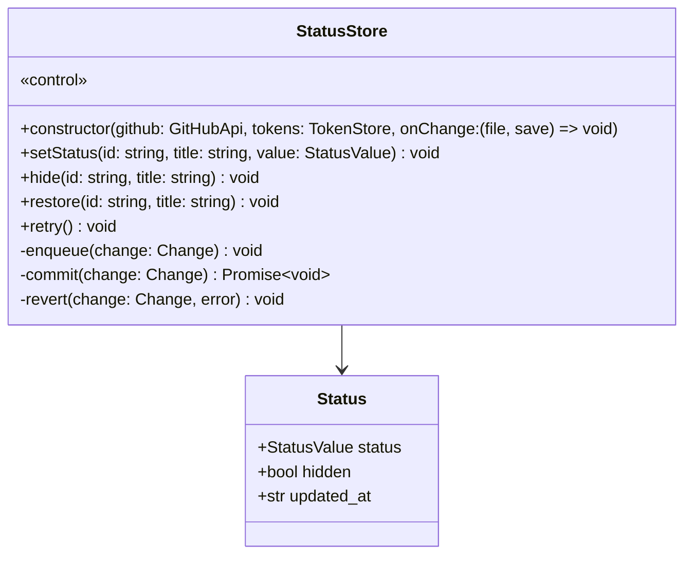

```
mergeChange(file: StatusFile, change: Change, now: string): StatusFile   순수 함수. 그 대회의 값만 얹는다
commitMessage(change: Change): string                                    status: <대회명> → <상태> · 지움 · 되살림. 대회명 60자
```

| 메서드 | 유스케이스 | 실패 |
|---|---|---|
| `setStatus` · `hide` · `restore` | [[CCR-UC-001#UC-H1]] 1 · 1b · 2 | 토큰이 없으면 부르지 않는다(화면이 막는다) |
| `_commit` | [[CCR-UC-001#UC-H1]] 3 · 4 · 5 · 4a · 4b | 409 · 422면 한 번 다시 읽고 다시 쓴다. 그래도 실패하거나 다른 오류면 `_revert` |
| `retry` | [[CCR-UI-001#UI-1]] 12.2 | 마지막으로 실패한 바꿈을 다시 `_commit` |

**규칙이 사는 곳**
- 화면을 먼저 바꾼다. `onChange`로 얹은 파일과 저장 중을 알린 뒤 커밋한다([[CCR-UC-001#UC-H1]] 2).
- 한 번에 요청 하나. 앞 커밋의 응답이 오기 전의 바꿈은 큐에 서고 차례로 보낸다. 같은 판으로 두 번 보내면 둘째가 409로 거절되기 때문이다([[CCR-API-001]] 1.4).
- 커밋마다 판 읽기부터 한다. raw로 읽은 파일은 표시용이고 쓰기의 기준이 아니다([[CCR-INFRA-001]] 6.4). 읽은 파일에 이번 바꿈만 얹어 쓴다. 다른 기기가 바꾼 다른 대회의 값은 남는다.
- 판이 어긋나면(409 · 422) 최신 판을 다시 읽고 한 번 더 쓴다. 다시 실패하면 값을 되돌리고 실패를 알린다. 5xx · 연결 오류 · 401 · 403은 되돌리고 알린다. 스스로 되풀이하지 않는다([[CCR-API-001]] 2.3).
- 되돌리기는 바꾸기 전 값으로다. 큐에 남은 바꿈은 버리고 함께 알린다.
- 성공한 응답의 `content.sha`를 기억하되, 다음 커밋도 판 읽기부터 한다. 기억한 판은 로그에도 찍지 않는다.

#### RepoFiles 저장소 파일 읽기 · 쓰기

`api/data.ts`와 `api/github.ts`. 페이지가 바깥에 거는 요청은 이 둘뿐이다([[CCR-INFRA-001]] 8.11).

```
api/data.ts
  readListFile(): Promise<ListEntry[]>              raw. 404면 []. 줄마다 JSON, 읽히지 않는 줄은 건너뛴다
  readStatusFile(): Promise<StatusFile>             raw. 404면 {}
  parseListFile(text: string): ListEntry[]          순수 함수. 식별자가 겹치면 앞의 것
  parseStatusFile(text: string): StatusFile         순수 함수. 객체가 아니면 DataReadError
api/github.ts
  readStatusVersion(token: string): Promise<StatusVersion>                 GET contents. 404면 {sha: null, file: {}}
  writeStatusFile(token: string, file: StatusFile, sha: string | null, message: string): Promise<string>   PUT contents. 새 sha
  encodeStatusFile(file: StatusFile): string        순수 함수. 키 정렬 · 두 칸 들여쓰기 · 끝 줄바꿈 · UTF-8 Base64
  decodeContent(base64: string): string             순수 함수. 줄바꿈 뗀 뒤 디코딩
```

| 함수 | 엔드포인트 | 유스케이스 |
|---|---|---|
| `readListFile` · `readStatusFile` | [[CCR-API-001#GET/raw.githubusercontent.com/…/data/{file}]] | [[CCR-UC-001#UC-A2]] 1 |
| `readStatusVersion` | [[CCR-API-001#GET/api.github.com/…/contents/data/status.json]] | [[CCR-UC-001#UC-H1]] 3 · 4a · [[CCR-UC-001#UC-H2]] 4 |
| `writeStatusFile` | [[CCR-API-001#PUT/api.github.com/…/contents/data/status.json]] | [[CCR-UC-001#UC-H1]] 4 |

**규칙이 사는 곳**
- raw 주소에는 `?t=<현재 시각 ms>`를 붙인다. `Authorization`을 보내지 않는다. 5xx · 연결 오류면 한 번 다시 받고, 그래도 실패하면 `DataReadError`다([[CCR-API-001]] 1.4 · 2.3).
- Contents API에는 헤더 셋을 보낸다. 토큰은 `Authorization` 헤더에만 있고 주소 · 콘솔 · 오류 메시지에 싣지 않는다([[CCR-INFRA-001]] 5.8).
- `writeStatusFile`은 `sha`가 `null`이면 `sha` 없이 보내 새 파일을 만든다. `committer` · `author`는 보내지 않는다.
- 200 · 201이 아니면 `GitHubError(status)`를 낸다. 가르는 일은 `StatusStore`가 한다.

#### TokenStore 토큰 보관

`store/token.ts`. `localStorage`의 키 하나(`ccr.token`)다([[CCR-INFRA-001]] 5.8).

```
TokenStore
  get(): string | null
  set(token: string): void
  clear(): void
  has(): boolean
```

**규칙** — 값은 `localStorage`에만 둔다. 쿠키 · 주소 · 콘솔에 두지 않는다. `localStorage`에 닿지 못하는 브라우저(사생활 보호 모드 등)에서는 `get`이 `null`이고 `set`은 조용히 실패한 뒤 `has`가 거짓이다. 페이지는 읽기만 되는 상태로 돈다.

## 5. 판단한 것

**결정 1. 묶음의 접수마감일은 구성원 가운데 가장 늦은 값이다.** 도메인 모델 6장의 미결이었다. 오늘 마감인지 가를 때만 쓴다(판별을 미루는 날의 예외). 가장 늦은 값으로 보면, 오늘 마감인 구성원이 다음 날 마감 판정에서 빠져도 나머지 구성원이 남아 대회를 잃지 않는다. 그래서 그 묶음은 미뤄도 된다. 목록 항목에는 여전히 대표의 값이 들어간다.

**결정 2. 결과가 다른 둘과 함께 확실하게 같으면 남김으로 적는다.** 도메인 모델 6장의 미결이었다. 예를 들어 버림 기록과 목록 항목이 같은 대회일 때다. 목록에 항목이 있는 대회를 버림으로 적으면, 관리자가 버림을 비울 때 그 대회가 다시 판별돼 항목이 하나 더 생긴다. 남김은 버림을 비울 때도 지우지 않는다([[CCR-UC-001#UC-A4]]).

**결정 3. HTML 파서는 `selectolax`다.** 도메인 모델 6장 · [[CCR-INFRA-001]] 9장의 미결이었다. 정적 HTML 두 곳(wevity · 콘테스트코리아)의 CSS 선택자만 쓰고, AI팩토리는 페이로드를 정규식과 JSON으로 읽어 파서가 필요 없다. 둘 다 짜 본 결과 선택자 문법이 같았고, selectolax가 가볍고 빠르다.

**결정 4. 목록 경계는 포트 없이 `crud.py`로 둔다.** 배치 쪽 구현은 파일 하나를 읽고 추가분에 더하는 것뿐이고 바뀔 계획이 없다. 테스트는 임시 폴더의 파일로 본다. 소스와 판별 모델에만 포트를 둔 것은 구현이 여섯이거나(소스), 테스트가 모델 호출 없이 선별을 돌려야 하기(판별) 때문이다. 노션 때 있던 HTTP 층(`infra/notion.py`)은 함께 없앴다. 배치가 저장소에 HTTP로 거는 요청은 없다.

**결정 5. 기록 경계가 데이터 폴더를 스스로 꺼낸다(`prepare`).** 기본 브랜치가 아닌 실행이 origin/main 최신 판을 읽어야 하는데([[CCR-UC-001#UC-A1]] 1b7), 워크플로에 스텝을 더하면 로컬 실행에는 그 스텝이 없다. git으로 꺼내는 일을 기록 경계에 두면 Actions의 브랜치 실행과 개발자 PC가 같은 길을 탄다. 꺼내지 못하면 처리 이력 읽기 실패로 끝난다. 목록 파일도 같은 사본에 함께 꺼낸다. 목록 경계에 같은 일을 또 두면 git을 두 번 부르고, 두 경계가 서로 다른 판을 읽을 수 있다. `Pipeline`이 `RecordService.start`를 먼저 부르는 차례로 의존을 만들지 않는다(3.1).

**결정 6. 판별 스레드의 결과는 한 흐름이 받는다.** 추가분 파일은 한 곳만 쓴다는 [[CCR-INFRA-001]] 6.2를 지키기 위해서다. 판별 스레드는 답만 돌려주고, 받는 쪽이 받은 차례대로 버림을 적는다.

**결정 7. 같은 대회는 문턱 0.90으로 가르고, 모든 짝이 같을 때만 묶는다(사용자 결정, 2026-09-28).** 이 문서 6장의 미결이었다. 2026-09-27 후보 321건에서 문턱 0.80 · 사슬 규칙은 서로 다른 아이디어 공모전 스무 건을 한 묶음으로 만들었다. 새 규칙으로는 여럿인 묶음 59개 가운데 57개가 실제로 같은 대회였고, 가장 큰 묶음은 세 건이었다. 대가로 0.80~0.90 사이의 옳은 짝 10개가 갈려 목록에 항목이 둘 생길 수 있다. 숫자와 까닭은 [[CCR-PRD-001]] 5.2다. `group`은 두 묶음을 합칠 때 가로지르는 짝이 모두 같음 집합에 있는지 본다. 묶음이 작아(대개 둘) 모든 짝을 봐도 비용이 없다. 아는 대회와 견주는 `_matches`의 조건은 바꾸지 않았다([[CCR-UC-001#UC-S4]] 5).

**결정 8. wevity는 쪽의 마지막 공고가 `마감`일 때 분야를 멈춘다.** 목록 위쪽 홍보 칸에 마감된 공고가 남으면, `마감`이 하나라도 보일 때 멈추던 처음 규칙은 뒤쪽의 접수 중 공고를 놓친다. 2026-09-28 아침에는 웹/모바일/IT와 논문/리포트의 2쪽 22건을 놓쳤다([[CCR-API-001#GET/www.wevity.com/?c=find]]). 모두 마감인 쪽까지 읽는 방법은 분야마다 한 쪽씩 늘어 쪽 상한 20에 가까워져 쓰지 않았다.

**결정 9. 페이지는 도메인 폴더 없이 계층(`pages · components · api · store`)으로만 나눈다(2026-09-29).** 화면이 하나이고 읽고 쓰는 개념이 둘뿐이다. 배치의 네 경계 가운데 페이지가 닿는 것은 목록 경계의 두 개념이고, 그마저 파일 형식(ERD)으로만 이어진다([[CCR-DOM-001]] 4.2). 배치와 코드를 나누어 갖지 않으므로 `ListEntry`가 파이썬과 TypeScript에 각각 있다. 둘 다 ERD를 따르고, 한쪽을 고치면 다른 쪽도 고친다.

**결정 10. 상태 파일에 쓰는 길은 `StatusStore` 하나다(2026-09-29).** 상태 · 지우기 · 되살리기가 각자 커밋하면 같은 판으로 두 요청이 나가 둘째가 409로 거절된다([[CCR-API-001]] 1.4). 한 클래스가 큐를 갖고 하나씩 보내면 화면은 먼저 바뀌고 커밋은 차례로 들어간다. 여럿을 잠깐 모아 한 커밋으로 보내는 것은 UI 명세 5장의 미결로 남겼다.

**결정 11. 페이지 테스트는 브라우저 없는 순수 모듈만 vitest로 본다(2026-09-29).** 파싱 · 정렬 · 상태 얹기 · 커밋 메시지 · Base64가 그것이다. 화면은 사용자가 요소 번호대로 눌러 확인한다(싱크독 규약 DEV-14). 브라우저 테스트 도구를 더하면 의존성과 CI 시간이 늘고, 화면이 하나라 얻는 것이 적다.

## 6. 미결사항

2026-09-28에 같은 대회 판정 규칙(결정 7)과 wevity의 두 미결을 닫았다. 아침 보정값은 09:02에 −1로 쟀고, 상세의 `viewok` 302는 API 명세에 적었다([[CCR-API-001#GET/www.wevity.com/?c=find&gbn=view]]). 2026-09-29에 노션 경계를 목록 경계로 바꾸고 페이지의 구조를 더했다(결정 9 · 10 · 11).

- [ ] Kaggle 어댑터는 실측 전이다. 토큰이 생기면 [[CCR-API-001]] 5장대로 필드 이름 · 연습용 표기 · 쪽 크기를 실측하고 `kaggle.py`를 맞춘다. 그때까지는 토큰이 없어 설정 누락으로 건너뛴다
- [ ] 처리 이력이 커질 때 아는 대회 가르기의 시간. 기록 5,000줄 · 후보 600건으로 흉내 내 2.2초였다. 연 수천 줄이면 몇 해는 넉넉하다([[CCR-DOM-001]] 6장의 덜어내기 미결과 함께 본다)
- [ ] 페이지의 `ListEntry` 타입을 ERD에서 만들어 낼지. 지금은 파이썬과 TypeScript에 손으로 같게 적는다(결정 9). 필드가 늘면 그때 본다
