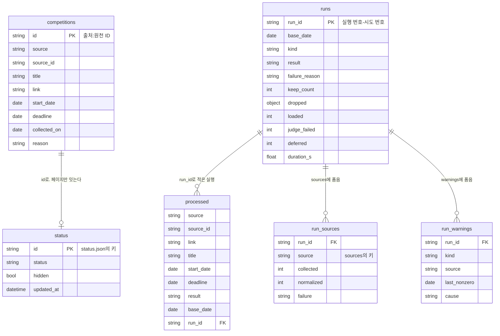

# ERD·DD — 대회 수집 배치

## 0. 이 문서가 다루는 것

배치와 대회 목록 페이지가 읽고 쓰는 데이터의 모양을 정한다. 데이터베이스는 없다([[CCR-INFRA-001#C4]]). 그 자리에 저장소 `data/`의 **데이터 파일 넷**이 있다([[CCR-INFRA-001]] 6.2). 2026-09-29까지 있던 노션 `대회목록`은 목록 파일과 상태 파일로 갈라져 들어왔다.

| 테이블 | 실체 | 쓰는 쪽 | 읽는 쪽 |
|---|---|---|---|
| `competitions` | `data/competitions.jsonl`. 한 줄이 목록 항목 하나 | 배치(추가분) → 마무리 단계가 커밋 | 배치 · 마무리 단계 · 페이지 · 관리자 |
| `status` | `data/status.json`. 객체 하나. 키가 식별자, 값이 상태 하나 | 페이지(Contents API로 커밋) | 페이지 |
| `processed` | `data/processed.jsonl`. 한 줄이 처리 이력 기록 하나 | 배치(추가분) → 마무리 단계가 커밋 | 배치 · 마무리 단계 · 관리자 |
| `runs` | `data/runs.jsonl`. 한 줄이 실행 하나 | 배치(추가분) · 마무리 단계(중단 줄) → 마무리 단계가 커밋 | 배치 · 마무리 단계 · 관리자 |
| `run_sources` | `runs` 한 줄 안의 `sources` 객체 | `runs`와 같다 | 배치(소스 0건 경고) |
| `run_warnings` | `runs` 한 줄 안의 `warnings` 배열 | `runs`와 같다 | 사람 |

**한 곳에 정하고 셋이 따로 따른다.** 배치(`collector`) · 마무리 단계(`finish.py`) · 페이지(`frontend/`)는 코드를 나누지 않고 이 문서를 각자 따른다([[CCR-DOM-001]] 4.2 · [[CCR-INFRA-001]] 8.2 · [[CCR-DOM-002]] 5장 결정 9). 필드 이름을 바꾸면 세 곳을 함께 고친다.

**파일의 공통 형식.** 배치가 쓰는 세 파일은 JSON Lines다. UTF-8, 줄바꿈 LF, 한 줄에 JSON 객체 하나. 빈 줄은 건너뛴다. 상태 파일만 JSON 객체 하나다. 페이지가 통째로 읽고 통째로 다시 쓴다([[CCR-INFRA-001]] 6.2). 네 파일 모두 날짜는 KST 날짜를 `YYYY-MM-DD` 문자열로, 시각은 UTC를 `YYYY-MM-DDTHH:MM:SSZ`로 쓴다. 값이 없으면 `null`이다. 한글은 이스케이프하지 않는다(`ensure_ascii=false`).

**자유 문장은 판별 근거 한 줄뿐이다.** 네 파일은 공개 저장소에 커밋되고 git 이력에서 지워지지 않는다. 예외 메시지 · URL 경로의 오류 본문 · 원문 실패 사유는 로그에만 간다([[CCR-INFRA-001]] 5.4). 대회명과 링크는 원래 공개된 정보라 적는다. 판별 근거는 대회명과 분류 이유뿐이라 비밀값이 섞일 자리가 없어 목록 파일에 적는다([[CCR-API-001]] 3.2).

## 1. ERD



`competitions`와 `processed` 사이에는 선이 없다. 목록 항목은 처리 이력 기록과 **값으로만** 이어진다([[CCR-DOM-001#ListEntry]]). 항목마다 그 묶음의 구성원에 `result=keep`인 줄이 있지만, 항목에 실행 식별자를 적지 않고 기록에 항목을 가리키는 값을 두지 않는다. `competitions`에서 `runs`로 가는 선도 없다. `collected_on`에 기준일 값이 들어갈 뿐이다([[CCR-DOM-001#Run]]).

`competitions`와 `status`의 선은 페이지만 쓴다. 배치는 `status`를 읽지도 쓰지도 않는다([[CCR-DOM-001]] 4.2 규칙 3). 상태가 없는 항목은 `시작 전` · 감추지 않음이고, 항목이 없는 상태는 페이지가 무시한다.

`run_sources` · `run_warnings`는 따로 된 파일이 아니다. `runs` 한 줄 안에 들어 있는 것을 표로 풀어 적었다(3장).

## 2. DD (데이터 사전)

#### competitions

클래스: [[CCR-DOM-002#ListEntry]]

목록 파일. 사람이 페이지에서 보는 대회 한 줄이자 배치가 이미 아는 대회를 가르는 근거다([[CCR-DOM-001#ListEntry]] · [[CCR-UC-001#UC-S6]]). 묶음의 대표 하나가 한 줄이고, 배치는 더하기만 한다.

| 컬럼 | 타입 | 제약 | 의미 | 예시 |
|---|---|---|---|---|
| id | string | 필수 · 유일 | 식별자. `<source>:<source_id>`([[CCR-PRD-001]] 5.1). 상태 파일의 키이고 페이지와 마무리 단계가 그대로 쓴다 | `AI팩토리:9304` |
| source | string | 필수 | 소스 이름. `SourceName` 여섯 가운데 하나 | `AI팩토리` |
| source_id | string | 필수 | 그 소스의 원천 ID. 원천 ID를 읽지 못한 공고는 절대 링크 | `9304` |
| title | string | 필수 | 대표의 대회명. Kaggle은 영문 원문 그대로 | `2026 국립공원 위성 모니터링 AI 챌린지` |
| link | string | 필수 | 대표의 상세 링크 | `https://aifactory.space/competitions/9304` |
| start_date | date? | | 접수시작일. 모르면 `null` | `2026-07-31` |
| deadline | date? | | 접수마감일. 모르면 `null`. 페이지는 `null`을 맨 뒤에 둔다 | `2026-10-06` |
| collected_on | date | 필수 | 만든 실행의 기준일. 실행 도중 자정을 넘겨도 바꾸지 않는다 | `2026-09-29` |
| reason | string | | 판별 근거 한 줄. 판별 없이 들어온 대회는 그 사정(`판별 실패` · `오늘 마감`). 비면 `""` | `위성 영상 AI 분석 경진대회` |

- **`id`는 두 값에서 만든다.** 배치는 쓸 때 `source`와 `source_id`로 만들어 적고, 읽을 때는 적힌 `id`를 믿지 않고 두 값에서 다시 만든다([[CCR-DOM-002#ListEntry]]). 페이지와 마무리 단계는 `id`를 그대로 쓴다. 두 곳이 `source_id`의 모양(절대 링크일 수 있다)을 몰라도 되게 하기 위해서다.
- **필수 여섯**(`id` · `source` · `source_id` · `title` · `link` · `collected_on`)이 없거나 빈 줄은 마무리 단계가 붙이지 않는다([[CCR-INFRA-001]] 8.2가 식별자 · 대회명 · 링크 · 출처 · 수집일로 부른 것이다. 식별자에 출처와 원천 ID가 든다). 배치는 그런 줄이 있는 목록 파일을 읽지 못한 것으로 보고 실행을 실패로 끝낸다([[CCR-UC-001#UC-S4]] 1b). 페이지는 그 줄만 건너뛴다([[CCR-API-001]] 1.4).
- 날짜가 `YYYY-MM-DD`로 읽히지 않는 줄도 배치는 읽지 못한 것으로 본다.
- **유일.** 같은 `id`의 줄은 하나다. 배치는 시작할 때 읽은 식별자와 이번 실행에 더한 식별자에 없을 때만 더하고, 마무리 단계는 최신 판에 이미 있는 식별자의 추가분 줄을 붙이지 않는다([[CCR-INFRA-001]] 8.2). 그래도 둘 이상이면 손으로 고친 것이고, 페이지는 앞의 것을 쓴다.
- **한 번 들어간 줄은 배치가 다시 손대지 않는다**([[CCR-PRD-001#R6]]). 마감일이 바뀌어도, 마감이 지나도 그대로다. 페이지가 접는다. 상태는 이 파일에 없다.
- 관리자가 손으로 고칠 일은 없다. 되돌릴 때는 처리 이력 · 실행 요약과 같은 커밋의 판으로 함께 되돌린다([[CCR-UC-001#UC-A3]] 2d2).

```json
{"id":"AI팩토리:9304","source":"AI팩토리","source_id":"9304","title":"2026 국립공원 위성 모니터링 AI 챌린지","link":"https://aifactory.space/competitions/9304","start_date":"2026-07-31","deadline":"2026-10-06","collected_on":"2026-09-29","reason":"위성 영상 AI 분석 경진대회"}
```

#### status

클래스: [[CCR-DOM-002#Status]]

상태 파일. 참가자가 페이지에서 바꾼 값이다([[CCR-DOM-001#Status]] · [[CCR-UC-001#UC-H1]]). 파일 전체가 JSON 객체 하나이고, 키가 목록 항목의 `id`, 값이 아래 객체다. 값이 없는 항목은 `not_started` · `hidden=false`다.

| 컬럼 | 타입 | 제약 | 의미 | 예시 |
|---|---|---|---|---|
| (키) | string | 유일 | 목록 항목의 `id` | `AI팩토리:9304` |
| status | string | 필수. `not_started` · `in_progress` · `submitted` · `done` | 상태. 화면에는 `시작 전` · `진행 중` · `제출` · `완료` | `in_progress` |
| hidden | bool | 필수 | 지웠는지. 되살리면 `false`로 둔다. 키를 지우지 않는다 | `false` |
| updated_at | datetime | 필수 | 마지막으로 바꾼 시각. UTC, 초 단위 | `2026-09-29T00:12:41Z` |

- **페이지만 쓴다.** 배치도 마무리 단계도 이 파일을 열지 않는다. 배치의 커밋은 다른 세 파일만 담고, 페이지의 커밋은 이 파일만 담는다([[CCR-INFRA-001]] 6.1 · 8.2).
- **쓰는 모양.** 키를 문자열 순으로 정렬하고, 두 칸 들여쓰기, 끝에 줄바꿈 하나. 같은 내용이면 같은 바이트가 되게 해 git 이력에서 바뀐 항목만 보이게 한다([[CCR-API-001#PUT/api.github.com/…/contents/data/status.json]]).
- **통째로 바꾼다.** 페이지는 Contents API로 최신 판을 읽고, 바꾼 항목만 얹어 파일 전체를 다시 쓴다. 판(`sha`)이 어긋나면 다시 읽고 한 번 더 쓴다([[CCR-API-001]] 2.3). 다른 기기가 바꾼 다른 항목의 값은 남는다.
- **읽히지 않는 파일.** 객체가 아니면 페이지가 읽지 못했다고 알린다. 값이 위 모양이 아닌 항목은 `not_started` · `hidden=false`로 본다. 목록에 없는 키는 무시하고, 다시 쓸 때도 지우지 않는다(목록 파일을 되돌린 경우, [[CCR-INFRA-001]] 6.2).
- 파일이 없으면 빈 객체다. 첫 쓰기가 만든다.

```json
{
  "AI팩토리:9304": {"status": "in_progress", "hidden": false, "updated_at": "2026-09-29T00:12:41Z"},
  "event-us:135608": {"status": "not_started", "hidden": true, "updated_at": "2026-09-29T00:13:07Z"}
}
```

#### processed

클래스: [[CCR-DOM-002#HistoryRecord]]

처리 이력. 판별했거나(남김 · 버림) 이미 아는 대회와 확실하게 같다고 확인한 공고 하나가 한 줄이다([[CCR-DOM-001#HistoryRecord]]). 묶음의 구성원마다 한 줄이다.

| 컬럼 | 타입 | 제약 | 의미 | 예시 |
|---|---|---|---|---|
| source | string | 필수 | 소스 이름. `SourceName` 여섯 가운데 하나 | `AI팩토리` |
| source_id | string | 필수 | 그 소스의 원천 ID. 원천 ID를 읽지 못한 공고는 절대 링크 | `9304` |
| link | string? | | 상세 링크 | `https://aifactory.space/competitions/9304` |
| title | string | | 대회명. 판정 4 · 5단계가 쓴다. 비면 `""` | `2026 국립공원 위성 모니터링 AI 챌린지` |
| start_date | date? | | 접수시작일. 그 공고에 없으면 묶음 대표의 값, 대표에도 없으면 `null` | `2026-07-31` |
| deadline | date? | | 접수마감일. 채우는 법은 `start_date`와 같다 | `2026-10-06` |
| result | string | 필수. `keep` · `discard` | 남김 · 버림 | `keep` |
| base_date | date? | | 적은 실행의 기준일. 마무리 단계는 이 값이 없어도 받는다 | `2026-09-29` |
| run_id | string | 필수 | 적은 실행의 식별자 | `18234567890-1` |

- **필수 넷**(`source` · `source_id` · `result` · `run_id`)이 없거나 빈 줄은 마무리 단계가 붙이지 않는다([[CCR-INFRA-001]] 8.2). 배치는 그런 줄이 있는 처리 이력을 읽지 못한 것으로 보고 실행을 실패로 끝낸다([[CCR-UC-001#UC-S4]] 2b).
- 날짜가 `YYYY-MM-DD`로 읽히지 않거나 `result`가 둘 가운데 하나가 아닌 줄도 배치는 읽지 못한 것으로 본다.
- 배치는 같은 `(source, source_id)`의 줄을 두 번 쓰지 않는다. 자기 기록이 있는 공고는 판정 1단계로 아는 대회가 되고, 아는 대회로 빠진 묶음에서는 자기 기록이 없는 구성원만 적는다. 여럿이면 손으로 고친 것이고, 배치는 모두 아는 대회로 본다.
- 목록 항목의 `id`와 이 줄의 `(source, source_id)`는 같은 값이다. 목록에 항목이 있는 대회는 그 묶음의 구성원에 `keep` 줄이 있다([[CCR-DOM-001#ListEntry]]).
- 관리자가 손으로 고치는 것은 버림 줄을 지우는 것뿐이다([[CCR-UC-001#UC-A4]]). 남김 줄은 지우지 않는다. 지우면 다음 실행이 처리 이력 감소로 멈춘다.

```json
{"source":"AI팩토리","source_id":"9304","link":"https://aifactory.space/competitions/9304","title":"2026 국립공원 위성 모니터링 AI 챌린지","start_date":"2026-07-31","deadline":"2026-10-06","result":"keep","base_date":"2026-09-29","run_id":"18234567890-1"}
```

#### runs

클래스: [[CCR-DOM-002#RunLine]]

실행 요약. 목록에 쓰는 실행 하나가 한 줄이다([[CCR-DOM-001#Run]] · [[CCR-UC-001#UC-S7]]).

| 컬럼 | 타입 | 제약 | 의미 | 예시 |
|---|---|---|---|---|
| run_id | string | 필수 · 유일 | 실행 번호와 시도 번호. `github.run_id`-`github.run_attempt` | `18234567890-1` |
| base_date | date | 필수 | 기준일. 실행이 시작한 시각의 KST 날짜 | `2026-09-29` |
| kind | string | 필수. `schedule` · `manual` | 실행 종류 | `schedule` |
| result | string | 필수. `success` · `failure` · `aborted` | 결과 | `success` |
| failure_reason | string? | 결과가 `failure`일 때만 | `all_sources_failed` · `list_read_failed` · `history_read_failed` · `history_shrank` | `null` |
| keep_count | int | 마무리 단계가 채운다 | 이 실행을 올린 뒤 `processed`에 있는 `result=keep` 줄의 수 | `412` |
| sources | object? | | 소스 이름 → `run_sources` 한 줄. 수집을 시작하지 않은 실행은 `{}` | 아래 예시 |
| dropped | object? | | `normalize` · `expired` · `known` · `discarded`의 건수 | `{"normalize":0,"expired":140,"known":230,"discarded":12}` |
| loaded | int? | | 목록 파일에 더한 항목의 수 | `6` |
| judge_failed | int? | | 판별을 받지 못한 묶음의 수 | `0` |
| deferred | int? | | 다음 실행으로 미룬 묶음의 수 | `0` |
| warnings | array? | | `run_warnings` 한 줄씩 | `[]` |
| duration_s | float? | | 배치가 돈 초. 소수 한 자리 | `93.4` |

- **세는 단위.** `sources`의 `collected`와 `dropped.normalize`는 원본 레코드의 수(AI팩토리는 합치기 전 과제의 수, wevity · 콘테스트코리아는 여러 분야에 올라온 같은 공고를 원천 ID로 합친 뒤의 수), `normalized`와 `dropped.expired`는 대회의 수, 나머지는 묶음의 수다([[CCR-DOM-001#Run]]). `loaded`는 그 실행이 `competitions`에 더한 줄의 수와 같다.
- **없어진 값.** 노션 때 있던 `create_failed`(행 생성 실패)와 실패 사유 `missing_config` · `notion_read_failed` · `due_today_not_loaded`는 2026-09-29에 없앴다. 파일에 더하는 방식에서는 일어날 수 없고, 반드시 있어야 하는 시크릿이 없다([[CCR-UC-001#UC-A1]] 1d1). 그 전에 적힌 줄이 있다면 모르는 필드는 읽을 때 무시한다.
- **중단 줄.** 배치가 줄을 남기기 전에 멈추면 마무리 단계가 `run_id` · `base_date` · `kind` · `result=aborted` · `keep_count` 다섯만 쓴다. 나머지 필드는 없다. 0으로 채우지 않는 것은 소스 0건 판단이 이 줄을 "그 소스를 수집하지 않은 줄"로 건너뛰게 하기 위해서다([[CCR-INFRA-001]] 8.2).
- **`keep_count`.** 배치가 쓰는 추가분에서는 `null`이다. 마무리 단계가 추가분을 얹은 뒤 세어 채운다. 배치는 다음 실행에서 이 값과 `processed`의 남김 줄 수를 견준다([[CCR-UC-001#UC-S4]] 2c).
- **유일.** 같은 `run_id`의 줄은 하나다. 마무리 단계는 올리기 전에 이 식별자의 줄이 이미 있으면 얹지 않는다.
- **읽히지 않는 줄.** JSON이 아니거나 `run_id` · `base_date`가 없는 줄은 건너뛰고 요약 파일 손상 경고를 붙인다([[CCR-UC-001#UC-S7]] 2c).

```json
{"run_id":"18234567890-1","base_date":"2026-09-29","kind":"schedule","result":"success","failure_reason":null,"keep_count":412,"sources":{"event-us":{"collected":39,"normalized":39,"failure":null},"Kaggle":{"collected":0,"normalized":0,"failure":"missing_config"}},"dropped":{"normalize":0,"expired":140,"known":230,"discarded":12},"loaded":6,"judge_failed":0,"deferred":0,"warnings":[],"duration_s":93.4}
{"run_id":"18234567999-1","base_date":"2026-09-30","kind":"schedule","result":"aborted","keep_count":418}
```

#### run_sources

클래스: [[CCR-DOM-002#SourceLine]]

`runs.sources`의 값 하나. 키가 소스 이름이다.

| 컬럼 | 타입 | 제약 | 의미 | 예시 |
|---|---|---|---|---|
| (키) | string | `SourceName` | 소스 이름 | `wevity` |
| collected | int | | 소스가 준 원본 레코드의 수. 세는 단위는 `runs`의 설명 | `168` |
| normalized | int | | 공통 형식으로 맞춘 뒤 대회의 수. 소스 0건 경고는 이 값으로 센다 | `168` |
| failure | string? | `connection` · `http_status` · `format` · `robots` · `missing_config` | 실패의 종류. 성공이면 `null` | `null` |

실패한 소스는 `collected` · `normalized`가 0이고 `failure`가 채워진다. 소스 0건 판단은 `failure`가 있는 값을 건너뛴다([[CCR-UC-001#UC-S7]] 2).

#### run_warnings

클래스: [[CCR-DOM-002#RunWarning]]

`runs.warnings`의 원소 하나([[CCR-DOM-001#Warning]]).

| 컬럼 | 타입 | 제약 | 의미 | 예시 |
|---|---|---|---|---|
| kind | string | 필수. `zero_count` · `judge_deferred` · `summary_corrupt` | 종류. 셋이다 | `zero_count` |
| source | string? | `zero_count`일 때만 | 0건을 낸 소스 | `DACON` |
| last_nonzero | date? | `zero_count`일 때만 | 그 소스가 마지막으로 1건 이상을 낸 기준일 | `2026-09-24` |
| cause | string? | `judge_deferred`일 때만. `missing_key` · `call_failed` | 미룬 원인 | `call_failed` |

해당하지 않는 필드는 쓰지 않는다(키가 없다). 어느 종류도 `result`를 바꾸지 않는다. 노션 때 있던 `create_all_failed` · `due_today_not_loaded`는 없앴다([[CCR-DOM-001#Warning]]).

## 3. 인덱스와 정규화

**인덱스가 없다.** 세 JSON Lines 파일은 실행마다 처음부터 끝까지 한 번 읽는다. 연 수천 줄이라 풀어 읽는 비용이 작다. 찾기는 배치가 읽은 뒤 메모리에 색인을 만들어 한다([[CCR-DOM-002]] 2.4 `KnownSet`). 상태 파일은 객체라 키가 곧 색인이다. 페이지는 항목의 `id`로 바로 찾는다.

| 메모리 색인 | 키 | 찾는 것 |
|---|---|---|
| `by_id` | `(source, source_id)` | 판정 1단계. 목록 항목과 처리 이력 기록 |
| `by_link` | 추적 매개변수를 뗀 링크 | 판정 1단계의 예비. 목록 항목. 소스 개편으로 원천 ID가 바뀐 공고를 잇는다 |
| `by_title` | 정규화한 대회명 | 판정 4단계 |
| `history_ids` | `(source, source_id)` | 자기 기록이 있는 구성원 가리기([[CCR-UC-001#UC-S4]] 6) |

유사도(판정 5단계)는 색인이 없고, 글자 수와 글자 집합으로 0.90에 닿을 수 없는 짝을 먼저 건너뛴다. 기록 5,000줄 · 후보 600건으로 흉내 내 아는 대회 가르기가 2초 안팎이었다(실측, 테스트 아님).

**일부러 정규화를 깬 곳.**

1. **`run_sources` · `run_warnings`를 `runs` 한 줄 안에 품는다.** 실행 하나가 한 줄이어야 마무리 단계가 "이 실행의 줄이 있나"를 한 줄로 가르고, 추가분을 통째로 바꿔 쓸 수 있다. 사람이 파일 하나로 날짜별 비교를 한다([[CCR-RFQ-001#Q15]]).
2. **처리 이력의 구성원 줄에 대표의 날짜를 채운다.** 같은 대회라 날짜도 같다. 날짜 없는 기록은 다음 해 같은 이름의 대회를 3단계로 가르지 못해 해마다 막는다([[CCR-UC-001]] 0.1 · [[CCR-PRD-001]] 5.2).
3. **처리 이력에 대회명 · 링크를 함께 둔다.** 원천 ID만으로는 다른 소스의 같은 대회를 알아보지 못한다. 판정이 대회명을 쓴다.
4. **`keep_count`를 `runs`에 적는다.** `processed`에서 언제든 셀 수 있는 값이지만, 그 실행이 끝났을 때의 수를 남겨야 처리 이력이 줄었는지 견줄 수 있다.
5. **`competitions`에 `id`를 `source` · `source_id`와 함께 적는다.** 두 값에서 만들 수 있는 값이지만, 페이지와 마무리 단계가 원천 ID의 모양을 몰라도 상태 파일의 키와 곧바로 맞출 수 있게 둔다. 배치는 읽을 때 두 값에서 다시 만든다.
6. **목록 항목의 값을 처리 이력에도 둔다.** 대표의 대회명 · 링크 · 날짜가 두 파일에 있다. 목록 파일은 사람이 보는 것이고 처리 이력은 배치의 기억이라, 한쪽을 되돌리거나 손질해도 다른 쪽이 남게 한다([[CCR-INFRA-001]] 6.2).

**상태를 목록과 다른 파일에 둔다.** 정규화의 문제가 아니라 쓰는 쪽이 다르기 때문이다. 목록 파일은 배치가 더하고 상태 파일은 페이지가 쓴다. 한 파일에 두면 두 커밋이 같은 파일을 두고 부딪힌다([[CCR-DOM-001]] 5장 · [[CCR-INFRA-001]] 6.1).

## 4. 미결사항

- [ ] 처리 이력이 커질 때 오래된 기록을 덜어낼지([[CCR-DOM-001]] 6장). 남김 줄을 덜어내면 `keep_count` 견주기에 걸리므로 두 파일을 함께 정해야 한다. 목록 파일도 마감 지난 줄을 덜어낼지 함께 본다([[CCR-INFRA-001]] 9장)
- [ ] `run_warnings`에 판별 미룸의 미룬 건수를 함께 적을지. 지금은 `runs.deferred`에만 있다
- [ ] 상태 파일에서 목록에 없는 키를 언제 치울지. 지금은 페이지가 무시만 하고 지우지 않는다
