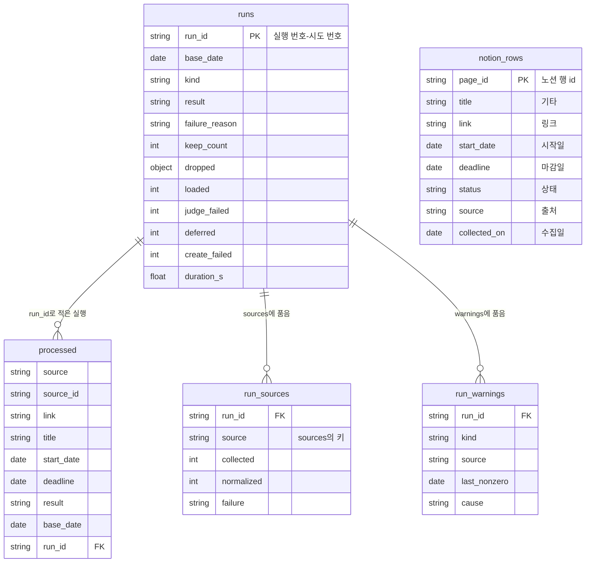

# ERD·DD — 대회 수집 배치

## 0. 이 문서가 다루는 것

배치가 읽고 쓰는 데이터의 모양을 정한다. 데이터베이스는 없다([[CCR-INFRA-001#C4]]). 그 자리에 저장소의 **상태 파일 둘**과 사람이 보는 **노션 `대회목록`** 이 있다.

| 테이블 | 실체 | 쓰는 쪽 | 읽는 쪽 |
|---|---|---|---|
| `processed` | `data/processed.jsonl`. 한 줄이 처리 이력 기록 하나 | 배치(추가분) → 마무리 단계가 커밋 | 배치 · 마무리 단계 · 관리자 |
| `runs` | `data/runs.jsonl`. 한 줄이 실행 하나 | 배치(추가분) · 마무리 단계(중단 줄) → 마무리 단계가 커밋 | 배치 · 마무리 단계 · 관리자 |
| `run_sources` | `runs` 한 줄 안의 `sources` 객체 | `runs`와 같다 | 배치(소스 0건 경고) |
| `run_warnings` | `runs` 한 줄 안의 `warnings` 배열 | `runs`와 같다 | 사람 |
| `notion_rows` | 노션 `대회목록` DB의 행 | 배치는 새 행만 만든다 | 배치 · 참가자 |

**한 곳에 정하고 둘이 따로 따른다.** 배치(`collector`)와 마무리 단계(`finish.py`)는 코드를 나누지 않고 이 문서를 각자 따른다([[CCR-DOM-001]] 4.2 · [[CCR-INFRA-001]] 8.2). 필드 이름을 바꾸면 두 곳을 함께 고친다.

**파일의 공통 형식.** 두 파일 모두 JSON Lines다. UTF-8, 줄바꿈 LF, 한 줄에 JSON 객체 하나. 날짜는 KST 날짜를 `YYYY-MM-DD` 문자열로 쓴다. 값이 없으면 `null`이다. 한글은 이스케이프하지 않는다(`ensure_ascii=false`). 빈 줄은 건너뛴다.

**자유 문장은 쓰지 않는다.** 두 파일은 공개 저장소에 커밋되고 git 이력에서 지워지지 않는다. 예외 메시지 · URL 경로의 오류 본문 · 모델의 판별 근거 · 원문 실패 사유는 로그에만 간다([[CCR-INFRA-001]] 5.4). 대회명과 링크는 원래 공개된 정보라 적는다.

## 1. ERD



`notion_rows`와 다른 테이블 사이에는 선이 없다. 노션 행은 처리 이력 기록과 **값으로만** 이어진다([[CCR-DOM-001#NotionRow]]). 행 id를 처리 이력에 적지 않고, 행에 실행 식별자를 적지 않는다.

`run_sources` · `run_warnings`는 따로 된 파일이 아니다. `runs` 한 줄 안에 들어 있는 것을 표로 풀어 적었다(3장).

## 2. DD (데이터 사전)

#### processed

클래스: [[CCR-DOM-002#HistoryRecord]]

처리 이력. 판별했거나(남김 · 버림) 이미 아는 대회와 확실하게 같다고 확인한 공고 하나가 한 줄이다([[CCR-DOM-001#HistoryRecord]]). 묶음의 구성원마다 한 줄이다.

| 컬럼 | 타입 | 제약 | 의미 | 예시 |
|---|---|---|---|---|
| source | string | 필수 | 소스 이름. `SourceName` 여섯 가운데 하나 | `AI팩토리` |
| source_id | string | 필수 | 그 소스의 원천 ID. 원천 ID를 읽지 못한 공고는 절대 링크 | `9304` |
| link | string? | | 상세 링크 | `https://aifactory.space/competitions/9304` |
| title | string | | 대회명. 판정 4 · 5단계가 쓴다. 비면 `""` | `2026 국립공원 위성 모니터링 AI 챌린지` |
| start_date | date? | | 접수시작일. 그 공고에 없으면 묶음 대표의 값, 대표에도 없으면 `null` | `2026-07-31` |
| deadline | date? | | 접수마감일. 채우는 법은 `start_date`와 같다 | `2026-10-06` |
| result | string | 필수. `keep` · `discard` | 남김 · 버림 | `keep` |
| base_date | date? | | 적은 실행의 기준일. 마무리 단계는 이 값이 없어도 받는다 | `2026-09-28` |
| run_id | string | 필수 | 적은 실행의 식별자 | `18234567890-1` |

- **필수 넷**(`source` · `source_id` · `result` · `run_id`)이 없거나 빈 줄은 마무리 단계가 붙이지 않는다([[CCR-INFRA-001]] 8.2). 배치는 그런 줄이 있는 처리 이력을 읽지 못한 것으로 보고 실행을 실패로 끝낸다([[CCR-UC-001#UC-S4]] 2b).
- 날짜가 `YYYY-MM-DD`로 읽히지 않거나 `result`가 둘 가운데 하나가 아닌 줄도 배치는 읽지 못한 것으로 본다.
- 배치는 같은 `(source, source_id)`의 줄을 두 번 쓰지 않는다. 자기 기록이 있는 공고는 판정 1단계로 아는 대회가 되고, 아는 대회로 빠진 묶음에서는 자기 기록이 없는 구성원만 적는다. 여럿이면 손으로 고친 것이고, 배치는 모두 아는 대회로 본다.
- 관리자가 손으로 고치는 것은 버림 줄을 지우는 것뿐이다([[CCR-UC-001#UC-A4]]). 남김 줄은 지우지 않는다. 지우면 다음 실행이 처리 이력 감소로 멈춘다.

```json
{"source":"AI팩토리","source_id":"9304","link":"https://aifactory.space/competitions/9304","title":"2026 국립공원 위성 모니터링 AI 챌린지","start_date":"2026-07-31","deadline":"2026-10-06","result":"keep","base_date":"2026-09-28","run_id":"18234567890-1"}
```

#### runs

클래스: [[CCR-DOM-002#RunLine]]

실행 요약. 노션에 쓰는 실행 하나가 한 줄이다([[CCR-DOM-001#Run]] · [[CCR-UC-001#UC-S7]]).

| 컬럼 | 타입 | 제약 | 의미 | 예시 |
|---|---|---|---|---|
| run_id | string | 필수 · 유일 | 실행 번호와 시도 번호. `github.run_id`-`github.run_attempt` | `18234567890-1` |
| base_date | date | 필수 | 기준일. 실행이 시작한 시각의 KST 날짜 | `2026-09-28` |
| kind | string | 필수. `schedule` · `manual` | 실행 종류 | `schedule` |
| result | string | 필수. `success` · `failure` · `aborted` | 결과 | `success` |
| failure_reason | string? | 결과가 `failure`일 때만 | `missing_config` · `all_sources_failed` · `notion_read_failed` · `history_read_failed` · `history_shrank` · `due_today_not_loaded` | `null` |
| keep_count | int | 마무리 단계가 채운다 | 이 실행을 올린 뒤 `processed`에 있는 `result=keep` 줄의 수 | `412` |
| sources | object? | | 소스 이름 → `run_sources` 한 줄. 수집을 시작하지 않은 실행은 `{}` | 아래 예시 |
| dropped | object? | | `normalize` · `expired` · `known` · `discarded`의 건수 | `{"normalize":0,"expired":140,"known":230,"discarded":12}` |
| loaded | int? | | 행이 만들어졌다는 응답을 받은 묶음의 수 | `6` |
| judge_failed | int? | | 판별을 받지 못한 묶음의 수 | `0` |
| deferred | int? | | 다음 실행으로 미룬 묶음의 수 | `0` |
| create_failed | int? | | 행 생성에 실패한 묶음의 수 | `0` |
| warnings | array? | | `run_warnings` 한 줄씩 | `[]` |
| duration_s | float? | | 배치가 돈 초. 소수 한 자리 | `93.4` |

- **세는 단위.** `sources`의 `collected`와 `dropped.normalize`는 원본 레코드의 수(AI팩토리는 합치기 전 과제의 수, wevity · 콘테스트코리아는 여러 분야에 올라온 같은 공고를 원천 ID로 합친 뒤의 수), `normalized`와 `dropped.expired`는 대회의 수, 나머지는 묶음의 수다([[CCR-DOM-001#Run]]).
- **중단 줄.** 배치가 줄을 남기기 전에 멈추면 마무리 단계가 `run_id` · `base_date` · `kind` · `result=aborted` · `keep_count` 다섯만 쓴다. 나머지 필드는 없다. 0으로 채우지 않는 것은 소스 0건 판단이 이 줄을 "그 소스를 수집하지 않은 줄"로 건너뛰게 하기 위해서다([[CCR-INFRA-001]] 8.2).
- **`keep_count`.** 배치가 쓰는 추가분에서는 `null`이다. 마무리 단계가 추가분을 얹은 뒤 세어 채운다. 배치는 다음 실행에서 이 값과 `processed`의 남김 줄 수를 견준다([[CCR-UC-001#UC-S4]] 2c).
- **유일.** 같은 `run_id`의 줄은 하나다. 마무리 단계는 올리기 전에 이 식별자의 줄이 이미 있으면 얹지 않는다.
- **읽히지 않는 줄.** JSON이 아니거나 `run_id` · `base_date`가 없는 줄은 건너뛰고 요약 파일 손상 경고를 붙인다([[CCR-UC-001#UC-S7]] 2c).

```json
{"run_id":"18234567890-1","base_date":"2026-09-28","kind":"schedule","result":"success","failure_reason":null,"keep_count":412,"sources":{"event-us":{"collected":39,"normalized":39,"failure":null},"Kaggle":{"collected":0,"normalized":0,"failure":"missing_config"}},"dropped":{"normalize":0,"expired":140,"known":230,"discarded":12},"loaded":6,"judge_failed":0,"deferred":0,"create_failed":0,"warnings":[],"duration_s":93.4}
{"run_id":"18234567999-1","base_date":"2026-09-29","kind":"schedule","result":"aborted","keep_count":418}
```

#### run_sources

클래스: [[CCR-DOM-002#SourceLine]]

`runs.sources`의 값 하나. 키가 소스 이름이다.

| 컬럼 | 타입 | 제약 | 의미 | 예시 |
|---|---|---|---|---|
| (키) | string | `SourceName` | 소스 이름 | `wevity` |
| collected | int | | 소스가 준 원본 레코드의 수. 세는 단위는 `runs`의 설명 | `168` |
| normalized | int | | 공통 형식으로 맞춘 뒤 대회의 수. 소스 0건 경고는 이 값으로 센다 | `168` |
| failure | string? | `connection` · `http_status` · `format` · `robots` · `missing_config` | 실패의 종류. 성공이면 `null` | `null` |

실패한 소스는 `collected` · `normalized`가 0이고 `failure`가 채워진다. 소스 0건 판단은 `failure`가 있는 값을 건너뛴다([[CCR-UC-001#UC-S7]] 2).

#### run_warnings

클래스: [[CCR-DOM-002#RunWarning]]

`runs.warnings`의 원소 하나([[CCR-DOM-001#Warning]]).

| 컬럼 | 타입 | 제약 | 의미 | 예시 |
|---|---|---|---|---|
| kind | string | 필수. `zero_count` · `judge_deferred` · `create_all_failed` · `due_today_not_loaded` · `summary_corrupt` | 종류 | `zero_count` |
| source | string? | `zero_count`일 때만 | 0건을 낸 소스 | `DACON` |
| last_nonzero | date? | `zero_count`일 때만 | 그 소스가 마지막으로 1건 이상을 낸 기준일 | `2026-09-24` |
| cause | string? | `judge_deferred`일 때만. `missing_key` · `call_failed` | 미룬 원인 | `call_failed` |

해당하지 않는 필드는 쓰지 않는다(키가 없다). `due_today_not_loaded`가 있으면 그 줄의 `result`는 `failure`다.

#### notion_rows

클래스: [[CCR-DOM-002#NotionRow]]

노션 `대회목록` DB의 행. 이 문서의 다른 테이블과 달리 배치가 모양을 정하지 않는다. 사람이 쓰는 표이고, 배치는 아래 컬럼을 이름으로 읽고 새 행에 값을 넣는다([[CCR-API-001]] 1.4 · 4.2).

| 컬럼(노션 이름) | 노션 종류 | 제약 | 배치가 | 예시 |
|---|---|---|---|---|
| (행 id) | page id | PK | 읽는다. 판정에는 쓰지 않는다 | |
| `기타` | title | 있어야 한다 | 읽고, 새 행에 대표의 대회명(2,000자에서 자름) | `2026 국립공원 위성 모니터링 AI 챌린지` |
| `링크` | url | 있어야 한다 | 읽고(판정 1단계), 새 행에 대표의 상세 링크 | `https://aifactory.space/competitions/9304` |
| `시작일` | date | 있어야 한다 | 읽고, 새 행에 접수시작일. 모르면 비운다 | `2026-07-31` |
| `마감일` | date | 있어야 한다 | 읽고, 새 행에 접수마감일. 모르면 비운다 | `2026-10-06` |
| `상태` | status | 있어야 하고 `시작 전` 선택지가 있어야 한다 | 새 행에 `시작 전`만 | `시작 전` |
| `출처` | select | 없으면 만든다 | 새 행에 소스 이름 | `AI팩토리` |
| `수집일` | date | 없으면 만든다 | 새 행에 기준일 | `2026-09-28` |
| `결과날` | date | | 쓰지 않는다 | |

- 이름 · 종류가 다르면 행을 만들지 않고 넣으려던 묶음을 모두 행 생성 실패로 센다(행 생성 전면 실패 경고). `출처` · `수집일`만 없으면 노션에 쓰는 실행에서 만든다.
- 배치는 기존 행의 값을 고치지 않고 지우지 않는다([[CCR-PRD-001#R6]]). 새 행 말고는 이 표에 쓰는 것이 없다.
- 날짜는 `date.start`의 날짜 부분이다. 시각이 붙어 있으면 KST 날짜로 바꿔 읽는다.

## 3. 인덱스와 정규화

**인덱스가 없다.** 두 파일은 실행마다 처음부터 끝까지 한 번 읽는다. 연 수천 줄이라 풀어 읽는 비용이 작다. 찾기는 배치가 읽은 뒤 메모리에 색인을 만들어 한다([[CCR-DOM-002]] 2.4 `KnownSet`).

| 메모리 색인 | 키 | 찾는 것 |
|---|---|---|
| `by_id` | `(source, source_id)` | 판정 1단계. 처리 이력 기록 |
| `by_link` | 추적 매개변수를 뗀 링크 | 판정 1단계. 노션 행 |
| `by_title` | 정규화한 대회명 | 판정 4단계 |
| `history_ids` | `(source, source_id)` | 자기 기록이 있는 구성원 가리기([[CCR-UC-001#UC-S4]] 6) |

유사도(판정 5단계)는 색인이 없고, 글자 수와 글자 집합으로 0.90에 닿을 수 없는 짝을 먼저 건너뛴다. 기록 5,000줄 · 후보 600건으로 흉내 내 아는 대회 가르기가 2초 안팎이었다(실측, 테스트 아님).

**일부러 정규화를 깬 곳.**

1. **`run_sources` · `run_warnings`를 `runs` 한 줄 안에 품는다.** 실행 하나가 한 줄이어야 마무리 단계가 "이 실행의 줄이 있나"를 한 줄로 가르고, 추가분을 통째로 바꿔 쓸 수 있다. 사람이 파일 하나로 날짜별 비교를 한다([[CCR-RFQ-001#Q15]]).
2. **처리 이력의 구성원 줄에 대표의 날짜를 채운다.** 같은 대회라 날짜도 같다. 날짜 없는 기록은 다음 해 같은 이름의 대회를 3단계로 가르지 못해 해마다 막는다([[CCR-UC-001]] 0.1 · [[CCR-PRD-001]] 5.2).
3. **처리 이력에 대회명 · 링크를 함께 둔다.** 원천 ID만으로는 다른 소스의 같은 대회를 알아보지 못한다. 판정이 대회명을 쓴다.
4. **`keep_count`를 `runs`에 적는다.** `processed`에서 언제든 셀 수 있는 값이지만, 그 실행이 끝났을 때의 수를 남겨야 처리 이력이 줄었는지 견줄 수 있다.

## 4. 미결사항

- [ ] 처리 이력이 커질 때 오래된 기록을 덜어낼지([[CCR-DOM-001]] 6장). 남김 줄을 덜어내면 `keep_count` 견주기에 걸리므로 두 파일을 함께 정해야 한다
- [ ] `run_warnings`에 판별 미룸의 미룬 건수를 함께 적을지. 지금은 `runs.deferred`에만 있다
