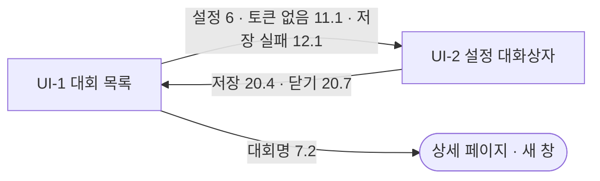

# 화면 설계·와이어프레임 — 대회 목록 페이지

## 0. 이 문서가 다루는 것

사람이 마주하는 화면은 대회 목록 페이지 하나다([[CCR-PRD-001#R10]] · [[CCR-INFRA-001#C14]]). 배치가 저장소에 올린 목록 파일을 보여 주고, 사람이 상태를 바꾸거나 대회를 지우면 상태 파일에 커밋한다. 화면은 둘이다. 목록(UI-1)과, 그 위에 뜨는 설정 대화상자(UI-2)다. 검색·자유 정렬·통계·손으로 추가하기는 두지 않는다([[CCR-PRD-001]] 2장).

와이어프레임은 클로드의 Artifact Design 캔버스에서 1280×800 아트보드로 그렸고, 그 html을 아래 배치 블록에 그대로 옮겼다. 캔버스: https://claude.ai/artifact/UyUFTESag4eF8X3ZyYCjRr (비공개). 쪽 나누기 줄(13)은 2026-10-01에 사용자 요청으로 배치 블록에 바로 더했고 캔버스에는 없다. 배치 블록의 `data-el` 번호가 요소 표의 `#`이다. 표 안의 대회 이름과 날짜는 예시이고, 실측이 없는 값은 `[대회명]`처럼 자리만 잡았다.

정하지 않는 것: 데이터 파일의 필드 이름(ERD), 저장소 API의 모양(API 명세), 컴포넌트와 파일 이름(클래스 명세).

## 1. 유스케이스 대응

| 유스케이스 | 화면 |
|---|---|
| [[CCR-UC-001#UC-A2]] 새로 들어온 대회를 훑고 참가할 것을 고른다 | UI-1 |
| [[CCR-UC-001#UC-H1]] 페이지에서 상태를 바꾸거나 대회를 지운다 | UI-1 |
| [[CCR-UC-001#UC-H2]] 페이지에 토큰을 넣거나 지운다 | UI-2 |

## 2. 화면 목록

| 화면 | 경로 | 한 줄 목적 |
|---|---|---|
| UI-1 대회 목록 | `/` (`https://hoyoungparkme.github.io/competition-crawler/`) | 마감일 순 목록을 보고, 상태를 바꾸고, 관심 없는 대회를 지운다 |
| UI-2 설정 대화상자 | `/`(UI-1 위에 뜸) | 저장소에 쓸 GitHub 토큰을 넣거나 지운다 |

## UI-1 대회 목록

| 항목 | 내용 |
|---|---|
| 경로 | `/` |
| 주 유스케이스 | [[CCR-UC-001#UC-A2]] · [[CCR-UC-001#UC-H1]] |
| 진입 / 이탈 | 주소를 열면 바로 이 화면 / 없음. 링크(7.2)는 새 창으로 열리고, 설정(6)은 이 화면 위에 UI-2를 띄운다 |
| 읽는 것 | 기본 브랜치의 `data/competitions.jsonl`·`data/status.json`([[CCR-INFRA-001]] 6.4) |
| 쓰는 것 | `data/status.json`만. 상태 셀렉트(7.4)·지우기(7.5)·별표(7.7)·되살리기(9.1)가 커밋한다([[CCR-INFRA-001]] 8.11) |

### 배치
```html
<style>
body{margin:0;font-family:"IBM Plex Sans KR",system-ui,sans-serif;background:#f4f2ec;color:#1d1c19}
a{color:#1f5f6b}a:hover{color:#143f47}
.cc-top{display:flex;align-items:center;gap:16px;padding:0 0 16px;border-bottom:1px solid #d9d5cb}
.cc-top h1{margin:0;font-size:22px;font-weight:600;letter-spacing:-0.01em}
.cc-sub{font-size:13px;color:#5c594f}
.cc-btn{font:inherit;font-size:14px;padding:9px 14px;border-radius:8px;border:1px solid #c9c4b7;background:#fff;color:#1d1c19;cursor:pointer;min-height:40px}
.cc-btn.primary{background:#1f5f6b;border-color:#1f5f6b;color:#fff}
.cc-btn.ghost{border-color:transparent;background:transparent;color:#5c594f}
.cc-sel{font:inherit;font-size:14px;padding:8px 10px;border-radius:8px;border:1px solid #c9c4b7;background:#fff;color:#1d1c19;min-height:40px}
.cc-bar{display:flex;align-items:center;gap:12px;padding:14px 0}
.cc-bar label{font-size:13px;color:#5c594f;display:flex;align-items:center;gap:6px}
.cc-tbl{width:100%;border-collapse:collapse;background:#fff;border:1px solid #d9d5cb;border-radius:10px;overflow:hidden}
.cc-tbl th{font-size:12px;font-weight:600;color:#5c594f;text-align:left;padding:10px 14px;background:#faf9f5;border-bottom:1px solid #d9d5cb}
.cc-tbl td{padding:12px 14px;border-bottom:1px solid #eceae3;font-size:14px;vertical-align:middle}
.cc-tbl tr:last-child td{border-bottom:0}
.cc-due{font-variant-numeric:tabular-nums;white-space:nowrap}
.cc-due.soon{color:#a13f1d;font-weight:600}
.cc-src{display:inline-block;font-size:12px;padding:2px 8px;border-radius:999px;background:#ecebe4;color:#3f3d36}
.cc-note{font-size:12px;color:#7a766b;margin-top:4px}
.cc-state{font:inherit;font-size:13px;padding:6px 8px;border-radius:8px;border:1px solid #c9c4b7;background:#fff;min-height:36px}
.cc-state.s1{background:#e6eef0;border-color:#9fbcc3}
.cc-state.s2{background:#e3ecdd;border-color:#8fae82}
.cc-state.s3{background:#ebe5f3;border-color:#b4a5cc}
.cc-state.s4{background:#ecebe4;border-color:#c9c4b7;color:#57534a}
.cc-star{border:0;background:transparent;color:#57534a;font-size:18px;line-height:1;padding:0 6px 0 0;cursor:pointer}
.cc-star.on{color:#a8650f}
tr.skipped .cc-due,tr.skipped a,tr.skipped .cc-note,tr.skipped .cc-src{opacity:.55}
.cc-fold{margin-top:16px;border:1px dashed #c9c4b7;border-radius:10px;padding:12px 14px;display:flex;align-items:center;gap:12px;font-size:14px;color:#5c594f;background:#faf9f5}
.cc-pager{display:flex;align-items:center;gap:12px;padding-top:12px}
.cc-range{font-size:13px;color:#5c594f}
.cc-size{font-size:13px;color:#5c594f;display:flex;align-items:center;gap:6px}
.cc-pageno{font-variant-numeric:tabular-nums;min-width:4em;text-align:center}
.cc-foot{display:flex;justify-content:space-between;align-items:center;padding-top:14px;font-size:12px;color:#7a766b}
.cc-toast{display:inline-flex;align-items:center;gap:8px;font-size:13px;padding:6px 12px;border-radius:8px;background:#fff7e6;border:1px solid #e3c98a;color:#5b4200}
</style>
<style>
body{margin:0;font-family:"IBM Plex Sans KR",system-ui,sans-serif;background:#f4f2ec;color:#1d1c19}
a{color:#1f5f6b}a:hover{color:#143f47}
.cc-btn{font:inherit;font-size:14px;padding:9px 14px;border-radius:8px;border:1px solid #c9c4b7;background:#fff;color:#1d1c19;cursor:pointer;min-height:40px}
.cc-btn.primary{background:#1f5f6b;border-color:#1f5f6b;color:#fff}
.cc-card{background:#fff;border:1px solid #d9d5cb;border-radius:10px;padding:16px 18px;display:flex;flex-direction:column;gap:10px}
.cc-cap{font-size:12px;color:#7a766b;text-transform:none;letter-spacing:.02em}
.cc-empty{text-align:center;padding:36px 16px;color:#5c594f;font-size:14px;line-height:1.6;border:1px dashed #c9c4b7;border-radius:10px;background:#faf9f5}
.cc-alert{display:flex;align-items:center;gap:10px;font-size:13px;padding:10px 12px;border-radius:8px}
.cc-alert.warn{background:#fff7e6;border:1px solid #e3c98a;color:#5b4200}
.cc-alert.err{background:#fbe9e4;border:1px solid #d9a898;color:#6b2412}
.cc-alert.info{background:#e6eef0;border:1px solid #9fbcc3;color:#163e46}
.cc-alert .sp{flex-grow:1}
.cc-row{display:flex;align-items:center;gap:12px;padding:10px 12px;border:1px solid #eceae3;border-radius:8px;font-size:14px;background:#fff}
.cc-state{font:inherit;font-size:13px;padding:6px 8px;border-radius:8px;border:1px solid #c9c4b7;background:#fff;min-height:36px}
</style>
<style>
.var{font:12px/1.4 system-ui,sans-serif;color:#7a766b;margin:20px 0 6px;padding-top:12px;border-top:1px solid #d9d5cb}
.cc-board{background:#f4f2ec;padding:24px 28px;border:1px solid #d9d5cb;border-radius:12px;display:flex;flex-direction:column;gap:10px}
</style>
<div data-el="0" style="width: 100%; max-width: 1280px; min-height: 800px; box-sizing: border-box; padding: 32px 40px; display: flex; flex-direction: column; gap: 0; background: #f4f2ec;">
  <header class="cc-top" data-el="1">
    <div style="display: flex; flex-direction: column; gap: 4px;">
      <h1 data-el="1.1">대회 목록</h1>
      <span class="cc-sub" data-el="1.2">마감일 순 · 2026-09-29 09:12 갱신 · 열린 대회 40</span>
    </div>
    <div style="flex-grow: 1;"></div>
    <span class="cc-toast" data-el="8"><svg width="14" height="14" viewBox="0 0 24 24" fill="none" stroke="currentColor" stroke-width="2"><circle cx="12" cy="12" r="9"></circle><path d="M12 7v5l3 2"></path></svg>저장 중…</span>
    <button class="cc-btn ghost" data-el="2" type="button">새로 고침</button>
    <button class="cc-btn" data-el="6" type="button" aria-label="설정">설정</button>
  </header>

  <div class="cc-bar" data-el="3">
    <label>출처 <select class="cc-sel" data-el="3.1"><option>전체</option><option>event-us</option><option>DACON</option><option>Kaggle</option><option>wevity</option><option>AI팩토리</option><option>콘테스트코리아</option></select></label>
    <label>상태 <select class="cc-sel" data-el="3.2"><option>전체</option><option>시작 전</option><option>진행 중</option><option>제출</option><option>완료</option><option>미참</option></select></label>
    <label><input type="checkbox" data-el="3.3"> 마감 지남·지운 대회 보기</label>
    <label><input type="checkbox" data-el="3.4"> 별표만 보기</label>
  </div>

  <table class="cc-tbl" data-el="7">
    <thead>
      <tr><th style="width: 120px;">마감</th><th>대회명</th><th style="width: 130px;">출처</th><th style="width: 110px;">수집일</th><th style="width: 130px;">상태</th><th style="width: 80px;"></th></tr>
    </thead>
    <tbody>
      <tr>
        <td class="cc-due soon" data-el="7.1">10-06 (D-7)</td>
        <td><button class="cc-star on" type="button" data-el="7.7" aria-label="별표 떼기">★</button><a href="https://aifactory.space/" data-el="7.2">2026 국립공원 위성 모니터링 AI 챌린지</a><div class="cc-note" data-el="7.6">위성 영상 AI 분석 경진대회</div></td>
        <td><span class="cc-src" data-el="7.3">AI팩토리</span></td>
        <td class="cc-due">09-16</td>
        <td><select class="cc-state s2" data-el="7.4"><option>시작 전</option><option selected>진행 중</option><option>제출</option><option>완료</option><option>미참</option></select></td>
        <td><button class="cc-btn ghost" data-el="7.5" type="button">지우기</button></td>
      </tr>
      <tr>
        <td class="cc-due">10-14</td>
        <td><button class="cc-star" type="button" aria-label="별표 붙이기">☆</button><a href="#">[대회명]</a><div class="cc-note">[판별 근거 한 줄]</div></td>
        <td><span class="cc-src">event-us</span></td>
        <td class="cc-due">09-29</td>
        <td><select class="cc-state"><option selected>시작 전</option><option>진행 중</option><option>제출</option><option>완료</option><option>미참</option></select></td>
        <td><button class="cc-btn ghost" type="button">지우기</button></td>
      </tr>
      <tr>
        <td class="cc-due">10-31</td>
        <td><button class="cc-star" type="button" aria-label="별표 붙이기">☆</button><a href="#">[대회명]</a><div class="cc-note">[판별 근거 한 줄]</div></td>
        <td><span class="cc-src">DACON</span></td>
        <td class="cc-due">09-29</td>
        <td><select class="cc-state"><option selected>시작 전</option><option>진행 중</option><option>제출</option><option>완료</option><option>미참</option></select></td>
        <td><button class="cc-btn ghost" type="button">지우기</button></td>
      </tr>
      <tr>
        <td class="cc-due">11-20</td>
        <td><button class="cc-star" type="button" aria-label="별표 붙이기">☆</button><a href="#">[Competition title]</a><div class="cc-note">[판별 근거 한 줄]</div></td>
        <td><span class="cc-src">Kaggle</span></td>
        <td class="cc-due">09-27</td>
        <td><select class="cc-state s1"><option>시작 전</option><option>진행 중</option><option selected>제출</option><option>완료</option><option>미참</option></select></td>
        <td><button class="cc-btn ghost" type="button">지우기</button></td>
      </tr>
      <tr class="skipped">
        <td class="cc-due">—</td>
        <td><button class="cc-star" type="button" aria-label="별표 붙이기">☆</button><a href="#">[대회명 · 마감일 없음]</a><div class="cc-note">[판별 근거 한 줄]</div></td>
        <td><span class="cc-src">wevity</span></td>
        <td class="cc-due">09-28</td>
        <td><select class="cc-state s4"><option>시작 전</option><option>진행 중</option><option>제출</option><option>완료</option><option selected>미참</option></select></td>
        <td><button class="cc-btn ghost" type="button">지우기</button></td>
      </tr>
    </tbody>
  </table>

  <nav class="cc-pager" data-el="13">
    <span class="cc-range" data-el="13.1">40개 중 1–20</span>
    <div style="flex-grow: 1;"></div>
    <label class="cc-size">한 번에 <select class="cc-sel" data-el="13.2"><option>10개</option><option selected>20개</option><option>50개</option><option>100개</option></select></label>
    <button class="cc-btn" type="button" data-el="13.3" disabled>이전</button>
    <span class="cc-pageno" data-el="13.4">1 / 2</span>
    <button class="cc-btn" type="button" data-el="13.5">다음</button>
  </nav>

  <div class="cc-fold" data-el="9">
    <svg width="16" height="16" viewBox="0 0 24 24" fill="none" stroke="currentColor" stroke-width="2"><path d="M9 6l6 6-6 6"></path></svg>
    <span>마감 지난 대회 12 · 지운 대회 3 — 접혀 있음. 펼치면 표 끝에 이어진다</span>
  </div>

  <div style="flex-grow: 1;"></div>
  <div class="cc-foot" data-el="1.3">
    <span>목록은 배치가 매일 08:50에 올리고, 상태는 이 페이지가 저장소에 저장한다</span>
    <span>HoyoungParkme/competition-crawler · main</span>
  </div>
</div>

<div class="var">빈 상태 (10) — 배치가 아직 한 번도 돌지 않았거나 목록 파일이 없을 때</div>
<div class="cc-board">
<div class="cc-empty" data-el="10">아직 대회가 없습니다.<br>배치가 매일 08:50에 저장소에 목록을 올립니다. 첫 실행 뒤 다시 열어 주세요.</div>
</div>

<div class="var">토큰 없음 (11) — 상태를 바꾸려 눌렀는데 토큰이 없을 때</div>
<div class="cc-board">
<div class="cc-alert warn" data-el="11">
      <svg width="16" height="16" viewBox="0 0 24 24" fill="none" stroke="currentColor" stroke-width="2"><path d="M12 9v4m0 4h.01M10.3 3.9 2.6 17.2A2 2 0 0 0 4.3 20h15.4a2 2 0 0 0 1.7-2.8L13.7 3.9a2 2 0 0 0-3.4 0z"></path></svg>
      <span>저장하려면 GitHub 토큰이 필요합니다. 읽기는 그대로 됩니다.</span>
      <span class="sp"></span>
      <button class="cc-btn primary" type="button" data-el="11.1">설정 열기</button>
    </div>
    <div class="cc-row"><span style="width: 90px; color: #7a766b;">10-14</span><a href="#" style="flex-grow: 1;">[대회명]</a><select class="cc-state" disabled><option>시작 전</option></select></div>
</div>

<div class="var">저장 중 (8) — 셀렉트를 바꾼 직후. 화면은 먼저 바뀌고 커밋이 끝나면 표시가 사라진다</div>
<div class="cc-board">
<div class="cc-alert info">
      <svg width="16" height="16" viewBox="0 0 24 24" fill="none" stroke="currentColor" stroke-width="2"><circle cx="12" cy="12" r="9"></circle><path d="M12 7v5l3 2"></path></svg>
      <span>저장 중… data/status.json에 커밋하고 있습니다</span>
    </div>
    <div class="cc-row"><span style="width: 90px; color: #7a766b;">10-06</span><a href="#" style="flex-grow: 1;">2026 국립공원 위성 모니터링 AI 챌린지</a><select class="cc-state" style="background: #e3ecdd; border-color: #8fae82;"><option>진행 중</option></select></div>
</div>

<div class="var">저장 실패 (12) — 판이 어긋나 한 번 다시 썼는데도 안 됐거나, 토큰이 거절됐을 때. 값은 바꾸기 전으로 되돌린다</div>
<div class="cc-board">
<div class="cc-alert err" data-el="12">
      <svg width="16" height="16" viewBox="0 0 24 24" fill="none" stroke="currentColor" stroke-width="2"><circle cx="12" cy="12" r="9"></circle><path d="M15 9l-6 6m0-6 6 6"></path></svg>
      <span>저장하지 못했습니다 (401). 토큰이 만료됐거나 권한이 없습니다. 값을 이전으로 되돌렸습니다.</span>
      <span class="sp"></span>
      <button class="cc-btn" type="button" data-el="12.1">설정 열기</button>
      <button class="cc-btn primary" type="button" data-el="12.2">다시 시도</button>
    </div>
    <div class="cc-row"><span style="width: 90px; color: #7a766b;">10-06</span><a href="#" style="flex-grow: 1;">2026 국립공원 위성 모니터링 AI 챌린지</a><select class="cc-state"><option>시작 전</option></select></div>
</div>

<div class="var">접힌 구역을 펼쳤을 때 (9) — 마감 지난 대회와 지운 대회. 지운 대회는 되살리기 버튼이 있다</div>
<div class="cc-board">
<div class="cc-row" style="opacity: .75;"><span style="width: 90px; color: #7a766b;">09-18 지남</span><a href="#" style="flex-grow: 1;">2026 Big Data 활용 대회</a><span style="font-size: 12px; color: #7a766b;">event-us</span><select class="cc-state"><option>완료</option></select><button class="cc-btn" type="button">지우기</button></div>
    <div class="cc-row" style="opacity: .75;"><span style="width: 90px; color: #7a766b;">09-30</span><a href="#" style="flex-grow: 1; text-decoration: line-through;">2026 AI 창업 경진대회</a><span style="font-size: 12px; color: #7a766b;">event-us · 지움</span><button class="cc-btn" type="button" data-el="9.1">되살리기</button></div>
</div>

```

### 요소
| # | 이름 | 종류 | 보여주는 것 | 누르면 |
|---|---|---|---|---|
| 1 | 머리 | 영역 | 제목(1.1)과 요약 줄(1.2: 정렬 기준 · 마지막 갱신 시각 · 열린 대회 수), 바닥 줄(1.3: 데이터가 어디서 오는지) | — |
| 2 | 새로 고침 | 버튼 | — | 두 파일을 다시 읽는다. 목록 파일은 raw로, 상태 파일은 토큰이 있으면 Contents API로 읽는다. raw는 CDN이 5분까지 캐시해 배치가 막 올린 목록은 조금 늦게 보일 수 있다([[CCR-INFRA-001]] 6.4) |
| 3 | 거르기 줄 | 영역 | 출처(3.1)·상태(3.2) 셀렉트와 「마감 지남·지운 대회 보기」(3.3) · 「별표만 보기」(3.4) | 바꾸면 표(7)가 곧바로 걸러지고 첫 쪽으로 간다. 저장소에는 쓰지 않고 브라우저에만 기억한다 |
| 6 | 설정 | 버튼 | 토큰이 없으면 「설정」 옆에 점을 찍어 알린다 | UI-2를 띄운다 |
| 7 | 목록 표 | 표 | 접수마감일 오름차순. 마감일 없는 대회는 맨 뒤. 열: 마감(7.1) · 별표(7.7)와 대회명(7.2), 판별 근거(7.6) · 출처(7.3) · 수집일 · 상태(7.4) · 지우기(7.5). 한 번에 13.2의 개수만큼 보인다. `미참`인 줄은 흐리게 그린다 | — |
| 7.1 | 마감 | 글 | `MM-DD`와 남은 날(D-n). 7일 안이면 강조 | — |
| 7.2 | 대회명 | 링크 | 목록 항목의 대회명. Kaggle은 영문 그대로 | 상세 링크를 새 창으로 연다 |
| 7.3 | 출처 | 칩 | 소스 이름 여섯 가운데 하나 | — |
| 7.4 | 상태 | 셀렉트 | `시작 전` · `진행 중` · `제출` · `완료` · `미참`. 상태 파일에 값이 없으면 `시작 전`. 다섯 값마다 셀렉트의 색이 다르다(3장) | 고르는 즉시 화면이 바뀌고 저장 중(8)이 뜬다. 커밋이 끝나면 사라진다([[CCR-UC-001#UC-H1]]) |
| 7.5 | 지우기 | 버튼 | — | 그 줄이 목록에서 사라지고 접힌 구역(9)으로 간다. 상태 파일에 감춤으로 커밋한다. 목록 파일은 그대로다 |
| 7.6 | 판별 근거 | 글 | 목록 항목의 판별 근거 한 줄. 회색 보조 글(3장) | — |
| 7.7 | 별표 | 버튼 | 대회명 앞. 붙였으면 채운 별(★), 아니면 빈 별(☆) | 붙이거나 뗀다. 화면이 먼저 바뀌고 상태 파일에 커밋한다([[CCR-UC-001#UC-H1]] 1c) |
| 8 | 저장 중 | 표시 | 커밋하는 동안 머리에 뜬다. 여럿을 빨리 바꾸면 하나씩 차례로 보낸다 | — |
| 9 | 접힌 구역 | 영역 | 마감 지난 대회 수와 지운 대회 수. 3.3을 켜거나 여기를 누르면 접힌 줄이 열린 줄 뒤에 이어진다. 지운 대회에는 되살리기(9.1) | 펼치기·접기. 여기를 눌러 펼치면 접힌 줄이 시작하는 쪽으로 넘어간다 |
| 9.1 | 되살리기 | 버튼 | 지운 대회의 줄에만 | 감춤을 풀어 원래 자리로 돌려보낸다. 상태 파일에 커밋한다 |
| 10 | 빈 상태 | 글 | 목록 파일이 없거나 비었을 때 표 대신 | — |
| 11 | 토큰 없음 | 알림 | 7.4·7.5·7.7·9.1을 눌렀는데 토큰이 없을 때. 화면은 바꾸지 않는다 | 「설정 열기」(11.1)가 UI-2를 띄운다 |
| 12 | 저장 실패 | 알림 | 커밋이 끝내 실패했을 때. 값을 바꾸기 전으로 되돌린 뒤 뜬다. 응답 코드와 짧은 이유 | 「다시 시도」(12.2)는 최신 판을 다시 읽고 같은 바꿈을 다시 보낸다. 「설정 열기」(12.1)는 UI-2 |
| 13 | 쪽 나누기 줄 | 영역 | 표(7)와 접힌 구역(9) 사이. 보이는 범위(13.1) · 한 번에 볼 개수(13.2) · 이전(13.3) · 쪽 번호(13.4) · 다음(13.5). 보일 줄이 하나도 없으면 두지 않는다 | — |
| 13.1 | 보이는 범위 | 글 | `40개 중 1–20`. 펼쳐 있으면 접힌 줄까지 센다 | — |
| 13.2 | 한 번에 볼 개수 | 셀렉트 | `10개` · `20개` · `50개` · `100개`. 기본은 20개다. 고른 값은 브라우저에 기억한다 | 바꾸면 보던 첫 줄이 든 쪽으로 간다 |
| 13.3 | 이전 | 버튼 | 첫 쪽이면 누를 수 없다 | 앞 쪽으로 간다. 표 머리가 화면 위로 지나가 있으면 표 머리로 올린다 |
| 13.4 | 쪽 번호 | 글 | `1 / 2`. 지금 쪽과 쪽 수 | — |
| 13.5 | 다음 | 버튼 | 마지막 쪽이면 누를 수 없다 | 다음 쪽으로 간다. 표 머리가 화면 위로 지나가 있으면 표 머리로 올린다 |

### 규칙
- 정렬은 접수마감일 오름차순 하나뿐이다. 마감일이 없는 대회는 맨 뒤에 둔다([[CCR-PRD-001#R10]]). 사용자가 정렬을 바꾸는 장치는 두지 않는다.
- 마감이 지난 대회와 지운 대회는 기본으로 접혀 있고(9), 3.3을 켜면 열린 줄 뒤에 이어진다. 접힌 구역의 줄은 흐리게 그린다.
- 목록은 쪽으로 나눠 보인다(13). 펼친 접힌 줄도 같은 쪽을 따른다. 한 번에 볼 개수는 10 · 20 · 50 · 100개 가운데 고르고 기본은 20개다. 고른 개수는 브라우저에만 기억하고, 쪽 번호는 기억하지 않는다. 2026-10-01 사용자 요청으로 더했다.
- 거르기(3)를 바꾸면 첫 쪽으로 가고, 개수(13.2)를 바꾸면 보던 첫 줄이 든 쪽으로 간다. 지우기 · 되살리기로 줄이 줄어 지금 쪽이 비면 마지막 쪽을 보인다.
- 상태 파일에 값이 없는 대회는 `시작 전`으로 보이고, 감추지 않았고 별표가 없는 것으로 본다([[CCR-DOM-001#Status]]).
- `미참`인 줄은 목록에 남되 마감 · 대회명 · 판별 근거 · 출처 · 수집일을 흐리게 그린다. 상태 셀렉트와 단추는 흐리게 하지 않는다. 미참과 별표는 2026-10-01 사용자 요청으로 더했다([[CCR-PRD-001#R10]]).
- 별표만 보기(3.4)는 거르기라 브라우저에만 기억한다. 별표 자체(7.7)는 상태처럼 상태 파일에 커밋한다.
- 상태를 바꾸거나 지우면 **화면을 먼저 바꾸고** 커밋한다. 판이 어긋나면(409·422) 최신 상태 파일을 다시 읽고 이번 바꿈만 얹어 한 번 더 쓴다. 그래도 실패하면 값을 되돌리고 12를 띄운다([[CCR-UC-001#UC-H1]] 4a · 4b).
- 커밋 메시지는 페이지가 만든다. `status: <대회명> → <상태>` 꼴이고, 별표는 `status: <대회명> 별표` · `status: <대회명> 별표 뗌`이다([[CCR-INFRA-001]] 8.11 · [[CCR-API-001]] 1.4).
- 토큰이 없으면 읽기는 그대로 되고, 쓰는 조작을 하면 11이 뜬다. 화면 값은 바꾸지 않는다([[CCR-UC-001#UC-A2]] 4b).
- 목록에 없는 식별자의 상태 값은 무시한다([[CCR-INFRA-001]] 6.2).
- 페이지는 외부 스크립트를 싣지 않는다. 폰트는 Google Fonts `css2` 링크 하나다([[CCR-INFRA-001]] 5.6).
- 요청 주소·콘솔 로그에 토큰을 싣지 않는다([[CCR-INFRA-001]] 5.8).

### 시나리오
**S-1 아침에 훑고 상태를 바꾼다** — [[CCR-UC-001#UC-A2]] · [[CCR-SCN-001#S8]]
1. 페이지를 연다. 두 파일을 읽어 표(7)를 마감일 순으로 그린다.
2. 수집일이 오늘인 줄을 훑고, 관심 가는 대회의 링크(7.2)를 새 창으로 연다.
3. 상태(7.4)를 `진행 중`으로 고른다. 화면이 바뀌고 저장 중(8)이 떴다 사라진다.
4. 관심 없는 대회는 지우기(7.5)를 누른다. 줄이 사라지고 접힌 구역(9)의 수가 하나 는다.

**S-2 토큰 없이 처음 연다** — [[CCR-UC-001#UC-A2]] 4b · [[CCR-UC-001#UC-H2]]
1. 표는 보인다. 상태(7.4)를 바꾸려 하면 토큰 없음(11)이 뜨고 값은 그대로다.
2. 「설정 열기」로 UI-2를 띄워 토큰을 넣는다.
3. 돌아와 다시 고르면 저장된다.

**S-3 다른 기기가 먼저 썼다** — [[CCR-UC-001#UC-H1]] 4a
1. 상태를 바꾼다. 커밋이 판 어긋남으로 거절된다.
2. 페이지가 최신 상태 파일을 다시 읽고 이번 바꿈만 얹어 다시 쓴다. 사용자는 저장 중(8)이 조금 길어진 것만 본다.
3. 그래도 실패하면 값을 되돌리고 저장 실패(12)를 띄운다.

**S-6 목록이 길어 쪽을 넘긴다** — [[CCR-UC-001#UC-A2]]
1. 표에 20개가 보이고, 표 아래 쪽 나누기 줄(13)에 `40개 중 1–20`과 `1 / 2`가 보인다.
2. 다음(13.5)을 누르면 21번째 대회부터 보이고, 화면이 표 머리로 올라간다.
3. 한 번에 볼 개수(13.2)를 50개로 바꾸면 한 쪽에 모두 보인다. 다음에 열어도 50개다.

**S-7 별표를 붙이고 별표만 본다** — [[CCR-UC-001#UC-A2]] · [[CCR-UC-001#UC-H1]] 1c
1. 눈여겨볼 대회의 별표(7.7)를 누른다. 빈 별이 채운 별이 되고 저장 중(8)이 떴다 사라진다.
2. 「별표만 보기」(3.4)를 켜면 별표를 붙인 대회만 남고 첫 쪽으로 간다.
3. 참가하지 않기로 한 대회는 상태(7.4)를 `미참`으로 고른다. 그 줄이 흐려지고 셀렉트가 회색이 된다.

## UI-2 설정 대화상자

| 항목 | 내용 |
|---|---|
| 경로 | `/` (UI-1 위에 뜬다. 주소는 바뀌지 않는다) |
| 주 유스케이스 | [[CCR-UC-001#UC-H2]] |
| 진입 / 이탈 | UI-1의 설정(6)·토큰 없음(11.1)·저장 실패(12.1)에서 / 닫기(20.7)·저장(20.4) 뒤 UI-1로 |
| 쓰는 것 | 브라우저 `localStorage`의 토큰. 저장소에는 아무것도 쓰지 않는다 |

### 배치
```html
<style>
body{margin:0;font-family:"IBM Plex Sans KR",system-ui,sans-serif;background:#f4f2ec;color:#1d1c19}
a{color:#1f5f6b}a:hover{color:#143f47}
.cc-btn{font:inherit;font-size:14px;padding:9px 14px;border-radius:8px;border:1px solid #c9c4b7;background:#fff;color:#1d1c19;cursor:pointer;min-height:40px}
.cc-btn.primary{background:#1f5f6b;border-color:#1f5f6b;color:#fff}
.cc-btn.ghost{border-color:transparent;background:transparent;color:#5c594f}
.cc-btn.danger{color:#8f2f16;border-color:#d9b1a3}
.cc-dim{position:absolute;inset:0;background:rgba(29,28,25,.42);display:flex;align-items:center;justify-content:center}
.cc-dlg{width:560px;background:#fff;border:1px solid #c9c4b7;border-radius:14px;padding:24px 28px;box-shadow:0 20px 50px rgba(0,0,0,.18);display:flex;flex-direction:column;gap:16px}
.cc-dlg h2{margin:0;font-size:18px;font-weight:600}
.cc-dlg p{margin:0;font-size:14px;line-height:1.55;color:#3f3d36}
.cc-dlg ol{margin:0;padding-left:20px;font-size:13px;line-height:1.6;color:#3f3d36}
.cc-in{font:inherit;font-size:14px;padding:10px 12px;border-radius:8px;border:1px solid #c9c4b7;width:100%;box-sizing:border-box;min-height:44px}
.cc-lbl{font-size:13px;color:#5c594f;display:flex;flex-direction:column;gap:6px}
.cc-ok{display:inline-flex;align-items:center;gap:8px;font-size:13px;padding:6px 12px;border-radius:8px;background:#e3ecdd;border:1px solid #8fae82;color:#25451b}
.cc-ghosttbl{opacity:.55;filter:saturate(.6)}
.cc-ghosttbl div{height:44px;border-bottom:1px solid #eceae3;background:#fff}
</style>
<div data-el="0" style="width: 100%; max-width: 1280px; min-height: 800px; box-sizing: border-box; position: relative; background: #f4f2ec; overflow: hidden;">
  <div style="padding: 32px 40px; display: flex; flex-direction: column; gap: 14px;">
    <div style="font-size: 22px; font-weight: 600;">대회 목록</div>
    <div class="cc-ghosttbl" style="border: 1px solid #d9d5cb; border-radius: 10px; overflow: hidden; display: flex; flex-direction: column;">
      <div style="background: #faf9f5;"></div><div></div><div></div><div></div><div></div><div></div>
    </div>
  </div>
  <div class="cc-dim">
    <div class="cc-dlg" role="dialog" aria-labelledby="cc-dlg-title" data-el="20">
      <div style="display: flex; align-items: center; gap: 12px;">
        <h2 id="cc-dlg-title" data-el="20.1">설정 — 저장소 토큰</h2>
        <div style="flex-grow: 1;"></div>
        <span class="cc-ok" data-el="20.6"><svg width="14" height="14" viewBox="0 0 24 24" fill="none" stroke="currentColor" stroke-width="2"><path d="M5 12l4 4 10-10"></path></svg>토큰 있음 · 쓰기 가능</span>
      </div>
      <p>상태를 바꾸거나 대회를 지우면 이 페이지가 저장소의 <code>data/status.json</code>에 커밋합니다. 그러려면 GitHub 토큰이 필요하고, 토큰은 이 브라우저에만 저장됩니다.</p>
      <ol data-el="20.2">
        <li>GitHub → Settings → Developer settings → <strong>Fine-grained tokens</strong> → Generate new token</li>
        <li>Repository access: <strong>Only select repositories</strong> → HoyoungParkme/competition-crawler</li>
        <li>Permissions → Repository → <strong>Contents: Read and write</strong>. 그 밖은 두지 않음. 만료 기한을 둠</li>
      </ol>
      <label class="cc-lbl">토큰
        <input class="cc-in" type="password" placeholder="github_pat_…" data-el="20.3" autocomplete="off">
      </label>
      <div style="display: flex; gap: 10px; align-items: center;">
        <button class="cc-btn danger" type="button" data-el="20.5">이 브라우저에서 토큰 지우기</button>
        <div style="flex-grow: 1;"></div>
        <button class="cc-btn ghost" type="button" data-el="20.7">닫기</button>
        <button class="cc-btn primary" type="button" data-el="20.4">확인하고 저장</button>
      </div>
    </div>
  </div>
</div>
```

### 요소
| # | 이름 | 종류 | 보여주는 것 | 누르면 |
|---|---|---|---|---|
| 20 | 대화상자 | 대화상자 | UI-1을 흐리게 덮는다. 바깥을 누르거나 Esc로 닫힌다 | — |
| 20.1 | 제목 | 글 | 「설정 — 저장소 토큰」 | — |
| 20.2 | 만드는 법 | 글 | GitHub에서 fine-grained 토큰을 만드는 세 단계. 저장소는 이 저장소 하나, 권한은 Contents 읽기·쓰기만, 만료 기한을 둘 것([[CCR-INFRA-001]] 5.8) | — |
| 20.3 | 토큰 입력 | 입력(password) | 붙여 넣는 칸. 값은 가려 보인다. 자동 완성 끔 | — |
| 20.4 | 확인하고 저장 | 버튼 | — | 토큰으로 상태 파일을 한 번 읽어 본다. 읽히면 `localStorage`에 두고 닫는다. 상태 파일이 아직 없어 404가 와도 읽힌 것으로 본다. 안 읽히면 이유(401·403)를 칸 아래에 보이고 저장하지 않는다([[CCR-UC-001#UC-H2]] 4a) |
| 20.5 | 토큰 지우기 | 버튼 | 토큰이 있을 때만 | `localStorage`에서 지운다. 페이지는 읽기만 되는 상태로 돌아간다. GitHub 쪽 폐기는 사용자가 한다 |
| 20.6 | 토큰 상태 | 표시 | 「토큰 있음 · 쓰기 가능」 또는 「토큰 없음 · 읽기만」. 값은 보여 주지 않는다 | — |
| 20.7 | 닫기 | 버튼 | — | 바꾼 것 없이 닫는다 |

### 규칙
- 토큰 값은 한 번 넣은 뒤 다시 보여 주지 않는다. 있음·없음만 보인다([[CCR-UC-001#UC-H2]] 1).
- 저장 전에 반드시 상태 파일을 읽어 검증한다. 검증에 실패한 값은 저장하지 않는다. 저장소가 공개라 쓰기 권한까지는 가르지 못하고, 모자라면 첫 저장에서 저장 실패(12)로 드러난다([[CCR-UC-001#UC-H2]] 4b).
- 토큰은 `localStorage`에만 둔다. 쿠키·주소·콘솔에 두지 않는다([[CCR-INFRA-001]] 5.8).
- 대화상자를 여는 동안 UI-1의 조작은 막는다.

### 시나리오
**S-4 토큰을 넣는다** — [[CCR-UC-001#UC-H2]]
1. 20.2대로 GitHub에서 토큰을 만든다.
2. 20.3에 붙여 넣고 20.4를 누른다. 검증이 지나면 20.6이 「토큰 있음」으로 바뀌고 닫힌다.

**S-5 샌 것 같아 바꾼다** — [[CCR-UC-001#UC-H2]] 5a
1. GitHub에서 옛 토큰을 폐기하고 새로 만든다.
2. UI-2를 열어 20.3에 새 값을 넣고 20.4. 옛 값은 덮인다.

## 3. 공통 틀

```html
<link rel="stylesheet" href="https://fonts.googleapis.com/css2?family=IBM+Plex+Sans+KR:wght@400;500;600&display=swap">
<style>
  body{margin:0;font-family:"IBM Plex Sans KR",system-ui,sans-serif;background:#f4f2ec;color:#1d1c19}
  a{color:#1f5f6b}a:hover{color:#143f47}
</style>
```

색은 셋이다. 바탕 `#f4f2ec`, 글 `#1d1c19`, 강조 `#1f5f6b`(링크·주 버튼). 보조 글의 회색은 `#45423a`(요약 줄 · 거르기 · 표 머리)와 `#57534a`(판별 근거 · 바닥 줄) 둘이다. 흰 표 위에서 7.6:1, 바탕 위에서 6.8:1 이상의 대비다. 상태 셀렉트는 값마다 색이 다르다. 배경(테두리 · 글)은 `시작 전` 흰색(`#c9c4b7` · `#1d1c19`), `진행 중` `#e3ecdd`(`#8fae82` · `#25451b`), `제출` `#e6eef0`(`#9fbcc3` · `#163e46`), `완료` `#ebe5f3`(`#b4a5cc` · `#3d2f5a`), `미참` `#ecebe4`(`#c9c4b7` · `#57534a`)이고, 글의 대비는 모두 6.4:1 이상이다. 알림은 경고 `#fff7e6`, 실패 `#fbe9e4`, 안내 `#e6eef0`. 글꼴은 IBM Plex Sans KR 하나다. 크기는 본문 16px, 보조 글(판별 근거 · 요약 줄 · 거르기 · 상태 셀렉트 · 표 안의 지우기와 되살리기 · 쪽 나누기의 범위와 「한 번에」 · 저장 중 · 알림 · 대화상자의 안내) 14px, 표 머리 · 출처 칩 · 바닥 줄 13px, 날짜(마감 7.1 · 수집일)와 쪽 번호(13.4) 15px, 제목 22px이다. 대회명 링크(7.2)는 `#174a54`로 굵게(600) 쓰고 밑줄은 가리킬 때만 긋는다. 누르는 것의 높이는 머리 · 거르기 · 쪽 나누기 · 대화상자에서 40px, 표 안(상태 셀렉트 · 지우기 · 되살리기 · 별표)에서 36px이다. 표의 칸 너비는 마감 132 · 출처 136 · 수집일 84 · 상태 116 · 마지막 칸 108px이고, 남는 너비는 대회명이 갖는다. 칸 여백은 위아래 12px · 좌우 16px이다. 표의 줄은 가리키면 `#faf9f5`로 칠하고, 키보드로 옮긴 포커스는 강조색 2px 테두리로 보인다. 별표는 빈 별 `#57534a`, 채운 별 `#a8650f`(흰 바탕 대비 4.6:1)이고, `미참`인 줄의 흐린 칸은 불투명도 0.55다. 값은 `frontend/src/styles.css`에 토큰으로 옮기고 컴포넌트에 직접 쓰지 않는다([[CCR-INFRA-001]] 4장).

글자 크기와 회색은 2026-10-01에 키우고 진하게 했다. 글이 잘 보이지 않는다는 사용자 의견을 따른 것이다. 처음 값(본문 14px · 작은 글 12px · 회색 `#7a766b`)에서 판별 근거는 흰 표 위에서 4.5:1, 바닥 줄은 바탕 위에서 4.05:1이었다. 위 배치 블록의 와이어프레임은 처음 값으로 그렸고, 크기와 색은 이 절이 우선한다.

같은 날 사용자 요청으로 칸과 버튼의 크기를 다듬고 쪽 나누기 줄(13)을 더했다. 칸 너비를 글에 맞추고 칸 여백을 줄여, 1280px 화면에서 대회명 칸이 578px에서 607px로 넓어지고 줄 높이가 평균 87px에서 78px로 줄었다. 머리와 거르기의 조작은 실제로 44px이던 것을 40px로 맞췄다. 사용자가 고친 안의 화면을 보고 골랐다. 같은 날 미참 상태와 별표, 상태마다 다른 셀렉트 색도 사용자 요청으로 더했다.

## 4. 화면 흐름



## 5. 미결사항

- [ ] 표를 폰 폭에서 어떻게 접을지. 사용자는 PC로 아침에 여는 것을 전제로 그렸다([[CCR-RFQ-001]] 4장). 폰에서 열면 가로 스크롤로 둔다
- [ ] 여럿을 빨리 바꿀 때 커밋을 하나씩 보낼지, 잠깐 모아 한 커밋으로 보낼지. 지금은 하나씩이다
