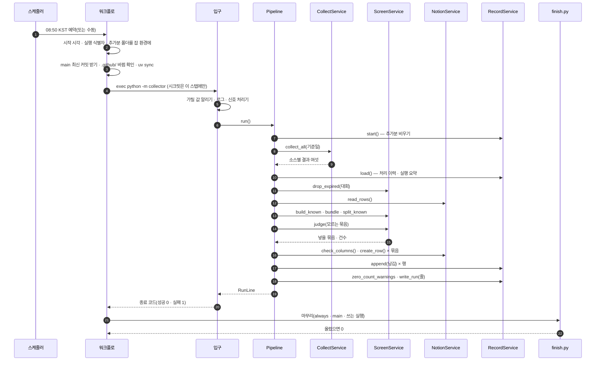
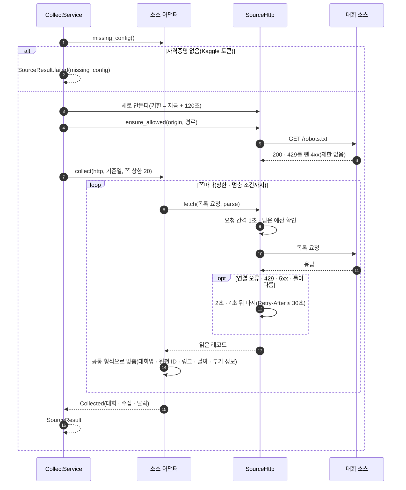
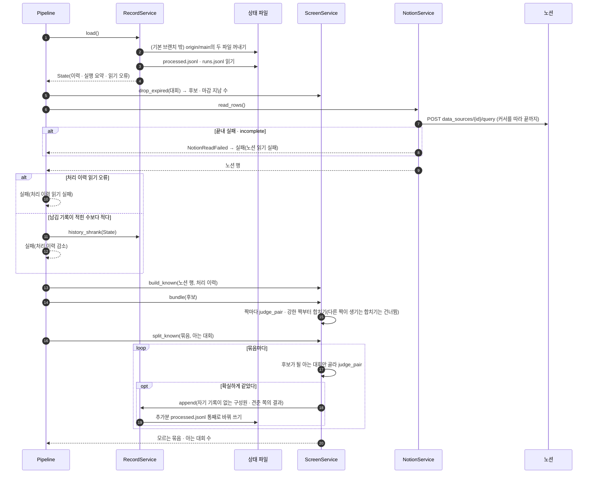
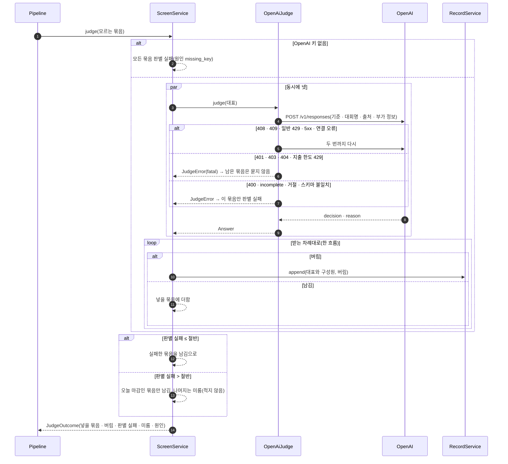
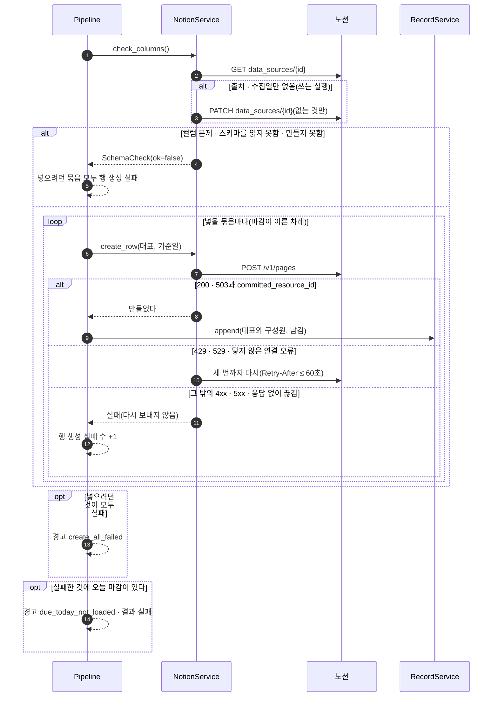
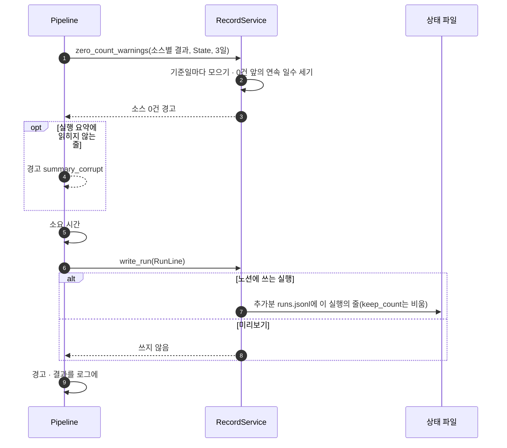
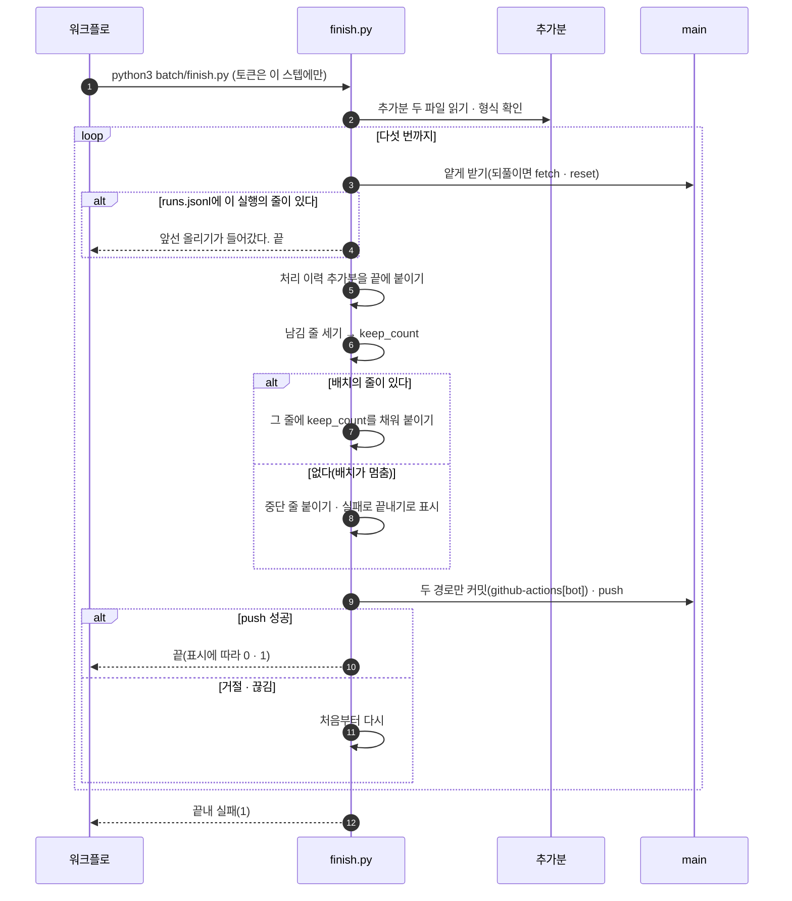
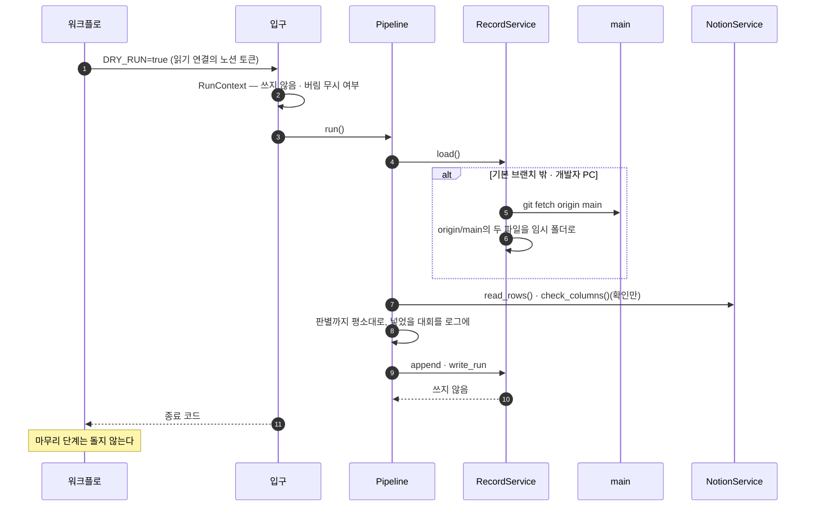
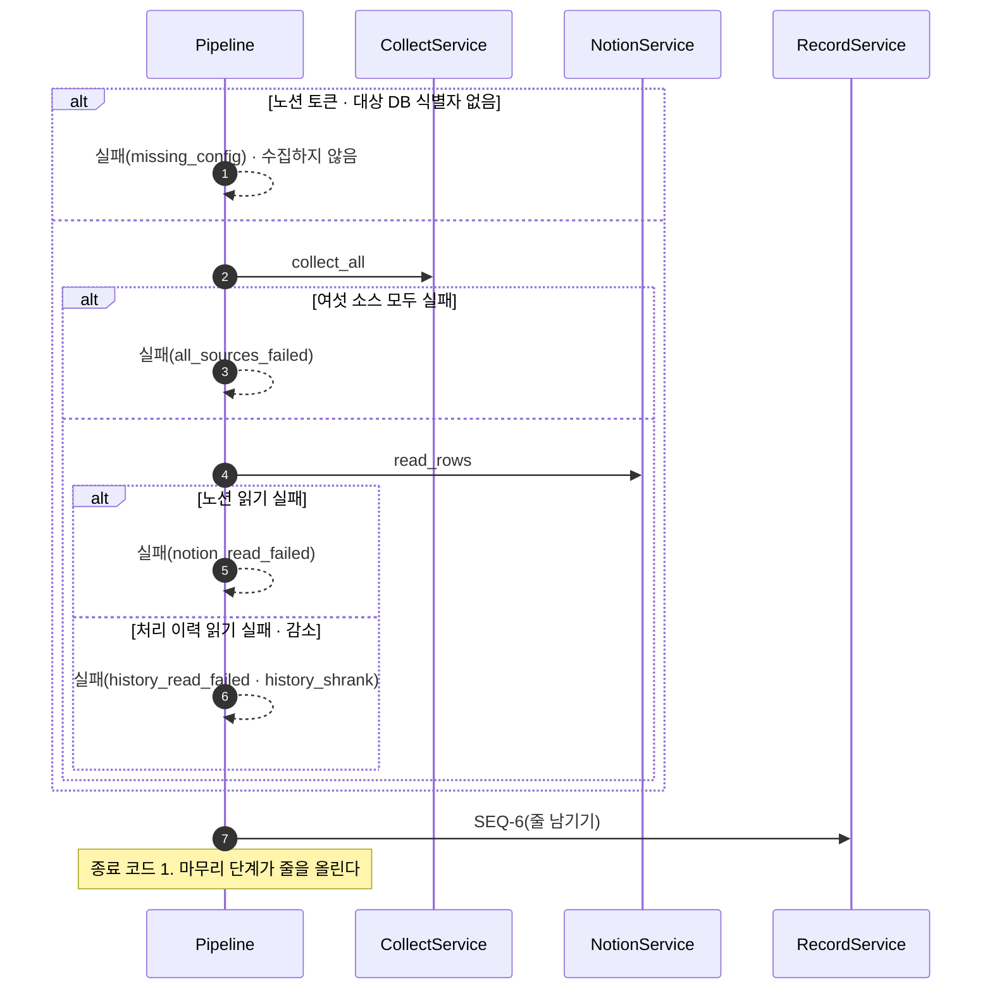
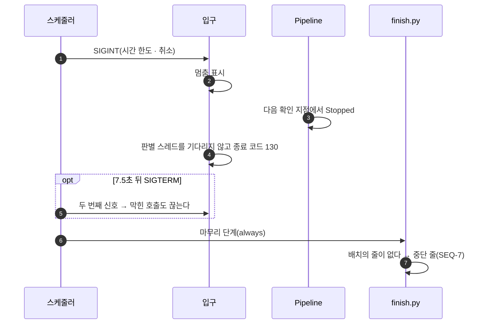

# SEQUENCE — 대회 수집 배치

## 0. 이 문서가 다루는 것

유스케이스([[CCR-UC-001]])의 흐름을 클래스 명세([[CCR-DOM-002]])의 객체 사이 메시지로 옮긴다. 한 실행이 시간순으로 무엇을 부르는지, 실패하면 어디서 갈라지는지를 본다. 함수 안의 처리는 [[CCR-MS-001]]이 맡는다.

화면이 없어 사람이 부르는 시퀀스는 없다. 모든 시퀀스의 시작은 스케줄러(GitHub Actions)이거나 관리자의 수동 실행이다.

### 0.1 생명선

| 생명선 | 약어 | 실체 | 종류 | 정의한 곳 |
|---|---|---|---|---|
| 스케줄러 | GH | GitHub Actions. 예약 · 수동 실행과 신호 | 외부 | [[CCR-INFRA-001]] 8.1 |
| 워크플로 | WF | `.github/workflows/daily.yml`의 스텝 | 실행 환경 | [[CCR-INFRA-001]] 8.1 |
| 입구 | M | `collector/__main__.py` | Boundary | [[CCR-DOM-002]] 4.7 |
| 실행의 흐름 | P | `Pipeline` | Control | [[CCR-DOM-002#Pipeline]] |
| 수집 | CS | `CollectService` | Control | [[CCR-DOM-002#CollectService]] |
| 소스 어댑터 | SA | `Source` 구현 여섯 | Boundary | [[CCR-DOM-002#Source]] |
| 소스 요청 | H | `SourceHttp` · `ensure_allowed` | infra | [[CCR-DOM-002]] 4.8 |
| 대회 소스 | SRC | event-us · DACON · Kaggle · wevity · AI팩토리 · 콘테스트코리아 | 외부 | [[CCR-API-001]] 3.1 |
| 선별 | SS | `ScreenService`와 `matching` | Control | [[CCR-DOM-002#ScreenService]] |
| 판별 | J | `OpenAiJudge` | Boundary | [[CCR-DOM-002#OpenAiJudge]] |
| OpenAI | AI | Responses API | 외부 | [[CCR-API-001#POST/api.openai.com/v1/responses]] |
| 노션 서비스 | NS | `NotionService` → `NotionCrud` → `NotionHttp` | Control | [[CCR-DOM-002#NotionService]] |
| 노션 | N | `대회목록` 데이터 소스 | 외부 | [[CCR-API-001]] 3.3 · [[CCR-DOM-003#notion_rows]] |
| 기록 | RS | `RecordService` → `RecordCrud` | Control | [[CCR-DOM-002#RecordService]] |
| 상태 파일 | FS | `data/processed.jsonl` · `data/runs.jsonl`과 추가분 `$RUNNER_TEMP/append/` | 파일 | [[CCR-DOM-003]] |
| 마무리 단계 | F | `batch/finish.py` | Control | [[CCR-DOM-002]] 4.10 |
| 기본 브랜치 | G | 원격 저장소의 `main` | 외부 | [[CCR-INFRA-001]] 8.2 |

## SEQ-1 하루치를 돌린다

[[CCR-UC-001#UC-A1]] 기본 흐름 1 ~ 10. 워크플로의 일곱 스텝([[CCR-INFRA-001]] 8.1의 다섯 차례. 코드 받기에 정의 확인이, 환경에 의존성 설치가 붙는다)과 배치 안의 흐름을 한 그림에 둔다. 각 단계의 안은 SEQ-2 ~ SEQ-7이다.

**읽을 때 볼 것**
- 기준일은 1단계가 잡 환경에 남긴 `RUN_STARTED_AT`에서 배치와 마무리 단계가 각자 구한다. 배치가 어디서 멈추든 같은 날짜다([[CCR-INFRA-001#C13]]).
- 파일 쓰기(`append` · `write_run`)는 추가분 폴더에만 한다. 커밋은 마무리 단계가 한 번 한다([[CCR-UC-001#UC-A1]] 9).
- 마무리 단계는 배치 스텝이 실패하거나 끊겨도 돈다(`if: always()`). 노션에 쓰지 않는 실행과 기본 브랜치가 아닌 실행에서는 돌지 않는다.
- 배치가 스스로 실패로 판단해 끝나면(종료 코드 1) 줄이 남고 실패 사유가 줄에 있다. 예상하지 못한 오류로 멈춰도 종료 코드는 1이지만 줄이 없어, 마무리 단계가 중단 줄을 쓴다(SEQ-10).

## SEQ-2 소스 하나를 수집한다

[[CCR-UC-001#UC-S1]] · [[CCR-UC-001#UC-S2]]. `CollectService`가 소스마다 스레드 하나로 돌리는 것 가운데 하나다.

**읽을 때 볼 것**
- 소스의 실패는 밖으로 새지 않는다. robots 금지 → `robots`, 예산 초과 · 연결 → `connection`, 3xx · 4xx · 끝내 5xx → `http_status`, 틀이 다르거나 파서의 예외 → `format`([[CCR-API-001]] 2.1).
- 어느 소스도 쪽마다 1초를 쉬고, 여섯 소스는 동시에 돈다. 본문을 받는 동안에도 기한을 보므로, 가장 느린 소스도 예산 120초에 요청 한 단계의 타임아웃(최대 20초)을 더한 것보다 오래 돌지 않는다([[CCR-INFRA-001]] 8.5).
- wevity는 다섯 분야를 다 읽은 뒤 접수 중인 첫 공고의 상세 한 쪽을 더 받아 날수 보정값(0 · −1)을 잰다. 상세는 같은 사이트의 `gbn=viewok`로 302를 보내므로 이 요청은 리디렉션을 따라간다. 목록 요청은 따라가지 않는다(robots.txt는 따라간다). 재지 못하면 −1이다([[CCR-API-001#GET/www.wevity.com/?c=find&gbn=view]]).
- AI팩토리는 한 쪽을 받아 과제를 대회로 합친다. 수집 건수는 합치기 전 과제의 수다.

## SEQ-3 이미 아는 대회를 가른다

[[CCR-UC-001#UC-S3]] · [[CCR-UC-001#UC-S4]] 1 ~ 7 · 1a · 2a · 2b · 2c.

**읽을 때 볼 것**
- 노션을 먼저 읽고 처리 이력의 문제를 본다. 어느 쪽이든 실패면 판별도 적재도 하지 않고 SEQ-6으로 간다([[CCR-UC-001#UC-A1]] 5a).
- 아는 대회는 1단계로 같은 구성원이 하나라도 있거나, 넣어도 묶는 규칙이 지켜지는 것이다. 이름만으로 같았으면(연도 · 날짜를 맞대 보지 못함) 빼기만 하고 적지 않는다.
- 결과가 다른 둘과 함께 확실하게 같으면 남김으로 적는다([[CCR-DOM-002]] 5장 결정 2).
- 노션에 쓰지 않는 실행이면 `append`는 아무것도 하지 않는다.

## SEQ-4 관심 분야를 판별한다

[[CCR-UC-001#UC-S5]] 1 ~ 6 · 1a · 1b · 2a · 2b · 2c.

**읽을 때 볼 것**
- 판별 스레드는 답만 돌려주고, 처리 이력은 받는 쪽 한 흐름이 적는다([[CCR-INFRA-001]] 6.2).
- 오늘 마감인지는 묶음의 접수마감일(구성원 가운데 가장 늦은 값)로 가른다([[CCR-DOM-002]] 5장 결정 1).
- 미룬 묶음이 있으면 `Pipeline`이 판별 미룸 경고를 붙인다. 결과는 성공이다.
- 넣을 묶음은 접수마감일이 이른 차례로 돌려준다.

## SEQ-5 노션에 넣는다

[[CCR-UC-001#UC-S6]] 1 ~ 4 · 1a · 1b · 2a · 2b · 2c · 2d · [[CCR-UC-001#UC-A1]] 7a.

**읽을 때 볼 것**
- 행이 만들어졌다는 응답을 받은 그 자리에서 곧바로 처리 이력에 적는다. 모두 넣은 뒤에 한꺼번에 적지 않는다([[CCR-UC-001#UC-S6]] 4).
- 응답 없이 끊긴 쓰기는 노션에 행이 생겼을 수 있다. 다음 실행이 노션 행으로 알아본다([[CCR-UC-001#UC-S6]] 2c).
- 노션에 쓰지 않는 실행은 `check_columns`까지만 하고(만들지 않고 확인만), 넣었을 대회를 로그에 남긴다.
- 기존 행을 고치거나 지우는 메시지는 이 그림에 없다. 코드에도 없다.

## SEQ-6 실행 기록을 남긴다

[[CCR-UC-001#UC-S7]] 1 ~ 8 · 2a · 2b · 2c · 8a. 실패로 건너뛴 실행도 여기를 지난다.

**읽을 때 볼 것**
- 결과를 실패로 올리는 경고는 오늘 마감 미적재 하나다. 나머지 경고는 결과를 바꾸지 않는다([[CCR-UC-001#UC-S7]] 3).
- 줄에는 정해진 값만 들어간다. 원문 실패 사유와 판별 근거는 로그에만 간다([[CCR-DOM-003#runs]]).
- `keep_count`는 SEQ-7이 채운다.

## SEQ-7 마무리 단계가 올린다

[[CCR-UC-001#UC-A1]] 9 · 9a · \*a2 · [[CCR-INFRA-001]] 8.2.

**읽을 때 볼 것**
- 텍스트 병합이나 rebase에 맡기지 않고 최신 판 위에 다시 얹는다. 그사이 관리자가 버림 줄을 지운 커밋이 남는다.
- 남김 줄 수는 얹은 뒤에 센다. 배치가 세면 올리다 빠진 줄만큼 커진다.
- 형식이 맞지 않는 추가분 줄은 붙이지 않고, 올린 뒤 실패로 끝낸다.
- 토큰은 받기와 push 명령에만 명령 줄 설정으로 준다. 명령을 로그에 찍지 않는다.

## SEQ-8 미리보기로 돌린다

[[CCR-UC-001#UC-A1]] 1b · 1b5 · 1b6 · 1b7. 수동 실행에서 `dry_run`을 켜거나, 기본 브랜치가 아닌 곳이나 개발자 PC에서 돌 때다.

**읽을 때 볼 것**
- 판별 모델은 실제로 부른다. 무엇이 들어갈지 보려면 판별 결과가 필요하다. 이 호출도 비용에 들어간다([[CCR-UC-001#UC-A1]] 1b4).
- 버림 기록을 없는 것으로 보라는 입력(`ignore_discards`)은 이 모드에서만 먹는다. 쓰는 실행에서는 무시하고 로그에 적는다.
- origin/main을 받지 못하면 처리 이력 읽기 실패로 끝난다. 브랜치의 오래된 사본으로 돌지 않는다.
- Actions 안에서 `DRY_RUN`이 `true`도 `false`도 아니면 입구가 아무것도 하지 않고 종료 코드 2로 끝난다.

## SEQ-9 실패로 기록 단계로 건너뛴다

[[CCR-UC-001#UC-A1]] 1d1 · 1d2 · 1d3 · 2b · 5a.

**읽을 때 볼 것**
- Kaggle 토큰만 없으면 실패가 아니다. Kaggle에 설정 누락 표시만 남는다(SEQ-2). OpenAI 키만 없으면 판별 미룸이다(SEQ-4).
- 실패 사유는 하나만 적는다. 먼저 걸린 것이다.

## SEQ-10 신호로 멈춘다

[[CCR-UC-001#UC-A1]] \*a · \*a2. 스텝 시간 한도(8분) · 수동 취소 · 예상하지 못한 오류다.

**읽을 때 볼 것**
- 배치는 신호를 받으면 줄을 쓰지 않는다. 끊긴 실행의 줄은 마무리 단계가 중단으로 쓴다.
- 처리 이력은 행마다 추가분에 반영돼 있어 넣은 데까지는 올라간다. 끊기는 순간 막 만든 행 하나가 기록에서 빠질 수 있다([[CCR-INFRA-001]] 8.5).
- 예상하지 못한 오류(파이썬 예외)도 줄을 남기지 않고 종료 코드 1로 끝나, 마무리 단계가 중단으로 쓴다.

## 1. 대응표

| 시퀀스 | 유스케이스 | 주요 함수 |
|---|---|---|
| SEQ-1 | [[CCR-UC-001#UC-A1]] 1 ~ 10 | [[CCR-MS-001#Pipeline.run]] · [[CCR-MS-001#__main__.main]] · [[CCR-MS-001#__main__.run_batch]] |
| SEQ-2 | [[CCR-UC-001#UC-S1]] · [[CCR-UC-001#UC-S2]] | [[CCR-MS-001#CollectService.collect_all]] · [[CCR-MS-001#CollectService._collect_one]] · [[CCR-MS-001#SourceHttp.fetch]] · [[CCR-MS-001#robots.ensure_allowed]] · 어댑터 함수 |
| SEQ-3 | [[CCR-UC-001#UC-S3]] · [[CCR-UC-001#UC-S4]] | [[CCR-MS-001#ScreenService.drop_expired]] · [[CCR-MS-001#NotionService.read_rows]] · [[CCR-MS-001#RecordService.load]] · [[CCR-MS-001#RecordService.history_shrank]] · [[CCR-MS-001#ScreenService.build_known]] · [[CCR-MS-001#ScreenService.bundle]] · [[CCR-MS-001#ScreenService.split_known]] · [[CCR-MS-001#matching.judge_pair]] · [[CCR-MS-001#matching.group]] |
| SEQ-4 | [[CCR-UC-001#UC-S5]] | [[CCR-MS-001#ScreenService.judge]] · [[CCR-MS-001#ScreenService._ask_all]] · [[CCR-MS-001#OpenAiJudge.judge]] |
| SEQ-5 | [[CCR-UC-001#UC-S6]] | [[CCR-MS-001#Pipeline._load]] · [[CCR-MS-001#NotionService.check_columns]] · [[CCR-MS-001#NotionService.create_row]] · [[CCR-MS-001#NotionHttp.write]] |
| SEQ-6 | [[CCR-UC-001#UC-S7]] | [[CCR-MS-001#Pipeline._finish]] · [[CCR-MS-001#RecordService.zero_count_warnings]] · [[CCR-MS-001#RecordService.write_run]] |
| SEQ-7 | [[CCR-UC-001#UC-A1]] 9 · \*a2 | [[CCR-MS-001#finish.finish]] · [[CCR-MS-001#finish.read_additions]] · [[CCR-MS-001#Git.fresh_main]] · [[CCR-MS-001#Git.commit_and_push]] |
| SEQ-8 | [[CCR-UC-001#UC-A1]] 1b | [[CCR-MS-001#RunContext.from_env]] · [[CCR-MS-001#record.export_main_state]] |
| SEQ-9 | [[CCR-UC-001#UC-A1]] 1d · 2b · 5a | [[CCR-MS-001#Pipeline._run]] |
| SEQ-10 | [[CCR-UC-001#UC-A1]] \*a | [[CCR-MS-001#__main__.main]] · [[CCR-MS-001#finish.finish]] |

## 2. 되먹일 것

시퀀스를 그리며 코드와 실측에서 찾은 것 가운데 상위 문서를 고쳐야 하는 것이다. 이 문서는 상위 문서를 고치지 않는다.

1. **[[CCR-API-001]] wevity 상세 요청.** `gbn=view`가 같은 사이트의 `gbn=viewok`로 302를 보낸다(2026-09-27 실측). 날수 맞춰 보기의 상세 요청은 리디렉션을 따라가도록 구현했다(SEQ-2). 엔드포인트 절과 1.2의 리디렉션 규칙에 이 예외를 적는다.
2. **[[CCR-PRD-001]] 5.2 · [[CCR-UC-001#UC-S4]] 같은 대회 판정.** 실측 후보 321건에서 판정표가 틀박이 이름의 서로 다른 대회를 이었다(가장 큰 묶음 스무 건). 판정 규칙을 바꿀지 사람이 정한다. 자료와 대안은 [[CCR-DOM-002]] 6장.
3. **[[CCR-DOM-001]] 6장 미결 셋이 풀렸다.** 묶음의 접수마감일(가장 늦은 값), 결과가 다른 둘과 함께 같을 때(남김), HTML 파서(selectolax). [[CCR-DOM-002]] 5장 결정 1 · 2 · 3. 도메인 모델의 미결을 닫는다. [[CCR-INFRA-001]] 9장의 파서 미결도 같다.
4. **[[CCR-UC-001#UC-S2]] 4 · [[CCR-API-001]] 1.2 대회명 다듬기.** event-us · 콘테스트코리아가 대회명 앞에 BOM(U+FEFF)을 붙여 주는 일이 있다. 앞뒤를 다듬을 때 공백과 함께 보이지 않는 서식 문자도 뗀다고, HTML 소스는 브라우저가 보여 주는 대로 이어진 공백을 하나로 모은다고 적는다.
5. **[[CCR-INFRA-001]] 8.1 코드 받기 스텝.** 다른 브랜치의 미리보기가 main 최신 판의 상태 파일을 읽는 일은 워크플로 스텝이 아니라 배치(기록 경계)가 git으로 한다(SEQ-8). 개발자 PC와 같은 길이다. 스텝 표의 문장을 이에 맞춘다.
6. **[[CCR-INFRA-001]] 8.1 종료 코드.** 쓰기 여부 값이 깨졌으면 2, 신호로 멈추면 130이다. 8.6 표의 "쓰기 여부 값이 true · false가 아님" 행에 종료 코드를 적는다.

## 3. 미결사항

- [ ] SEQ-2의 Kaggle 목록 요청은 실측 전이다. 토큰이 생기면 다시 그린다
- [ ] 같은 대회 판정 규칙이 바뀌면(되먹일 것 2) SEQ-3의 묶기 단계를 고친다
