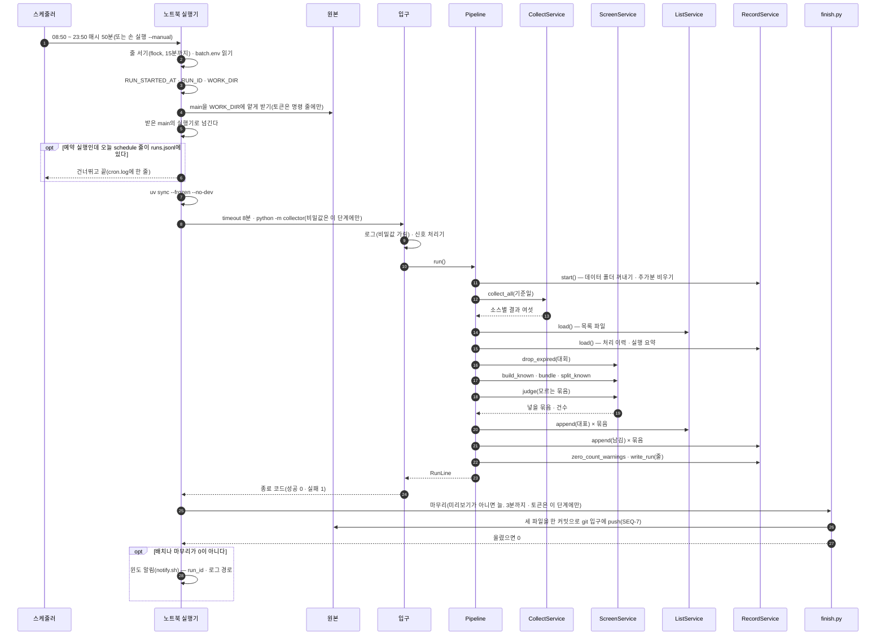
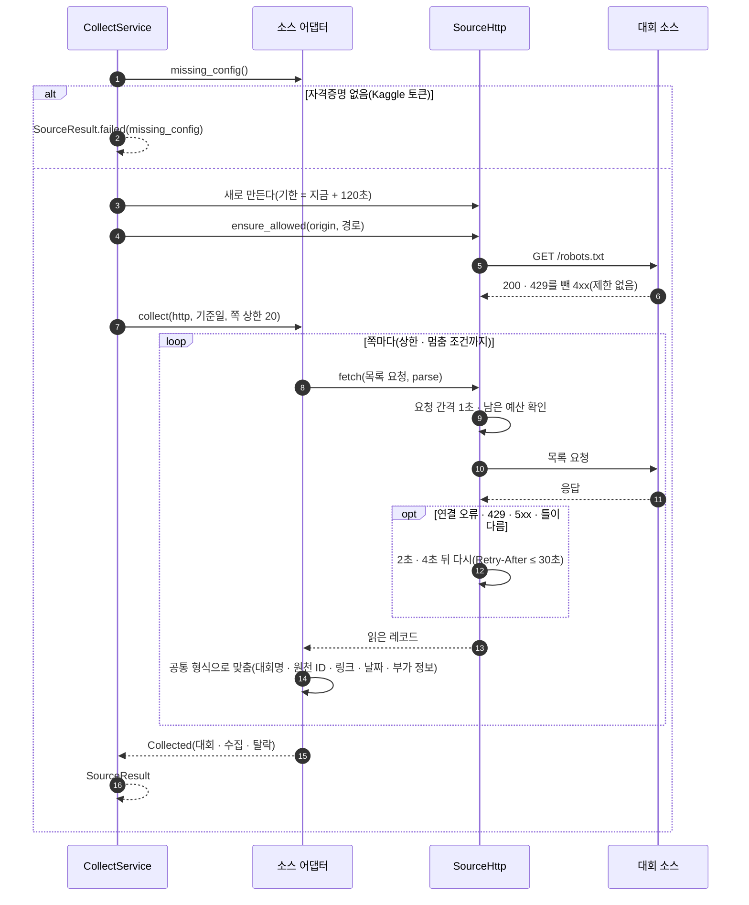
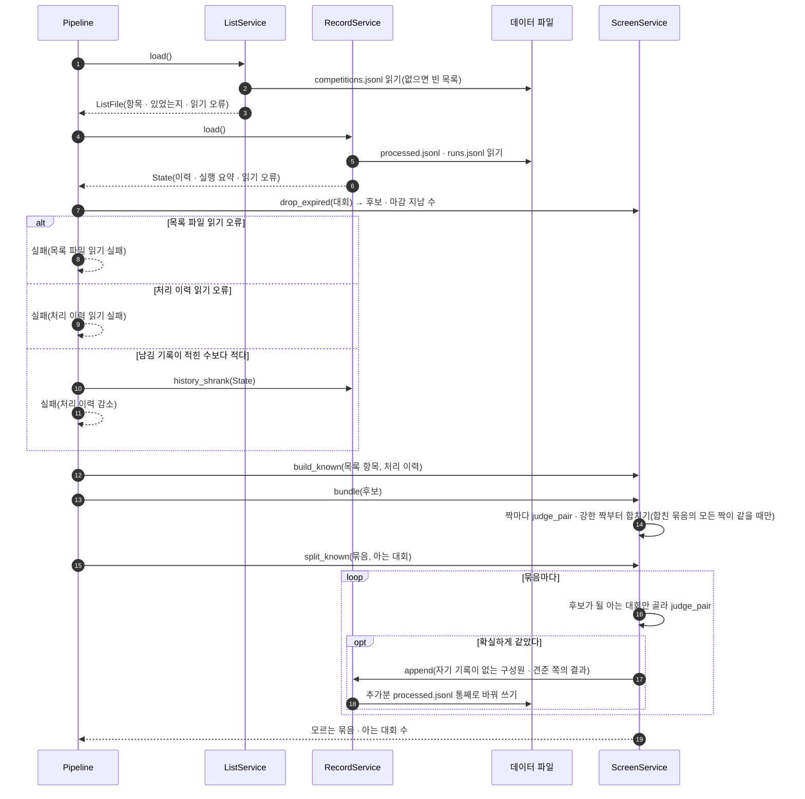
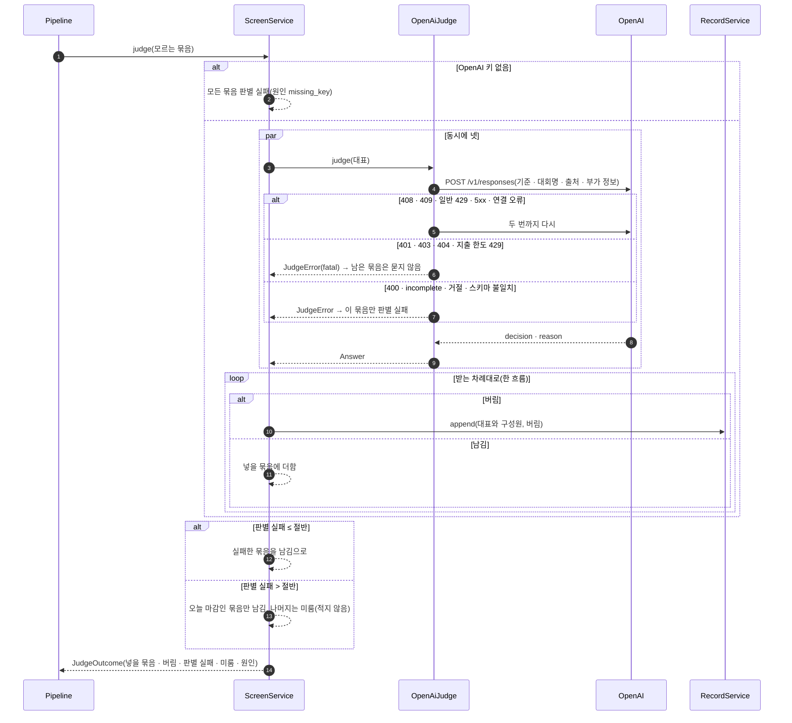
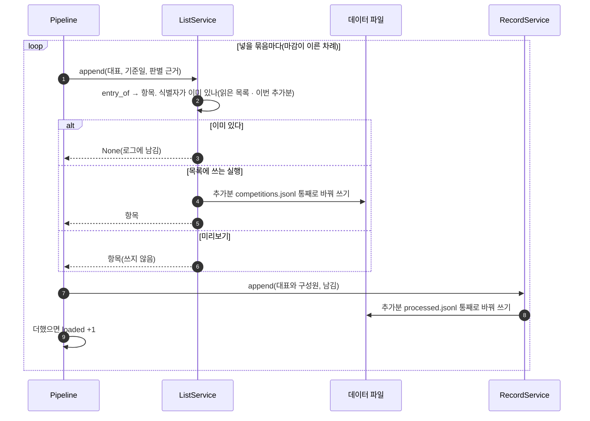
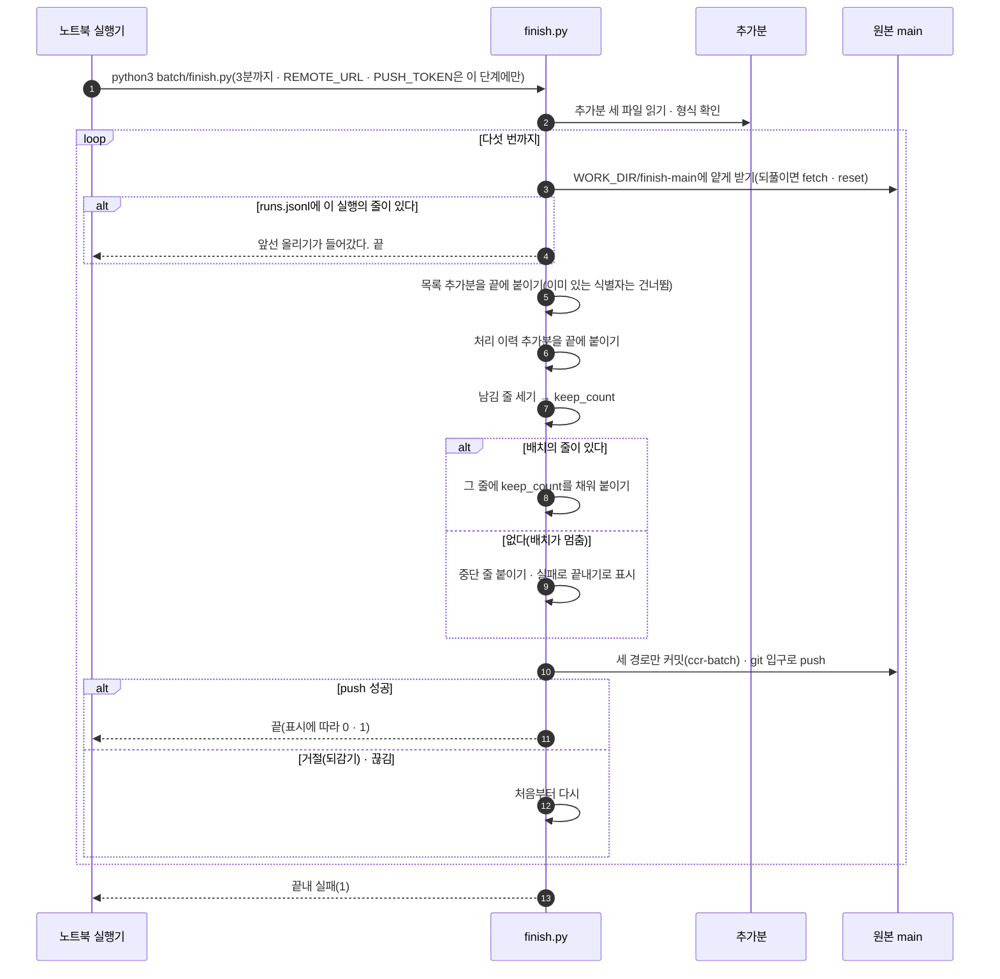
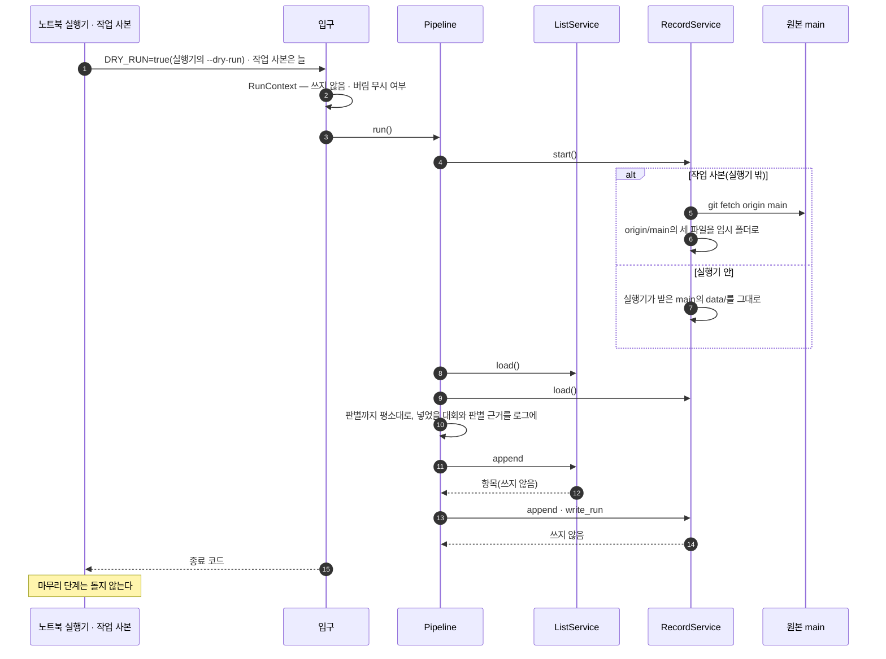
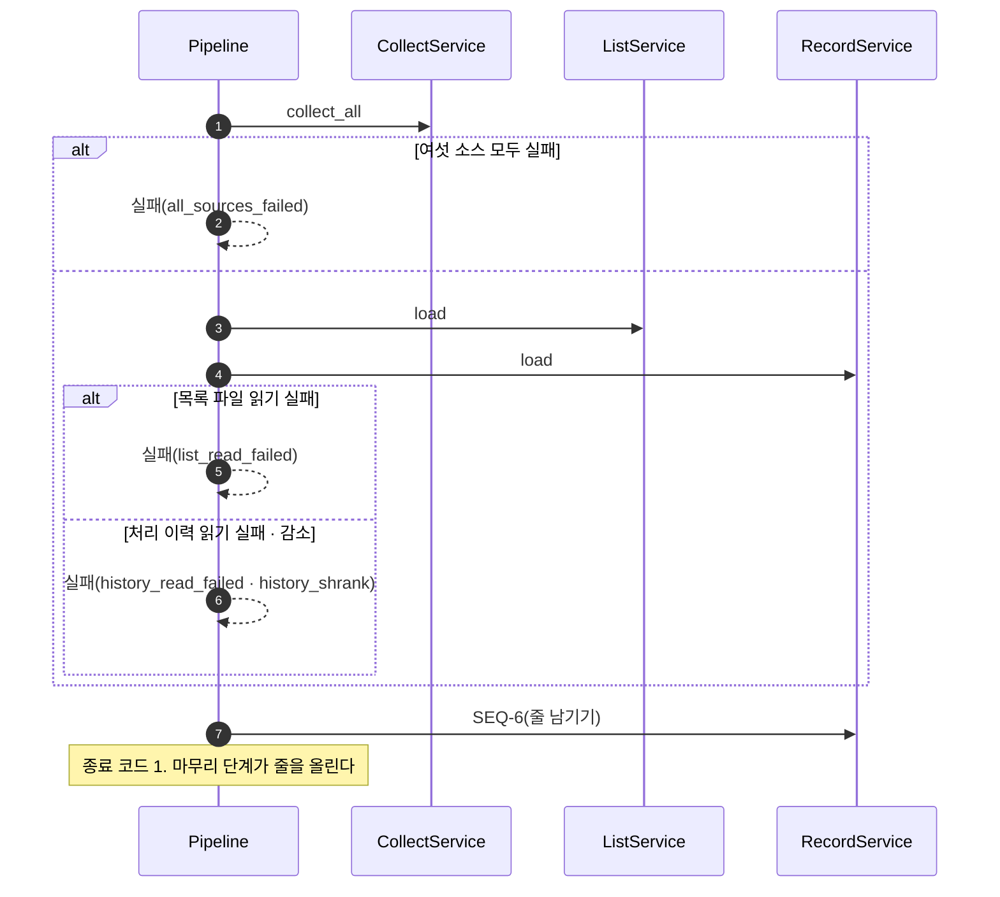
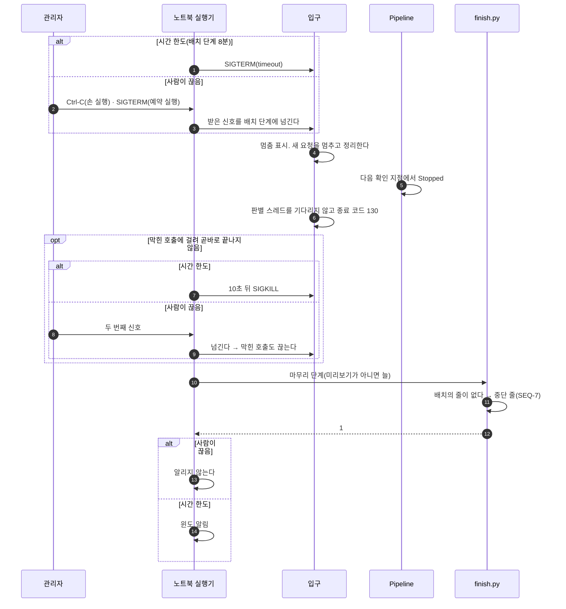
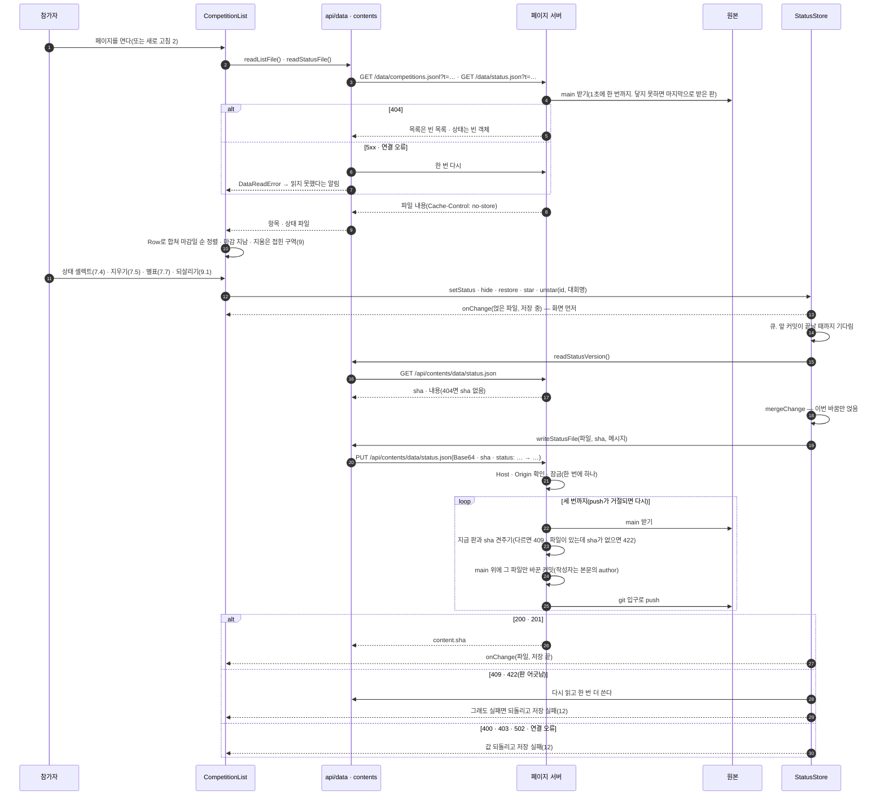

# SEQUENCE — 대회 수집 배치

## 0. 이 문서가 다루는 것

유스케이스([[CCR-UC-001]])의 흐름을 클래스 명세([[CCR-DOM-002]])의 객체 사이 메시지로 옮긴다. 한 실행이 시간순으로 무엇을 부르는지, 실패하면 어디서 갈라지는지를 본다. 함수 안의 처리는 [[CCR-MS-001]]이 맡는다.

배치의 시퀀스(SEQ-1 ~ SEQ-10)는 노트북의 crontab이 부르는 노트북 실행기(`scripts/daily.sh`)나 관리자의 손 실행(`scripts/daily.sh --manual`)에서 시작한다. 대회 목록 페이지의 시퀀스(SEQ-11)는 참가자가 노트북의 브라우저에서 시작한다. 토큰을 넣던 SEQ-12는 2026-10-06에 폐기했다. 2026-09-29에 노션을 페이지로 바꾸면서 노션 생명선을 지우고 목록 서비스와 페이지의 생명선을 더했다. 2026-10-06에 GitHub를 빼면서 스케줄러(GitHub Actions) · 워크플로 · GitHub · 토큰 보관 생명선을 crontab · 노트북 실행기 · 페이지 서버로 바꾸고, 기본 브랜치 생명선을 원본으로 고쳤다.

### 0.1 생명선

| 생명선 | 약어 | 실체 | 종류 | 정의한 곳 |
|---|---|---|---|---|
| 스케줄러 | CR | 노트북의 crontab(`50 8-23 * * *`)과 관리자의 손 실행(`--manual`) | 외부 | [[CCR-INFRA-001]] 8.1 |
| 노트북 실행기 | DS | `scripts/daily.sh`의 단계 | 실행 환경 | [[CCR-INFRA-001]] 8.1 |
| 입구 | M | `collector/__main__.py` | Boundary | [[CCR-DOM-002]] 4.7 |
| 실행의 흐름 | P | `Pipeline` | Control | [[CCR-DOM-002#Pipeline]] |
| 수집 | CS | `CollectService` | Control | [[CCR-DOM-002#CollectService]] |
| 소스 어댑터 | SA | `Source` 구현 여섯 | Boundary | [[CCR-DOM-002#Source]] |
| 소스 요청 | H | `SourceHttp` · `ensure_allowed` | infra | [[CCR-DOM-002]] 4.8 |
| 대회 소스 | SRC | event-us · DACON · Kaggle · wevity · AI팩토리 · 콘테스트코리아 | 외부 | [[CCR-API-001]] 3.1 |
| 선별 | SS | `ScreenService`와 `matching` | Control | [[CCR-DOM-002#ScreenService]] |
| 판별 | J | `OpenAiJudge` | Boundary | [[CCR-DOM-002#OpenAiJudge]] |
| OpenAI | AI | Responses API | 외부 | [[CCR-API-001#POST/api.openai.com/v1/responses]] |
| 목록 | LS | `ListService` → `ListCrud` | Control | [[CCR-DOM-002#ListService]] |
| 기록 | RS | `RecordService` → `RecordCrud` | Control | [[CCR-DOM-002#RecordService]] |
| 데이터 파일 | FS | `data/competitions.jsonl` · `data/processed.jsonl` · `data/runs.jsonl`과 추가분 `$WORK_DIR/append/` | 파일 | [[CCR-DOM-003]] |
| 마무리 단계 | F | `batch/finish.py` | Control | [[CCR-DOM-002]] 4.10 |
| 원본 | G | 싱크독 서버 저장소의 `main`. git 입구(`http://localhost:8000/git/CCR.git`)로 받고 올린다 | 외부 | [[CCR-INFRA-001]] 8.2 |
| 관리자 | AD | 손 실행을 돌리고 끊는 사람 | 액터 | [[CCR-UC-001]] 1장 |
| 참가자 | U | 브라우저 앞의 사람 | 액터 | [[CCR-UC-001]] 1장 |
| 화면 | UI | `CompetitionList` | Boundary | [[CCR-DOM-002#CompetitionList]] |
| 상태 저장 | ST | `StatusStore` | Control | [[CCR-DOM-002#StatusStore]] |
| 저장소 파일 | RF | `api/data.ts` · `api/contents.ts` | Boundary | [[CCR-DOM-002#RepoFiles]] |
| 페이지 서버 | PS | `batch/page_server.py`(`PageHandler` · `Mirror`). `http://localhost:8090` | Boundary | [[CCR-INFRA-001]] 8.11 · [[CCR-API-001]] 3.3 |

## SEQ-1 하루치를 돌린다

[[CCR-UC-001#UC-A1]] 기본 흐름 1 ~ 10. 노트북 실행기의 단계([[CCR-INFRA-001]] 8.1)와 배치 안의 흐름을 한 그림에 둔다. 각 단계의 안은 SEQ-2 ~ SEQ-7이다.

**읽을 때 볼 것**
- 기준일은 실행기가 줄 서기를 마친 뒤 정한 `RUN_STARTED_AT`에서 배치와 마무리 단계가 각자 구한다. 배치가 어디서 멈추든 같은 날짜다([[CCR-INFRA-001#C13]]).
- 예약 실행은 하루 한 번이다. 노트북이 08:50에 꺼져 있거나 잠들어 있었으면 켜진 뒤 첫 매시 50분에 돈다. 그날(KST) `runs.jsonl`에 `kind=schedule` 줄이 이미 있으면 건너뛴다. 실패한 실행도 줄을 남기므로 다시 돌지 않는다([[CCR-INFRA-001#C2]]).
- 줄을 못 남긴 예약 실행(마무리 push 실패 · 싱크독 꺼짐 · 실행기가 죽음)은 그날 `schedule` 줄이 없어 다음 매시 50분에 다시 돈다. 23:50까지 되풀이하고 실패할 때마다 알림이 뜬다. 고장이 낫는 대로 그날 안에 저절로 메워진다.
- 늘 받은 main의 실행기가 나머지를 돈다. cron이 부른 작업 사본의 실행기는 main을 받아 넘기기만 한다. 작업 사본에서 고치는 중인 실행기가 운영에 섞이지 않는다.
- 파일 쓰기(두 `append` · `write_run`)는 추가분 폴더에만 한다. 커밋은 마무리 단계가 세 파일을 한 번에 한다([[CCR-UC-001#UC-A1]] 9). 배치는 원본에 아무것도 보내지 않는다.
- 마무리 단계는 배치 단계가 실패하거나 끊겨도 돈다. 미리보기에서는 돌지 않는다(SEQ-8). 실행기는 늘 main을 새로 받아 돌므로 쓰는 실행은 기본 브랜치의 것뿐이다([[CCR-INFRA-001#C12]]).
- 배치에 반드시 있어야 하는 비밀값은 없다. OpenAI 키와 Kaggle 토큰이 배치 단계의 환경 변수로 들어갈 뿐이다([[CCR-UC-001#UC-A1]] 1d1). 싱크독 토큰은 main을 받는 명령과 마무리 단계에만 간다.
- 배치가 스스로 실패로 판단해 끝나면(종료 코드 1) 줄이 남고 실패 사유가 줄에 있다. 예상하지 못한 오류로 멈춰도 종료 코드는 1이지만 줄이 없어, 마무리 단계가 중단 줄을 쓴다(SEQ-10).
- 배치나 마무리 단계가 0이 아닌 코드로 끝나면 실행기가 윈도 알림(「CCR 일배치 실패」)을 띄운다. 성공과 건너뜀은 조용하다. 실행의 출력은 `~/.local/state/ccr/logs/{run_id}.log`에 남는다.

## SEQ-2 소스 하나를 수집한다

[[CCR-UC-001#UC-S1]] · [[CCR-UC-001#UC-S2]]. `CollectService`가 소스마다 스레드 하나로 돌리는 것 가운데 하나다.

**읽을 때 볼 것**
- 소스의 실패는 밖으로 새지 않는다. robots 금지 → `robots`, 예산 초과 · 연결 → `connection`, 3xx · 4xx · 끝내 5xx → `http_status`, 틀이 다르거나 파서의 예외 → `format`([[CCR-API-001]] 2.1).
- 어느 소스도 쪽마다 1초를 쉬고, 여섯 소스는 동시에 돈다. 본문을 받는 동안에도 기한을 보므로, 가장 느린 소스도 예산 120초에 요청 한 단계의 타임아웃(최대 20초)을 더한 것보다 오래 돌지 않는다([[CCR-INFRA-001]] 8.5).
- wevity는 분야마다 쪽의 마지막 공고가 `마감`이면 그 분야를 멈춘다. 첫 쪽 위쪽 홍보 칸에 남은 마감 공고로는 멈추지 않는다([[CCR-DOM-002]] 5장 결정 8).
- wevity는 다섯 분야를 다 읽은 뒤 접수 중인 첫 공고의 상세 한 쪽을 더 받아 날수 보정값(0 · −1)을 잰다. 상세는 같은 사이트의 `gbn=viewok`로 302를 보내므로 이 요청은 리디렉션을 따라간다. 목록 요청은 따라가지 않는다(robots.txt는 따라간다). 재지 못하면 −1이다([[CCR-API-001#GET/www.wevity.com/?c=find&gbn=view]]).
- AI팩토리는 한 쪽을 받아 과제를 대회로 합친다. 수집 건수는 합치기 전 과제의 수다.
- Kaggle은 `page`를 1부터 올려 빈 쪽이 올 때까지 받는다. 한 쪽은 20건으로 정해져 있다. 응답이 심은 쿠키는 다음 요청에 싣지 않는다. 쿠키가 실리면 토큰이 있어도 401이다([[CCR-API-001]] 1.1 · 2026-10-01 실측).

## SEQ-3 이미 아는 대회를 가른다

[[CCR-UC-001#UC-S3]] · [[CCR-UC-001#UC-S4]] 1 ~ 7 · 1a · 1b · 2a · 2b · 2c.

**읽을 때 볼 것**
- 목록 파일을 먼저 읽고 처리 이력의 문제를 본다. 어느 쪽이든 실패면 판별도 적재도 하지 않고 SEQ-6으로 간다([[CCR-UC-001#UC-A1]] 5a). 데이터 폴더는 SEQ-1의 `start()`가 이미 꺼내 두었다(실행기 밖이면 origin/main의 세 파일).
- 목록 항목은 참가자가 페이지에서 지워도 남아 있어 지운 대회도 아는 대회다. 판정 1단계는 출처 · 원천 ID로 보고, 링크는 예비다([[CCR-DOM-001#ListEntry]]).
- 묶기는 합친 묶음 안의 모든 짝이 같다고 나올 때만 합친다. 다르다고 나온 짝은 물론, 판단하지 않은 짝(유사도 0.90 미만)이 하나라도 있으면 합치지 않는다([[CCR-DOM-002]] 5장 결정 7).
- 아는 대회는 1단계로 같은 구성원이 하나라도 있거나, 구성원 하나 이상과 같고 어느 구성원과도 다르지 않은 것이다. 묶을 때와 달리 모든 구성원과 같을 필요는 없다. 이름만으로 같았으면(연도 · 날짜를 맞대 보지 못함) 빼기만 하고 적지 않는다.
- 결과가 다른 둘과 함께 확실하게 같으면 남김으로 적는다([[CCR-DOM-002]] 5장 결정 2).
- 목록에 쓰지 않는 실행이면 `append`는 아무것도 하지 않는다.

## SEQ-4 관심 분야를 판별한다

[[CCR-UC-001#UC-S5]] 1 ~ 6 · 1a · 1b · 2a · 2b · 2c.

**읽을 때 볼 것**
- 판별 스레드는 답만 돌려주고, 처리 이력은 받는 쪽 한 흐름이 적는다([[CCR-INFRA-001]] 6.2).
- 오늘 마감인지는 묶음의 접수마감일(구성원 가운데 가장 늦은 값)로 가른다([[CCR-DOM-002]] 5장 결정 1).
- 미룬 묶음이 있으면 `Pipeline`이 판별 미룸 경고를 붙인다. 결과는 성공이다.
- 넣을 묶음은 접수마감일이 이른 차례로 돌려준다.

## SEQ-5 목록 파일에 더한다

[[CCR-UC-001#UC-S6]] 1 ~ 4 · 2a · 2b · 4a · [[CCR-UC-001#UC-A1]] 7.

**읽을 때 볼 것**
- 항목을 더한 그 자리에서 곧바로 처리 이력에 적는다. 모두 넣은 뒤에 한꺼번에 적지 않는다([[CCR-UC-001#UC-S6]] 4). 두 추가분은 한 커밋으로 올라간다(SEQ-7).
- 넣는 일에는 실패가 없다. 노션 때의 컬럼 확인 · 행 생성 실패 · 오늘 마감 미적재는 파일에 더하는 방식에서 일어날 수 없어 없어졌다([[CCR-DOM-001#Warning]]). 파일 쓰기가 실패하면 예상하지 못한 오류로 멈추고(SEQ-10) 마무리 단계가 반영된 데까지 올린다([[CCR-UC-001#UC-S6]] 2b).
- 식별자가 이미 목록에 있는 묶음은 SEQ-3이 걸렀어야 하는 경우다. 항목을 더하지 않고 처리 이력에만 적는다([[CCR-UC-001#UC-S6]] 2a).
- 미리보기는 항목을 만들기만 하고 쓰지 않는다. `Pipeline`이 넣었을 대회와 판별 근거를 로그에 남긴다([[CCR-UC-001#UC-A1]] 1b3).
- 기존 항목을 고치거나 지우는 메시지는 이 그림에 없다. 코드에도 없다. 상태 파일은 열지도 않는다.

## SEQ-6 실행 기록을 남긴다

[[CCR-UC-001#UC-S7]] 1 ~ 8 · 2a · 2b · 2c · 8a. 실패로 건너뛴 실행도 여기를 지난다.

**읽을 때 볼 것**
- 경고 셋(소스 0건 · 판별 미룸 · 요약 파일 손상)은 어느 것도 결과를 바꾸지 않는다([[CCR-UC-001#UC-S7]] 3). 그날 조치할 고장(오늘 마감을 넣지 못함)은 커밋 실패로만 일어나고 실행 실패의 윈도 알림으로 드러난다([[CCR-UC-001#UC-A1]] 9a5).
- 줄에는 정해진 값만 들어간다. 원문 실패 사유와 판별 근거는 로그에만 간다([[CCR-DOM-003#runs]]).
- `keep_count`는 SEQ-7이 채운다.

## SEQ-7 마무리 단계가 올린다

[[CCR-UC-001#UC-A1]] 9 · 9a · \*a2 · [[CCR-INFRA-001]] 8.2.

**읽을 때 볼 것**
- 텍스트 병합이나 rebase에 맡기지 않고 최신 판 위에 다시 얹는다. 그사이 관리자가 버림 줄을 지운 커밋이 남는다. 페이지 서버가 그사이 올린 상태 파일 커밋도 받은 `main`에 이미 들어 있어 부딪히지 않는다. `data/status.json`은 읽지도 스테이징하지도 않는다([[CCR-INFRA-001]] 8.2).
- 남김 줄 수는 얹은 뒤에 센다. 배치가 세면 올리다 빠진 줄만큼 커진다.
- 형식이 맞지 않는 추가분 줄은 붙이지 않고, 올린 뒤 실패로 끝낸다.
- 토큰은 받기와 push 명령에만 명령 줄 설정으로 준다. 명령을 로그에 찍지 않는다.
- 원본은 싱크독 git 입구(`REMOTE_URL`)이고 토큰은 싱크독 개인 토큰(`PUSH_TOKEN`)이다. git 입구는 비밀번호 칸만 보고, `main`의 되감기 push를 거절한다. 커밋 작성자는 `ccr-batch <ccr-batch@localhost>`라 git log에서 사람 · 페이지 커밋과 갈린다.
- push가 들어오면 싱크독이 그 커밋을 읽지만, `data/`만 바뀐 커밋이라 명세 판도 코드 그래프도 만들지 않는다.

## SEQ-8 미리보기로 돌린다

[[CCR-UC-001#UC-A1]] 1b · 1b5 · 1b6 · 1b7. 손 실행에 `--dry-run`을 주거나(`scripts/daily.sh --manual --dry-run`), 실행기 밖(작업 사본)에서 돌 때다. 작업 사본은 늘 미리보기다.

**읽을 때 볼 것**
- 판별 모델은 실제로 부른다. 무엇이 들어갈지 보려면 판별 결과가 필요하다. 이 호출도 비용에 들어간다([[CCR-UC-001#UC-A1]] 1b4).
- 버림 기록을 없는 것으로 보라는 입력(실행기의 `--ignore-discards`, 작업 사본의 `IGNORE_DISCARDS=true`)은 이 모드에서만 먹는다. 쓰는 실행에서는 무시하고 로그에 적는다.
- 작업 사본에서 origin/main을 받지 못하면 처리 이력 읽기 실패로 끝난다. 작업 사본에 있는 오래된 파일로 돌지 않는다. 목록 파일도 같은 사본에서 읽는다([[CCR-DOM-002]] 5장 결정 5).
- 시크릿 없이도 돈다. OpenAI 키가 없으면 판별 미룸이 될 뿐이다.
- 실행기 안(`BATCH_RUNNER=laptop`)에서 `DRY_RUN`이 `true`도 `false`도 아니면 입구가 아무것도 하지 않고 종료 코드 2로 끝난다.
- 판별 기준을 바꿔 미리 보려면 작업 사본에서 고친 코드로 `uv run python -m collector`를 돌린다. 늘 미리보기이고 main의 최신 이력 위에서 판별한다. 그다음 기본 브랜치에 한 커밋으로 합쳐 원본에 push한다. 옛 「기본 브랜치가 아닌 브랜치에서 미리보기」의 자리다.

## SEQ-9 실패로 기록 단계로 건너뛴다

[[CCR-UC-001#UC-A1]] 1d1 · 1d2 · 1d3 · 2b · 5a.

**읽을 때 볼 것**
- 반드시 있어야 하는 시크릿이 없어 설정 누락은 실패 사유가 아니다. Kaggle 토큰만 없으면 Kaggle에 설정 누락 표시만 남고(SEQ-2), OpenAI 키만 없으면 판별 미룸이다(SEQ-4).
- 실패 사유는 넷 가운데 먼저 걸린 하나만 적는다([[CCR-DOM-003#runs]]).

## SEQ-10 신호로 멈춘다

[[CCR-UC-001#UC-A1]] \*a · \*a2. 배치 단계의 시간 한도(8분) · 사람이 끊음 · 예상하지 못한 오류다.

**읽을 때 볼 것**
- 배치는 신호를 받으면 줄을 쓰지 않는다. 끊긴 실행의 줄은 마무리 단계가 중단(`aborted`)으로 쓴다.
- 시간 한도는 실행기가 배치를 `timeout -s TERM -k 10s 8m`으로 띄워 건다. 8분이 지나면 SIGTERM 한 번이고, 10초 안에 끝나지 않으면 SIGKILL이다. 두 번째 신호가 없으므로 막힌 호출은 SIGKILL이 끊는다.
- 사람은 손 실행이면 터미널에서 Ctrl-C로, 예약 실행이면 실행기 프로세스에 SIGTERM을 보내 끊는다. 실행기는 받은 신호를 배치 단계에 넘긴다. 배치는 첫 신호에 새 요청을 멈추고 정리하고, 두 번째 신호에 하던 호출도 끊는다. 사람이 끊은 실행은 윈도 알림을 띄우지 않는다. 2026-10-06까지는 Actions가 시간 한도와 취소에 SIGINT를, 7.5초 뒤 SIGTERM을 보냈다.
- 예약 실행을 끊어도 중단 줄이 남으므로 그날 예약 실행은 더 돌지 않는다. 다시 돌리려면 손 실행이다.
- 목록과 처리 이력은 묶음마다 추가분에 반영돼 있어 넣은 데까지는 올라간다. 끊기는 순간 막 더한 항목 하나가 처리 이력에서 빠질 수 있다. 다음 실행이 목록 항목으로 그 대회를 알아보므로 다시 들어오지는 않는다([[CCR-INFRA-001]] 8.5).
- 예상하지 못한 오류(파이썬 예외)도 줄을 남기지 않고 종료 코드 1로 끝나, 마무리 단계가 중단으로 쓴다.

## SEQ-11 페이지를 열고 상태를 바꾼다

[[CCR-UC-001#UC-A2]] 1 ~ 6 · 1b · [[CCR-UC-001#UC-H1]] 1 ~ 5 · 1b · 1c · 4a · 4b · 4c. 화면은 [[CCR-UI-001#UI-1]], 페이지 서버는 [[CCR-API-001]] 3.3이다.

**읽을 때 볼 것**
- 두 파일은 페이지 서버의 `/data/…`로 읽는다. 페이지 서버가 읽을 때마다 원본을 받으므로(1초에 한 번까지) 캐시가 없다. 배치가 막 올린 목록과 방금 바꾼 상태가 새로 고치면 곧바로 보인다. 원본(싱크독)에 닿지 못하면 마지막으로 받은 판을 낸다. 쓰기의 기준은 늘 커밋 직전에 다시 읽은 판이다([[CCR-INFRA-001]] 6.4).
- 상태 파일에 쓰는 길은 `StatusStore` 하나이고 한 번에 요청 하나다. 같은 판으로 두 번 보내면 둘째가 409로 거절되기 때문이다([[CCR-DOM-002]] 5장 결정 10 · [[CCR-API-001]] 1.4).
- 판이 어긋나면 한 번만 다시 쓴다. 다른 탭이나 브라우저가 먼저 쓴 경우다. 502 · 5xx · 연결 오류는 스스로 되풀이하지 않고 「다시 시도」(12.2)를 기다린다([[CCR-API-001]] 2.3).
- 배치가 같은 때 push해도 부딪히지 않는다. 파일이 다르고, 페이지 서버는 상태 파일의 판만 견준다. 배치의 push 때문에 git 입구가 페이지 서버의 push를 거절하면, 페이지 서버가 원본을 다시 받아 판을 다시 견준 뒤 다시 얹는다. 세 번까지다([[CCR-UC-001#UC-H1]] 4c).
- 브라우저는 토큰을 갖지 않는다. 원본에 쓰는 싱크독 토큰은 페이지 서버가 `batch.env`에서 읽어 git 명령에만 준다. 페이지 서버는 `Host`가, 쓰기는 `Origin`도 `localhost:8090` · `127.0.0.1:8090`일 때만 받는다([[CCR-API-001]] 1.4).
- 2026-10-06까지는 페이지가 GitHub에서 직접 읽고(raw · Contents API) 브라우저의 토큰으로 썼다. 토큰이 없을 때의 알림(UI-1 11)과 토큰을 넣는 흐름(SEQ-12)은 그때 없어졌다.

## SEQ-12 토큰을 넣는다

2026-10-06 폐기 — 페이지 토큰을 없앴다. 브라우저는 토큰을 갖지 않고 노트북 페이지 서버가 원본에 쓴다(SEQ-11). 토큰을 넣고 검증하던 이 흐름도 그 화면 · 유스케이스와 함께 없어졌다([[CCR-UC-001#UC-H2]] · [[CCR-UI-001#UI-2]]).

## 1. 대응표

| 시퀀스 | 유스케이스 | 주요 함수 |
|---|---|---|
| SEQ-1 | [[CCR-UC-001#UC-A1]] 1 ~ 10 | [[CCR-MS-001#Pipeline.run]] · [[CCR-MS-001#__main__.main]] · [[CCR-MS-001#__main__.run_batch]] |
| SEQ-2 | [[CCR-UC-001#UC-S1]] · [[CCR-UC-001#UC-S2]] | [[CCR-MS-001#CollectService.collect_all]] · [[CCR-MS-001#CollectService._collect_one]] · [[CCR-MS-001#SourceHttp.fetch]] · [[CCR-MS-001#robots.ensure_allowed]] · 어댑터 함수 |
| SEQ-3 | [[CCR-UC-001#UC-S3]] · [[CCR-UC-001#UC-S4]] | [[CCR-MS-001#ScreenService.drop_expired]] · [[CCR-MS-001#ListService.load]] · [[CCR-MS-001#RecordService.load]] · [[CCR-MS-001#RecordService.history_shrank]] · [[CCR-MS-001#ScreenService.build_known]] · [[CCR-MS-001#ScreenService.bundle]] · [[CCR-MS-001#ScreenService.split_known]] · [[CCR-MS-001#matching.judge_pair]] · [[CCR-MS-001#matching.group]] |
| SEQ-4 | [[CCR-UC-001#UC-S5]] | [[CCR-MS-001#ScreenService.judge]] · [[CCR-MS-001#ScreenService._ask_all]] · [[CCR-MS-001#OpenAiJudge.judge]] |
| SEQ-5 | [[CCR-UC-001#UC-S6]] | [[CCR-MS-001#Pipeline._load]] · [[CCR-MS-001#ListService.append]] · [[CCR-MS-001#list.entry_of]] · [[CCR-MS-001#RecordService.append]] |
| SEQ-6 | [[CCR-UC-001#UC-S7]] | [[CCR-MS-001#Pipeline._finish]] · [[CCR-MS-001#RecordService.zero_count_warnings]] · [[CCR-MS-001#RecordService.write_run]] |
| SEQ-7 | [[CCR-UC-001#UC-A1]] 9 · \*a2 | [[CCR-MS-001#finish.finish]] · [[CCR-MS-001#finish.read_additions]] · [[CCR-MS-001#Git.fresh_main]] · [[CCR-MS-001#Git.commit_and_push]] |
| SEQ-8 | [[CCR-UC-001#UC-A1]] 1b | [[CCR-MS-001#RunContext.from_env]] · [[CCR-MS-001#record.export_main_state]] · [[CCR-MS-001#ListService.load]] |
| SEQ-9 | [[CCR-UC-001#UC-A1]] 1d · 2b · 5a | [[CCR-MS-001#Pipeline._run]] |
| SEQ-10 | [[CCR-UC-001#UC-A1]] \*a | [[CCR-MS-001#__main__.main]] · [[CCR-MS-001#finish.finish]] |
| SEQ-11 | [[CCR-UC-001#UC-A2]] · [[CCR-UC-001#UC-H1]] | [[CCR-DOM-002#CompetitionList]] · [[CCR-DOM-002#StatusStore]] · [[CCR-DOM-002#RepoFiles]] · [[CCR-MS-001#Mirror.write]] |
| SEQ-12 | 2026-10-06 폐기 | — |

## 2. 되먹일 것

시퀀스를 그리며 코드와 실측에서 찾은 것 가운데 상위 문서를 고쳐야 하는 것이다. 이 문서는 상위 문서를 고치지 않는다. 1 ~ 6은 2026-09-28에 상위 문서에 반영했다. 7은 2026-09-29에 찾았고 2026-09-30에 반영했다([[CCR-INFRA-001]] v7 · [[CCR-DOM-003]] v4). 아래 글은 반영하던 때의 것이다. 5의 워크플로 스텝은 2026-10-06에 노트북 실행기의 단계가 됐다.

1. **[[CCR-API-001]] wevity 상세 요청.** `gbn=view`가 같은 사이트의 `gbn=viewok`로 302를 보낸다(2026-09-27 실측). 날수 맞춰 보기의 상세 요청은 리디렉션을 따라가도록 구현했다(SEQ-2). 엔드포인트 절과 1.2의 리디렉션 규칙에 이 예외를 적는다.
2. **[[CCR-PRD-001]] 5.2 · [[CCR-UC-001#UC-S4]] 같은 대회 판정.** 실측 후보 321건에서 판정표가 틀박이 이름의 서로 다른 대회를 이었다(가장 큰 묶음 스무 건). 사용자가 문턱 0.90 · 모든 짝 규칙으로 정했다(2026-09-28, [[CCR-DOM-002]] 5장 결정 7).
3. **[[CCR-DOM-001]] 6장 미결 셋이 풀렸다.** 묶음의 접수마감일(가장 늦은 값), 결과가 다른 둘과 함께 같을 때(남김), HTML 파서(selectolax). [[CCR-DOM-002]] 5장 결정 1 · 2 · 3. 도메인 모델의 미결을 닫는다. [[CCR-INFRA-001]] 9장의 파서 미결도 같다.
4. **[[CCR-UC-001#UC-S2]] 4 · [[CCR-API-001]] 1.2 대회명 다듬기.** event-us · 콘테스트코리아가 대회명 앞에 BOM(U+FEFF)을 붙여 주는 일이 있다. 앞뒤를 다듬을 때 공백과 함께 보이지 않는 서식 문자도 뗀다고, HTML 소스는 브라우저가 보여 주는 대로 이어진 공백을 하나로 모은다고 적는다.
5. **[[CCR-INFRA-001]] 8.1 코드 받기 스텝.** 다른 브랜치의 미리보기가 main 최신 판의 상태 파일을 읽는 일은 워크플로 스텝이 아니라 배치(기록 경계)가 git으로 한다(SEQ-8). 개발자 PC와 같은 길이다. 스텝 표의 문장을 이에 맞춘다.
6. **[[CCR-INFRA-001]] 8.1 종료 코드.** 쓰기 여부 값이 깨졌으면 2, 신호로 멈추면 130이다. 8.6 표의 "쓰기 여부 값이 true · false가 아님" 행에 종료 코드를 적는다.
7. **[[CCR-INFRA-001]] 8.2 목록 추가분의 필수 필드.** 8.2는 식별자 · 대회명 · 링크 · 출처 · 수집일 다섯을 부르는데, ERD([[CCR-DOM-003#competitions]])는 `id` · `source` · `source_id` · `title` · `link` · `collected_on` 여섯이다. 식별자가 출처와 원천 ID를 품으므로 뜻은 같지만, 마무리 단계가 따르는 것은 ERD다. INFRA의 문장을 "ERD의 필수 필드"로 고치면 두 문서가 어긋나지 않는다.

## 3. 미결사항

2026-10-01에 SEQ-2의 Kaggle 목록 요청을 실측했다. 다른 소스와 같은 모양이라 그림은 그대로 두고 읽을 때 볼 것에 한 줄을 더했다.

- [ ] SEQ-11의 쓰기는 페이지 서버로 옮긴 뒤 브라우저에서 실측 전이다. 2026-09-30에는 페이지의 실제 저장 코드로 GitHub Contents API에 상태 파일을 만들고(판 없이 쓰기) 고치는(판 위에 쓰기) 흐름을 브라우저 밖에서 보았다([[CCR-CODE-001]] 4장). 2026-10-06에 노트북 페이지 서버로 옮겼다([[CCR-INFRA-001]] 8.11). 노트북 브라우저에서 저장 · 409(다른 탭이 먼저 씀) · 502(싱크독이 꺼짐)와, 배치의 push와 겹쳐 페이지 서버가 다시 얹는 흐름을 실제로 보고 다시 그린다. SEQ-12는 폐기해 볼 것이 없다
